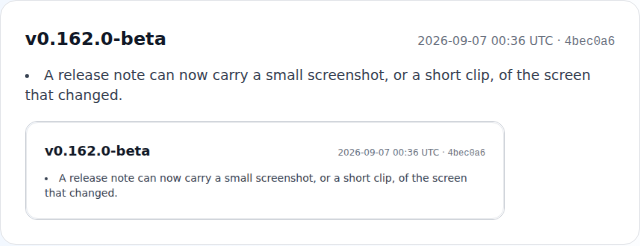

# Changelog

All notable changes to this project are documented here.

The format follows [Keep a Changelog](https://keepachangelog.com/en/1.1.0/),
and this project uses [Semantic Versioning](https://semver.org/). The app
version is shown in the sidebar footer of every page (links to the
[user-facing release notes](src/lib/releaseNotes.ts), rendered at
`/release-notes`) and in the landing-page footer.

Since #1457 **one shipped change = one section**: its own version, the UTC time
it was merged and a link to the commit. Sections up to and including
`0.85.0-beta` predate that and can group several changes; the entries from
`0.86.0-beta` to `0.110.1-beta` were reconstructed from the release fragments'
add-commits (the 2026-08-24 compaction had folded all 45 of them into a single
`0.110.1-beta` section).

The run of sections from `0.110.2-beta` to `0.135.0-beta` was written in one go
on 2026-09-03 (#2142): compaction had failed every scheduled run since
2026-08-24, so 57 fragments sat unfolded for ten days. Their versions, dates,
times and commits are the real ones — all four come from the commit that added
each fragment — so only the *recording* was late, not the numbering. The app
had been serving these versions correctly all along, deriving them from
base+fragments at build time.

## [0.181.0-beta] - 2026-09-08

_Shipped 2026-09-08 08:11 UTC · commit [2bc8f58](https://github.com/21072026/Internship/commit/2bc8f580849dd4a02005093abcb22b582555cdb7)_

- **Changing a mentee's mentor is one operation** (#2289). There was no first-class "change mentor": the only way was to mark the relation `COMPLETED` and assign somebody else — two unlinked writes, no reason recorded, a record afterwards claiming the mentorship finished successfully, and the one-active-mentor invariant (#419) false in between (assigning first answers `409 already_mentored`, a correct refusal with no supported path through it). `POST /api/mentorship/[id]/transfer` (ADMIN) now does it in a single `$transaction`, with the guard re-asked inside it via `exceptRelationId`. The outcome is decided from the data, not from a dropdown: a pairing with nothing recorded under it has its `mentorId` corrected **in place** (the mis-assignment case — no closed relation left behind), while a pairing with history is closed as `lifecycleState: ENDED_REASSIGNED` with an `endReasonCode`, and the new relation is chained to it through the new `previousRelationId` column, carrying the pipeline stage, deadline, company, project and cohort forward. Nothing is moved between the two relations — `InteractionLog` has no author column, so re-pointing `mentorId` on a used pairing would credit the outgoing mentor's meetings to the incoming one. The reason is stored as a code only; the admin's free-text note goes to the ActivityLog, which only admins read, and neither mentor is shown either (#1801's rule, mirrored). `/admin/mentorship` gains a **Change mentor** action on every active row, badges `ENDED_REASSIGNED`/`ENDED_REMATCHED` rows instead of calling them "Completed", and the `already_mentored` refusal now names the mentor in the way (`activeRelationId`/`activeMentorName`) and offers the change. Certificate eligibility rejects both mentor-change end states. Rules in `docs/mentor-transfer.md`; `scripts/test/mentor-transfer.test.mjs` and `e2e/mentor-transfer.spec.ts` cover it.

## [0.180.0-beta] - 2026-09-07

_Shipped 2026-09-07 21:33 UTC · commit [9a4b9e5](https://github.com/21072026/Internship/commit/9a4b9e55e48db437c9724c9915ee42e17b2d9d50)_

- **A pasted skill list is split into skills, and one skill can no longer be a paragraph** (#2314). Every form wrote `skills.split(',')` from a single-line `<input>`, and a browser drops the line breaks out of a multi-line paste — so a mentee filling their profile from their CV stored ONE 300-character entry ("Java C# / .NET Backend Development REST API / API Development SQL / PostgreSQL …"), which then rendered as a pill that filled half the admin dashboard's "Yeni Adaylar" card. `src/lib/skills.ts` is now the single rule for both sides: it splits on commas, semicolons, line breaks, tabs, bullets and numbered-list markers, leaves the `/` inside "SQL / PostgreSQL" and any separator inside parentheses alone, de-duplicates Turkish-aware, and caps a list at **40 skills of 60 characters** (requisitions keep their wider 50 × 100 through `REQUISITION_SKILL_LIMITS`). The shared `SkillsField` chip editor reads a paste from the **clipboard** rather than from the input value — the only place the newlines still exist — and shows a live counter, a "split into N skills" notice, and the reason an entry was refused; it replaces the comma-only input on the mentee profile, both onboarding wizards, the public application, the mentor application, the source portal, the admin mentor-expertise dialog and the requisition editor. Every write path enforces the same numbers: `/api/profile` and `/api/users/[id]` refuse with `code: 'too_long'` / `'too_many'` (a truncated half-sentence would be worse than a clear no), while the paths that must not fail over a skills field — public application, mentor application, source submission, duplicate merge, AI CV extraction — go through the lossy `capSkills`. Dense list views clip a label with the full text on hover, and `prisma/backfill-skill-lists.mjs` (wired into `infra/deploy-prod.sh`, dry-run by default) re-splits the rows already stored, reporting the blobs whose separators were gone before the fix and could only be truncated. 20 assertions in `scripts/test/skills.test.mjs`, including a corpus that pins the plain-ESM mirror `prisma/skill-split.mjs` to the TypeScript rule, plus `e2e/skills-field.spec.ts` for the real paste event and a 100% line-coverage floor.

## [0.179.0-beta] - 2026-09-07

_Shipped 2026-09-07 19:18 UTC · commit [6db605a](https://github.com/21072026/Internship/commit/6db605a854cab6e130801ea819d0dc3575b0a352)_

- **The `/pricing` page ships, and the parked links come back** (#1730, #1728, story #1726). `src/app/pricing/page.tsx` is a `force-dynamic` server page in `PublicShell`: free-core band first, the four programme columns, the metering rule, the overage rule, the employer wallet, add-ons, published discounts, six FAQs and per-audience CTAs. Not one currency literal is in the page — every amount comes from `src/lib/plans.ts` through the new `src/lib/money.ts`, which is hand-rolled rather than `Intl` because an e2e spec pins a published total as a string and ICU builds disagree on both the group separator and whether tr-TR writes EUR before or after the amount. **#1728 was implemented by extending `plans.ts`, not by adding the `pricing.ts` it specified**: that file already declares itself the single source of packaging and already held every price, limit and feature, so a second module would have been the exact drift #1728 was written to prevent. What it gained: `METERING_UNIT`, `NEVER_METERED` (the free-core rule as data — the page renders the list from it, so the promise and the list cannot lose an entry separately), `ADDONS`, `PLACEMENT_FEE_EUR`/`_BOOKABLE`, `SELF_SERVE_CHECKOUT`, and four derived helpers. Two figures are **derived rather than stored**, which is the substantive pricing decision here: `overagePerPairCents()` returns `OVERAGE_SHARE` (80 %) of the in-band annual per-pair price — which reproduces the already-published €1.20 for Program exactly, and yields €0.80 for Program Plus, so an over-band pair is provably cheaper than an in-band one and "going over is not a penalty" is checkable rather than asserted; and `annualSavingEur()`/`annualMonthsFree()` print the real saving (€480 / 2.5 months on Program, €960 / 2 months on Program Plus) instead of the flat "2 months free" of the original spec, which was true for Program Plus and understated Program by half a month — a headline discount contradicting the table beneath it. The placement fee is published with a legal footnote and **no CTA** (`PLACEMENT_FEE_BOOKABLE = false`), because charging for a placement touches Arbeitsvermittlung/AÜG in DE and the İŞKUR regime in TR; the footnote is rendered off the flag, so it removes itself when the sign-off lands. Same for the no-checkout note: `Subscription.currentPeriodStart` is nullable because no billing provider is wired up, so the page says paid plans are invoiced after a conversation rather than showing buttons that look like they take a card. The three parked links (#2296) are restored in `PublicHeader`, `PublicFooter` and the landing free-core band. The contradiction #1730 required retiring is gone: `forCompanies.pilotBody` and `landing.faqCompany3A` promised in all three locales that pricing would be "worked out together with the first companies", which with a published list meant the site stated two pricing policies — they now say what is true (free on the employer free tier, published above it) and link to the page. `e2e/pricing.spec.ts` asserts **rendered content only, never a URL**: that is precisely how #2284's own gate stayed green while shipping three links to a 404, and it is why the nav assertions live next to the page instead of in `free-core-band.spec.ts`. `src/lib/money.ts` joins the coverage ratchet at 100 %.

## [0.178.4-beta] - 2026-09-07

_Shipped 2026-09-07 18:47 UTC · commit [80d3292](https://github.com/21072026/Internship/commit/80d32923e5b0d40ef7c15987b168db1d7dc93107)_

- **The mentor dashboard's "View all interactions →" link, and the app shell's mobile drawer buttons, are translated** (#1377). `src/app/mentor/page.tsx` read every other string off `t.mentor.*` and then typed this one link as a JSX literal, so it stayed English in the Turkish and German UI — it is now `t.mentor.viewAllInteractions` (EN/TR/DE), with the `→` left outside the string to match the `t.mentor.viewDetails` link two panels up. A sweep of the rest of the mentor panel (`src/app/mentor/**` plus the components those pages mount) found no other hardcoded user-facing English, but it did turn up two in the shared app shell that renders around it: `ResponsiveShell`'s hamburger and drawer-close buttons carried `aria-label="Open menu"` / `"Close menu"`, i.e. a screen reader announced them in English on every signed-in page of all five panels. Those move to a new `a11y.openMenu` / `a11y.closeMenu` pair — `publicNav` already had translations for the same two words, but that namespace belongs to the marketing header, so the signed-in shell gets its own rather than reaching across. `e2e/i18n-coverage.spec.ts` gains a mentor-dashboard case asserting the translated link in TR and DE and that the English literal is gone, because `npm run check:i18n` compares dictionary keys and can never see a string typed into JSX.

## [0.178.3-beta] - 2026-09-07

_Shipped 2026-09-07 18:47 UTC · commit [799c747](https://github.com/21072026/Internship/commit/799c7477aa1eed2a48bd3916a4cf7ee5974958d7)_

- **The mode switcher's contrast is measured and pinned, not assumed** (#1343). The two `color-contrast` entries #826 froze into `e2e/a11y-baseline.json` for `/admin#dark` and `/admin/candidates#dark` — both reported under the active pill's `.dark\:bg-gray-700` class — have been `{}` since #1482, so there was nothing left to unfreeze: axe was naming the pill as the shortest unique selector for the *unselected* segments beside it, which were `text-gray-500 dark:text-gray-400` and rendered #9ca3af on the group's remapped #374151 at 4.06:1 until #1482 raised the pair to 7.00:1. What was missing was cover: every colour in this component is produced by a cascade (`html.dark .*` remaps plus the always-present `html[data-accent]` layer) rather than by the classes on the element, so `e2e/contrast-1343.spec.ts` now measures the resolved ratio in the rendered document for all three modes in both themes — admin/mentor/mentee pills at 12.48/14.64/13.03:1 dark and 5.02-6.98:1 light, the unselected segments at 7.00:1 dark and 9.37:1 light — against a fixture (an admin who is also mentored) that renders all three segments, which the a11y scan's bare admin never does. The `STYLES` comment and `docs/a11y-audit.md` record the two cascade facts behind those numbers: the pill's `bg-white dark:bg-gray-700` actually renders as gray-900 because `html.dark .bg-white` outranks the variant, and forcing the authored gray-700 through would *lower* the pill-vs-track separation rather than raise it. Both segments also carry `data-testid="mode-switch-option"` with `data-mode`/`data-active` so a spec can name one state without depending on the tag it renders as.

## [0.178.2-beta] - 2026-09-07

_Shipped 2026-09-07 18:47 UTC · commit [93708d2](https://github.com/21072026/Internship/commit/93708d2240816afad490929fe996a61fb4572244)_

- **The board's WIP limit is configuration, per stage, and can be switched off** (#1439). `WIP_LIMIT = 8` was hardcoded in `src/app/admin/board/page.tsx`, so the amber column warning stopped meaning anything as a pool grew — measured at 308 relations, all thirteen columns read `24 / 8`, `23 / 8`, … The limit now resolves through one rule (`src/lib/boardWip.ts`, unit-tested): the stage's own `StageSla.wipLimit` → the org-wide `boardWipLimit` setting → the shipped default of 8, which is deliberately the old constant so an installation that configures nothing sees yesterday's board. Both levels can say "no warning": `0` on the setting switches WIP warnings off entirely, `0` on a stage exempts that one column — the honest setting for a first-contact column that is supposed to be deep, since one number cannot fit both a funnel mouth and a hiring stage. `StageSla.days` is nullable as a consequence (a row may now exist for its WIP limit alone; `resolveStageSlas()` and the onboarding checklist's SLA count both skip those, so a board setting cannot make an org look SLA-managed), and `PUT /api/admin/stage-sla` treats an omitted `wipLimit` as "leave it alone" so a programme template posting service levels cannot wipe the board configuration. When every column that holds anybody is over its limit the chips are replaced by a single line saying the limit does not fit this programme, linking to the settings — a warning that fires everywhere is decoration, not a signal. The warning text now names the limit it passed and is exposed to screen readers rather than only as a `title`.

## [0.178.1-beta] - 2026-09-07

_Shipped 2026-09-07 18:47 UTC · commit [0859f0f](https://github.com/21072026/Internship/commit/0859f0f039521766056bfb13347b41fa66161b90)_

- **Analytics premium gate is read, not probed** (#1442). `/admin/analytics` and `/admin/analytics/report` used to discover the premium tier by calling the gated cohorts/sources/benchmark endpoints and inferring it from the 403, so every visit by an unentitled admin fired four failing requests and logged four console errors. The pages now read the flag once from the new ADMIN-only `GET /api/admin/analytics/entitlements` and render a single `PremiumAnalyticsLocked` panel; the three premium endpoints keep their server-side `feature_locked` gate unchanged.

## [0.178.0-beta] - 2026-09-07

_Shipped 2026-09-07 13:39 UTC · commit [316077b](https://github.com/21072026/Internship/commit/316077bda6e3276f1e899da2616e45ea46143315)_

- **Optional screenshot or short clip on a release note** (#2233). A release fragment may carry `media` — a required `.png` poster, an optional `.webm` clip and EN/TR/DE `alt`; this note carries one itself. `scripts/release-media.cjs` validates the referenced files against the bytes on disk (PNG IHDR for the poster's size, the EBML header for the clip's duration and its own PixelWidth/PixelHeight; no ffmpeg): poster ≤ 150 KB, clip ≤ 1.5 MB and ≤ 5s (WCAG 2.2.2), and a clip without a poster is rejected. `/release-notes` renders it at ≤ 480px in a light-pinned frame and shows the poster — never a paused video — under `prefers-reduced-motion`; the `<video>` is laid out at the clip's own size rather than the poster's, since a cropped still and a recorded viewport have unrelated aspect ratios. `e2e/release-media.spec.ts` captures the media (element screenshots plus Playwright `recordVideo`, which starts recording at `newContext()` — so the template warms the route outside it) and runs only under the opt-in `release-media` project, never in the PR gate or the scheduled suite. Compaction carries the block into `releaseNotes.ts` and writes the poster into `CHANGELOG.md`; both writers live in `release-media.cjs` so `npm run test:release` can cover them.

## [0.177.1-beta] - 2026-09-07

_Shipped 2026-09-07 13:36 UTC · commit [197fd3c](https://github.com/21072026/Internship/commit/197fd3c1b16b3b9e303184a05dcafe42914e4edb)_

- **White text on a mid-tone accent surface now clears WCAG AA everywhere** (#1299). The six selectors the issue named had all been fixed already (#1336/#1482, #2131), but the *pair* behind them had not: a solid `bg-<hue>-500`/`-600` carrying `text-white`. Tailwind's mid shades are picked to look good, not to clear 4.5:1 under white — amber-500 measures 2.15:1, green-500 2.28:1, amber-600 3.19:1, green-600 3.30:1, red-500 3.76:1 — and fourteen call sites had drifted onto them. All fourteen move one shade down to red-600 (4.83:1), amber-700 (5.02:1) or green-700 (5.02:1) — at least as readable as the app's own `bg-blue-600` primary button (5.17:1) — with each hover state stepped down beside it: the mentee portal's missing-documents CTA, the meeting-join button and pill, the RSVP accept button, the sign-in demo-login and contributor-terms and reconnect-calendar buttons, the admin nav's application and offer badges, the inbox and bell unread counts, and the journey tracker's completed-stage check mark (2.28:1, a WCAG 1.4.11 failure axe's text rule cannot see). `LanguageBadge`'s unset variant is fixed too — gray-400 on gray-100 at 4.39:1 in light and its `dark:!text-gray-500` pin at 3.04:1 in dark, under AA in *both* themes. Why the existing gate was green on all of it: the accessibility step in `e2e.yml` runs *after* the smoke step, so a job whose smoke step fails never reaches it. The pair is therefore now guarded statically by `npm run check:contrast` (`scripts/check-contrast.mjs`, in `ci.yml`) — no browser, no database, under a second, and unskippable by an earlier failing step — with the guard's own too-narrow/too-broad failure modes pinned by `scripts/test/contrast-guard.test.mjs`, and the rendered result in both themes asserted by `e2e/contrast-1299.spec.ts`.

## [0.177.0-beta] - 2026-09-07

_Shipped 2026-09-07 13:36 UTC · commit [11b789a](https://github.com/21072026/Internship/commit/11b789a1b16e4bbf6266ff55456700d83acab80a)_

- **Demo links carry UTM parameters and report their own click** (#1391). The landing hero button, the inline link in the bottom CTA band and the public footer link all sent visitors to `demo.interncrm.com` bare, so the site's most-clicked control was an unmeasured exit — a departure on this side, a visitor from nowhere on the demo side, even though both deployments run the same analytics code. `demoUrl(placement)` in `src/lib/demoMode.ts` now tags each one (`utm_source=crm&utm_medium=cta&utm_campaign=demo&utm_content=hero|cta|footer`), keeping `DEMO_URL` the single constant it already was, and a new `DemoLink` client component fires a `demo_cta_click` event with the placement before the browser navigates. The event goes through the analytics providers `AnalyticsScripts` has already loaded (`src/lib/track.ts` — no new vendor, no new beacon endpoint, no-op without analytics consent) and carries the placement and nothing else: this is an anonymous public page and no user id, address or session touches it. The footer link's `rel` gains `noopener` alongside `noreferrer` — belt and braces, since `noreferrer` already implies it — and the click event is disclosed in both sub-processor registers: the rendered `/trust` entries for Plausible, PostHog and GA4 (`src/i18n/dictionaries.ts`) and the long-form rows 9-11 of `docs/trust/subprocessors.md`, whose "Last updated" line and `SUBPROCESSORS_UPDATED` move together as `docs/trust/README.md` requires.

## [0.176.0-beta] - 2026-09-07

_Shipped 2026-09-07 13:36 UTC · commit [512b319](https://github.com/21072026/Internship/commit/512b3194e309f531449949ee6e0f4eb0e5a66027)_

- **Name search and stage/status filters on the mentor mentee list and board** (#1367). `/mentor/mentees` was a bare `relations.map()` and `/mentor/board` filtered only by column, so past a dozen active mentees both screens were a scan. The list now carries an Active/Completed chip row, a stage `<select>` fed from `useResolvedStages()` (the org's own per-tenant stages, #747 — no canonical key is named anywhere in the new code), a `data-testid="mentee-search"` box over name/e-mail/university, and `SavedViews` on the same `search`/`status`/`stage` triple the admin mentorship list uses (a saved view naming a stage the org has since renamed falls back to "all stages" instead of silently emptying the grid). The board gets `data-testid="mentor-board-search"`, and every column count — and the announced result count — is derived from the filtered `itemsFor()` over the stage keys the columns actually walk, so neither a badge nor the live region can claim rows the search has hidden or rows sitting on a key the org's resolved catalogue no longer holds (stages are per-tenant, #747). On a phone the board shows one stage at a time, so a search whose only match is in another stage now names the stages holding the matches as taps rather than rendering "no cards in this stage" over a search that succeeded. Filtering is **client-side and honestly so**: neither page passes `page` to `GET /api/mentorship`, so both already hold every relation the mentor can see and the search covers all of them — not a visible page, unlike the trap #1820 documents. The matching rule itself is one dependency-free module, `src/lib/menteeFilter.ts`, shared by both surfaces and unit-tested (`scripts/test/mentee-filter.test.mjs`); it folds diacritics and Turkish dotless ı, so "Sahin" finds "Şahin", "Muller" finds "Müller" and "Isik" finds "Işık". Deliberately **not** a board hook — extracting the admin board's `search`/`hideEmpty` state into `useBoardFilters()` remains #2076's job, and a stateless matcher cannot collide with it. Filtered-to-nothing gets its own empty state with a Clear-filters action rather than the misleading "no mentees assigned yet", and both surfaces announce the result count through `useFilterAnnouncement` (WCAG 4.1.3). **Dormant first contacts stay reachable by name**: the toggle hides them from the grid, so a search whose matches are all dormant offers "show dormant matches" — clearing the filters would not reveal them — and a search with both visible and hidden matches carries a banner saying how many the toggle is holding back, with the live region announcing the same sentence instead of "no results". `src/lib/menteeFilter.ts` joins the per-file coverage ratchet (`scripts/check-unit-coverage.mjs`) at a 95% floor, so the diacritic folding cannot be deleted together with its assertions. New e2e coverage in `e2e/mentee-search-filter.spec.ts`.

## [0.175.1-beta] - 2026-09-07

_Shipped 2026-09-07 13:36 UTC · commit [1a6cdfe](https://github.com/21072026/Internship/commit/1a6cdfe0ee01f4aad490a3435b61212f615e50b1)_

- **The monthly AI quota is editable from the settings form, and the pipeline-stage editor speaks all three languages** (#1625). `aiMonthlyQuota` was a real, enforced setting — the AI gate refuses provider calls once the month's pool is spent — that no screen ever rendered, so changing it meant a raw `PUT /api/admin/settings` or a DB write; `/admin/settings` now shows it as a numeric field (0-999999, mirroring the API's unchanged `\d{1,6}` regex, which stays the authority) with a hint naming what draws on the pool, when the counter resets and that `0` switches AI off. The hint says the pool is measured **installation-wide**, because it is: the limit resolves per tenant like every other setting, but `AiUsage` has no `orgId`, so two tenants share one counter (`docs/ai.md` now spells this out, and the competitive gap register no longer claims the quota is unsettable). The field is posted only when it actually changed — a PUT writes the caller's own layer, so sending an untouched inherited value would pin a tenant override at the operator's current number — and a value the API would reject is now reported on the field instead of 400-ing the whole payload; a save that fails for any other reason finally says so, where before the page reacted only to success and silently dropped every change on the form. `/admin/organizations/[id]/pipeline` was hardcoded English in an otherwise trilingual product: every string moves into a new `pipelineStages` dictionary block (EN/TR/DE) — the heading, the custom-vs-defaults sentence, the FREE-plan notice, the aria-labels of the label and colour inputs, the off-path/final checkboxes, both buttons and the success/failure messages. The save copy says the whole stage set is *replaced*, not patched, because the PUT is a `deleteMany` + `createMany` that remaps nothing; a server-side error detail (a developer-facing English string such as "Stage keys must be unique") is now shown under the translated headline instead of in place of it.

## [0.175.0-beta] - 2026-09-07

_Shipped 2026-09-07 13:32 UTC · commit [1b01d02](https://github.com/21072026/Internship/commit/1b01d022d622b41faa1c2b0d026d6332bf227bdb)_

- **Mentee-initiated re-match, with an admin queue and a mentor-side notice** (#1801). A mentee whose pairing is not working had exactly one exit: an admin marking the relation `COMPLETED`, which records a success that never happened. `POST /api/mentorship/[id]/rematch` is the mentee's own path — mentee-only (403 for the relation's mentor and for any non-participant, 404 for an unknown relation), a reason code from the new shared `END_REASON_CODES` whitelist is required (400 without one, free-text note optional), one open re-match per pairing (409), the same 1h cooldown and the same consent-gated preferred-mentor rule as `POST /api/mentorship-requests`. The request rides the existing `MentorshipRequest` model (`replacesRelationId` + `rematchReason` + `rematchNote`, all additive and nullable) so the admin queue, `decideMentorshipRequest()` and the decision e-mails stay single-sourced. The old pairing stays fully live until the decision; approving creates the new relation **and** closes the old one as `ENDED_REMATCHED` (new nullable `MentorshipRelation.lifecycleState`, keys in `src/lib/relationLifecycle.ts`) in one `$transaction`, so a mid-way failure leaves exactly the original state and a successful approval leaves exactly one live relation. `ENDED_REMATCHED` is not a completion: `canIssueCertificate()` refuses it, and the admin queue reports a 90-day re-match rate and a by-reason breakdown next to the closures. The plan gate is skipped for a re-match (net-zero active relations; free core). Privacy is enforced server-side on every read path: `rematchReason`/`rematchNote` are returned only by the ADMIN queue and to the mentee who wrote them — a mentor's own inbox filters re-matches out entirely and cannot decide one, and the outgoing mentor's notice and e-mail carry the mentee's name and nothing else (covered in `e2e/authz-matrix.spec.ts` and a new `@smoke` `e2e/rematch-request.spec.ts`).

## [0.174.0-beta] - 2026-09-07

_Shipped 2026-09-07 13:25 UTC · commit [b8870e1](https://github.com/21072026/Internship/commit/b8870e165707bdd81d926d6f7726bec3a8beb97b)_

- **Single-owner leases and a rolling two-replica deploy** (#1701). New `JobLease` model plus `src/lib/jobs/lease.ts`: one row per lease name, a TTL, renewal by the work's own tick, and takeover by a single conditional `UPDATE`, so two replicas can never both believe they hold it — freed by expiry, never by a release, because a SIGKILLed replica releases nothing. The IMAP reply bridge now takes the `'imap-bridge'` lease inside `/api/inbound-email/poll` and a replica without it quietly does nothing, replacing the implicit "the credentials only exist in production" guard against two pollers racing over the `\Seen` flag. `infra/deploy-prod.sh` gained `REPLICAS` (default **1**, at which the deploy is byte-for-byte unchanged): above 1 it runs `${CONTAINER}-k` on `PORT+10*(k-1)` behind one proxy pool (`infra/server/replica-route.sh`, no sticky sessions — the session is a JWT and SSE reconnects itself) and rolls the deploy through them one at a time, aborting before the second replica if the first fails its health check. `/api/health` now reports the replica identity and, with `?leases=1`, who holds each lease. Two replicas remove the process SPOF only — one box, one MySQL — and turning them on is gated on the drill recorded in `docs/disaster-recovery.md`, which has not been run yet. The scheduler's own lease needs the schedule registry, which stays with #1676; until then the deploy runs replica ≥2 with `CRON_ENABLED=0` so nothing can double-send.

## [0.173.3-beta] - 2026-09-07

_Shipped 2026-09-07 13:07 UTC · commit [ba6838e](https://github.com/21072026/Internship/commit/ba6838e20a9bd7679e2f5216f1fad09d614357b9)_

- **A schema step `db push` cannot apply to a populated table is now a red build** (#2298). #2249 added `Setting.id String @id @default(cuid())` — additive in the schema, legal against the fresh database every topic env pushes to (#1185), and refused outright on the first environment with rows ("There are 8 rows in this table, it is not possible to execute this step"), which stalled every prod and preview deploy for 13 commits. `npm run check:schema-push` (`scripts/check-schema-push-safety.mjs`, in CI) diffs `prisma/schema.prisma` against the merge-base with `origin/main` and fails on exactly that class: a new required column whose default is client-side (`cuid()`/`uuid()`/`nanoid()`/`auto()`) or absent, and a new or changed `@id`/`@@id`, on a model that exists on both sides. Nullable columns, literal and DB-resolvable defaults (`0`, `"x"`, `false`, `now()`, `autoincrement()`, `dbgenerated()`), anything on a brand-new model and index-only changes stay silent; a new `@unique` over columns that already exist is a warning rather than a failure, because whether it breaks depends on data the guard cannot see. The failure names the model and field, says why the push refuses it and points at `prisma/push-company-interest-expand.mjs` as the worked expand/backfill/contract shape; an `EXEMPT` map with a written reason takes a documented bypass. It **fails closed** when no merge-base can be resolved (a shallow clone) — "no base" must never read as "no problem". 16 assertions in `scripts/test/schema-push-safety.test.mjs`, with the real #2249 diff as the fixture.

## [0.173.2-beta] - 2026-09-07

_Shipped 2026-09-07 12:55 UTC · commit [2e5bde6](https://github.com/21072026/Internship/commit/2e5bde600b52a3f0e8d1ad9ac05d3795c7515851)_

- **Fix prod/preview deploy blocked since #2249**: adding `Setting.id` (`String @id @default(cuid())`, #1553) hard-blocked `prisma db push` on the populated `Setting` table ("There are 8 rows in this table, it is not possible to execute this step") — a client-generated default cannot be produced by pure DDL, and `--accept-data-loss` does not override that class of error, unlike a data-loss warning. `prisma/push-setting-id-expand.mjs` converges to an expand schema with `id` nullable (keeping `key` as the primary key), `prisma/backfill-setting-id.mjs` fills it via raw SQL, and the existing contract-phase `db push` then applies the real primary-key change — the same expand/contract shape `push-company-interest-expand.mjs` already established. Wired into `infra/deploy-prod.sh` (prod + preview) and `infra/server/topic-deploy.sh`'s existing-data branch. Reproduced the original failure and verified the full expand → backfill → contract sequence locally against a MariaDB table seeded with 8 pre-migration rows, including idempotency on a second run and a from-empty run.

## [0.173.1-beta] - 2026-09-07

_Shipped 2026-09-07 12:48 UTC · commit [871b1ab](https://github.com/21072026/Internship/commit/871b1abe73abfe89e5c3f9b3790f8b846b97d075)_

Fixed: park the `/pricing` header, footer and free-core-band links until the page exists (#1730) — the route 404s, and App Router's prefetch of an in-viewport link put that 404 in the browser console, which reded the smoke gate on `main`.

## [0.173.0-beta] - 2026-09-07

_Shipped 2026-09-07 12:04 UTC · commit [012d03d](https://github.com/21072026/Internship/commit/012d03d2262ebfe981b6a9a48da71edd289e23fc)_

- **Pricing is reachable from the public chrome, and the free-core promise has its own landing band** (#1732). The header offered Features / For companies / Showcase and never mentioned money, so a visitor who came for the number had nothing to click. `publicNav` gains a `pricing` key in all three locales and `/pricing` is added to `PublicHeader`'s single `links` array (which drives the desktop bar and the phone disclosure panel alike) and to `PublicFooter`'s Product column. On the landing page the `landing.heroModel` sentence is promoted out of the hero — where the one line answering "what does this cost me" was a grey paragraph among five — into a dedicated `bg-green-50` band placed after the three audience sections, with a new supporting line and `/pricing` as its only CTA; the string itself is unchanged, so nothing an e2e spec pins moved. The band needs no new dark-mode rule: `bg-green-50` is already retinted in `globals.css` and its `text-green-*` descendants are covered by the existing green compound override, which is also why the band carries no `bg-green-100` chip (those stay light in dark mode while the override would still lighten their text). `e2e/pricing-nav.spec.ts` walks the header link, the footer link, the band CTA and the 375px menu, and checks the band does not overflow a phone. Depends on #1730 for the `/pricing` route itself.

## [0.172.3-beta] - 2026-09-07

_Shipped 2026-09-07 12:04 UTC · commit [5774cad](https://github.com/21072026/Internship/commit/5774cad9b04c90a7b6ac4f815f2281ba772f9541)_

- **The career newsletter is branded per recipient** (#1667). `renderNewsletterFor` resolved branding with a hard-coded `getOrgBranding(null)`, so the one recurring high-visibility message a tenant's members receive was the single mail type that ignored their name, logo and accent while every `emailBrand()` template honoured it. It now takes an `orgId` and the dispatch loop passes each **recipient's** `user.orgId` — per recipient, not once per issue: an issue fans out across people who may belong to different organizations, so a lookup hoisted out of the loop would stamp whoever happened to be first onto everybody else's copy. A per-run `NewsletterBrandCache` memoises the resolved branding by org (holding the in-flight promise, so the recipients the pool has open at once share one query), keeping the cost at one row read per *tenant*; it is built per dispatch run and never at module scope, so branding edited between two issues shows up in the second. The admin preview and "Send me a test" pass the requesting admin's own org, so what they proofread is what their members receive; a recipient with no org still gets the unchanged product default. Nothing re-renders or rewrites a sent issue — branding is resolved at render time and never stored on the row, so an issue's immutability is untouched. Also retires the stale claims that per-tenant branding is unapplied: `docs/white-label.md` is rewritten around what is branded today (five role shells, transactional mail, the newsletter, certificate PDFs) and what deliberately is not (the in-app accent palette #1666, pre-login surfaces, the archive), the `branding.ts` header comment points at that list instead of contradicting it, and the `brandingHint`/`phaseNote` admin strings plus the `whiteLabel` feature-catalogue entry are corrected in EN/TR/DE. No entitlement enforcement is added — `WHITE_LABEL` stays a label.

## [0.172.2-beta] - 2026-09-07

_Shipped 2026-09-07 11:44 UTC · commit [5047513](https://github.com/21072026/Internship/commit/50475136c5c38e75400090061ebaf8f88e5909a0)_

- **Assignment refusals name their reason again** (#2283 follow-up). Switching the three assignment surfaces onto the response `code` had collapsed every refusal but `already_mentored` into a generic line, so an admin at their plan cap was told only "The mentorship could not be created." One resolver, `src/lib/mentorshipAssignmentError.ts`, now translates `plan_limit_reached` (with usage/limit/plan), `already_decided` and the newly coded `invalid_mentor`; unknown codes still fall back to the generic sentence. The concurrency spec in `e2e/one-active-mentor.spec.ts` stopped asserting `[201, 409]` — a guarantee the shipped code does not make until the unique index lands — and asserts instead that every request is answered 201/409 and that the rows on disk match the answers.

## [0.172.1-beta] - 2026-09-07

_Shipped 2026-09-07 11:04 UTC · commit [0e74340](https://github.com/21072026/Internship/commit/0e7434004b9df8e77579567640ddf9482c605247)_

- **A mentee can no longer end up with two active mentors by accident — the four back doors are closed** (EPIC F / #419). "One mentee, at most one ACTIVE mentor" was always the intended invariant: `POST /api/mentorship` and the request-approval path have answered 409 for it since the beginning. But it was enforced at **two of eight write paths**, by two hand-rolled `findFirst`s that had drifted apart, and skipped entirely everywhere else — so the operation one door refuses, four others performed silently. One reader owns the question now, `src/lib/activeMentorship.ts`, and every write path calls it (no copy-pasted filter is left in `src/`). Closed: the **invitation auto-link** (`src/app/api/register/route.ts`) matched the `(mentorId, menteeId)` PAIR with **no status filter**, so an admin inviting a mentor and pre-linking an existing mentee created a SECOND ACTIVE relation the moment the invitee clicked the link — and told the mentee they were now connected; the same missing filter meant re-inviting on a closed pair created nothing and still sent that notification. It now creates nothing, notifies nobody, and writes a `mentorship.autolink_skipped` ActivityLog entry plus an admin notification; `POST /api/invite` refuses the pre-link with 409 up front, while the admin is still looking at the form. **Reopening** a COMPLETED relation to ACTIVE (`PUT /api/mentorship/[id]`) never checked whether the mentee had since acquired another mentor — it does now, excluding itself. **Duplicate-account merge** (`src/lib/mergeUsers.ts`) re-pointed `menteeId` and only collapsed relations converging on the same pair, so a duplicate whose mentor DIFFERED was carried over alongside the primary's; it is **refused** with `active_mentor_conflict` naming both mentors, and the transaction rolls back — auto-completing the loser would close the #854 document window on that mentor, flip the mentee's portal to an archive, make them certificate-eligible for a mentorship that never finished, and be irreversible. **`scripts/import-csv.mjs`**'s idempotency check was owner-scoped with no status filter, so importing the same sheet as a second `--owner` added a second active relation; those rows are now skipped, listed, and the run exits 1. Both front doors moved their guard INSIDE the `$transaction` that writes (the approval path's request `update` also matches on `status: 'PENDING'`, which fully serializes double-approval of one request), and `POST /api/mentor/mentees` writes the account and the relation atomically. Every refusal carries a stable `code` the UI translates — `/admin/mentorship`, `AssignMentorInline`, `MentorshipRequestQueue` and `/admin/duplicates` stopped rendering the server's English literals (the duplicates page was printing raw tokens like `linked_by_mentorship`). The hard consequence this prevents: the dormant-first-contact nudge cap is spent on the RELATION, so a mentee with two active relations received **four** "still interested?" mails out of two budgets — the second of which already promised silence — against a ceiling `docs/dormant-first-contacts.md` declares non-negotiable; `sendDormantCheckIns` now also de-duplicates by person within a tick. **The DB-level `@@unique([activeMenteeKey])` backstop is deliberately NOT in this change**: if the live database already holds a violation, adding it makes `prisma db push --accept-data-loss` fail, and that push is how this app deploys. So this ships the guards plus a way to LEARN — read-only `GET /api/admin/relation-integrity`, and `prisma/check-active-mentor-duplicates.mjs` printing the same numbers on every deploy (a detector, never a gate: it never writes and always exits 0). The constraint follows once that reads clean on prod AND shared preview. Rule, write-path table and the sequencing that matters: [docs/one-active-mentor.md](docs/one-active-mentor.md).

## [0.172.0-beta] - 2026-09-07

_Shipped 2026-09-07 10:52 UTC · commit [d1b70e0](https://github.com/21072026/Internship/commit/d1b70e0a1c9a02c6cad08a1bec5626c54501e7ea)_

- **Commercial spine: `Subscription` + `OrgEntitlement` and the plan→feature matrix** (#1731). New additive models give an Organization a real subscription (plan key, status, interval, period, trial, education discount, Stripe ids) and a place to grant a single feature outside its plan; both carry `orgId` and are registered in `TENANT_MODELS`. `src/lib/plans.ts` is the one source of the packaging (Community / Program / Program Plus / Enterprise + Employer tiers, published EUR prices, limits, features) and is pure/data-only, so it is unit-tested (`npm run test:plans`) and importable from client components. `resolveEntitlements()` is the single entitlement resolver; `src/lib/subscription.ts` adds `getOrCreateSubscription()` plus the DB-backed `orgEntitled()`. An idempotent deploy backfill maps every existing org's legacy plan onto a subscription row. No feature is gated behind a plan by this change.

## [0.171.0-beta] - 2026-09-07

_Shipped 2026-09-07 10:38 UTC · commit [5c07895](https://github.com/21072026/Internship/commit/5c078952e4813e5b50fdbf2a97e3918e100cf4c3)_

- **The browsers receiving push notifications are now listed on /account, and can be revoked one at a time** (#1716). `PushSubscription.userAgent` has carried the comment "so /account can list 'Chrome on Android' rather than an opaque endpoint" since #1464, but nothing ever read it: there was no GET on `/api/push/subscribe`, so someone who had granted push on a laptop, a phone and a work machine could only switch all three off together. `GET /api/push/subscribe` now returns the caller's own rows as `{ id, label, createdAt, lastSeenAt, current }` through an explicit `select` allowlist in `src/lib/pushDevices.ts` — `endpoint`, `p256dh` and `auth` are the credential for pushing to that browser and never leave the server, and the label is derived server-side from the untrusted user-agent by the fixed table in the new `src/lib/deviceLabel.ts` (moved out of `trustedDevice.ts` so both /account device lists name a device with the same words instead of keeping two copies of the regexes). The page marks its own row by sending the endpoint its service worker already holds in an `x-push-endpoint` header — a header, not a query parameter, so half a delivery credential does not land in an access log. `DELETE /api/push/subscribe?id=<id>` revokes one browser, scoped `{ id, userId }` on the route so another account's id is a 404 rather than a silent success; the service worker's existing endpoint-body DELETE is untouched. Revoking the browser you are sitting at also unsubscribes it locally and clears the local preference, because otherwise the silent re-subscribe on the next /account visit would hand the server back the row just deleted. A 404 is reported as "already unsubscribed — it had expired on its own" rather than as a revocation, since #1678's retention sweep and the push service's own 404/410 rejections delete rows nobody revoked. The list's visibility is decided by the rows, not by whether push is switched on: `enabled` and `devices` are two independent facts in the response, so a deployment whose VAPID keys went away still shows the subscriptions on record (with a note that nothing is being delivered) rather than stranding rows their owner can neither see nor revoke, and a failed refresh GET leaves the last known list on screen with a "may be out of date" note instead of unmounting the section. No schema change and no cache to invalidate: `sendPushToUser` reads the table on every send.

## [0.170.0-beta] - 2026-09-07

_Shipped 2026-09-07 10:27 UTC · commit [94911c0](https://github.com/21072026/Internship/commit/94911c0ec7edd5ae053bd21888bfaf7a7bd8389f)_

- **Programme economics and a deterministic ROI model** (#1892). New `ProgramCost` (integer minor units + ISO 4217, additive, cohort-scoped) and `Placement` value/fee columns, both tenant-scoped and registered in `TENANT_MODELS`. `src/lib/roi.ts` is the single ROI model in the tree — pure, Prisma-free (so the public calculator can import it), every intermediate exposed as a `steps[]` entry, coaching relations excluded from `placementCount`, and a mixed-currency window returns a typed error instead of a guessed rate. Admin-only `/api/admin/program-costs` write path, demo-seed coverage and a 20-case unit suite (`npm run test:roi`, wired into CI).

## [0.169.1-beta] - 2026-09-07

_Shipped 2026-09-07 10:04 UTC · commit [dd8993e](https://github.com/21072026/Internship/commit/dd8993ea7daedd225dc581c929437b6cf8d734d9)_

- **In-app messaging now counts as contact, so the attention queue stops flagging mentees the mentor talks to daily** (#2275). "Last contact" was read from `InteractionLog` alone — the form a mentor has to remember to fill in separately — so a mentor mid-conversation with a mentee still saw *Yakın zamanda temas yok* next to their name, and an 11-row queue of active mentorships is a queue mentors stop reading (the same failure #1499 was opened for, from the other side). One rule now answers the question for every surface, `src/lib/lastContactRule.ts` (dependency-free and unit-tested) with its queries in `src/lib/lastContact.ts`: the newest of a logged interaction, a **1:1 (DIRECT) message in the mentorship thread in either direction**, and a **group message the mentee wrote themselves**. A group message somebody *else* wrote is deliberately not contact — a group chat is a broadcast, and one mentor line into a channel with nine mentees in it would otherwise silence the queue for all nine at once. A mentee's group post is one timestamp applied to every mentorship they are in: the sign of life belongs to the person, not to one pairing. Read receipts, reactions and logins stay out (presence, not contact — that is `lib/activityReport.ts`). Wired into `getAttentionItems()`, the daily `checkMentorInteractionReminders()` bell item + grouped mentor email, `sendWeeklyMentorDigests()`'s stale count, the `/mentor` mentee cards and `/admin/candidates/[id]`'s "next action" (via a new server-computed `lastContactAt` on `/api/users/[id]`); `lib/dormantFirstContact.ts` now treats a mentee's own group post as a sign of life too, so it clears `dormantSince` and the nudge counters. Interaction **counts** are untouched by design — "Toplam Etkileşim", the mentee-list badge and `/mentor/interactions` are a logbook of `InteractionLog` rows, and what was wrong was freshness, not the ledger. Rule and rationale: [docs/last-contact.md](docs/last-contact.md).

## [0.169.0-beta] - 2026-09-07

_Shipped 2026-09-07 08:10 UTC · commit [d88c140](https://github.com/21072026/Internship/commit/d88c14093cd5f821153db787b1f8cdca242ea0a5)_

- **A mentee creates and manages their own project** (#2270). `POST /api/projects` accepts MENTEE (and answers 403, not 401, to a signed-in wrong role); the creator always owns what they create — `ownerType` derived from their role, `ownerUserId` set to them, client-supplied owner fields ignored, and the OWNER `ProjectMember` row created in the same `project.create()` as before, so there is still no orphan project. A mentee's own project starts `isPublic: false` whatever the request says: public means the anonymous `/projects` showcase and `sitemap.xml`, next to the owner's real name. New subject-keyed `project-create` rate limit (10/hour, on the user id rather than the IP so one student's burst cannot lock out a campus NAT). The project form is extracted out of `ProjectsManager` into `src/components/project/ProjectForm.tsx` — same fields, same testids — and reused by `/portal/projects`, which gains a "New project" button (header + empty state) and a pencil on the cards the mentee owns; `loadMenteeProjects()` derives `isOwner` server-side because `GET /api/projects` strips `members` from a mentee's response. `BUILDERS.project.MENTEE` gains the `{ ownerUserId }` arm the MENTOR builder always had, so an owner's private project no longer depends on its member row surviving. Three guards that keyed off the role string — and were therefore already broken for the mentee-owned projects an admin can create today — now key off ownership: `GET [id]/members` (was 401 for every MENTEE, and readable by every non-mentee) is now admin-or-OWNER, the `project-tasks/[taskId]` DELETE carve-out applies to plain members rather than to owners, and the legacy owner pointer in `DELETE [id]/members` writes `ownerType: 'MENTEE'` for a mentee successor instead of claiming they are a MENTOR. A MENTEE owner deliberately cannot add members directly (403 `mentee_owner_invite`): they approve join requests, and `ProjectMembersPanel` hides the pickers via `canAdd`. No schema change.

## [0.168.3-beta] - 2026-09-07

_Shipped 2026-09-07 07:06 UTC · commit [316ebda](https://github.com/21072026/Internship/commit/316ebda9f42a5d6ed2ed877d7159605b41d55c91)_

- **Fixed** the admin mentor profile had no message / view-as shortcut — `/admin/mentors/[id]` now renders `UserQuickActions` like the candidate profile does, with the candidate page's `flex-wrap` / `min-w-0` header so four controls survive a 360px phone (#2268).
- **Fixed** pipeline stage labels rendered in English inside a Turkish UI (#2268). The stage editor's GET resolved the built-in labels with no locale and its Save posted the prefill back verbatim, freezing English into `PipelineStage.label` for the whole tenant. A save now stores `""` for a stage nobody renamed, `resolvePipelineStages()` / `useResolvedStages()` localize any label that is still one of ours, and the editor plus `/api/admin/stage-sla` resolve in the viewer's locale.

## [0.168.2-beta] - 2026-09-07

_Shipped 2026-09-07 06:37 UTC · commit [395815f](https://github.com/21072026/Internship/commit/395815f042f51ec1c08bef3fb187e141488c6814)_

- **`main` is green on `check:stage-keys` again** (#1724 follow-up). The stage-clock carve-out that stops the clock on the default hired stage was typed as a `'HIRED_660'` literal in `src/lib/stageClock.ts`, which `npm run check:stage-keys` (#1886) forbids outside the two modules that own the canonical defaults — so every PR opened after #2253 merged inherited a red `Lint · Typecheck · Build`. It now imports `DEFAULT_HIRED_STAGE_KEY` from `src/lib/offers.ts` (an allowlisted module with no imports of its own, so nothing changes for the client components that use the clock), and the doc comment says why the key is not re-typed. The baseline ratchet was also retightened: #1634's work removed the last hits in `src/lib/dormantFirstContact.ts` and `src/lib/menteeOnboarding.ts`, and a generous baseline would have let a regression back into both.

## [0.168.1-beta] - 2026-09-07

_Shipped 2026-09-07 04:50 UTC · commit [85f9d40](https://github.com/21072026/Internship/commit/85f9d406a754f67758871faa8797b25cfcb29a8c)_

- **Orphan applicant accounts from `/apply` are recognised, listed and cleaned up** (#1780). The public apply link creates a real `User` before any human has said yes; when the mentor declined, that account stayed forever — it could never sign in, belonged to nobody, and had no `consentAt` for the consent-based retention review to anchor on, so it inflated every candidate count while holding personal data with no purpose (GDPR Art. 5(1)(e)). The bug underneath it first: `'!apply-no-login'` was missing from `NO_LOGIN_PASSWORDS` in `src/lib/menteeAccount.ts`, so `isPendingActivation()` — the one helper whose whole job is "this account has never had a password" — did not recognise the largest source of exactly that, and the relation detail page never offered to correct an apply-link mentee's address; the literal is now the exported `APPLY_NO_LOGIN_PASSWORD` and appears nowhere else. The rule itself lives in ONE new module, `src/lib/orphanApplicant.ts`, the way `dormantFirstContact.ts` owns dormancy: a MENTEE still on the apply sentinel, never verified, never signed in, with no mentorship relation, whose every request is REJECTED, and with no consent record, tag, CV, document, support ticket, company interest, interview request, project membership, conversation or onboarding — any one sign of life excludes the account, and the clock runs from the later of creation and the decision. `/admin/candidates` marks them with a badge and gains an `?orphan=1` filter (one extra query per rendered page, never a second copy of the rule); `/admin/retention` gains the dry run — every orphan with the applied-on date, who actually decided the request (`decidedBy`, falling back to the preferred mentor only when that account is gone) and the days left, plus the count and, when a backlog exceeds one run's cap, how many of them the next run would actually take — with per-row erase through the existing `UserEraseForm` gates and the existing admin send-a-link endpoint. The clean-up is one `registerRetention()` entry on #1678's registry rather than a new cron: it ANONYMIZES through `accountErasure.anonymizeUser` (no second deletion path, and closed-cycle funnel counts stay stable), after a configurable `orphanApplicantGraceDays` (default 90, writable through `PUT /api/admin/settings` and read from the global layer, which is the only layer the sweep can see), capped at 200 accounts a run, idempotent because anonymizing moves the address into the `@erased.local` namespace the rule excludes, and it leaves its own `retention.orphanApplicants` audit row. The panel's rescue button is a real intervention rather than a mail with no effect: an outstanding (unused, unexpired) password link takes the account out of the sweep for as long as it lives, and the row's countdown runs to whichever gate clears last — without that, the sweep would anonymise the account and delete the link it had just been mailed in the same transaction, and the applicant would click a dead link into an erased account. A failed dry-run fetch now says so with a retry rather than rendering the "nothing to clean up" empty state on the one page whose job is to warn before irreversible deletion. Also fixed while in there: `anonymizeUser` now drops outstanding password-reset tokens, which a hard delete cascaded away but an anonymise left live — every apply account is issued a 7-day SET_INITIAL link. Rule and rationale written down in `docs/pii-access-lifecycle.md`.

## [0.168.0-beta] - 2026-09-07

_Shipped 2026-09-07 04:50 UTC · commit [1530ff2](https://github.com/21072026/Internship/commit/1530ff2a0c4859c5404895abba2ec7a312494043)_

- **"Who accessed my account" — impersonation history on the account page** (#1587). Support impersonation already wrote `IMPERSONATE_START`/`IMPERSONATE_STOP` audit rows and told the account holder once, in a notification that scrolled away; the one party who could never look it up again was the person whose account was entered. Every role now has a read-only **Account access history** card on `/account`, fed by `GET /api/account/impersonations`: who entered (display name only — never the admin's e-mail or id: a name is what accountability needs, a login identifier is not), when, how long the visit lasted, and the reason the admin typed. The reason is now written to `AuditLog.detail` as well as the ActivityLog row, so it is readable from the history rather than only from the admin-side log. Start rows are paired with the following stop row *per admin*, so two overlapping visits do not cross-pair, and an orphan stop is dropped rather than shown as a zero-length visit. A start with no stop row gets one of two honest readings rather than one convenient one: inside the 30-minute session cap the card says only that **no end has been recorded yet** (the visit may be happening as you read the page, and an absent stop row proves neither that it is nor that it is not); past the cap the JWT callback has certainly reverted it, so "ended automatically" is stated as the fact it then is, with the duration clamped to the cap (now one exported constant shared with the JWT callback). A re-entry by the same admin also closes the earlier visit, bounded by the newer start rather than by the current time. The list is capped at the newest 50 sessions and now returns a `total`, so a longer history reads "Showing the 50 most recent of 63 recorded sign-ins" instead of silently presenting a page as the whole record under copy that promises nothing is ever removed — and the cap is applied to sessions rather than to rows, which could land at 49 when orphan stops sat at the edge of the window. The admin-typed reason is interpolated through the dictionary's function-replacer helper, so a reason containing `$&` or `$'` reaches the account holder verbatim instead of mangled. The endpoint reads `session.user.id` and accepts no user id — a query parameter cannot widen it — and selects an explicit column allowlist. `AuditLog` gains `@@index([targetId])`, the column this list filters on. Nothing anywhere deletes these rows: an access record the accessing party can erase is worth nothing. The empty state distinguishes "nobody has ever signed in to your account except you" from the bounded phrasing that takes over automatically once `AuditLog` joins the retention registry (#1585).

## [0.167.3-beta] - 2026-09-07

_Shipped 2026-09-07 04:36 UTC · commit [06a7279](https://github.com/21072026/Internship/commit/06a7279d1663e4c011bc677dd16115b935b638df)_

- **zod upper bounds now match the column they guard** (#1433). Every text field of the "Add company" modal and of the to-do/goal-template surface was capped wider than its `VARCHAR(191)` column, or not capped at all, so a long paste passed validation and died as a Prisma P2000 — a 500 in the company modal, and an empty-bodied 500 with no UI feedback at all when adding a to-do. `TEXT_LIMITS` gains `companyName`, `companyAddress`, `companyIndustry`, `companyLogoUrl`, `companyContactEmail`, `companySize`, `companyNeedPosition`, `companyNeedPeriod` and `todoTitle`, used in the server schema and the client schema; `goalTemplates`' own `MAX_TITLE` (300, sliced before the write) becomes `TEXT_LIMITS.todoTitle` so a shared goal cannot outgrow the task title it is copied into. `POST /api/todos` is wrapped **including its `getServerSession` call** — the jwt callback queries the DB on every request, so that was the likeliest throw — and a failed to-do now raises a toast, translated from the status via `apiErrorMessage` rather than echoing the route's English literal. The company inputs deliberately carry no `maxLength`: the browser applies it silently on paste, which replaced the validation error with a quietly truncated name. `e2e/text-limits-columns.unit.spec.ts` reads **every** `String` column of `Company`, `CompanyNeed`, `ProjectTask` and `ProjectTaskTemplate` out of `prisma/schema.prisma` and fails on any that is neither bound to a `TEXT_LIMITS` key nor exempted with a reason, so the next uncapped sibling breaks the test instead of shipping.

## [0.167.2-beta] - 2026-09-07

_Shipped 2026-09-07 04:35 UTC · commit [1777d3b](https://github.com/21072026/Internship/commit/1777d3beac1366f622ab51571920be3df8a95ed8)_

- **No no-op stage-history rows** (#934). Every path that writes a `StatusChange` now builds it through `statusChangeData()` in `src/lib/stageChange.ts`, which refuses a row whose `fromStatus` equals its `toStatus` — one rule instead of a copy per write path, and the demo seeder no longer seeds the `APPLICATION_100 → APPLICATION_100` row the bug report reproduced against. A same-stage write stays a successful no-op rather than becoming a 400. Rows already in the table are left alone, as #934 decided: the UI has hidden them since #1338, and teaching the stage clock and the aging report to skip them as well is #2264.

## [0.167.1-beta] - 2026-09-07

_Shipped 2026-09-07 04:35 UTC · commit [7dbbb2d](https://github.com/21072026/Internship/commit/7dbbb2d4d3bb0210ae368bd4678f8994cb3a8975)_

- **A per-module unit coverage floor, wired into the CI gate** (#1599). `npm run test:unit:coverage` (`scripts/check-unit-coverage.mjs`, wired into `ci.yml`) runs every `scripts/test/*.test.mjs` under Node's own runner — which since v22 strips TypeScript and measures coverage with no dependency, so the repo does not gain a third test runner — and holds each listed module to a per-file **line** floor. Per-file on purpose: a repo-wide percentage moves whenever unrelated code lands, so it is a number nobody can act on and can only ever be argued down (#1591). Four modules carry a floor today, each one the residue of an incident (mentor-directory truncation #1820, the shared rate-limit store and its outage fallback #1696, stage-visit vs candidate counting #1427); each floor is the value measured on `main` rounded down to the nearest 5, so the gate is green on day one and only ever moves up. The six modules waves 0-1 are about to rewrite score 0% under this runner and sit in an `AWAITING_TESTS` ratchet — the same shape as `PENDING_REGISTRATION` in `check-tenant-models.mjs` — pinned by an `EXPECTED_AWAITING` literal, annotated on every run, and promoted to a real floor the moment one of them is exercised, so the number lands in the same PR as the first test. **Exercised, not imported**: a module is promoted only when at least one of its functions actually ran and the suggested floor clears a 25% minimum, because importing a table-heavy module such as `src/lib/pipeline.ts` covers 85% of its lines while calling none of its functions — pinning that would certify module loading as coverage under a floor the ratchet forbids ever lowering, and would fail PRs whose only sin is a new test that transitively imports it. Both lists are also checked against the tree before the suite runs, so an entry naming a renamed or deleted module fails with its own message instead of rotting silently as “no tests yet”.

## [0.167.0-beta] - 2026-09-07

_Shipped 2026-09-07 04:35 UTC · commit [0313c22](https://github.com/21072026/Internship/commit/0313c22d1295dd2a8bf3b9b22a78f4ef5ab81ece)_

- **Notification retention window, a nightly prune and search in the notification centre** (#1646). `Notification` was the one table the product never deleted from, and its rows are the same category of personal data `EmailLog` is pruned for — a rendered sentence about a person plus a link to their record. It now has a window: `notificationRetentionDays` (default 180, matching `PageView`; `0` keeps forever) is a per-tenant setting on `/admin/settings`, and the sweep is **one more entry in #1678's retention registry** — no second cron, no second prune module, and its count rides in the existing single `retention.pruned` activity row. The window is resolved **per org inside the entry's own `run()`** rather than once by the runner, or the first tenant's choice would be applied to everyone (#1561). Three rails no setting can lower: an unread row is never deleted, nothing younger than 30 days is ever deleted (`NOTIFICATION_RETENTION_FLOOR_DAYS`), and `RETAINED_NOTIFICATION_TYPES` — the GDPR re-consent prompt and the two impersonation transparency notices — are never deleted at all, because for those the notification is the only record the data subject has that we told them anything. The rule itself lives in the Prisma-free `src/lib/notificationRetention.ts` so the rails are unit-tested without a database, and `Notification` gains an `@@index([read, createdAt])` — `read` leading, so the unread rows the sweep may never delete are outside the scanned range instead of permanently inside it — while scopes that resolve to the same cutoff are swept in one select rather than one per org. Separately, `/notifications` gets the text search it never had: `q` on `GET /api/notifications` (a capped `contains` on `text`), debounced, resetting to page 1 and part of "clear filters" — it cannot see rows written through the i18n contract, which carry `params` and no `text`, and the page says so where it matters — a hint under the box, repeated when a search matches nothing, pointing at the type filter as the handle on the rest. Overlapping requests are sequence-guarded, so a slow broad query cannot land after the narrow one that replaced it. The parameterless response shape is untouched, so `NotificationBell` is unaffected.

## [0.166.0-beta] - 2026-09-07

_Shipped 2026-09-07 02:44 UTC · commit [3e888c0](https://github.com/21072026/Internship/commit/3e888c03b089358d809b04f4dc7c377d66dd92d1)_

- **Stage clock on the mentor board card and in the mentee portal** (#1724). "How long has this person been stuck here" existed only in the ADMIN-only aging report, so the mentor who has to meet the service level could not see it and the mentee had no idea whether they were on track or forgotten. The days-in-stage formula is extracted into `src/lib/stageClock.ts` (client-safe, no Prisma) and every caller now reads it: the admin aging report and the mentor analytics export, which held two copies that already disagreed about a relation whose last recorded move predates its `startDate`, plus the new surfaces. `GET /api/mentorship` returns a derived `daysInStage` alongside the `stageDeadline` it already carried — inside the caller's existing scope, one extra `StatusChange` row per relation, no widening. The mentor board card, the mentor's mentee list and the mentee detail header get a chip that is neutral by default and red once the org's own `StageSla`-derived `stageDeadline` has passed; elapsed days alone never raise a state, because stage SLAs are opt-in and a flat day count cannot tell a two-day approval wait from a four-month internship. Three exclusions are shared by every surface instead of being re-implemented per screen: a stage whose clock has stopped (terminal, off-path, and `HIRED_660`, which no stage set flags as terminal but the candidate-detail chip has always excluded), a COMPLETED relation, and a mentee in the re-engagement pool (#834) — the aging report already kept the last of those out of its breach list, and the board would otherwise have chased mentors about people they were told to leave alone. The aging report's own `overdue` flag now runs through the same helper, so the two admin screens cannot disagree about the same relation. The mentee portal shows the same number under `JourneyTracker` with deliberately none of that: elapsed time, what comes next, and an expected date only while it is still in the future — no breach state, no red badge. Dark mode: the `bg-red-50` + same-element `text-red-600` pairing was missing from the compound overrides in `globals.css`, so the admin board's overdue chip was dark-on-dark.

## [0.165.1-beta] - 2026-09-07

_Shipped 2026-09-07 02:34 UTC · commit [79797f9](https://github.com/21072026/Internship/commit/79797f91607fc4f966f4d9de1d6226342edca2ae)_

- **One daily retention job for the telemetry tables, and the registry the rest of the product will register into** (#1678). Exactly one table was ever pruned (`EmailLog`, by a line buried in the 09:00 mail tick) while `ActivityLog` (IP addresses, user agents), `PageView` (per-user browsing history), `PushSubscription` and the job queue grew forever — a storage-limitation exposure next to a privacy notice that promises we keep nothing longer than necessary. `src/lib/retentionPrune.ts` is now the one registry (Prisma-free, so the runner is unit-testable) and `src/lib/retentionEntries.ts` the policy: `activityLogRetentionDays` 365, `pageViewRetentionDays` 180, `pushSubscriptionStaleDays` 180, `jobRetentionDays` 30 in `SETTING_DEFAULTS`, each carrying the reason it is that number and not another (PageView is the shortest because the only surface that reads it looks back 30 days at most; ActivityLog the longest because it is the security ledger). An entry is a `run(ctx)` FUNCTION rather than a `{ table, dateField }` descriptor, so #1585, #1646, #1691 and #2056 each arrive as one `registerRetention()` call with no second schedule — including #2056's masking, which the shipped `ActivityLog` entry already exercises: the five evidence actions (`email.unsubscribe`/`email.resubscribe`, `account.delete`/`account.export`, `contributor_terms.accepted`) are never deleted, they only have their `ip`/`userAgent` stripped. Every delete goes through a shared batched sweep (500 rows per statement, 50k per table per run) because one unbounded `DELETE` against a table that has grown for a year locks it for the length of the statement; `DEAD_LETTER` and `FAILED` jobs are never pruned; a stale push subscription goes only when its owner has been quiet for the same window, so a live user who simply gets no notifications keeps theirs. One entry throwing no longer stops the rest, each run writes one `retention.pruned` `ActivityLog` receipt with the per-table counts (itself subject to the `ActivityLog` window), and `/api/health?jobs=1` reports when the sweep last ran — a stalled prune and a clean one both delete zero rows, and only the receipt's age tells them apart. Schema: one `@@index([createdAt])` on `PageView`, without which every batch would full-scan the fastest-growing table in the product.

## [0.165.0-beta] - 2026-09-07

_Shipped 2026-09-07 02:24 UTC · commit [3cdc4b1](https://github.com/21072026/Internship/commit/3cdc4b1ce83517445367cae9e8bdc4cf23943697)_

- **One chronological timeline per mentorship pairing** (#1702). A new `RelationTimeline` panel on the admin candidate detail page and the mentor's mentee detail screen merges stage moves, interactions, meetings, goals, weekly reports, offers and mentor-private notes into a single newest-first list, each row typed by kind with its own icon and a localized label (EN/TR/DE). The merge happens once on the server in `src/lib/relationTimeline.ts`, behind `GET /api/mentorship/[id]/timeline` — not as four client fetches the component interleaves — so the ordering, the cursor and the per-viewer redaction are all one decision. Each source is queried on the column that says when the thing *happened* rather than when the row was written (`Meeting.scheduledAt` before `createdAt`, `Goal.completedAt` before `createdAt`, `Offer.decidedAt ?? sentAt ?? createdAt`); because Prisma cannot ORDER BY a coalesce, each of those pairs is split into disjoint queries, which also guarantees one row never emits two entries and keeps the (date, id) cursor a total order. Visibility follows what each role can already reach elsewhere: a mentee's list drops `RelationNote` entirely, drops DRAFT offers and drops the drop-off reason text on a stage move, while an admin and the relation's mentor see everything. The list pages by cursor with an explicit "load older entries" button and states its own end, so a short list is never a silently truncated one; the cursor is passed to each request as a parameter rather than captured in a callback, so paging moves forward instead of re-serving the first page, and a page that fails to load says so under the button rather than replacing the entries already on screen. Loading, error and empty states are explicit.

## [0.164.1-beta] - 2026-09-07

_Shipped 2026-09-07 02:24 UTC · commit [b8a108a](https://github.com/21072026/Internship/commit/b8a108ac0de3411ad4fb20a9b52d64fa96886756)_

- **Enterprise SSO is exercised end to end in CI against a stub IdP** (#1936). `e2e/support/idp-mock.mjs` is a local identity provider that signs real SAML assertions (and issues OIDC ID tokens, ready for #1929) with an RSA key pair and self-signed X.509 certificate it generates at start-up — nothing is committed, and the spec fetches the certificate over HTTP and stores it on the tenant exactly as a customer pastes in their IdP's. `e2e/sso-roundtrip.spec.ts` drives the whole SP-initiated flow in a browser — `/auth/sso` → login route → IdP → HTTP-POST back to the ACS → `/auth/sso/complete` → session — and asserts the user is JIT-provisioned into the right org; that happy path is tagged `@smoke`, so the PR gate now covers a flow that previously had none. The refusals get the same treatment, each preceded by an otherwise-identical control assertion the app must accept: an assertion signed by an unadvertised key, one with a flipped `SignatureValue`, an unsigned one, an expired one, one whose `AudienceRestriction` names another SP, and a replayed `SsoLoginGrant` — all must land on `/auth/signin?error=sso_failed` with no session and no user. No verification was relaxed to make any of it work: the tenant row is seeded behind `validateSsoConfig()` rather than through it, because that check rightly refuses the stub's plain-HTTP entry point. Docs: new `docs/sso-oidc.md` (Entra ID and Google Workspace registration, redirect URI, claims read, and what the stub cannot prove), plus the matching sections in `docs/sso-saml.md`, a stub-server section in `docs/testing.md`, and `docs/security-audit-playbook.md` §7 no longer lists live SAML SSO as never examined.

## [0.164.0-beta] - 2026-09-07

_Shipped 2026-09-07 02:23 UTC · commit [e3b2be6](https://github.com/21072026/Internship/commit/e3b2be661ae1b3ffba73966037bd3c0a844150bc)_

- **Programme template catalogue** (#1641). `src/lib/programTemplates.ts` ships five ready-made programme shapes — the canonical thirteen-stage pipeline plus a graduate internship, an onboarding buddy programme, a leadership cohort and a career transition — each with its own ordered stage set, its own per-stage service levels, its own reminder cadence and, where it matters, the documents the programme expects. Stage keys are stable identifiers in code (prefixed per template so two templates never collide, and none of them naming a canonical default key, which `check:stage-keys` forbids); every stage label ships in EN/TR/DE in the module, and the template names and descriptions live in the new `programTemplates` dictionary block, so `check:i18n` enforces the parity. The module is deliberately Prisma-free and client-safe, so the launch wizard (#1643) can render the catalogue with no server round-trip. Nothing applies a template automatically and this module has no writer of its own: `templateStagePayload()` produces the exact body the EXISTING editor endpoint `PUT /api/admin/organizations/[id]/pipeline-stages` accepts and `templateSlaPayload()` the body `PUT /api/admin/stage-sla` accepts, so a template inherits those routes' authz, premium gate and validation rather than getting a second writer. `templateApplyBlockers()` is the pre-flight for both: it refuses outright when any mentee sits on a stage the template does not contain (the stage editor replaces the set with deleteMany + createMany and remaps no relation, #1634) and when the organization has a `StageSla` row for a stage the template drops — `StageSla.stageKey` carries no foreign key, so such a row outlives its stage, keeps `stageDeadlineUpdate()` treating the org as SLA-managed, blanks `stageDeadline` on every later stage move and can no longer be deleted through the SLA editor; it also requires an explicit confirmation before replacing a stage set an organization has already customised. `validateProgramTemplate()` mirrors the editor endpoint's schema — key syntax and length, label length, the order ceiling, the 50-stage limit, unique stage keys and orders — plus exactly one first on-path stage, a reachable terminal stage, SLAs naming stages that exist and three-locale label parity; a new `e2e/program-templates.unit.spec.ts` runs it over the whole catalogue in the smoke gate, so a malformed template is a red build rather than a 400 at apply time. `e2e/program-template-apply.spec.ts` applies a template to a fresh organization through the editor endpoint and asserts the resulting stage set, order, labels and flags. Catalogue only — no schema change, no new table and no user-visible surface yet, so the user-facing release note ships with the picker in #1643.

## [0.163.0-beta] - 2026-09-07

_Shipped 2026-09-07 01:32 UTC · commit [aa257b2](https://github.com/21072026/Internship/commit/aa257b2d05d5aa30638626b08e1f42f823ec39e4)_

- **Settings are per-tenant with a global fallback** (#1553). `Setting` is re-keyed to (`orgId`, `key`) — a surrogate `id` plus `@@unique([orgId, key])` — and resolves org row → global row (`orgId = NULL`) → `SETTING_DEFAULTS`. The rule lives only in `src/lib/settings.ts` (`getSetting`/`getSettings`/`setSetting`, org argument optional and defaulting to the request's bound tenant), so the existing zero-argument call sites are unchanged. `PUT /api/admin/settings` is wrapped in `withTenantScope` and writes only the caller's own org. `Setting` is registered in `TENANT_MODELS`; its own readers run inside `runWithOrg(null, …)` because the auto-filter would otherwise hide the global fallback row. Legacy rows stay `orgId = NULL` as the global layer. **Dangerous under `db push`** — the primary-key change is resolved as DROP + CREATE, so it needs `prisma migrate deploy` (#1515) before it reaches a database that holds real settings.

## [0.162.0-beta] - 2026-09-07

_Shipped 2026-09-07 01:32 UTC · commit [d752aba](https://github.com/21072026/Internship/commit/d752aba073ebcfacc50acd6baec3c82ae2ae43c9)_

- **Rate limits can now be counted in a store the replicas share** (#1696). The limiter's counters lived in one process's `Map`, so a second replica would have silently doubled every limit (five sign-in attempts per container, not per attacker) and every redeploy reset them to zero. `src/lib/rateLimitStore.ts` now owns the counters behind a two-implementation interface: the same in-memory map by default, or one INCR-per-request against Redis when `RATE_LIMIT_REDIS_URL` is set — leaving it unset is byte-for-byte today's behaviour, because a single-container self-host must not be made to depend on a service it does not run. `rateLimit()`'s signature and `{ ok, retryAfter }` shape are unchanged and no call site was touched, so the ~30 existing guards (and #2028's identity override) inherit the shared counter for free. Availability fails OPEN and loudly: an unreachable store logs once, counts in the in-process mirror until it returns, and never errors a request or locks anyone out of sign-in — `GET /api/health` reports `rateLimitStore` (backend, degraded, since, last error, admin/HEALTH_TOKEN only) so a limiter that has quietly gone per-process is visible instead of being discovered during an incident. The window arithmetic is unchanged and the shared decision is made from a local mirror reconciled on the reply, since the guards are synchronous and this is the sign-in hot path: the bounded cost is up to one extra request per key, window and replica (two replicas with a limit of 5 admit ~6, not 10). A successful login still clears the counter — now on every replica — and breach auditing stays coalesced to one `ActivityLog` row per key per minute. Redis is spoken directly over `node:net`/`node:tls` (four commands, ~150 lines, no new dependency); `npm run test:rate-limit-store` covers store selection, cross-replica counting, the shared clear, the fallback and its single log line, and the transport against a real socket.

## [0.161.2-beta] - 2026-09-07

_Shipped 2026-09-07 01:32 UTC · commit [5e5cb40](https://github.com/21072026/Internship/commit/5e5cb4079f2497e50b56e71d3bd057202b1e331e)_

- **API keys are now enforced at the door, and an org-less `/api/v1` read is refused** (#1546). #1545 recorded a key's expiry, scopes, soft revoke and organisation; nothing checked them — `authenticateApiKey` returned `{ id }` for any key that existed and `GET /api/v1/candidates` then read every `MENTEE` in the database, because a key-authenticated request carries no session and the tenant middleware treats a missing org context as "do not scope". The public API is now entered through one door, `withApiKey()`: an unknown, expired or revoked key gets 401, a key that does not hold the operation's scope gets 403 (never a filtered 200), a key that resolves to no organisation gets 403 rather than an unscoped read, and the handler runs inside `runWithApiKeyOrg(key.orgId, …)` with `orgId` also written explicitly into the query — so the isolation does not depend on `MT_ENFORCE_ISOLATION`. The `v1` rate-limit bucket gains a per-key dimension alongside the existing per-IP one (the same limiter, the same bucket, `enforceRateLimit`'s `subject` option), so one integration can no longer spend another's allowance. Three guards keep the shape: `assertApiKeyRequestContext()` throws in development when a key is authenticated outside the door, a development-only Prisma middleware throws when a tenant model is queried in an API-key request with no org bound, and `npm run check:api-key-routes` fails CI for a `/api/v1` route that queries the database without it.

## [0.161.1-beta] - 2026-09-06

_Shipped 2026-09-06 22:27 UTC · commit [94950ef](https://github.com/21072026/Internship/commit/94950ef3aaae616c1b7ab4c8b2bece8bd162121b)_

- **Localise the last English-only system mails** (#1720). Invitation, password reset / set-password, address verification, meeting invite (participant and guest), meeting reminder (participant, guest and recurring project series) and the weekly mentor / daily activity / unread-message digests now render subject and body in the recipient's language, with a matching unsubscribe footer — including the parts a translated template can still leave in English: the meeting's own date and time and the other-participants clock list (both now take the mail's locale, English keeping its `en-GB` 24-hour rendering), and the daily digest's On-site cell. The three digest queries never selected `preferredLanguage` at all — the actual bug behind "the digest is always English". Registered recipients use their stored preference; an invitee has no account, so the inviting admin picks the language in the invite form (defaulting to their own UI language), it is stored on `InvitationToken.locale` so resends repeat it, and registration seeds the new account's `preferredLanguage` from it. Open self-registration sends the language the form was filled in, alongside the timezone it already sent. Guest meeting mail follows the organizer's language. New `notifications.*Email` blocks in EN/TR/DE, plus `e2e/system-mail-i18n.unit.spec.ts` (placeholder parity, a scan for re-hardcoded English) and `e2e/system-mail-language.spec.ts`, which drives the invitation locale round-trip and an unread digest against a real database.

## [0.161.0-beta] - 2026-09-06

_Shipped 2026-09-06 22:27 UTC · commit [78bcd22](https://github.com/21072026/Internship/commit/78bcd22e48524b216300e8e840f0d51c0dc34d18)_

- **Queue depth and dead-letter size on /api/health** (#1674). `GET /api/health?jobs=1` now reports `pending`, `running`, `deadLetter`, `oldestPendingAgeSec` and `failedLast24h` to a caller holding `HEALTH_TOKEN` or signed in as an admin — never on the endpoint's fail-open public branch, so an anonymous probe issues no extra query. A daily 06:45 UTC job mails `ALERT_EMAIL_TO` (Turkish) when the dead-letter queue is not empty, listing job types with counts and the grouped, sanitised failure reasons; it writes a `jobs.dlq_alert` activity row first, so a filling queue is visible even when the alert itself cannot be delivered, and an empty queue sends nothing at all. Carries the `Job` model from #1671, which has not landed yet.

## [0.160.0-beta] - 2026-09-06

_Shipped 2026-09-06 22:27 UTC · commit [8f8e32f](https://github.com/21072026/Internship/commit/8f8e32f2000771fff30cfa90c5539650d7c8c20f)_

- **Error and loading shells for every role tree** (#1602). `error.tsx` added to /mentor, /portal, /company, /source, /account, /interviews, /todos, /notifications, /announcements, /newsletters, /mentors, /messages and /projects, with a matching `loading.tsx` everywhere the tree has a layout to hold the fallback (/projects has none, and a boundary hanging off the root layout there rendered the page twice), plus a dependency-light `src/app/global-error.tsx` that renders its own `<html>`/`<body>` (inlined EN/TR/DE copy, no providers, no Tailwind) for a root-layout throw. Boundaries share `RouteErrorBoundary` and report through `lib/reportBoundaryError.ts` — one place to wire the tracker (#1600). Only the Next.js digest is shown; the message and stack never reach the screen. `global-error.tsx` picks the locale from the cookie then `navigator.language`, and the theme from the cookie then `localStorage`, so it is not stuck in English/light for a user whose preference lives on their account. Skeletons live in `components/PageSkeleton.tsx` and are shaped per route — rows for the /messages inbox, chat bubbles for the thread routes under it. `e2e/error-boundary.spec.ts` (@smoke) forces a real server throw through two `E2E_ERROR_ROUTES`-gated routes.

## [0.159.3-beta] - 2026-09-06

_Shipped 2026-09-06 22:27 UTC · commit [34a924c](https://github.com/21072026/Internship/commit/34a924c1124b1b52fc2383076b6f13c7d02728ab)_

- **An event may leave the product through one door only** (#1697). `npm run check:events` (`scripts/check-events.mjs`, wired into `ci.yml`) fails the build when a file under `src/` reaches the webhook dispatcher — `dispatchWebhook()` or the single-receiver `deliverToWebhook()` it is built on — outside the dispatcher module, the future webhook subscriber and the admin test-ping. The ten call sites that do it today cannot move yet (`emit()` (#1693) and the event catalogue (#1691) are not in the tree), so they are enumerated in a `PENDING_MIGRATION` burndown list carrying the event each raises **and how many direct calls the file is on record for**: an eleventh direct call is a red build, including a second one added to a route that already has one, and the recorded counts must add up to a `PENDING_CALL_SITES` constant that may only ever be lowered. A stale entry fails too, so the list can only shrink. The `activityLog`/`auditLog` half of the guard waits on the catalogue it would compare action names against.

## [0.159.2-beta] - 2026-09-06

_Shipped 2026-09-06 22:27 UTC · commit [9d6d006](https://github.com/21072026/Internship/commit/9d6d006ab8fee413ddf6c6bbd5e581e1dc477242)_

- **New relations start on the tenant's own first on-path stage, not `APPLICATION_100`** (#1634). Every create path let the schema default apply, so an organisation that customised its pipeline got relations parked on a key absent from its own `PipelineStage` rows: no board column to render in, no funnel row to count in, and no stage select to move out of — the mentee was invisible from the moment they were assigned. A pure `startStageKey(stages)` in `lib/pipeline.ts` (first of `onPathKeys`, so an off-path "withdrew" stage ordered first can never be a start; an all-off-path set falls back to the tenant's own first stage by order rather than to a key it does not have) and its DB-backed wrapper `resolveStartStage(orgId)` in `lib/pipelineStages.ts` are now called by all four application creation sites — the admin assignment `POST /api/mentorship`, the mentor's own add-a-mentee form, the mentorship-request approval in `lib/mentorshipDecision.ts` and the invitation auto-link in `POST /api/register` — while the seeders and the legacy CSV importer keep writing their own intended stage verbatim. Every other reader of "the first stage" now goes through the same helper: the dormancy sweep (`lib/dormantFirstContact.ts`) drops its duplicate, and the mentor onboarding checklist (`lib/menteeOnboarding.ts`) resolves it per org instead of comparing against a hardcoded `APPLICATION_100`, which would have pre-ticked its "move them off the first stage" step — a derived tick no mentor could undo — for exactly the tenants this fixes. An org with no custom stages resolves to the canonical set and still starts on `APPLICATION_100`, so single-tenant behaviour is byte-identical; the schema `@default` stays as the last-resort floor for a row created outside the application. `prisma/backfill-relation-start-stage.mjs` repairs the relations already stranded, writing a `StatusChange` per move so the correction is auditable rather than silent. Its filter is deliberately narrow — still on `APPLICATION_100`, still ACTIVE, and never moved (zero `StatusChange` rows) — because the stage editor replaces a set by deleting and recreating every row without remapping relations, so "any key outside the org's current set" briefly describes a renaming tenant's whole in-flight pipeline and would have dragged placed and completed mentees back to stage 1 unattended. The script is dry-run by default and prints what it would move; `deploy-prod.sh` passes `--apply`.

## [0.159.1-beta] - 2026-09-06

_Shipped 2026-09-06 22:27 UTC · commit [c24aa3c](https://github.com/21072026/Internship/commit/c24aa3ca6124dd864fec01a42bc480db4b348f3f)_

- **The deploy-time org backfill now covers every `orgId` column, not six of them** (#1557). `prisma/backfill-organization.mjs` hardcoded six models (`user`, `source`, `cohort`, `company`, `project`, `mentorshipRelation`) while 23 carry an `orgId`; the nine other nullable ones (`AccountLockout`, `ApiKey`, `CompanyInquiry`, `InterviewPanel`, `InvitationToken`, `MatchFeedback`, `MentorApplication`, `MessageTemplate`, `Offer`) stayed `NULL` — and under `MT_ENFORCE_ISOLATION=true` the Prisma middleware injects `where: { orgId }` into every tenant-model query, so a `NULL` row matches nobody and vanishes from the product. The model list is now derived from `Prisma.dmmf.datamodel.models` instead of being hand-maintained, so it cannot drift from `prisma/schema.prisma` again, and the same derived pass (`assignDefaultOrg`) replaces the duplicated six-model loops in `prisma/seed.mjs` and `prisma/seed-demo.mjs`. Models whose `orgId` is `NOT NULL` are skipped (they cannot hold NULLs) and logged as such. The pass runs as raw SQL rather than `updateMany` so it does not restamp `@updatedAt` on the legacy rows it fills (`Offer.updatedAt` is returned by `/api/offers` — a bookkeeping backfill must not look like an edit), and it verifies itself with up to three `UPDATE`+`COUNT` passes before exiting non-zero: a single re-count would fail on a healthy database, because a failed sign-in against an unknown e-mail and the public company-inquiry and mentor-application forms all insert `orgId = NULL` rows while the old container is still serving. The backfill now also runs on per-PR topic environments (`infra/server/topic-deploy.sh`) and the demo box (`infra/server/demo-refresh.sh`), which never ran it; `infra/deploy-prod.sh` keeps `|| true` (pending the #1540 backfill registry) but announces the failure instead of swallowing it, and `docs/tenant-isolation.md` records a complete backfill as step 1 of the enforcement rollout.

## [0.159.0-beta] - 2026-09-06

_Shipped 2026-09-06 20:21 UTC · commit [84249ef](https://github.com/21072026/Internship/commit/84249efc30e5a36b3959efc76aefdd39f2707fbd)_

- **"Request this mentor" CTA** (#1773). The mentor directory card and a mentor's public profile now offer a signed-in mentee a direct "Request this mentor" link to `/portal?mentor=<id>`, which preselects that mentor in the mentorship request panel and confirms the choice above the form. The deep-linked id is resolved by a dedicated `GET /api/mentors?mentorId=<id>` lookup running the same consent-gated visibility rule, so any directory-visible mentor prefills regardless of paging and a failed lookup stays silent instead of claiming the mentor is gone. The picker stays editable, the "no longer available" notice clears as soon as another mentor is chosen, the CTA is withheld for a deactivated mentor, and a click that cannot start a request (active mentorship or one already pending) is explained on the portal instead of being dropped. `POST /api/mentorship-requests` still re-validates the preferred mentor server-side.

## [0.158.6-beta] - 2026-09-06

_Shipped 2026-09-06 20:19 UTC · commit [f19687a](https://github.com/21072026/Internship/commit/f19687a9c11a0f0832b934ede955f82393f7e1bd)_

- **Saving an admin note no longer destroys a mentor application's rejection reason (#1806)**. The "save note" action on `/admin/mentor-applications/[id]` wrote to `MentorApplication.rejectReason` — the same column the reject action uses — so a note saved after a rejection silently overwrote the reason, and the note box read that reason back as if it were the note. `MentorApplication` gains `adminNote String? @db.Text` (nullable, additive, safe under `db push`); the note action writes there and stores an emptied note as `NULL` instead of `''`. Both values are returned by the list and detail routes and rendered side by side, the note marked *Internal* (EN/TR/DE). The activity entry stays and now carries the application id. `prisma/backfill-mentor-application-admin-note.mjs` (idempotent, wired into `deploy-prod.sh`) copies `rejectReason` into `adminNote` for **non-REJECTED rows only** — there the value can only be a misfiled note, since the reject action is the sole writer and flips the status in the same write; REJECTED rows are left untouched because the value there is either the real reason or a note that already replaced it, and nothing distinguishes them — so the review UI carries that ambiguity instead of hiding it: a REJECTED row decided before the split shows its text under *Recorded text (may be a review note)* with a one-line caveat rather than being asserted as the recorded rejection reason (`src/lib/mentorApplicationRejectReason.ts`, EN/TR/DE). `scripts/test/mentor-application-note-privacy.test.mjs` (CI) asserts that none of the ~10 files that call `sendEmail(` reference `adminNote` — discovered by that call, so a new mail-composing route is covered automatically — and brace-matches the rejection sender's real body (with a length floor, since an earlier `indexOf('\n}')` scan stopped after 95 characters of parameter names and checked nothing), and `e2e/mentor-application-review.spec.ts` rejects with a reason, saves a note and asserts the reason survived byte-identical. The sanitiser drops `adminNote` alongside `rejectReason`.

## [0.158.5-beta] - 2026-09-06

_Shipped 2026-09-06 20:18 UTC · commit [f64b99e](https://github.com/21072026/Internship/commit/f64b99ea04d6e669e5e0627c070a808c772f8cb0)_

- **Post-migration domain cleanup** (#2197). The offline fallback screen and the API docs' base-URL field now point at `interncrm.com` instead of the retired `crm.ersah.in`, and `DEMO_URL` at `demo.interncrm.com`. `CLAUDE.md`, `README.md` (including the hosted-service pointer), `SECURITY.md`'s disclosure scope, the ops docs, `.env.example`'s demo host, `docs/trust/hosting-and-residency.md` (which also stopped describing the retired Plesk box), `infra/README.md`, the topic/infra workflows (`BASE_DOMAIN` now falls back to `interncrm.com`), `playwright.config.ts`, `k6/nightly-load.js` and `scripts/stress-test.mjs` name the live hosts. `infra/setup-dns-cloudflare.sh` and `infra/acme-issue-wildcard.sh` default to `DOMAIN=interncrm.com` so the runbook's commands act on the zone it documents. Deliberately untouched: the frozen iCalendar UID domain in `src/lib/ics.ts` (now carrying a comment explaining why), the `INBOUND_EMAIL_DOMAIN` fallbacks and the mail docs (the MX side has not moved), the licensing/contributor-terms texts, and the historical changelog/release notes.

## [0.158.4-beta] - 2026-09-06

_Shipped 2026-09-06 19:55 UTC · commit [6c19d77](https://github.com/21072026/Internship/commit/6c19d77a3941b04156a0d0f07257e24d57a3b1c4)_

- **Dates follow the app language, not the browser** (#1422). The five remaining `toLocaleDateString()`/`toLocaleString()`/`toLocaleTimeString()` calls with no locale (interview requests queue, admin settings delivery health + e-mail log, meeting notes) now go through `formatDate`/`formatDateTime`/`formatTime` in `lib/relativeTime.ts`. Proposed interview slots additionally render through the new `formatDateTimeWithZone`, on the viewer's saved `User.timezone` (returned as `viewerTimezone` from `GET /api/interview-requests`, resolved client-side by the new `viewerTimeZone()`), with an explicit "(GMT+3)" label. The whole helper family now writes times on one clock — `hourCycle: 'h23'` is a `formatDateTime` default too, so an `en` UI no longer reads "16:30" on one screen and "04:30 PM" on the next — and the e-mail delivery log keeps the second-level precision its `toLocaleString()` used to give it, which is what tells a 50-recipient burst apart from a stall. `npm run check:locale-dates` guards the rule in CI; it sees through template interpolations and JSX apostrophes (both of which hid a call site from an earlier draft) and self-tests those cases before it trusts its own verdict.

## [0.158.3-beta] - 2026-09-06

_Shipped 2026-09-06 19:55 UTC · commit [8ad2fe7](https://github.com/21072026/Internship/commit/8ad2fe7f3e57b06a4ba3ab816249d56f48dc3bd9)_

- **Failed deletes no longer report success** (#1355). `confirmDeleteInteraction` on the mentee detail page ignored the DELETE response, so a 403/404/500 still fired the green "Interaction deleted" toast. It now checks `res.ok` and shows a localized error instead. Same unchecked-response fix applied to the portal note delete (`NotesPanel`), the quick Call/WhatsApp contact log (`ContactActions`) and the mentor availability slot delete. In all four the refresh that follows was moved *outside* the guarded request and swallows its own error, so a failing refetch can never be narrated as a failed delete — and it now runs on the failure path too, so a row the server no longer has (404) stops being rendered. New `apiErrorMessage()` helper (`src/lib/apiErrorMessage.ts`) maps the status to dictionary copy (401/403/404) rather than echoing the route's hardcoded English `error` string, matching the stance of `lib/authErrors.ts`. New i18n keys `common.sessionExpired` / `common.forbidden` / `common.alreadyGone` / `common.deleteFailed` / `contact.logFailed` (EN/TR/DE).

## [0.158.2-beta] - 2026-09-06

_Shipped 2026-09-06 19:54 UTC · commit [b05f633](https://github.com/21072026/Internship/commit/b05f6338bac3a913baf44c29eb00966821fb397d)_

- **Interaction type menu localized, Call and WhatsApp added** (#1354). The mentor's "log an interaction" form built its type menu from a hardcoded English three-item list; it now reads the shared `INTERACTION_TYPES` constant (`src/lib/interactionTypes.ts`, mirroring the Prisma `InteractionType` enum) and labels each option from `t.interactionTypes`, so all five channels are offered in EN/TR/DE. The form's "date and notes are required" error and its notes placeholder moved into the dictionaries, the interaction edit (`PUT /api/interactions/[id]`) schema stopped rejecting `Call`/`WhatsApp`, and a single `INTERACTION_TYPE_STYLE` map now gives each type its own colour — used by both `InteractionTypeBadge` and the mentor dashboard’s recent-interactions dot, which previously kept its own three-branch ternary and so disagreed with the badge on the very same row.

## [0.158.1-beta] - 2026-09-06

_Shipped 2026-09-06 19:54 UTC · commit [5223b52](https://github.com/21072026/Internship/commit/5223b52973a6b775b1cc8fe0801d897657c16f1a)_

- **`GET /api/meetings` no longer hands out the mentee's RSVP token** (#1548). The handler returned whole `Meeting` rows through a bare `include`, so `rsvpToken` — a bearer credential for the public `/rsvp/<token>` and `/api/calendar/<token>` routes — was serialised to every ADMIN and MENTOR viewer. The query now uses an explicit field `select`, so a future column is not leaked by default, and includes `rsvpToken` only when the caller's role is `MENTEE` — the same role-conditional shape the `guests` block in that query already used. Role scoping in the `where` clauses is unchanged; `e2e/meetings-rsvp-token-scope.spec.ts` asserts the token is absent for a mentor and an admin and present for the mentee; the mentor case is tagged `@smoke` so the PR quality gate — not just the scheduled suite — blocks a change that reintroduces the leak.

## [0.158.0-beta] - 2026-09-06

_Shipped 2026-09-06 18:53 UTC · commit [ea8a85e](https://github.com/21072026/Internship/commit/ea8a85ea26ef5ba45e5a332e0eb59b9c4a25192e)_

- **`MatchScoreBreakdown` — the explainability surface for match scores** (#1785). A pure presentational component (`src/components/matching/MatchScoreBreakdown.tsx`) rendering the `{ score, breakdown, blockedBy }` shape `scoreMatch()` will return (#1781), typed in the new client-safe `src/lib/matching/types.ts`. Compact mode is a colour-tiered percentage pill plus the top-contributing dimension for a list row; full mode is a score ring over one row per rule — localised dimension name, pass/fail marker, weight, contribution in points and the evidence strings as badges. Hard-rule failures render first in their own red panel, each named by what it *violated* (a separate `violations` dictionary block — the exclusion dimensions are named for the state that satisfies them, so reusing the dimension label as the blocking reason stated the opposite of what happened), so a blocked pair never reads as a low score. The "rule-satisfaction percentage, not a prediction of success" footer is unconditional and there is deliberately no number-only variant: this is the human-readable half of a high-risk automated decision under the EU AI Act, and the deterministic score is never labelled "AI". The tier, blocking-row, ordering and top-factor arithmetic lives in `src/lib/matching/presentation.ts` and is covered by `e2e/match-score-breakdown.unit.spec.ts` (no page needed). New `matchScore` dictionary block in EN/TR/DE — including the percentage format, which Turkish writes as `%78` — plus a `.match-score`-scoped dark-mode compound override in `globals.css` for the accent text that sits on the white card rather than in a tinted box. No screen renders it yet, so no user-facing release note: wiring into the mentor suggestion list follows behind #1781 and will carry the announcement.

## [0.157.4-beta] - 2026-09-06

_Shipped 2026-09-06 18:53 UTC · commit [ec4a4d5](https://github.com/21072026/Internship/commit/ec4a4d556ef8017d0ce26ecb2d60d1678aa66acc)_

- **Mentee interaction subjects** (#1421). Interaction subjects are now visible to mentees in their full interaction history and as the primary, truncation-safe line in recent journey interactions; entries without a subject retain their existing notes-only presentation.

## [0.157.3-beta] - 2026-09-06

_Shipped 2026-09-06 18:53 UTC · commit [cd33f4c](https://github.com/21072026/Internship/commit/cd33f4cfcc2b34b0af679643bebe6d1a9d0c2b6b)_

- **Premium org features gated on the write** (#1742). `PATCH /api/admin/organizations` now refuses white-label branding fields without the WHITE_LABEL entitlement and the SSO block without SSO_SAML, returning `403 { code: 'feature_locked', feature, requiredPlan }`. The entitlement comes from the tenant's plan via a new pure helper `orgPlanHasFeature()` in `src/lib/orgPlans.ts` (interim source of truth until #1733's `entitled(orgId, feature)` lands); both features are ENTERPRISE, matching the documented packaging. Setting the plan is now super-admin only on the same endpoint — the gate reads that field, so a tenant admin who could write it would simply self-upgrade. Clearing is exempt from the gate: an unentitled tenant can always remove stored branding or switch SSO off, it just cannot set a new value. Losing the entitlement never deletes stored config — `isSsoActive()` additionally requires SSO_SAML, so an unentitled tenant's IdP stops being accepted at sign-in while issuer, entry point and certificate survive an upgrade back, and an idempotent deploy backfill (`prisma/backfill-sso-plan.mjs`) grandfathers tenants whose SSO was already live to ENTERPRISE so the gate cannot lock them out. The admin screen renders a locked state on both editors with a remove/switch-off action, and the company entitlements modal marks WHITE_LABEL and SSO_SAML read-only because the tenant plan, not a per-company toggle, decides them (EN/TR/DE).

## [0.157.2-beta] - 2026-09-06

_Shipped 2026-09-06 18:50 UTC · commit [be6e469](https://github.com/21072026/Internship/commit/be6e469c43067a3ab9648288f3db89c2a9a4d56d)_

- **Muted secondary text and the inbox person-card trigger now meet WCAG AA** (#2131). `text-gray-400` (#9ca3af) was the app's muted-text token and measured 2.38-2.53:1 on white where AA asks 4.5:1 — axe found it on `/messages`, `/notifications`, both boards and `/admin/settings` at once, so it is raised once in `globals.css` to gray-500 (4.83:1) rather than patched per screen; dark mode keeps #9ca3af, and the ten `text-gray-400 dark:text-gray-500` pairs that the dark remap now outranks are dropped so source and rendering agree. Also: the admin board's `bg-white/40` stage-group panel is finally retinted for dark (its `text-gray-800` header sat at 3.26:1 on a 40%-white wash), its gray-100 count chip is pinned to gray-700, the read-notification row drops `opacity-60` (it faded the text and the card under it by the same amount, 2.3:1 light / 3.4:1 dark, so no colour token could win — the row's existing gray muting and its border now carry the state on their own), `/admin/settings` moves its green and amber status colours from the -600 shades (3.3:1 and 3.2:1 on white) to -700 (~5:1), and the 14x14px icon-only person-card trigger in the inbox gets a 24x24 hit area for WCAG 2.2 target-size. With those in, the a11y gate passes at an all-`{}` `e2e/a11y-baseline.json` — no page carries a frozen critical or serious violation any more.

## [0.157.1-beta] - 2026-09-06

_Shipped 2026-09-06 18:46 UTC · commit [62fc60e](https://github.com/21072026/Internship/commit/62fc60e5fee4adaa92b48c3c32920bd6612881f6)_

- **Mentor directory: honest totals, no silent 500-row cap** (#1820). `/api/mentors` no longer reads the first 500 consented mentors and reports the survivors of a JS filter as the total. Without a JSON-array filter the route now pages with `skip`/`take` and counts with `prisma.user.count()` over the same `where`; with one (skill / language / the derived `accepting` filter) it still filters in memory until the taxonomy join table (#1815) lands, but the count describes the filtered set and reaching the scan cap is reported as `partial: true` plus the cap. The paged order gained an `id` tiebreaker so mentors sharing a name cannot appear on two pages or on none, the cap is detected with a `limit + 1` probe so an answer of exactly the cap is not mislabelled partial, and the in-memory scan reads only the columns the filter needs (the card payload is re-read for the page slice) so a keystroke no longer drags thousands of bios through the heap. `/mentors` renders a "showing N of M" line and an explicit incompleteness notice whenever the answer is capped.

## [0.157.0-beta] - 2026-09-06

_Shipped 2026-09-06 18:46 UTC · commit [424e0b8](https://github.com/21072026/Internship/commit/424e0b8889d34b996c1f093fb85c1760b07d725d)_

- **One "Connected calendars" card, with connection health** (#1993). The Google-only card is replaced by a provider-shaped `ConnectedCalendarsCard` fed by a new `GET /api/integrations/calendar/status`, which reads `session.user.id` and returns one row per entry in the new `src/lib/calendarProviders.ts` registry (Google is the only entry until #1991) through an explicit column allowlist — never a token, never another user's row. Each row renders four distinct states: not configured by the operator (no dead button), configured but switched off for everyone, available but not connected, and connected — the last showing the account e-mail, a relative "last synced" label and a warning strip whenever meetings are not reaching that calendar, either because `lastError` is set (the provider's own message plus Reconnect) or because the provider is switched off here (no Reconnect — the connect route can only bounce — but Disconnect stays). `lastError` and `lastSyncAt` were already stored and nothing on screen read them, so a revoked token read as "connected" while meetings quietly stopped syncing. Disconnect now checks the DELETE response and re-reads the status endpoint instead of assuming it worked, so a refused revocation no longer flashes "disconnected and access revoked" over tokens that are still stored. `lib/sanitizeError` no longer swallows the word after a bare "token"/"key"/"secret": it redacts everything after an explicit `:`/`=`, but for a whitespace-separated value only when that value looks like a credential (12+ characters carrying non-alphabetic material). The old rule turned Google's "Token refresh failed" into "<redacted> failed" on every surface that renders connector errors.

## [0.156.25-beta] - 2026-09-06

_Shipped 2026-09-06 18:39 UTC · commit [07631c4](https://github.com/21072026/Internship/commit/07631c4b0dd9faf4a1087f106d338fac01920465)_

- **The demo links point at the live demo again** (#2216). `DEMO_URL` still named `crm-demo.ersah.in`, which stopped resolving with a valid certificate when the box moved to `interncrm.com` — so the hero button, the bottom CTA link and the footer link on every public page led to a TLS error. `src/lib/demoMode.ts` now points at `https://demo.interncrm.com` (the host `uptime.yml` already probes), and the offline page, the API-explorer default base, `docs/DEMO.md` and the README environment table follow the same move.

## [0.156.24-beta] - 2026-09-06

_Shipped 2026-09-06 18:08 UTC · commit [955829d](https://github.com/21072026/Internship/commit/955829d7ff1d986309ac7ac4ee5067cbaedc8757)_

- **Fix: every topic deploy failed because Caddy could not read the wildcard key** (#2213). acme.sh installs the private key `0600 owner:owner` and Caddy runs as a different user, so loading the config failed — and since Caddy loads one config for the whole machine, the entire reload failed and every `Deploy topic environment` job died with a misleading "caddy rejected the generated site file". The reload now goes through a helper that makes the certificates group-readable first, and it is registered as acme.sh's reload command so the renewal in 60 days cannot reintroduce it.

## [0.156.23-beta] - 2026-09-06

_Shipped 2026-09-06 17:59 UTC · commit [b51a193](https://github.com/21072026/Internship/commit/b51a193f89e6b00dfb849d2c7280002e8b692986)_

- **Topic environments come back up** (#2213). Four defects in the topic deploy path, all left behind by the server migration (#2166). (1) `infra/server/topic-deploy.sh` hardcoded bridge networking with `--add-host=host.docker.internal:host-gateway`, which only reaches the database on a host whose MySQL listens on the docker bridge; the migrated box publishes MySQL on `127.0.0.1` alone, so every topic deploy since the cutover died on `P1001: Can't reach database server`. It now takes the same `NETWORK` switch `deploy-prod.sh` and `demo-refresh.sh` were given during the migration (default `host`; `bridge` retained for a host whose DB user is granted from the gateway). (2) `HOST` still built the pre-#2182 `crm-pr<N>.<domain>` name while the routing block built `pr<N>.<domain>`, so the container's `NEXTAUTH_URL` named a host Caddy does not serve and sign-in could not have worked; `HOST` now follows `ENV_PREFIX` and `FQDN` derives from it. (3) The site file was written with a plain redirect and the service reloaded with a bare `systemctl`, but `/etc/caddy/sites` is `root:caddy 0775` and the deploy user is in `docker`, not `caddy` — `Permission denied`. Both now go through sudo, matching `wildcard-cert.yml`, which already reloads this same service that way; `topic-teardown.sh` had the identical bug and would have left a 502 route behind. (4) `CERT_DIR` still defaulted to nginx's `/etc/nginx/ssl` on a box whose wildcard lives in `/etc/caddy/certs`, so every topic host fell back to per-hostname issuance against a 50-certificate weekly limit; the default is now chosen from which directory exists.

## [0.156.22-beta] - 2026-09-06

_Shipped 2026-09-06 13:44 UTC · commit [c60708f](https://github.com/21072026/Internship/commit/c60708f5ae0f15b5d222971adcc84817db1e6554)_

- **Runbook: how the migration broke e-mail** (#2166). Repointing `crm.ersah.in` moved `SMTP_HOST` to a host with no mail server, and deleting the Plesk subdomain deleted the mail domain behind `reply@crm.ersah.in` — after which the IMAP poller's retries got the server fail2ban-banned on *all* ports, killing outbound too. Documented with the diagnostic trail, plus the `docker restart` does-not-reread-env trap found while fixing it.

## [0.156.21-beta] - 2026-09-06

_Shipped 2026-09-06 12:55 UTC · commit [9bf6cbc](https://github.com/21072026/Internship/commit/9bf6cbc1e31e8e3e3e1afdbfd6990faa3761140c)_

- **Guard: the backup setup job refuses to overwrite a working repository password** (#2169). It preferred the repo secret unconditionally, so a mistyped `RESTIC_PASSWORD` would have replaced the working one and left every existing snapshot unreadable — restic has no recovery path. It now compares the two by hash, printing neither, and fails with both prefixes when they differ.

## [0.156.20-beta] - 2026-09-06

_Shipped 2026-09-06 12:30 UTC · commit [a0751e8](https://github.com/21072026/Internship/commit/a0751e86d237a93f15a174d0fb648311edead428)_

- **Uptime monitoring moves off the monitored box** (#2169): `uptime.yml` probes the three public environments from GitHub-hosted runners every five minutes. The previous monitor ran on the server it was watching, so the 2026-09-03 outage took the alerting with it and ran ~40 hours unreported. Alerts fire on state change only — an open `uptime-alert` issue is the alerting state, created on the way down and closed on the way back up — so an outage sends one mail, not one every five minutes.

## [0.156.19-beta] - 2026-09-06

_Shipped 2026-09-06 12:07 UTC · commit [aa38c7b](https://github.com/21072026/Internship/commit/aa38c7baba8b75f4f28bca614dfd230d12ae957a)_

- **The off-site timer now targets the encrypted object store** (#2169). The restic credentials are deliberately absent from the systemd unit — unit files are world-readable, so the repository password and R2 key stay in a 0600 file the script sources itself.

## [0.156.18-beta] - 2026-09-06

_Shipped 2026-09-06 11:54 UTC · commit [a275bcc](https://github.com/21072026/Internship/commit/a275bcc41c66c5a080866938bb9b4ef96997e133)_

- **Off-site backups move to encrypted object storage** (#2169): `backup-offsite.sh` gains a restic mode targeting Cloudflare R2, replacing the interim rsync push to the retiring old host. The dumps carry CVs, phone numbers and mentor notes, so they are encrypted before they leave the machine. Verification downloads and re-hashes part of the repository rather than trusting an exit code, and retention (14 daily / 8 weekly / 12 monthly) prunes in the same pass to stay inside the free tier.

## [0.156.17-beta] - 2026-09-06

_Shipped 2026-09-06 10:56 UTC · commit [0590b46](https://github.com/21072026/Internship/commit/0590b46cdfb05e41c6d5677aa3ff5507dcb58009)_

- **Wildcard certificate issuance is a workflow** (#2166): `wildcard-cert.yml` runs `acme-issue-wildcard.sh` on the deploy runner with `CF_API_TOKEN` from the repo secret, so the Cloudflare token never touches a shell, a scrollback or a shell history. It fails closed if the resulting certificate does not carry the `*.<domain>` SAN.

## [0.156.16-beta] - 2026-09-06

_Shipped 2026-09-06 10:49 UTC · commit [9c8f99b](https://github.com/21072026/Internship/commit/9c8f99b6e5dad08973befb7f20d5400658c8bd8a)_

- **Fix: the public demo could not reach the database on the new host** (#2166). `demo-refresh.sh` hardcoded bridge networking because the old host's demo `DATABASE_URL` pointed at `host.docker.internal`. Where MySQL itself runs in a container publishing on `127.0.0.1`, that address reaches nothing — the container started and every reset failed inside it. It now follows `NETWORK` like `deploy-prod.sh`, defaulting to host.

## [0.156.15-beta] - 2026-09-06

_Shipped 2026-09-06 10:30 UTC · commit [efd3087](https://github.com/21072026/Internship/commit/efd3087b2644a5852d64d9c6258d420f9558a739)_

- **Fix: preview deploys could not reach the database on the new host** (#2166). Preview ran its containers on bridge networking, which existed for an old-host grant quirk — its DB user was granted only from the docker gateway. On the new host MySQL publishes on `127.0.0.1` only, so the gateway address reaches nothing and every preview deploy died in the first backfill. Preview now uses host networking, the same as production.

## [0.156.14-beta] - 2026-09-06

_Shipped 2026-09-06 10:17 UTC · commit [fd83158](https://github.com/21072026/Internship/commit/fd831581ba1b265a77a34020d894f964818e10e7)_

- **Fix: the nightly load test was measuring a redirect** (#2166). `k6-load.yml` and `stress.yml` fell back to `https://crm.ersah.in`, which became a 301 to the new domain at cutover — so the 2026-09-06 run breached its `checks` threshold and mailed a false alarm about production being unhealthy. The fallback now names the current production URL.

## [0.156.13-beta] - 2026-09-05

_Shipped 2026-09-05 23:43 UTC · commit [7fbb598](https://github.com/21072026/Internship/commit/7fbb598507d2f07b1b028f7d6d902f60ede69278)_

- **The deploy runner no longer has to be root** (#2166): `bootstrap.sh` grants the runner user exactly the three things `deploy-prod.sh` needs — read the env file, write the deployed-sha state file, own the backup directory — instead of the old host's approach of running the Actions runner as root. The backup directory must be *owned*, not merely group-writable: `backup-db.sh` chmods it, chmod is owner-only, and a failed backup is a hard stop for the deploy.

## [0.156.12-beta] - 2026-09-05

_Shipped 2026-09-05 23:24 UTC · commit [57fe816](https://github.com/21072026/Internship/commit/57fe816da3507fc78ed1019914db67e91663a27f)_

- **Environment hostnames drop the `crm-` prefix** (#2166): topic environments are now `pr<N>.<domain>` instead of `crm-pr<N>.<domain>`. The prefix existed to distinguish the app under a personal domain shared with other services; on a domain bought for this product it distinguishes nothing. `topic-teardown.sh` removes both the new and the legacy `crm-` names, so environments created under the old scheme are still cleaned up when their PR closes.

## [0.156.11-beta] - 2026-09-05

_Shipped 2026-09-05 23:12 UTC · commit [9130f21](https://github.com/21072026/Internship/commit/9130f21a13441c37b80f32d2d2cb0eb3f7695e0e)_

- **Fix: the DNS script expanded `*` against the filesystem** (#2166). `RECORDS` is iterated unquoted so it can hold several names, and the most important name in it is the wildcard — so a run inside a repo checkout created A records named `README.md.<domain>`, `src.<domain>` and 25 more, and never created the wildcard that was asked for. `set -f` disables pathname expansion; the script also gains a delete pass so a mistake like this can be undone by the same tool that made it. The `crm.` host is dropped from the default site list: that prefix existed because the app lived under a personal domain shared with other things, and on a domain bought for this product the apex is the app.

## [0.156.10-beta] - 2026-09-05

_Shipped 2026-09-05 22:51 UTC · commit [5dc23e7](https://github.com/21072026/Internship/commit/5dc23e7a4a4d057eb9878d26f1c6a9e1092da0d9)_

- **`infra/setup-dns-cloudflare.sh` handles the whole record set** (#2166): it takes a list of names instead of only the wildcard, updates a wrong record instead of adding a duplicate, and defaults to `proxied=false`. The old hardcoded `proxied: true` conflicts with `TRUSTED_PROXY_COUNT=1` — Cloudflare's proxy adds a hop, so an orange-clouded CRM hostname makes the rate limiter bucket every visitor as the Cloudflare edge. A `workflow_dispatch` workflow (`dns-records.yml`) runs it from the Actions tab with the existing `CF_API_TOKEN` secret, so applying records needs no live credential in a shell.

## [0.156.9-beta] - 2026-09-05

_Shipped 2026-09-05 22:29 UTC · commit [e56a3cb](https://github.com/21072026/Internship/commit/e56a3cb7745b4b1b819ba92cbfee3dea51efd5f9)_

- **Production vhosts are generated, not hand-written** (#2166): `bootstrap.sh` gains a `sites` step that writes one Caddy site file per public hostname, with automatic Let's Encrypt. It refuses to generate a site whose DNS does not point at this host — an unresolvable name cannot pass an ACME challenge, and Let's Encrypt rate-limits failed validations, so generating it anyway would burn that budget and leave the domain looping.

## [0.156.8-beta] - 2026-09-05

_Shipped 2026-09-05 13:22 UTC · commit [ba89b24](https://github.com/21072026/Internship/commit/ba89b244be0ed9c3e782f4c8b9c555943deb438a)_

- **Dumps are copied to a second machine** (#2169): `infra/server/backup-offsite.sh` rsyncs them to `$OFFSITE_TARGET` on its own timer, then verifies arrival with a dry-run pass — the remote key is `rrsync -wo`, write-only, so the far side cannot be listed or read back. Never `--delete`. It runs as a separate systemd unit so a local backup still counts as a success when the remote is down, while the off-site failure stays visible on its own.

## [0.156.7-beta] - 2026-09-05

_Shipped 2026-09-05 11:42 UTC · commit [ba3079b](https://github.com/21072026/Internship/commit/ba3079b32a0fe6055c881ea6fb8ebfc712155a03)_

- **Deploy jobs name the runner they mean** (#2166): all eleven `runs-on: self-hosted` jobs become `${{ vars.DEPLOY_RUNNER || 'self-hosted' }}`. With a self-hosted runner on both the old and the new host during the migration, a bare `self-hosted` label would have sent a production deploy to whichever box happened to be free.

## [0.156.6-beta] - 2026-09-05

_Shipped 2026-09-05 11:41 UTC · commit [3233995](https://github.com/21072026/Internship/commit/3233995c658c2f4fae114565ec288142c61d258b)_

**AI endpoint rate limits (#2028)** — throttled all five AI endpoints (`/api/cv/feedback`, `/api/interview-prep`, `/api/interactions/summary`, `/api/admin/mentor-suggest`, `/api/cv/[userId]/extract-ai`) per user (`ai:<taskId>:<userId>`) and per org (`ai:org:<orgId>`) before any database read or provider call, with centralized limit budgets in `src/lib/ai/limits.ts`.

## [0.156.5-beta] - 2026-09-05

_Shipped 2026-09-05 11:38 UTC · commit [691aa77](https://github.com/21072026/Internship/commit/691aa77acb4c0ff9212c5b528e0e1557d902428b)_

- **Database backups now run on a timer** (#2169): `bootstrap.sh` installs a systemd timer that runs `infra/backup-db.sh` daily at 02:40 UTC with `Persistent=true`, so a box that was powered off still takes the missed run. Until now nothing called that script on a schedule — dumps only happened as a side effect of a deploy, which is why the newest dump was three days old when the old host died.

## [0.156.4-beta] - 2026-09-05

_Shipped 2026-09-05 11:33 UTC · commit [613be6f](https://github.com/21072026/Internship/commit/613be6fe8a4d26bcd640f2f4aa2f74383dcdf4d7)_

- **Topic environments route through Caddy on the new host** (#2166): `topic-deploy.sh`/`topic-teardown.sh` now detect the reverse proxy in front of them. On the Oracle box the whole route is one generated `<fqdn>.caddy` file plus a validated reload — replacing the Plesk subdomain, wildcard-cert import and vhost regeneration the old box needed. The generated file is validated before reload and removed again if Caddy rejects it. `BASE_DOMAIN` becomes a repo variable so the cutover is a settings change, not a PR.

## [0.156.3-beta] - 2026-09-05

_Shipped 2026-09-05 11:32 UTC · commit [5644338](https://github.com/21072026/Internship/commit/56443389e66193675fcd6dbcd259e6f5557fda07)_

- **`infra/server/mariadb-to-mysql.sh`** (#2166): restores a MariaDB production dump onto the new MySQL 8 host. `prisma db push` alone cannot do this — MariaDB stores `Json` as LONGTEXT, so the push emits `MODIFY … JSON NOT NULL DEFAULT {}`, which MySQL 8 rejects, aborting mid-conversion. The script derives the cast from Prisma's own diff with the invalid defaults stripped, then lets `db push` verify. Everything runs in a scratch database and fails closed on unparseable JSON, on destructive statements, and on a push that is not already in sync. Measured procedure in `docs/server-migration.md`.

## [0.156.2-beta] - 2026-09-05

_Shipped 2026-09-05 07:32 UTC · commit [82609fb](https://github.com/21072026/Internship/commit/82609fb81fd9c70f12395704a0c63ab4f333186d)_

- **Multi-arch container image** (#2166): `build-image.yml` now publishes a `linux/amd64` + `linux/arm64` manifest, each arch built on its own native runner (`ubuntu-24.04-arm`) rather than under QEMU, and stitched with `imagetools create`. The merge job fails closed if either arch is missing. Prisma's `binaryTargets` gains `linux-arm64-openssl-3.0.x`.

## [0.156.1-beta] - 2026-09-05

_Shipped 2026-09-05 07:01 UTC · commit [6d8516d](https://github.com/21072026/Internship/commit/6d8516d1d5f51923d80c8aa18395da45fbc5f92c)_

- **`infra/server/bootstrap.sh`** (#2166): idempotent one-command setup for the new Oracle ARM host — Docker CE + buildx, Caddy owning 80/443, MySQL 8.0 pinned to the CI image and bound to 127.0.0.1, firewall, fail2ban, swap, journald caps. Deliberately no ufw (Oracle's cloud image already owns the filter table and `iptables-restore` flushes it on boot) and no panel. Migration runbook in `docs/server-migration.md`.

## [0.156.0-beta] - 2026-09-03

_Shipped 2026-09-03 21:55 UTC · commit [3e61fa3](https://github.com/21072026/Internship/commit/3e61fa37576f02741a6bc86c2d2dc8ed966157ac)_

- **WCAG 4.1.3 status messages and 1.4.10 reflow** (#2047). One app-wide live region (`ui/LiveRegion.tsx`, mounted empty in `providers.tsx`) with a `useAnnounce()` hook, wired to the account-settings save/error banner, the character-counter thresholds and the admin board search (debounced and de-duplicated via `useFilterAnnouncement`). The calendar's view switcher now wraps instead of scrolling sideways at 320px, and the board's column strip is a focusable named region while it can scroll. `e2e/mobile-layout-audit.spec.ts` gains a 320px / 400%-zoom reflow case in TR+DE, `e2e/live-region.spec.ts` asserts the region is mounted empty and then receives text, and the manual assistive-technology walkthrough — including what has not been run — is recorded in `docs/a11y-audit.md`, which the axe regenerator now preserves.

## [0.155.0-beta] - 2026-09-03

_Shipped 2026-09-03 21:44 UTC · commit [5acdb75](https://github.com/21072026/Internship/commit/5acdb75bfed307ac57572b61adf5b24c34dff048)_

- **Integration health board** (#2008). `/admin/integrations` now shows per-connector state for e-mail delivery, outgoing webhooks, Google Calendar, enterprise SSO and the two inbound receivers, each derived from that connector's existing ledger rather than a new "last state" column. `GET /api/admin/integrations/health` exposes the machine-countable per-connector `state` #1607's operations console rolls up. `sanitizeEmailError` is generalised into the single shared `lib/sanitizeError`, which strips PEM bodies, bearer/secret values, long opaque tokens and addresses from every connector's error text.

## [0.154.0-beta] - 2026-09-03

_Shipped 2026-09-03 21:02 UTC · commit [70c3ce2](https://github.com/21072026/Internship/commit/70c3ce27554b86628a49792041d3579ed5bbb335)_

- **Admin force sign-out & durable lockout**: new `POST /api/admin/users/[id]/sign-out-all` stamps `sessionsValidFrom` and revokes every trusted device (peer-admin refusal, impersonation refusal, `AuditLog` + activity warning + owner notification, tenant-scoped). Brute-force lockouts move out of the in-process `Map` into a new `AccountLockout` table — consulted before the bcrypt compare, surviving redeploys — with a "Locked" badge and `DELETE /api/admin/users/[id]/lockout` unlock in the admin user list. `rateLimit()` gains a pluggable counter store behind its existing signature.

## [0.153.0-beta] - 2026-09-03

_Shipped 2026-09-03 20:47 UTC · commit [0586a1b](https://github.com/21072026/Internship/commit/0586a1b5382a8278e6b93a9a5def7264deb29bd5)_

- **Message drafts, a typing indicator and canned responses** (#1871). An unsent reply is kept per thread and per viewer in `localStorage` (`messages-draft-<userId>-<kind>-<id>`) — every access try/catch-wrapped, so a private window or blocked site data still gets a working composer — restored on mount and cleared the moment the message is sent. `'typing'` joins the existing in-process realtime bus as a fourth, never-persisted event type: the composer publishes at most one `POST /api/realtime/typing` every 3s per thread, that route is rate-limited **per user** (a cohort behind one NAT would trip an IP bucket) and runs the *same* participant + can-post authorization as `POST /api/messages` before fanning out to the other participants only, and the receiving client expires the indicator itself after 5s since there is no "stopped typing" event. Two consumers deliberately ignore `typing`: the SSE stream skips its coalesced unread-count re-check, and `MessagesLiveRefresh` skips the inbox re-render — it is the one event that moves no counter, and reacting to it would mean a database round trip (including a conversation upsert and a read-stamp write) every few seconds for a number that cannot have changed. New `MessageTemplate` model (org-wide or personal, trilingual `translations`, `useCount`, archive-not-delete, in `TENANT_MODELS`) with `/admin/message-templates` to manage the pool and a composer picker that inserts the text in the **writer's** own locale and counts the use.

## [0.152.1-beta] - 2026-09-03

_Shipped 2026-09-03 20:46 UTC · commit [23b57f9](https://github.com/21072026/Internship/commit/23b57f9987ee953636ea8b0b8cf619301f59595a)_

- **Accessibility:** the language and theme pickers on `/account` had no accessible name — their `<label>`s were plain text sitting next to the control rather than associated with it, so screen readers announced two bare combo boxes (axe `select-name`, critical). Both now use `htmlFor`/`id` (`account-language`, `account-theme`), which also makes the visible text a click target, and both pick up the `max-lg:min-h-11` touch floor. The testimonial name-style picker in the consent card had the identical shape and got the identical fix. `/account` is now covered by the axe regression gate, light and dark (#2041).

## [0.152.0-beta] - 2026-09-03

_Shipped 2026-09-03 20:46 UTC · commit [3e0e16a](https://github.com/21072026/Internship/commit/3e0e16a6689f16e8681a9c878aa02e89ebe04a97)_

- **Trust centre at `/trust`** (#2027) — one public URL to paste into a procurement e-mail. Posture summary, the full **subprocessor register** (13 rows: hosting, both SMTP channels, Anthropic, Google Calendar, 8x8 JaaS and the public Jitsi fallback, Web Push, Plausible/PostHog/GA4, tawk.to, GitHub Actions + ghcr.io — each with purpose, data categories, hosting location, DPA/SCC basis and whether it is optional per deployment), a controls grid, the residency answer, and an explicit "what is not true yet" block that states plainly that `MT_ENFORCE_ISOLATION` is **off in production** (#1572) and that prod, preview and every PR environment share one host. The register lives once, typed, in `src/lib/trust.ts` — only the prose is translated, keyed by the same ids, so a missing locale is a type error rather than a blank cell. Long-form documents in `docs/trust/` (`subprocessors.md`, `security-overview.md`, `hosting-and-residency.md`) plus a `README.md` stating the rule that adding an outbound integration must update the register. Linked from the footer's Legal column using `t.trust.title`, so the link cannot disagree with the heading. No schema change; the operator is read from `operatorIdentity()`, never hardcoded.

## [0.151.1-beta] - 2026-09-03

_Shipped 2026-09-03 20:42 UTC · commit [834a0d5](https://github.com/21072026/Internship/commit/834a0d5297a5824067f759abc2c2a19b552b4256)_

- **Demo-seed fidelity gate**: a new `demo-fidelity` CI job seeds a throwaway MySQL and counts the rows behind each differentiating screen against `scripts/demo-fidelity.json`, failing the build with the screen and the owning issue when a screen has no demo data. The "is this DATABASE_URL safe for demo data?" predicate moved to `prisma/demoTarget.mjs` and is now shared by the seeder and the checker.

## [0.151.0-beta] - 2026-09-03

_Shipped 2026-09-03 14:41 UTC · commit [73ff73a](https://github.com/21072026/Internship/commit/73ff73a025a4c3bf5d3bd6a6bc91c0c637abddf8)_

- **API keys get a real lifecycle** (#1545). `ApiKey` gains `createdById` (+ relation to User), `expiresAt`, `revokedAt`, `scopes` (comma-separated, canonical `<resource>:<action>` shape, single closed value `candidates:read` today) and `orgId` — the tenant anchor #1466 describes, with `ApiKey` added to `TENANT_MODELS`. All columns are additive/defaulted so `db push` stays non-destructive. `POST /api/admin/api-keys` now requires at least one valid scope, accepts an optional `expiresAt` capped at 12 months, and stamps the minting admin plus the caller's org. `DELETE` became a **soft revoke**: it sets `revokedAt` and never deletes the row, so the `apikey.revoked` ActivityLog entry no longer points at a vanished target. `GET` returns owner (name/email), scopes, expiry, revocation and a derived `active | expired | revoked` status — never the hash or the raw key, which is still shown exactly once at creation. `/admin/integrations` gained scope checkboxes, an expiry picker bounded to the same 12 months, owner/expiry/status per key and a visible warning on a key with no expiry (EN/TR/DE). One idempotent backfill, `prisma/backfill-api-key-lifecycle.mjs`, gives pre-existing rows the default org and `candidates:read`, wired into the deploy step after `backfill-organization.mjs`. Enforcing expiry/revocation/scope at the `/api/v1` door remains #1546.

## [0.150.0-beta] - 2026-09-03

_Shipped 2026-09-03 14:35 UTC · commit [46a1515](https://github.com/21072026/Internship/commit/46a1515b485f980b2eecdd61260affee2e6a602e)_

- **Bulk invitations**: `/admin/invite/bulk` and `POST /api/admin/invite/bulk` turn one pasted roster (plain addresses or `email,fullName,role,label` CSV) into invitations — a mandatory dry run reports a per-row verdict from the same validator the real run uses, sending goes through a bounded-concurrency queue over the shared single-invite creation path, and ADMIN seats, reserved demo/example domains and over-plan rows are refused. The report also carries each row's actual delivery verdict: an environment without a mail transport reports the invitations as created-but-not-emailed and hands back their registration links instead of claiming they were sent.

## [0.149.0-beta] - 2026-09-03

_Shipped 2026-09-03 14:30 UTC · commit [ca559a6](https://github.com/21072026/Internship/commit/ca559a62372163e88712d59a348921380b2c3421)_

- **RSS feed for /release-notes** (#1383). New `GET /release-notes/feed.xml` renders `getAllReleaseNotes()` as RSS 2.0 (`src/lib/releaseFeed.ts`, pure + escaped, 50 newest items, absolute links from the configured origin, `urn:internship-crm:release:<version>` GUIDs, RFC 822 dates). Localized by `?lang=tr|de`, cached `s-maxage=3600`; the page advertises it via `rel="alternate"` plus a visible link, and its release cards gained `id="v<version>"` anchors so feed items deep-link.

## [0.148.2-beta] - 2026-09-03

_Shipped 2026-09-03 14:30 UTC · commit [ebbc3f3](https://github.com/21072026/Internship/commit/ebbc3f357ae172be0e87102b787d8aed57d25939)_

**Mentee detail (mentor)** — the overview grid no longer leaves its third column empty: the profile and stage-history cards form a reference sidebar (`lg:col-start-3`) and the working panels span the other two columns, replacing the `lg:col-span-2` that every panel carried (#1370).

## [0.148.1-beta] - 2026-09-03

_Shipped 2026-09-03 14:29 UTC · commit [17be013](https://github.com/21072026/Internship/commit/17be0135c156d2a77e7c3ea9a6c749b5f7ff4683)_

**Fixed:** the analytics "time in stage" card no longer labels completed stage transitions as "candidates", which made `/admin/analytics` report two different numbers for the same stage. `/api/admin/analytics/aging` now returns `visits` (completed stage visits measured) and `candidates` (the distinct mentees behind them) instead of an ambiguous `count`, plus `droppedNonPositive` so measurements discarded for a non-positive duration are no longer silent. The arithmetic moved to `src/lib/stageAging.ts` and is covered by `npm run test:stage-aging` in CI (#1427).

## [0.148.0-beta] - 2026-09-03

_Shipped 2026-09-03 14:26 UTC · commit [984c4c7](https://github.com/21072026/Internship/commit/984c4c7dee348729a9738c281c5e4def9ecff821)_

- **Calendar files on meeting mails, and a complete subscription feed**: meeting invitations (including guest invitations) now carry a `METHOD:REQUEST` `meeting.ics` attachment, built from the existing `buildMeetingIcs`, which gained optional `method` (`PUBLISH`/`REQUEST`/`CANCEL`), `sequence`, `organizer` and `attendee` parameters plus `STATUS:CANCELLED`. The `ORGANIZER`/`ATTENDEE` pair is what iTIP requires of a `REQUEST` and a `CANCEL` (RFC 5546 §3.2.2/§3.2.5) — without it Gmail renders no invitation card and a later cancellation mail cannot be matched to the stored event, so it would never remove it. `PUBLISH` (the public token route) stays participant-free and byte-identical. A link-only meeting still sends no attachment. The personal ICS feed now mirrors `/api/calendar-events`: relation meetings, project/conversation meetings, expanded recurring series occurrences and stage deadlines, role-scoped, still title-and-time only and still rate-limited and capped. The subscription card is mounted on the mentor and admin calendar pages too.

## [0.147.0-beta] - 2026-09-03

_Shipped 2026-09-03 14:26 UTC · commit [c99ae06](https://github.com/21072026/Internship/commit/c99ae0690c4c2c962afb3e0f87895a2833b264a9)_

**Added** — `MatchFeedback`: the mentor suggester is no longer stateless. Every suggestion `POST /api/admin/mentor-suggest` returns is now recorded as a `SHOWN` row carrying its rank, the rule-based score, the rule-set version and whether the AI re-rank ran, all sharing one `batchId` that goes back to the client (write is best-effort — a bookkeeping failure never costs the admin their suggestions). A new ADMIN-only `POST /api/admin/mentor-suggest/feedback` upgrades that row in place to `ACCEPTED` or `DISMISSED` with a short reason code, so the position a mentor was shown at survives; assigning a mentor who was never suggested writes a separate row with a NULL rank, which is what keeps an off-list assignment distinguishable from taking one of ours. The suggestion card gained an ✕ with a reason picker (wrong field / no capacity / language / already matched / other, EN/TR/DE) that reveals the next-best mentor, and the admin analytics page gained a "Match quality" report — lists shown, acceptance rate, acceptance by rank position, top dismissal reasons and a six-month trend, all aggregated in SQL. Additive schema change; `MatchFeedback` is in `TENANT_MODELS`, and the raw-SQL report filters on `orgId` explicitly because the tenant middleware never sees raw queries.

## [0.146.0-beta] - 2026-09-03

_Shipped 2026-09-03 14:25 UTC · commit [cbc134a](https://github.com/21072026/Internship/commit/cbc134ab28d1cf015b4a00f40e6e1eab3d78638a)_

- **The app honours `prefers-reduced-motion`, `prefers-contrast: more` and `forced-colors: active`** (#2045). A repo-wide grep for those three media features previously returned nothing, and axe could not see the gap: it scans one rendering with no preference emulated, so the empty a11y baseline said nothing about any of it. `src/app/globals.css` gains a media-preference block at the end of the file — the standard blanket animation/transition collapse (plus a static drawn placeholder for skeletons, whose only affordance is the pulse); a high-contrast re-tint of `border-gray-100/200`, `divide-gray-50/100` and `text-gray-400/500` through the same flat-utility remap the dark-mode layer uses, each rule duplicated for `html.dark` because that layer outranks a bare utility; and a forced-colors layer that swaps the hardcoded `#2563eb` focus ring for the system `Highlight` colour, opts only the `/account` accent swatches out of the forced palette (`forced-color-adjust: none` — there the fill *is* the content), and stops badges and board drop targets from carrying state in a background colour alone. The two scripted scrolls (message thread, project editor) ask `prefersReducedMotion()` in JS, since an explicit `ScrollOptions.behavior` overrides any CSS `scroll-behavior`. Every rule sits inside its media query, so the default and dark themes — and the empty axe baseline — are byte-for-byte unchanged. Covered by `e2e/a11y-media-preferences.spec.ts`, documented in `docs/testing.md`.

## [0.145.9-beta] - 2026-09-03

_Shipped 2026-09-03 09:37 UTC · commit [f0d8295](https://github.com/21072026/Internship/commit/f0d82958422382c62f3309241593c32f37b69a98)_

- **Feature catalogue:** Added enterprise platform capabilities (#2083).

## [0.145.8-beta] - 2026-09-03

_Shipped 2026-09-03 09:33 UTC · commit [8b46f92](https://github.com/21072026/Internship/commit/8b46f929f735b866cac422506e8738df99d0555f)_

- **Super-admin gate on tenant management**: `/api/admin/organizations` (and its pipeline-stages sub-route) now require a new `User.isSuperAdmin` capability, read from the database per request. A plain tenant ADMIN sees and may edit only their own organization — cross-tenant PATCH is refused before the target row is loaded and audited as `authz.scope_denied`.

## [0.145.7-beta] - 2026-09-03

_Shipped 2026-09-03 09:32 UTC · commit [f61235a](https://github.com/21072026/Internship/commit/f61235a88574d34927d7ed13cabaf889fff81ef6)_

- **Erasure now actually erases the free text** (#2052). `anonymizeUser()` / `hardDeleteUser()` rewrote the `User` row and deleted the uploaded files, and left every free-text field the person had ever typed — and everything typed about them — in place: `Message.body` + `MessageAttachment`, `SupportMessage.body` + `SupportAttachment`, `SupportTicket.subject` (a verbatim copy of the requester's first message), `PersonalNote.body`, `RelationNote.body`, `InteractionLog.notes`/`subject`, `MentorshipRequest.message`, plus `country`, `referralSource` and `reEngageNote` on the very row being anonymised. Two rules, documented in the file header: content the person **wrote** is tombstoned (body emptied, attachment rows deleted, the row kept — reusing the existing `Message.deletedForEveryoneAt` masking so the counterpart's thread still reads as a conversation), content written **about** them is scrubbed with the row's dates, types and stage intact. Both paths keep it in one `$transaction`; the hard-delete path scrubs *before* it deletes the relations, because `PersonalNote.meetingId` is `SetNull` and the note would otherwise survive with its text intact and its only link to the subject gone. No schema change. `Message.senderId` has no FK to `User`, so a conversation-layer message used to outlive the account entirely. Remaining surfaces are named in a `KNOWN GAPS` comment and tracked in #2106; `e2e/erasure-free-text.spec.ts` seeds a full paper trail, runs both paths and queries Prisma directly for the seeded strings.

## [0.145.6-beta] - 2026-09-03

_Shipped 2026-09-03 09:32 UTC · commit [ab18147](https://github.com/21072026/Internship/commit/ab181475c3224a1244f72e20b168af790eb11d3f)_

- **Accessibility scan widened to the screens outside the mentee portal (#2043)**: `e2e/a11y-scan.spec.ts` now also gates `/messages`, `/notifications`, `/mentor/board`, `/admin/board`, `/admin/settings` and the public `/apply/:mentorId` entry, in light and dark — fifteen pages, thirty baseline keys. The board and inbox scans run against a real mentor ↔ mentee relation (`seedMenteeWithRelation()` in `e2e/helpers/db.ts`, with a company, a goal, an interaction and an upcoming meeting) and assert a card is on screen before axe runs, so an empty board can no longer scan clean. A scan target may now carry its own baseline key and a readiness wait, which keeps a dynamic route (`/apply/:mentorId`) on one stable key and a client-fetched page from being measured mid-skeleton.
- **Three accessibility bugs the widened scan found (#2043)**: the *Self-registration* and *Require 2FA* dropdowns on `/admin/settings` had labels that were never associated with them, so a screen reader announced two unnamed selects (axe `select-name`, **critical**); the admin board's horizontally scrolling stage rows were not focusable, leaving the columns past the fold unreachable without a mouse (`scrollable-region-focusable`); and the inbox's person-card trigger is an `aria-hidden` icon inside a `role="button"`, so it announced nothing (`aria-command-name`) — it now takes its name from the person it opens.
- The nine remaining *serious* findings on the newly scanned screens are pre-existing and are frozen in `e2e/a11y-baseline.json` rather than fixed here: eight are the one `text-gray-400` muted-text token (2.38–2.53:1 against white) plus its dark-board mirror, and two are the 14×14px inbox trigger. Both are design-token changes that move other baseline keys, so they are #2131.

## [0.145.5-beta] - 2026-09-03

_Shipped 2026-09-03 08:17 UTC · commit [e988f77](https://github.com/21072026/Internship/commit/e988f77b7b99545a7bafcb35fe88bd0d8cf8df03)_

- **Global search is a real combobox** (#2075). The dropdown no longer renders as a light slab in dark mode (it leans on the flat `html.dark` overrides, and the weakest `text-gray-400` tones moved to `text-gray-500`, which clears AA in both themes). The input gains `role="combobox"` with `aria-expanded`/`aria-controls`/`aria-autocomplete`/`aria-activedescendant`, the panel is a `role="listbox"` of `role="option"` rows, and ArrowDown/ArrowUp (wrapping), Home/End, Enter, Escape and Tab all work. Adds an `aria-live` result count and a localised no-results row (`search.results`/`noResults`/`resultsCount` in EN/TR/DE). New testids `global-search-listbox` and `global-search-option-<id>`; the result rows answer to `role="option"` rather than `role="button"` now.

## [0.145.4-beta] - 2026-09-03

_Shipped 2026-09-03 08:12 UTC · commit [a982010](https://github.com/21072026/Internship/commit/a982010a024999c4f15bf2765e7df25d438c2ccc)_

- **`/robots.txt` and `/sitemap.xml` exist** (#1380). Both were 404, so nothing told a crawler what to fetch and the footer-only public pages were discoverable by luck. Two Next metadata routes (same file convention as `manifest.ts`), both `force-dynamic` because the absolute origin comes from the runtime `NEXTAUTH_URL` (new `lib/siteUrl.ts`). `robots.ts` allows `/`, disallows the signed-in areas as exact-or-subpath pairs (`/mentor$` + `/mentor/`, so the public `/mentors` directory is not collateral damage) and links the sitemap; on any non-production `NEXT_PUBLIC_APP_ENV` and on the demo deployment it closes the whole site instead, so preview/topic/demo copies stay out of the index. `sitemap.ts` lists the 13 anonymous routes plus `isPublic` + `ACTIVE` projects, `/stories` only once a story is published and `/demo` only on the demo instance; `/p/<userId>` and `/apply/<mentorId>` are deliberately excluded, and a database error degrades to the static list rather than a 500. New spec `e2e/robots-sitemap.spec.ts` (`@smoke`) asserts both routes' status and content type, the disallow set, and that no sitemap URL sits under an authenticated prefix.

## [0.145.3-beta] - 2026-09-03

_Shipped 2026-09-03 08:10 UTC · commit [26b61ea](https://github.com/21072026/Internship/commit/26b61ea41f530255a71a60c9df9a3476f9db6631)_

- **Demo seed fills the development half** (#2062). `prisma/seed-demo.mjs` now creates weekly reports (reviewed, awaiting review, sent back and draft), to-dos (project goals, handed-over and personal, two from the shared `ProjectTaskTemplate` pool), mentor questions (answered and open) and trilingual `DocumentRequirement` rows with real one-page PDF `Document`s fulfilling some of them — so the weekly-report, to-do, question and document screens are no longer empty on the public demo and in per-PR environments. Idempotent (Monday-anchored `weekStart`, existence checks per row) and the non-local `DATABASE_URL` refusal is untouched.

## [0.145.2-beta] - 2026-09-03

_Shipped 2026-09-03 08:09 UTC · commit [a7272b4](https://github.com/21072026/Internship/commit/a7272b4c37fcbc4c74936100fae6cf7d196ac0b1)_

- **Deactivation ends the session**: switching an account off (and erasing one) now stamps `sessionsValidFrom` and revokes the account's trusted devices, so an already-signed-in user is rejected on their next request instead of staying signed in until their 12-hour JWT expires.

## [0.145.1-beta] - 2026-09-03

_Shipped 2026-09-03 08:08 UTC · commit [bf96f70](https://github.com/21072026/Internship/commit/bf96f70fd70876f55b10d0e8f70af45ff100c2da)_

- **SSO**: reject `oidc` as a tenant SSO provider at the write boundary (`validateSsoConfig`), and treat an already-stored OIDC config as inactive (`isSsoActive`) — the login route only builds SAML requests, so saving OIDC previously reported success and locked the tenant out. The admin provider selector now shows OIDC disabled ("coming soon").

## [0.145.0-beta] - 2026-09-03

_Shipped 2026-09-03 08:07 UTC · commit [a720d96](https://github.com/21072026/Internship/commit/a720d967b2aa6a1c27d2fbb5be60352cef5d21d2)_

- **A correction window on evaluations, and reopenable interview panels** (#1893). `PATCH /api/evaluations/[id]` lets the author (or an admin) fix a mistyped score or comment for 7 days — `EVALUATION_EDIT_WINDOW_DAYS` in `src/lib/evaluation.ts` is the single rule the route enforces and the UI reads — instead of the delete-and-rewrite that threw the record out of its place in history. Scores go through the same tenant rubric check `POST` uses, an edit clears `excerptApprovedAt`/`publishedAt`/`sharedPublicly` (the approved wording described a record that no longer exists), every edit writes an `evaluation.updated` `ActivityLog` row, and a panel scorecard is explicitly refused so the blind-scoring rule keeps no back door. New nullable `Evaluation.correctedAt`, written **only** by this route and deliberately not a Prisma `@updatedAt` — an Evaluation row is also written when a testimonial excerpt is drafted, approved, published, unpublished or bulk-revoked, and a generic last-write column would have labelled all of those "corrected". On the panel side, `PATCH /api/interview-panels/[id]` retitles, reschedules and adds or drops an interviewer while the panel is open (409 on a closed panel, and on dropping someone who already submitted), and `POST /api/interview-panels/[id]/reopen` puts a panel closed too early back to collecting for its owner or an admin. Reopening adds nothing to the blind gate on purpose: the detail route recomputes it from `closedAt` plus the live roster on every read, so an interviewer who has not submitted stays blind. An empty `PATCH` body is a 400 rather than a no-op, so the un-publish side effect can only fire on a real edit; the two new panel writes and the evaluation `PATCH` also `assertSameOrg()` on the fetched row, since neither `Evaluation` nor `InterviewPanel` is auto-scoped by `TENANT_MODELS`, and an interviewer added by `PATCH` gets the same (blind-safe) assignment notification the create route sends, so a late addition cannot become a ghost member who blocks completion for ever.

## [0.144.1-beta] - 2026-09-03

_Shipped 2026-09-03 08:07 UTC · commit [fc5d64f](https://github.com/21072026/Internship/commit/fc5d64fc4ef749dec6890f4a3ea6f51910c19aab)_

- **Fixed** (#1423): the "ask your mentor for a meeting" link on a mentee's empty meetings card no longer appears without an active mentor relation — it used to point at `/portal/requests`, which has no request form for a mentee with no mentor or an archived mentorship. The no-mentor hint now also says a mentor request can be sent instead of only waiting for an admin.

## [0.144.0-beta] - 2026-09-03

_Shipped 2026-09-03 08:05 UTC · commit [b998d9d](https://github.com/21072026/Internship/commit/b998d9dc2a6da82d5747db5b508477352bddd797)_

- **Mentees see the activity report that is already about them** (#1915). New page `/portal/insights` and the thin `GET /api/portal/insights?days=1|7|30` behind it render the same summary `/mentor/mentee-activity` and `/admin/mentee-activity` show, for the caller only. `getMenteeActivity` is reused through a new `getOwnMenteeActivity(userId, since)` wrapper scoped with `menteeRelationWhere`, so a completed mentorship still counts as the reader's record. The route takes **no mentee id** — the subject is `session.user.id`, gated with `canUsePortal` so a mentor or admin who is themselves mentored is not locked out — and carries no entitlement, plan or quota check. When `ACTIVITY_TRACKING` consent is absent the page renders an explicit "tracking is off" state with a link to the privacy settings instead of zeros that read as inactivity; nothing on the page ranks, scores or compares the reader to another participant.

## [0.143.0-beta] - 2026-09-03

_Shipped 2026-09-03 08:04 UTC · commit [53bb054](https://github.com/21072026/Internship/commit/53bb0544e093811cb9f6b8842aa772ceae0962e5)_

- **Built-in survey instrument library** (#1883). New `src/lib/surveyTemplates.ts` ships six ready instruments — `program_pre`, `program_mid`, `program_post`, `pulse`, `nps_only`, `post_meeting` — each complete in EN/TR/DE and each capped at three questions plus one NPS item (the #836 rule: more questions, fewer responses). Labels are dictionary *selectors*, so the already-shipped `programSurvey` NPS and role-specific questions are reused rather than copied; new wording lives in a `surveyTemplates` namespace in all three dictionaries. The file imports nothing from Prisma or `node:*` so a future admin picker can preview an instrument client-side; `listSurveyTemplates()`, `getSurveyTemplate(key)` and `renderSurveyTemplate(template, locale, role)` are the accessors. Content and types only — no schema, no routes, no UI (those are #1879 and its siblings).

## [0.142.0-beta] - 2026-09-03

_Shipped 2026-09-03 08:03 UTC · commit [1a2a0be](https://github.com/21072026/Internship/commit/1a2a0be037217ff9ed26e15e8543e6962028ab04)_

- **`/admin/offers` — the offer index** (#1873). `GET /api/offers` gains ADMIN-only filters (`status` multi, `companyId`, `requisitionId`, `declineReasonCode`, `expiringWithinDays`, `q`, `from`/`to` on `sentAt`, `sort`/`dir`) plus server-side `page`/`pageSize` and a `total` from a separate `count()` on the same `where`. The new page has three URL-shareable saved views (outstanding / expiring this week / declined), rows linking to the candidate's existing offer panel, and a nav badge counting sent-but-undecided offers. The DRAFT-invisibility and `compensationNote` select rules are untouched: MENTEE/COMPANY keep the previous response shape and select.

## [0.141.3-beta] - 2026-09-03

_Shipped 2026-09-03 08:03 UTC · commit [12f5716](https://github.com/21072026/Internship/commit/12f5716b0e257ce51d2fd26d49555a9909d8c14c)_

- **Chat apps: operator runbook and env contract written ahead of the code** (#1961). New `docs/chat-apps.md` covers the Slack + Microsoft Teams provider setup step by step, the `configured` vs `CHAT_APPS_ENABLED` gate (the `isGoogleCalendarConfigured()`/`isGoogleCalendarEnabled()` shape), the local-stub design the e2e will need, the two store-submission checklists, and a "what data leaves the app" section for a security reviewer. It also records the commercial gate honestly: the GTM non-goal is quoted verbatim, and the epic is unblocked by an owner scope decision (2026-08-30), *not* by the three-paying-customers condition being met. `.env.example` gains the dormant `SLACK_*` / `TEAMS_*` / `CHAT_OAUTH_REDIRECT_URI` / `CHAT_APPS_ENABLED` block. No code reads these names yet — #1923 is still unimplemented and still sequenced behind the notification router (#1705/#1712) — so the `chatApps` feature-catalogue entry is deliberately deferred to the PR that first delivers a chat notification rather than advertising an unbuilt feature on `/features`.

## [0.141.2-beta] - 2026-09-03

_Shipped 2026-09-03 08:03 UTC · commit [66ed97b](https://github.com/21072026/Internship/commit/66ed97bbada0d4d962c8c7535d679e5416a89cfb)_

- **The changelog records what shipped again** (#2142). Release compaction had failed all ten of its runs since 2026-08-24, so 57 fragments piled up and 25 versions' worth of merged changes never reached `CHANGELOG.md` or `src/lib/releaseNotes.ts` — the app's *displayed* version stayed correct throughout, since `next.config.js` derives it from base+fragments at build time, but the committed record stopped tracking reality. Two chained causes: `RELEASE_BOT_TOKEN` is unset, so `gh pr create` was refused (this org forbids `GITHUB_TOKEN` from opening PRs), and the branch name carried the version — identical on every retry, with a fresh commit sha each time — so once a run had pushed it, every later run died on a non-fast-forward reject before even reaching the PR step. Compaction now uses **one stable branch, force-pushed** (safe: it only ever holds an earlier attempt built from the same `main`, which the new commit strictly supersedes, compaction being cumulative), **reuses an already-open PR** instead of failing on a second `gh pr create`, and **fails loudly** — a preflight warning for the missing secret, an `::error` annotation naming the ready-to-open branch, and a `notify` job that emails through `scripts/send-alert-email.mjs` like every other scheduled workflow. A failed run now leaves the branch correct and current, so the next one recovers on its own.

## [0.141.1-beta] - 2026-09-03

_Shipped 2026-09-03 08:00 UTC · commit [ffc14fa](https://github.com/21072026/Internship/commit/ffc14fa28ef723851f102da25a40220187c9a0a6)_

- **The sign-in form no longer prints internal errors, and the database restarts itself.** MySQL is being OOM-killed on the server; while it was down the login page showed the driver's own words (``Invalid `prisma.user.findUnique()` invocation: Can't reach database server at `localhost:3306` ``). The guard added in #1150 never actually ran: `CredentialsProvider` keeps the real `authorize` in its `options` bag and NextAuth's `parseProviders` merges that bag back *over* the provider, reinstating the unwrapped function — so `guardProviders` now wraps both, and a unit spec reproduces that merge (`e2e/auth-error-guard.unit.spec.ts`). An unreachable database (P1001/P2024/`PrismaClientInitializationError`) maps to a new `SERVICE_UNAVAILABLE` code rendered as "temporarily unavailable, try again shortly"; the sign-in page now renders only allow-listed messages, so anything unforeseen is generic by construction. On the server side, `infra/mysql-watchdog.sh` adds three layers: a systemd drop-in (`Restart=always`, no start-rate limit, `OOMScoreAdjust=-500`), a once-a-minute on-box timer that starts the unit and logs the kernel's OOM evidence, and `.github/workflows/mysql-watchdog.yml` — GitHub-hosted, so it still fires when the box is sick — which re-installs the timer and emails when the database is down and could not be recovered.

## [0.141.0-beta] - 2026-09-03

_Shipped 2026-09-03 07:59 UTC · commit [06c3637](https://github.com/21072026/Internship/commit/06c3637344386beeb3a1511ba822f3e81428476e)_

- **In-app image viewer** (#2147). Images in messages, support tickets and announcements open in a dismissible lightbox (✕, Escape, backdrop tap, phone back button) with zoom, download and prev/next, instead of a chrome-less new tab the reader could not get out of.

## [0.140.1-beta] - 2026-09-03

_Shipped 2026-09-03 07:58 UTC · commit [1d57e89](https://github.com/21072026/Internship/commit/1d57e89a613aba27f2cdcf3560d659aa4a922582)_

- **Requisition compatibility backfill runs during deploys** (#1359). Production, shared preview and topic deploys now migrate legacy `CompanyNeed` rows through the existing idempotent backfill without making row-level failures block deployment.

## [0.140.0-beta] - 2026-09-03

_Shipped 2026-09-03 07:57 UTC · commit [f5a334b](https://github.com/21072026/Internship/commit/f5a334b252ca0d81ee52a0717bcc2211cd80c979)_

- **Onboarding checklist: server-side progress and a guide per step** (#2068). Dismissal moves from localStorage to the new `UserGuidanceState` table (`checklist:<ROLE>`, written by `POST /api/onboarding/dismiss` for the session user only), so it follows the account rather than the browser. The ADMIN list grows from three rows to the nine a launch actually needs (pipeline stages, stage SLAs, document requirements, evaluation framework, mentors, mentees, company, first mentorship, first interaction) — every one still derived from a real count — and each step opens a short EN/TR/DE guide written for a first-time programme owner.

## [0.139.0-beta] - 2026-09-03

_Shipped 2026-09-03 07:47 UTC · commit [1522801](https://github.com/21072026/Internship/commit/1522801f241ba0046028eb4c2bd34f8e85fcfc19)_

- **⌘K command palette and a `?` shortcut sheet** (#2079). `CommandPalette` is mounted once per authenticated shell (admin/mentor/portal) and reuses GlobalSearch's combobox machinery plus `useModalFocus` for the trap, Escape and focus return. Its "Go to" entries come from the new `src/lib/navLinks.ts` — now the single source the three sidebars also render from, so a palette entry can never point at a page the role is refused. `src/lib/shortcuts.ts` is the one shortcut registry; the help sheet is generated from it and renders ⌘ on macOS, Ctrl elsewhere.

## [0.138.0-beta] - 2026-09-03

_Shipped 2026-09-03 07:25 UTC · commit [f00d27a](https://github.com/21072026/Internship/commit/f00d27a7275932bc275615d40d0b812dc254513d)_

- **Public accessibility conformance statement** (#2035). New page `/accessibility` (EN/TR/DE, server component in the shape of `/privacy`) publishes what EN 301 549 procurement and the European Accessibility Act expect to find: the standard claimed (WCAG 2.2 AA, mapped to EN 301 549 clause 9 and Revised Section 508), a **partially conformant** status, the scope by URL, the evidence for every "we do this" claim — each linking the file or workflow that backs it — the known limitations with their tracking issues (#2041, #2043, #1412, #2033, plus RTL and third-party embeds), a feedback address resolved from `operatorIdentity()` rather than hardcoded with a 5-working-day response target, and the EU enforcement route. Facts, sources and issue numbers live in `src/lib/accessibility.ts`; the canonical long form with the re-review rule is `docs/accessibility-statement.md`. Linked from the public footer's legal column and catalogued as a `trust` feature. `/accessibility` joins `e2e/a11y-baseline.json` and the axe gate (light + dark), and `e2e/accessibility-statement.spec.ts` asserts the anonymous render, the three locales and — the point of the page — a non-empty limitations list.

## [0.137.1-beta] - 2026-09-03

_Shipped 2026-09-03 07:15 UTC · commit [09428f8](https://github.com/21072026/Internship/commit/09428f846663aa48197e7b6bfe95ec867490e93d)_

- **Security:** Added rate limits to unprotected write endpoints (#1547).

## [0.137.0-beta] - 2026-09-03

_Shipped 2026-09-03 07:15 UTC · commit [6fdc485](https://github.com/21072026/Internship/commit/6fdc485e713add48719a6b70359389dea9804a92)_

- **AI transparency layer** (#2034). New public `/ai` page (EN/TR/DE) listing all five registered AI tasks with what is sent, what is deliberately withheld, the sub-processor, retention, the per-purpose opt-out, the org-wide off switch and the human-in-the-loop statement — plus an explicit "what we do not have yet" section. New shared `AiBadge` ✨ marker (visible chip + screen-reader label + tooltip + "check it" note) on all five surfaces that render model output. The privacy notice now names all four AI processing purposes instead of CV parsing alone, and `docs/ai.md` documents the gate, the task table and the two closed boundaries.

## [0.136.0-beta] - 2026-09-03

_Shipped 2026-09-03 07:12 UTC · commit [34c221f](https://github.com/21072026/Internship/commit/34c221fa386644f0425dc09e66c9ca30c26d01cc)_

**Added** — webhook subscriptions can now be edited instead of only created and deleted: `PATCH /api/admin/webhooks?id=…` changes the URL (through the same SSRF guard as create) and the event set without touching the signing secret, and writes `active`, which until now had no writer anywhere — so a hook can be paused while its receiver is redeployed and resumed afterwards. Secret rotation is its own explicit endpoint (`POST /api/admin/webhooks/rotate-secret?id=…`, returning the new secret once), and `POST /api/admin/webhooks/test?id=…` delivers a signed `ping` through the normal delivery path and reports the receiver's status code and latency — rate-limited per hook, not per IP, so the button cannot be used to hammer a third party from the production host. `/admin/integrations` grows an inline edit form, a pause/resume toggle, a paused badge and a test button that renders the result next to the hook.

## [0.135.0-beta] - 2026-09-02

_Shipped 2026-09-02 16:07 UTC · commit [517148d](https://github.com/21072026/Internship/commit/517148df0219a0cae9f735a2ac577b61defb2ef5)_

- **Richer PWA manifest** (#2084). `id`, `lang`, `dir`, `categories` and `display_override`; long-press shortcuts to Messages / To-dos / Notifications (96x96 icons, each target now carries a `?callbackUrl` through sign-in); a `share_target` at `/share` that displays a shared link and writes nothing until the person confirms; iOS launch screens for 17 device sizes, generated from `lib/appleSplash.ts` by `npm run gen:pwa-images`. `orientation` is no longer locked to portrait — the pipeline board is a wide horizontal scroller. `screenshots` still wait on the capture pipeline in #1399.

## [0.134.0-beta] - 2026-09-02

_Shipped 2026-09-02 16:07 UTC · commit [09a84fa](https://github.com/21072026/Internship/commit/09a84faba43525270a0bb0bc68b051da7090ed08)_

- **Invitation status board** (#2071). `/admin/invitations` shows every invitation with a derived status (sent / opened / registered / verified / expired / revoked), per-status counts that double as the status filter, plus role, date-range and free-text filters and a CSV export of the filtered set. Bulk re-invite, revoke and delete run through `POST /api/admin/invitations/bulk` and report a per-row outcome; re-invite refuses rows that already registered, never mails a synthetic `@demo.example.com` / `@sample.invalid` address, fans out with bounded concurrency and carries a per-admin hourly cap on top of the IP bucket. `InvitationToken` gains a nullable `revokedAt`, and a revoked token is refused at registration, at the open-tracking ping and at single-row resend — not merely hidden from the list. Both new routes are ADMIN-only and filter by `orgId` explicitly, because `InvitationToken` is not in `TENANT_MODELS`.

## [0.133.0-beta] - 2026-09-02

_Shipped 2026-09-02 15:38 UTC · commit [c88bf50](https://github.com/21072026/Internship/commit/c88bf5023853927b4e7faaa91df4be2e82de8ec8)_

- **Theme control returns to "system", plus a compact density mode** (#2078). `ThemeToggle` is now three-state (system → light → dark), `system` is a persisted cookie/localStorage value the no-flash script resolves via `matchMedia` (and follows live while the tab is open), and a new `DensityControl` sets `html.density-compact` — container-only spacing overrides in `globals.css`, so no tap target drops below 44x44px. Both are mirrored by selects on /account and persisted to the account (`User.density`).

## [0.132.0-beta] - 2026-09-02

_Shipped 2026-09-02 15:37 UTC · commit [f1a43fb](https://github.com/21072026/Internship/commit/f1a43fb91b0028c56f2ed71cd06aafffe65b7ffe)_

- **Role-aware empty states** (#2077). One `src/components/ui/EmptyState` primitive (icon + title + body + a next step picked from a `byRole` map, `data-testid="empty-<id>"`), replacing the ad-hoc empty markup on the mentor and admin boards, `/admin/candidates`, `/admin/companies`, requisitions, interview requests, weekly reports, documents, `/portal/goals` and the to-do list. The older `src/components/EmptyState` is gone and its six remaining call sites (mentor directory, goal templates, company inquiries, duplicates, mentor mentees, talent pool) now use the primitive too. Copy for every screen lives in the new `emptyStates` i18n block (EN/TR/DE). A role with no entry in `byRole` gets the explanation and no action, so an empty screen can never offer a route the viewer would be refused.

## [0.131.1-beta] - 2026-09-02

_Shipped 2026-09-02 15:36 UTC · commit [ded54e3](https://github.com/21072026/Internship/commit/ded54e3d15c69119f28114c89ac6713146508218)_

- **Global search is an accessible combobox** (#2075). The results dropdown in the admin/mentor header now carries `role="combobox"` with `aria-expanded`/`aria-controls`/`aria-activedescendant` on the input and a `role="listbox"` of `role="option"` rows, and is fully keyboard-operable: ArrowUp/ArrowDown (wrapping), Home/End, Enter to open the highlighted hit, Escape to close and return focus, Tab to dismiss without navigating — with the active row scrolled into view. A polite live region announces the result count, a query with no matches now shows a localised "no results" row instead of rendering nothing, and the panel's dark-mode surfaces and text tones are pinned to the flat `html.dark` overrides (documented in-file so no dead `dark:` variant creeps back in) and asserted by a computed-style e2e check in both themes.

## [0.131.0-beta] - 2026-09-02

_Shipped 2026-09-02 10:43 UTC · commit [03f6add](https://github.com/21072026/Internship/commit/03f6addf4c9a0f2c6258dcb2c6c1ef700d10cbc1)_

- **Mentor analytics: date range, Excel export and print** (#1913). `GET /api/mentor/analytics` accepts `?from=&to=` with the admin route's parse-and-fall-back behaviour and returns `range`, a windowed `statusChanges` and `goals.doneInRange`, plus per-mentee `rows` (stage, days in stage, interactions, completed goals) computed server-side so the spreadsheet and the screen cannot disagree. `/mentor/analytics` gains the range preset, an ungated XLSX export (a mentor's own data is free core) and a print layout. The stage distribution and outcomes stay present-tense state and are deliberately not date-filtered.

## [0.130.1-beta] - 2026-09-02

_Shipped 2026-09-02 10:41 UTC · commit [045bdba](https://github.com/21072026/Internship/commit/045bdba0cb889979f00e78822c8c6c8afab2eef2)_

- **Mentee /portal/interactions page is fully localized** (#1418). Replaced hard-coded English strings with EN/TR/DE dictionary keys.

## [0.130.0-beta] - 2026-09-02

_Shipped 2026-09-02 10:40 UTC · commit [8090266](https://github.com/21072026/Internship/commit/809026690a20198344a6c251aee88f6c046b55c7)_

- **OS accessibility preferences honoured** (#2045): `prefers-reduced-motion: reduce` neutralises every animation, transition and programmatic smooth scroll (`src/lib/motion.ts`) while state changes such as the mobile drawer keep working; `prefers-contrast: more` strengthens gray borders and secondary text in light and dark; `forced-colors: active` restates the keyboard focus ring as the system `Highlight` colour, opts the accent swatches out of colour flattening and gives badges a border. Covered by `e2e/a11y-media-preferences.spec.ts`.

## [0.129.0-beta] - 2026-09-02

_Shipped 2026-09-02 10:39 UTC · commit [f652a07](https://github.com/21072026/Internship/commit/f652a0766049c97e809db8bb1f5bac311f565e59)_

- **SAML SP metadata per tenant** (#1931). `GET /api/auth/sso/<slug>/metadata` returns SAML 2.0 SP metadata as `application/samlmetadata+xml` — public, pre-auth, served while `ssoEnabled` is still off (that is when IT configures), `404` for an unknown slug. Admin → Organizations → Enterprise SSO shows the Entity ID, ACS URL and metadata URL read-only with copy buttons, computed server-side from `NEXTAUTH_URL`.

## [0.128.3-beta] - 2026-09-02

_Shipped 2026-09-02 10:37 UTC · commit [585eadf](https://github.com/21072026/Internship/commit/585eadfdb74673480e0a24ee333664ef8caf6a5b)_

- **Stage-key guard** (#1886). `npm run check:stage-keys` fails CI when a canonical pipeline stage key (`HIRED_660`, `APPLICATION_100`, …) is hardcoded in a new place, with `src/lib/pipeline.ts` and `src/lib/offers.ts` allowed and today's offenders recorded in `scripts/stage-keys-baseline.json` as a shrinking ratchet. A `@smoke` e2e fixture seeds a tenant whose stages are `STAGE_A`…`STAGE_F` and asserts the hiring funnel reports on those.

## [0.128.2-beta] - 2026-08-30

_Shipped 2026-08-30 07:11 UTC · commit [bb2fef7](https://github.com/21072026/Internship/commit/bb2fef7434d5f7be83b9338b47eedd11e9df776b)_

- **The dormant fortnight is measured from the start of the silence** (#1516), not from the most recent outreach. Measuring from the last message made the clock belong to the mentor's persistence rather than to the mentee's silence: somebody ignored for three weeks who got one more "Hi?" was back on the attention queue for another fortnight, and every chase bought another one — the exact treadmill the feature exists to end. The window now starts at the first outreach the mentee never answered, so a later nudge is more of the same silence rather than a fresh start. A genuine reply still resets it in full, and a relation where the mentor has not written since the mentee's last message stays on the queue, because there the answer is owed by the mentor.

## [0.128.1-beta] - 2026-08-29

_Shipped 2026-08-29 22:39 UTC · commit [9f4b626](https://github.com/21072026/Internship/commit/9f4b6261d3114aaf78ceeb8bb4d93a5af6395923)_

- **The dormant-first-contact rule now counts messenger outreach** (#1512): it only ever read `InteractionLog`, so a mentee written to four times through the in-app messenger — with no interaction ever logged — had "no outreach" by the rule and stayed in the attention queue permanently, which is the exact case the feature was built for. The outreach date is now the later of the last logged interaction and the last message from anybody who is not the mentee. A mentee reply also only counts as a sign of life when it came *after* that outreach: somebody who chatted in June, was written to in August and has said nothing since is dormant again, while somebody who answered yesterday stays on the queue because the mentor owes *them* a reply. The first check-in is anchored on `dormantSince` rather than re-derived from the interaction log, so it cannot fall into the same trap.

## [0.128.0-beta] - 2026-08-29

_Shipped 2026-08-29 20:49 UTC · commit [6efdc24](https://github.com/21072026/Internship/commit/6efdc246f3fa4ca3fa3780b095bcdd1d86030917)_

- **Dormant first contacts are marked and asked** (#1508): the daily sweep stamps `MentorshipRelation.dormantSince` on a relation still parked in the pipeline's first stage whose outreach is 14+ days old with nothing back, and the platform then e-mails the mentee twice — day 14, then 31 days later — asking whether they are still interested. Two is the hard cap; after that the relation simply stays marked dormant (stage unchanged, nothing closed, no data touched). Any sign of life clears the stamp and the nudge counters, so a later silence is a new episode. The mentee list hides dormant relations behind a one-click toggle and badges them. New e-mail category `dormant-check-in` in the `announcements` group, so an opt-out works; preferences are read before the counter is spent. Runnable on its own via `GET /api/cron?job=dormant`.

## [0.127.0-beta] - 2026-08-29

_Shipped 2026-08-29 15:44 UTC · commit [1ac0a50](https://github.com/21072026/Internship/commit/1ac0a5061f7a4925861f0310a1f46ad4d945ff61)_

- **Dormant first contacts leave the attention queue** (#1499): a mentee still parked in the pipeline's first stage who was already messaged and never replied — no message back, no unanswered question, no pending meeting request, no stage deadline — is dropped from the mentor's "needs attention" queue and from the daily staleness reminder. A relation with no outreach yet is untouched (the first message is still the mentor's to send), and any sign of life puts it straight back. Filter only: nothing is written to the relation and the mentee stays visible everywhere else. The queue footnotes how many were hidden.

## [0.126.0-beta] - 2026-08-28

_Shipped 2026-08-28 10:01 UTC · commit [053857d](https://github.com/21072026/Internship/commit/053857d83cb4e2d328696422dfc05f4abf393cfc)_

- **"Keep me signed in" (#1495).** New `TrustedDevice` model: a rotating, hashed, revocable persistent-login token per device, 30-day sliding / 90-day absolute expiry, with replay of a superseded token treated as theft (device revoked + `auth.device_token_reuse` logged). The 12h session JWT is unchanged — `POST /api/auth/remember/refresh` verifies and rotates the device cookie and mints a single-use grant that the new `remember` NextAuth provider trades for a session, so tokens keep being issued in exactly one place. Devices are listed and revocable under Account → sessions, and are revoked on sign-out, password change, password reset and "sign out of all devices".

## [0.125.1-beta] - 2026-08-28

_Shipped 2026-08-28 07:18 UTC · commit [7c8abb7](https://github.com/21072026/Internship/commit/7c8abb7586c644fb6cbf25538c8f89a4c3c4f7ae)_

- **Attention queue counts to-dos as open work** (#1491). `getAttentionItems` derived `no_open_goal` from `Goal` rows only, so a mentee whose work was handed out as to-dos (everything from the shared pool is a `ProjectTask`, not a `Goal`) was permanently flagged "no open goal". Open to-dos visible to the mentor now suppress the flag, and the label names both.

## [0.125.0-beta] - 2026-08-28

_Shipped 2026-08-28 07:04 UTC · commit [0cbe2c9](https://github.com/21072026/Internship/commit/0cbe2c91ef5a92dd43eda2c138d9d9bf4615ce24)_

- **A meeting that took place logs itself as an interaction** (#1489). Relation meetings write their own `InteractionLog` (`type: Meeting`, `autoLogged`, unique `meetingId`) — on the "meeting is over" click, and via a quarter-hourly sweep for the ones nobody ended (2h grace, DECLINED invitations skipped). The auto entry is marked in the UI, editable and deletable like any other, and is filtered out of the calendar's logged-meeting feed so a meeting is never listed twice.

## [0.124.3-beta] - 2026-08-27

_Shipped 2026-08-27 17:41 UTC · commit [acc4b75](https://github.com/21072026/Internship/commit/acc4b7515a3eab72b3720611fd36f8901f6a99d5)_

- **Mentee portal:** Kept the portal tab bar in one consistent place on every portal page (#1424).

## [0.124.2-beta] - 2026-08-27

_Shipped 2026-08-27 17:40 UTC · commit [866f832](https://github.com/21072026/Internship/commit/866f832dbfed3e70cde49d8d087bf294504a01e5)_

- **Pipeline history integrity**: ignore same-stage writes and hide legacy no-op transitions while preserving custom stage keys.

## [0.124.1-beta] - 2026-08-27

_Shipped 2026-08-27 16:43 UTC · commit [75030fb](https://github.com/21072026/Internship/commit/75030fb90f2c012b57ac271e2715818b36245d98)_

- **Requisitions:** Fixed Turkish-aware de-duplication for required skills (#1389).

## [0.124.0-beta] - 2026-08-27

_Shipped 2026-08-27 11:45 UTC · commit [17d8500](https://github.com/21072026/Internship/commit/17d8500ac22c64cf64d635cb04a93e1b933a57d2)_

- **Imprint page and a named controller** (#1396). New `/imprint` (EN/TR/DE), linked from the public footer, published from `OPERATOR_*` env vars (`src/lib/imprint.ts`) so a self-hosted instance never inherits ours. The privacy notice now names the controller and a real contact address instead of the placeholder saying the operator would supply them before production use; `PRIVACY_POLICY_VERSION` → 2026-08-25.

## [0.123.5-beta] - 2026-08-27

_Shipped 2026-08-27 11:26 UTC · commit [abd78e1](https://github.com/21072026/Internship/commit/abd78e13db7965b164908060afab62ae89e89619)_

- **Accessible color contrast**: raise low-contrast helper, loading, empty-state, mode-switch, and profile-completion text to WCAG AA-compliant palette tones.

## [0.123.4-beta] - 2026-08-27

_Shipped 2026-08-27 11:02 UTC · commit [cc6af7c](https://github.com/21072026/Internship/commit/cc6af7c214e89482525f3883931f6c6e2e56ac7b)_

- **Accessibility:** Added an accessible label to the evaluation type selector (#1413).

## [0.123.3-beta] - 2026-08-27

_Shipped 2026-08-27 06:50 UTC · commit [5997a24](https://github.com/21072026/Internship/commit/5997a2497bfaebd152d3f51b4a8d5e777609bc0f)_

**Fixed** — the upcoming stages in the mentee journey tracker were below the WCAG AA contrast threshold in both themes (measured 2.54:1 and 2.31:1 in light, 2.35:1 and 2.13:1 in dark). The dark half was worse than it looked in the source: the badge's `dark:bg-gray-800` never applied, because a flat `html.dark` rule in globals.css outranks the variant. Now 4.83:1–8.33:1 across both themes.

## [0.123.2-beta] - 2026-08-27

_Shipped 2026-08-27 01:41 UTC · commit [38da361](https://github.com/21072026/Internship/commit/38da3618af1f5597793bdf76603167cb29ec4950)_

**A completed mentorship no longer empties the mentee's portal** (#1408) — `/portal`, `/portal/journey`, `/portal/goals` and `/portal/requests` each asked for `status: 'ACTIVE'` and nothing else, so the moment a mentorship was marked `COMPLETED` the mentee's mentor, company, stage bar, goals, evaluations and question history vanished and the portal told them "no mentor assigned yet — an admin will assign you one once your profile is reviewed". Finishing the programme is its success case, and it read as a data loss. The four pages now resolve the relation through `pickMenteeRelation()` (ACTIVE, else the most recently completed one) and render the finished mentorship as a labelled archive: the record stays readable while the actions that need a live mentorship — asking a question, requesting a meeting, moving goals, filing a weekly report — are closed, in the UI *and* in `/api/questions`, `/api/meeting-requests` and `/api/goals`, which now answer `409 inactive_relation` to a mentee writing on a mentorship that has ended. Mentor and admin writes are untouched: the certificate flow keys off exactly the COMPLETED state, and a mentee's evaluation of their mentor stays open because it is usually written after the mentorship ends. The "request a mentor" panel is offered on an archive too, so finishing one round is a way into the next rather than a dead end.

## [0.123.1-beta] - 2026-08-27

_Shipped 2026-08-27 00:40 UTC · commit [d417b8e](https://github.com/21072026/Internship/commit/d417b8e915aa23f63ae7ef13177194b7391e6574)_

- **Candidates:** Removed the duplicate disabled graduation-year filter option (#1441).

## [0.123.0-beta] - 2026-08-26

_Shipped 2026-08-26 14:03 UTC · commit [a1586c7](https://github.com/21072026/Internship/commit/a1586c71fc6fa3351aa298bf8c2edc85d1b7b873)_

**Per-group e-mail unsubscribe with RFC 8058 one-click** (#1444) — every mail the app sends now belongs to exactly one of twelve e-mail groups (`src/lib/emailGroups.ts`), and each non-essential group has its own switch. `sendEmail` enforces the group centrally, before the demo/SMTP short-circuits, so an opt-out applies to all 41 send sites and not only the ones that remembered to check — nine of them had no per-user guard at all. Non-essential mail carries a one-line unsubscribe footer (in both MIME parts) plus `List-Unsubscribe` / `List-Unsubscribe-Post: List-Unsubscribe=One-Click`; bulk groups additionally get `List-Id`, `Precedence: bulk` and auto-response suppression. `account_security` mail advertises nothing and ignores every switch — an unsubscribable password reset is a lockout, not a preference. The signed token has no expiry (an opt-out that expires fails exactly when someone is annoyed enough to use it) and `/u/<token>` applies the choice and renders the whole preference centre with no login and no Save button; the mutation runs from the browser so Outlook Safe Links and antivirus gateways prefetching the URL cannot unsubscribe anyone. Preferences live in the existing `User.notificationPrefs` JSON under prefixed `email:<group>` keys, so there is no schema change, and the eleven legacy in-app keys still gate in-app notifications and still suppress the group they used to suppress. The bulk SMTP channel list is now derived from the taxonomy instead of hand-maintained. `sendEmail` accepts an optional pre-resolved `prefs` so a caller that already loaded the row does not pay for a second read: the announcement broadcast selects every recipient's preferences in one query and now passes them through, which halves the pooled query count on the largest send the product makes (1000 recipients previously meant 1000 duplicate point reads inside a single `Promise.all`, doubling the window for a pool timeout). The parameter is data and not a bypass — omitting it costs a query, it cannot skip the check. The account-settings switches (both the new e-mail groups and the older in-app categories) now stay disabled until `GET /api/profile` answers: they write the whole `notificationPrefs` blob back and `PUT /api/profile` replaces that column, so a click before the fetch resolved used to persist one key over the top of every preference the user actually had.

## [0.122.2-beta] - 2026-08-26

_Shipped 2026-08-26 23:47 UTC · commit [0c00c88](https://github.com/21072026/Internship/commit/0c00c883b18e423a5c428b5cb453c371bd91aaa5)_

- **Copy buttons share one clipboard helper with a fallback** (#701). Four call sites (invitation link, mentee setup link, application link, meeting link) each called `navigator.clipboard.writeText` directly, so in any context where the modern Clipboard API is unavailable — an insecure origin, an older browser, a denied permission — the copy silently did nothing while the UI still flashed success. `src/lib/clipboard.ts` now feature-detects the API, falls back to a hidden `textarea` + `execCommand('copy')`, guards both `navigator` and `document` for SSR, always removes the temporary node, and returns a boolean the callers check before showing the copied state.

## [0.122.1-beta] - 2026-08-26

_Shipped 2026-08-26 23:35 UTC · commit [dc1c8e2](https://github.com/21072026/Internship/commit/dc1c8e2f27807efeffc40fd982cda38f0fc623a7)_

**Fixed** — every bar in the admin analytics Trends chart rendered at 0px. The bars size themselves with percentage heights, but no ancestor had a definite height, so the percentages resolved to `auto`. The month labels kept rendering (text has intrinsic height), which made an empty chart look like missing data rather than a broken layout.

## [0.122.0-beta] - 2026-08-26

_Shipped 2026-08-26 23:12 UTC · commit [d11ba53](https://github.com/21072026/Internship/commit/d11ba531887194881a1e783bc76f8dcfe4bd5645)_

- **Every shipped change gets its own version, dated and traceable to its commit (#1457)** — the release-fragment mechanism (#1275) collapsed a whole compaction window into one section: the 2026-08-24 run buried 45 changes under `## [0.110.1-beta]`, and the 25 versions the app had actually served in between (0.86 → 0.110) were recorded nowhere. Worse, fragments were ordered by FILENAME, so a `patch` fragment whose name sorted before the last `minor` fragment's was erased by that minor's `patch = 0` reset — three consecutive merges all shipped as `0.114.0-beta`. Fragments are now ordered by MERGE order, read from the commit that added each one (`--diff-filter=A`, `--topo-order`), and each becomes its own release: its own version, the UTC minute it was merged and a link to its commit, in `CHANGELOG.md`, in `src/lib/releaseNotes.ts` and on `/release-notes`. That ordering is what makes the number a build displays the number the changelog later records — a fragment's version depends only on the fragments that shipped before it, so a later merge can never renumber an earlier one. Compaction now **fails closed** rather than date a release it cannot see (a shallow clone), so the workflows that stamp check out with `fetch-depth: 0`; `.git` is `.dockerignore`d, so `build-image.yml` resolves the stamps on the runner and passes them into the image as `RELEASE_STAMPS`. `scripts/release-resplit.mjs` re-split the one lumped section into its 45 dated releases, verified two ways: the replay lands back on the published `0.110.1-beta`, and every bullet and highlight survives unedited. New `npm run test:release` (13 cases, in CI) guards the arithmetic and both old failure modes.

## [0.121.1-beta] - 2026-08-26

_Shipped 2026-08-26 22:58 UTC · commit [1348ceb](https://github.com/21072026/Internship/commit/1348ceb7eb0a6cbbef0c8f6e3218687c2e305087)_

- **The 404 page keeps the public site shell** (#1409). `not-found.tsx` rendered a bare centred block, so a visitor who mistyped a URL lost the header, the language and theme switches and the footer — every route out of the page except a single "back home" button. It now renders inside `PublicShell` with direct links to register, apply as a mentor and the company page, plus a localized title and `noindex, nofollow` robots metadata.

## [0.121.0-beta] - 2026-08-26

_Shipped 2026-08-26 17:31 UTC · commit [a8612c0](https://github.com/21072026/Internship/commit/a8612c03ec65701729268fecf23eee53c4a985e7)_

**Fixed** — reading a message now clears the *notification* it produced (#1464). Two independent unread signals describe the same event (the message counters and the `Notification` row `notify()` writes), and opening a thread only ever cleared the first one — so the blue "new message from X" row survived reading the message and even answering it, until the reader happened to open the bell. `markThreadRead()` now retires both, which covers every way of reading a thread (opening it, replying by e-mail, the "mark as read" link in the notification mail); the pinned support thread does the same for `support.replied`.
**Added** — live messaging over SSE. An in-process bus (`src/lib/realtimeBus.ts`) plus `GET /api/realtime/stream` push a signal to whoever has a thread, the inbox or the header badge on screen; the client shares one `EventSource` per tab and falls back to polling `/api/messages/unread` when the stream is blocked. Chosen over a WebSocket/SignalR-style channel because everything needed is one-directional and SSE survives the Plesk reverse proxy with one header, no broker and no extra dependency. The stream re-reads the unread counters from the database on every 25s heartbeat, so a missed event self-heals rather than leaving a stale badge. Details and the reasoning in `docs/realtime-and-push.md`.
**Added** — background Web Push for new messages (#675 Kademe 2): `PushSubscription` model, `web-push` + VAPID env, `POST/DELETE /api/push/subscribe`, `GET /api/push/config`, and `push`/`notificationclick`/`pushsubscriptionchange` handlers in `public/sw.js`. Wired to the existing "Browser notifications" switch on /account, composed in the recipient's language from the same dictionary template the bell renders, and self-pruning (404/410 deletes the endpoint). Entirely optional: with no VAPID keys configured every send is a no-op and the app behaves exactly as before.

## [0.120.0-beta] - 2026-08-26

_Shipped 2026-08-26 16:42 UTC · commit [bd4ccec](https://github.com/21072026/Internship/commit/bd4ccec69f73a1f0f9b89ee7f57c8c7d3dc24da6)_

- **Interactive API explorer for admins** (#1447). New page `/admin/api-explorer` mounts real Swagger UI, bundled from `swagger-ui-dist` in `node_modules` (no CDN — `script-src` is `'self'`) with `validatorUrl: null` so the spec never leaves the origin. It is driven by the ADMIN-only `GET /api/admin/openapi`, which describes the whole surface including the internal admin/cron/webhook endpoints. Two auth modes: "Try it out" rides the caller's existing NextAuth session cookie (`withCredentials` plus a `requestInterceptor` pinning `credentials: 'same-origin'`), and a Bearer key for `/api/v1/*` can be minted in-page through the existing `POST /api/admin/api-keys` and pushed into the Authorize dialog with `preauthorizeApiKey` — no copy-paste, no new auth path. Linked from `/admin/integrations` and `/admin/api-docs`; the ~1.2 MB bundle is `await import()`ed inside an effect so no other route pays for it.

## [0.119.2-beta] - 2026-08-26

_Shipped 2026-08-26 15:41 UTC · commit [d6d6bd2](https://github.com/21072026/Internship/commit/d6d6bd2d7a65d534b7b5e80ec738fd83f3af64e3)_

- **Mentee onboarding headings are fully localized** (#1420). The profile setup title and subtitle now use the active EN/TR/DE dictionary instead of hard-coded English.

## [0.119.1-beta] - 2026-08-26

_Shipped 2026-08-26 14:52 UTC · commit [fb61482](https://github.com/21072026/Internship/commit/fb61482b71c0cef6adfe82a50c87a8882e5d8e1c)_

**Fixed** — the **Messages** notification category silenced e-mail but not the in-app bell. Four message paths (direct messages, the mentor bulk composer, emailed replies, and public-profile contact) called `notify()` ungated, in some cases four lines above an e-mail branch that did check the same preference. All four now honour it, failing open on a missing user row.

## [0.119.0-beta] - 2026-08-26

_Shipped 2026-08-26 16:54 UTC · commit [f44a4e6](https://github.com/21072026/Internship/commit/f44a4e6f11e0cf13683864ba89374e9b101d2112)_

- **E-mail newsletter module** (#1469). New `Newsletter` / `NewsletterImage` / `NewsletterSend` models plus a curated library of ten career issues in EN/TR/DE (`src/lib/newsletterContent.ts`). An issue is a fixed shape (subject, preheader, intro, 1-5 emoji tips, ten-minute action, optional CTA, mentor-only note) rendered as email-safe table HTML with an inline hero image; `MENTEE` / `MENTOR` / `BOTH` audiences, with mentors seeing the coaching block on a shared issue. Admin composer at `/admin/newsletters` (library picker, three language tabs, live preview through the real renderer, test send to self, schedule, cadence) with an immutable record of every send; reader archive at `/newsletters`; one-click unsubscribe at `/newsletter/unsubscribe` behind an HMAC token, a new `newsletter` notification category and `List-Unsubscribe` headers. Two cron jobs (`*/15` dispatch, daily 06:00 cadence queue), one `NewsletterSend` row per recipient so a resumed run never double-mails, and newsletter sends are cleared by both account-erasure paths.

## [0.118.4-beta] - 2026-08-26

_Shipped 2026-08-26 14:27 UTC · commit [00acb82](https://github.com/21072026/Internship/commit/00acb82fb0851f0c8dd30918648e52414e5ae73e)_

**Fixed** — four endpoints reported `emailSent: true` when nothing had been delivered. `sendEmail` returns normally (recording a SKIPPED row) when SMTP is unconfigured or demo mode is on, and the callers read that silence as success — so creating a company or source login, resetting a password, or activating a mentee claimed the set-password link was on its way while the delivery log said SKIPPED, leaving an account nobody could sign in to. `sendEmail` and its wrappers now return `'SENT' | 'SKIPPED' | 'FAILED'`, all six routes derive `emailSent` from that, and the invite routes' `!!process.env.SMTP_USER` guess is gone — it was right about a missing SMTP_USER and wrong about demo mode.

## [0.118.3-beta] - 2026-08-26

_Shipped 2026-08-26 14:26 UTC · commit [df2f097](https://github.com/21072026/Internship/commit/df2f0973c3016b3a371a0a85ae9a4ba75c81178e)_

**Nightly k6 load test** — a new `k6/` source directory with `k6/nightly-load.js`: a 6-minute staged VU ramp (peak 20) over the public, anonymous, read-only surface (`/`, `/auth/signin`, `/features`, `/api/public/stories`, `/api/health`, `/api/health?db=1`), with per-endpoint latency budgets on top of the aggregate error-rate and p95/p99 gates that `stress.yml` already enforces. Runs at 23:40 UTC via `.github/workflows/k6-load.yml` — no drift gate, because a load test measures the environment rather than the commit. `scripts/k6-report-email.mjs` emails a Turkish breach report (threshold, actual vs limit, per-endpoint table) **only when a threshold fails**; a green run is silent, and `K6_REPORT_MODE=always` restores a green summary. The verdict is read from k6's summary artifact rather than its exit code, so a crash that produced no summary is red rather than silent. `npm run test:load` runs it locally; `K6_SMOKE=1` collapses the ramp to ~40s for validating a script change.

## [0.118.2-beta] - 2026-08-26

_Shipped 2026-08-26 14:14 UTC · commit [2173cd7](https://github.com/21072026/Internship/commit/2173cd753393aea0e6b6d01d807a09e615d973c8)_

**Fixed** — talent-pool search read 60 rows from the database and only then applied the skill filter, so a skill held by nobody in the 60 most recently updated candidates returned nothing at all — and the response carried no total, so an incomplete answer looked identical to an empty one. The search now counts and paginates over the whole matching set, the early-access embargo is part of the database filter rather than a post-filter, and the screen shows the result count with a pager.

## [0.118.1-beta] - 2026-08-26

_Shipped 2026-08-26 13:41 UTC · commit [59ebadc](https://github.com/21072026/Internship/commit/59ebadc64afd8e766283a8aaaed852fc53d30a44)_

- **Mentee calendar and onboarding contrast now meets AA targets** (#1417). Month day numbers, inactive calendar view tabs, onboarding step labels and future-step badges use accessible light/dark colours.

## [0.118.0-beta] - 2026-08-26

_Shipped 2026-08-26 12:46 UTC · commit [a7c65b8](https://github.com/21072026/Internship/commit/a7c65b83b4ab7880ddc1f0d7383760889ff2a4b5)_

**Added** — a company requesting an interview for a shortlisted candidate can now attach an optional note (up to 1000 characters) and up to 5 proposed time slots, added or removed inline before submitting. Both stay optional — submitting with neither still creates a plain request, unchanged from before.

## [0.117.5-beta] - 2026-08-26

_Shipped 2026-08-26 12:44 UTC · commit [6981f37](https://github.com/21072026/Internship/commit/6981f373b60ea6cbf0b7b37b5befb2bbb48f3b29)_

- **Offer requisitions are selected safely** (#1407). The offer wizard now lists company-scoped open requisitions, validates the selection on create and draft edit, and shows requisition titles in offer management.

## [0.117.4-beta] - 2026-08-26

_Shipped 2026-08-26 11:43 UTC · commit [b8c404c](https://github.com/21072026/Internship/commit/b8c404cda2e02dc2a10c67b117772c812e61a205)_

**Fixed** — premium open-position match alerts scanned only the legacy `CompanyNeed` table, so a role opened through the Requisition screen never matched anybody: a premium company could have several open requisitions and receive nothing. The job now reads both sources. Only requisitions with status `OPEN` and unfilled openings alert, and the existing per-(company, candidate) dedupe means a role present in both tables still alerts once.

## [0.117.3-beta] - 2026-08-26

_Shipped 2026-08-26 10:43 UTC · commit [8f3313f](https://github.com/21072026/Internship/commit/8f3313f65031194c83ca4205bfc1efba40937534)_

- **Async UI states**: centralize loading, error, retry and empty presentation with shared skeleton variants.

## [0.117.2-beta] - 2026-08-26

_Shipped 2026-08-26 10:42 UTC · commit [dd17c87](https://github.com/21072026/Internship/commit/dd17c875a687e05973088bc76f689bb647421346)_

- **Candidate history deletion**: surface failed stage-history deletes and avoid reloading stale candidate data.

## [0.117.1-beta] - 2026-08-26

_Shipped 2026-08-26 10:39 UTC · commit [31d150c](https://github.com/21072026/Internship/commit/31d150c1927ec636d931fd10176ca9e18bda0c1e)_

- **The calendar no longer flashes a false empty state** (#931). `CalendarView` rendered "nothing scheduled" while the range request was still in flight, and a failed request degraded silently into the same empty calendar. Loading, loaded-empty and error are now distinct: an in-flight range shows a skeleton overlay (`role="status"`, `aria-live="polite"`) over the grid so the layout does not jump, a failure shows an error overlay (`role="alert"`) with Retry, and the per-cell/agenda empty texts are suppressed until the range that is actually displayed has settled. In-flight requests are cancelled with `AbortController` on range change, so an old month's events can never land in the new month's grid.

## [0.117.0-beta] - 2026-08-26

_Shipped 2026-08-26 08:11 UTC · commit [2df864e](https://github.com/21072026/Internship/commit/2df864e2b9f4a2143c049670b1803f5bc19c4507)_

- **Invite people from outside the platform to a meeting** (#1446). The meeting scheduler (both `/mentor/meetings` · `/admin/meetings` and the candidate detail panel) gains an email chip field: type an address and that person is invited to the same room with the same Yes/No RSVP buttons — no account, no sign-up. New `MeetingGuest` model carries its own unguessable `rsvpToken`, so `/rsvp/<token>` and `/api/calendar/<token>` work for a guest exactly as they do for a participant, while a guest's answer is recorded against their own row and never onto the participant's. `POST /api/meetings` takes a `guests` array; `GET|POST|DELETE /api/meetings/[id]/guests` adds, lists and withdraws invitations after the fact (deleting the row kills the token). Guests are reminded by the meeting cron too — they have no dashboard to fall back on — unless they already declined. Guarded by: a per-meeting cap of 20, new rate limits on scheduling, the public RSVP read and the public `.ics`, a MENTOR/ADMIN gate on top of meeting participation (being the organizer is not enough — `/api/meetings/instant` lets a mentee create a meeting), and a rule that an address belonging to an existing account is never minted a guest token: that person is reached the normal way and the organizer is told so. `scripts/sanitize-db.mjs` scrubs guest addresses and re-mints their tokens, since a guest's email is the PII of someone with no account and no self-service erasure path.
- Fixed `e2e/meetings-rsvp.spec.ts`, which had been failing on `main`: it ticked the invitee by clicking their name, and that stopped toggling the checkbox when the name became a `PersonHoverCard` (whose `onClick` `preventDefault()`s so opening the card does not toggle the `<label>` around it). It now targets the checkbox.

## [0.116.0-beta] - 2026-08-26

_Shipped 2026-08-26 07:39 UTC · commit [5b4b898](https://github.com/21072026/Internship/commit/5b4b8988f54bc8cd25520a269ed766392a8e7312)_

**Added** — a mentee requesting a meeting now picks from their mentor's posted weekly hours, expanded into concrete date-times for the next three weeks and resolved in the mentor's time zone (DST-correct). The mentor's request list marks which requests landed on their own hours. A mentor who has posted no hours is unchanged: the free-text request stays. Closes the loop the landing FAQ has been promising — until now nothing in the product read an availability slot.

## [0.115.0-beta] - 2026-08-25

_Shipped 2026-08-25 09:25 UTC · commit [b174c20](https://github.com/21072026/Internship/commit/b174c20b245caa33f6d10c9a3beba43586f0ed96)_

**Added** — the availability screen now states which time zone the weekly hours are read in (the mentor's profile zone), prompts for one when none is saved, and groups slots by day. **Fixed** — an interval overlapping one already on that weekday, exact repeats included, is refused with 409 and the message names the interval it collided with; previously the same hours could be added twice.

## [0.114.3-beta] - 2026-08-25

_Shipped 2026-08-25 09:15 UTC · commit [361ec61](https://github.com/21072026/Internship/commit/361ec618f1c9ee781eaa7fada7bce5fe505c7094)_

**Fixed** — `GET /api/availability?mentorId=` returned any mentor's weekly hours to any signed-in account, across organizations: `AvailabilitySlot` carries no `orgId` and is not a tenant-anchored model, so the central isolation middleware never saw the query. Reading another mentor's hours now requires being an admin in the same organization, a mentee with an active relation to that mentor, or the mentor having opted into the directory. The admin delete escape hatch is scoped to the admin's own organization for the same reason.

## [0.114.2-beta] - 2026-08-25

_Shipped 2026-08-25 01:36 UTC · commit [d1133e4](https://github.com/21072026/Internship/commit/d1133e4facae6fceac410805c2642cf95a9f337e)_

**Fixed** — the desktop admin board iterated the built-in stage list, so an organization with a customized pipeline saw its stages on a phone but no columns at all on a desktop. It now groups the organization's own resolved stages; stage keys outside the built-in phases get their own group. Added a 768px tablet layout tier, phone-width audits of the profile pages, a dark-mode phone audit, and board tests that seed 3-stage and 13-stage custom pipelines.

## [0.114.1-beta] - 2026-08-25

_Shipped 2026-08-25 01:36 UTC · commit [d1133e4](https://github.com/21072026/Internship/commit/d1133e4facae6fceac410805c2642cf95a9f337e)_

**The accessibility gate now actually gates** (#826) — the 9-page axe scan shipped in #862 carried no `@smoke` tag while the PR job runs `--grep @smoke`, so the baseline comparison only ever ran in the scheduled suite and a PR introducing a new *serious* violation was never blocked (#1333 is that failure realised). It now runs as its own CI step, outside the grep. Regenerating the baseline also **says out loud what got wider**, in the console and in the audit report, so a violation can no longer freeze itself in silently on a page nobody touched. And the scan now runs **twice per page, light and dark** — dark results keyed `<page>#dark` so they gate independently. That immediately surfaced six previously invisible serious contrast failures; four are fixed here.

## [0.114.0-beta] - 2026-08-24

_Shipped 2026-08-24 23:48 UTC · commit [29e072a](https://github.com/21072026/Internship/commit/29e072a02b4d3daff8f007b9de993582ccb0d2f2)_

**Growth analytics, off by default** (#1242, #966) — a dependency-free, multi-provider layer (Plausible / GA4 / PostHog) that resolves the two objections that held #1221 back. **CSP no longer loosens unconditionally**: provider hosts are added only when that provider's `NEXT_PUBLIC_*` variable is set, so a deployment with no analytics configured allows no analytics host at all. **The loader is mounted on the public shell, never the root layout**, so nothing runs on signed-in CRM pages where a pageview would carry a mentee's name to a vendor — and nothing loads at all without the visitor's `analytics` cookie consent, re-read live on the consent-change event. PostHog's autocapture, session recording and localStorage persistence are forced off in code rather than left to the dashboard.

## [0.113.0-beta] - 2026-08-24

_Shipped 2026-08-24 23:03 UTC · commit [6c0e748](https://github.com/21072026/Internship/commit/6c0e7487396064b1f5f77e77a7582f86cd252ad4)_

**Talent re-engagement pool** (#834) — candidates who did not place this cycle can be given an explicit "we'll write in September" date instead of sitting in the pipeline forever. Joining requires the person's own consent (new `ConsentType.RE_ENGAGEMENT_POOL`) and **never touches `User.consentAt`**, so it cannot extend how long data is kept — the two permissions are deliberately separate and a test asserts it. One click from the e-mail (signed token, no login) leaves the pool and revokes the permission. An idempotent cron sends the reminder once per date. Pooled candidates drop out of the aging report's `overdue` list — which is what stops that report rotting — and appear in a `pooledCount` instead, with their own admin page at `/admin/re-engagement`.

## [0.112.0-beta] - 2026-08-24

_Shipped 2026-08-24 22:42 UTC · commit [6c8b027](https://github.com/21072026/Internship/commit/6c8b027acd88c420428e54f6ae773ee574fcbb0f)_

**Tag management** (#845, completing the story #887 started) — a new admin screen at `/admin/tags` lists the org's labels with how many people carry each, and lets an admin **rename** one (in place, so the tag keeps its id and nobody loses the label or has a saved view silently empty), **recolour** it, **merge** it into another, or delete it behind a confirmation that names the usage count. New `PATCH /api/tags/:id` and `POST /api/tags/:id/merge`, both ADMIN-only and org-scoped. Merge moves everyone onto the target — carrying over the original tagger rather than the admin doing the merge — and the `(userId, tagId)` unique means someone who already had both simply keeps one.

## [0.111.0-beta] - 2026-08-24

_Shipped 2026-08-24 22:17 UTC · commit [3ba4083](https://github.com/21072026/Internship/commit/3ba40837423edb975b7fc1bcbfb54588e316fdbd)_

**Google Calendar, connected by the user** (#709) — the last open piece of the meetings epic. `/account` gains a "Connect Google Calendar" card: connect your own Google account and the meetings you are part of are mirrored onto your calendar; disconnect revokes the access at Google rather than only forgetting it here. Refresh tokens are encrypted at rest (new `src/lib/secretBox.ts`, AES-256-GCM keyed from `NEXTAUTH_SECRET` via HKDF), the OAuth `state` is HMAC-signed and bound to the session that started the flow, and the meeting→event mapping is per (meeting, user) so each participant gets the event on their own calendar. Gated behind `GOOGLE_CALENDAR_ENABLED` (default off) and separate from merely having credentials; unconnected users keep the in-app calendar, `.ics` and reminders unchanged. The token exchange and calendar write are now covered by an e2e that points Google's endpoints at a local stub.

## [0.110.2-beta] - 2026-08-24

_Shipped 2026-08-24 22:13 UTC · commit [c50bdb8](https://github.com/21072026/Internship/commit/c50bdb86475cf4027048e4b1e139210b85067b2c)_

- **Candidate filter accessibility**: add localized accessible names to the graduation-year and source filters on the admin candidate list.

## [0.110.1-beta] - 2026-08-24

_Shipped 2026-08-24 21:47 UTC · commit [b0d36f4](https://github.com/21072026/Internship/commit/b0d36f484100a431ef542b23e4e8820b5cf41536)_

- **Mentor deadline notification link (#1266)**: deadline reminders now open the mentor's relation-scoped mentee detail page.

## [0.110.0-beta] - 2026-08-24

_Shipped 2026-08-24 21:37 UTC · commit [30d79fc](https://github.com/21072026/Internship/commit/30d79fc9497de5a045c73df873668b5ccd34663e)_

**Contributor terms: admin acceptance report** (#1027) — `/admin/contributor-terms` answers "who accepted which terms, for what, and when" from one screen instead of a database console. One row per person × scope (platform, plus every project they are on that asks), including the rows where the answer is no: `Accepted` / `Outdated version` / `Not accepted`, filterable by status and by project, exportable to Excel. Evidence is reported as *recorded*, never as the stored hash. ADMIN only, checked on the page itself rather than relying on the layout.

## [0.109.0-beta] - 2026-08-24

_Shipped 2026-08-24 21:07 UTC · commit [c6343ee](https://github.com/21072026/Internship/commit/c6343ee598fa2f8c4ee4cae33654ad68a8009fd8)_

**Project-level contributor terms** (#1026) — a project now names the terms its members contribute under (`contributorTermsKey`, or the platform default) and can opt out entirely (`contributorTermsRequired`). A member opening a project whose terms they have not accepted gets the text and an unticked checkbox in place of the internal view; accepting writes an acceptance scoped to that project, distinct from the platform-level one. Admins are never gated — they look in to administer, not to contribute — and the public showcase view is untouched. The acceptance API now verifies membership and derives the terms key from the project, so a row cannot be minted for a project the caller is not on.

## [0.108.0-beta] - 2026-08-24

_Shipped 2026-08-24 20:56 UTC · commit [aac75ae](https://github.com/21072026/Internship/commit/aac75ae4052e4e2bda4f01dd75d2a840dc5d89a2)_

- **Names are clickable across the app** (#1166 follow-up). The person card now sits behind the names on the project join-request queue, project rosters and goal assignees, the mentor's application inbox, the admin mentorship-request and interview queues, the meeting scheduler and list, group-chat participants, support tickets, the retention and user lists, the mentor/mentee dashboards and the mentee portal. Pending requests (project join, mentor application) now authorize the lookup, so an applicant's name resolves before the membership or relation exists.
- **Fixed** the card's "open profile" link for mentors: /mentor/mentees is keyed by the relation, not the person, so the link built from the user id landed on "relation not found". The card endpoint now returns the viewer's relation id.

## [0.107.3-beta] - 2026-08-24

_Shipped 2026-08-24 20:53 UTC · commit [4ed3ec5](https://github.com/21072026/Internship/commit/4ed3ec5be47c32c67e5445928d1121f1d05fd58a)_

- **Accessible focus management for modal dialogs** (#871). A new `useModalFocus` hook (`src/components/ui/useModalFocus.ts`) gives every blocking dialog initial focus inside itself, a two-way Tab trap, Escape-to-close through the existing handler, and focus restoration to whatever opened it. Applied to `ConfirmDialog`, `DropoffReasonDialog`, `TemplatesLibrary`, `CertificateGenerator`, `OfferWizardModal`, `RequisitionsManager`, `CompanyEntitlements`, `MeetingLauncher` and the bare admin modals on the companies/mentors/mentorship pages, which also gained the `role="dialog"` / `aria-modal` / `aria-labelledby` they were missing. Focusable-element detection filters on computed visibility, and a dialog with no focusable child falls back to the container. E2E coverage in `e2e/templates-library.spec.ts`.

## [0.107.2-beta] - 2026-08-24

_Shipped 2026-08-24 20:46 UTC · commit [4a87a47](https://github.com/21072026/Internship/commit/4a87a472eb2acdff4217a380c39c0dafb0f71a64)_

- **No more false empty states on the meetings page** (#930). `MeetingsManager` fetched mentorships and meetings without tracking load state, so mentors with mentees briefly saw "No mentees assigned yet" and a `Meetings (0)` heading before the responses landed, and a non-2xx response silently degraded into the same empty list. Loading, loaded-empty and error are now distinct states: skeleton rows while loading, the empty text only after a successful empty load, and a visible error card with Retry when a request fails. EN/TR/DE load-error strings; regression in `e2e/meeting-schedule-form.spec.ts` covers the failure path.

## [0.107.1-beta] - 2026-08-24

_Shipped 2026-08-24 20:43 UTC · commit [cb3fdb5](https://github.com/21072026/Internship/commit/cb3fdb58b9a6eb79db9add1dd46b2323f48f8ec3)_

- **WCAG touch targets (#1265)**: primary actions, icon buttons, candidate filters, tabs, inputs, selects, and related controls now provide minimum 44×44 px interactive areas while preserving visual icon sizes.

## [0.107.0-beta] - 2026-08-24

_Shipped 2026-08-24 20:34 UTC · commit [31f010f](https://github.com/21072026/Internship/commit/31f010fffba707c1e63db74d9e9b3c4903f519b2)_

**Contributor terms accepted in the app** (#1025) — the terms are versioned rows in the database rather than a paragraph in the code: `/contributor-terms` shows the text in force to anyone (no sign-in), lets a signed-in user download it and read back what they accepted, and `/onboarding/contributor-terms` is the acceptance step — full text on screen, an unticked checkbox, and the displayed version sent with the POST so a text that changed while it was being read is refused instead of recorded. Accepting writes an evidence row (who, which version, when, HMAC-hashed IP/user-agent — never a raw address). `/portal/projects` is gated on acceptance; the rest of the portal is deliberately not.

## [0.106.3-beta] - 2026-08-24

_Shipped 2026-08-24 20:26 UTC · commit [d99e463](https://github.com/21072026/Internship/commit/d99e46380f658ee4a3280fcf6c0bd31205684ed7)_

- Centralize role-safe notification destinations with exhaustive fallback coverage (#929).

## [0.106.2-beta] - 2026-08-24

_Shipped 2026-08-24 20:26 UTC · commit [3958cba](https://github.com/21072026/Internship/commit/3958cba224e82f8f80f9cb1c56423a3069485b6e)_

- **Role-compatible notification links**: notification targets now use the recipient’s mentorship side and the correct relation or conversation identifier across evaluations, goals, requests, questions, invitations, meetings, and document reminders.

## [0.106.1-beta] - 2026-08-24

_Shipped 2026-08-24 20:26 UTC · commit [cd59f4b](https://github.com/21072026/Internship/commit/cd59f4bbca94ad1d47814a5e26ecf713edbb7b33)_

- **Pipeline board scroll affordance (#684)**: admin and mentor boards now show state-aware horizontal edge fades when more columns are available, including dark-mode styling and non-interactive overlays.

## [0.106.0-beta] - 2026-08-24

_Shipped 2026-08-24 20:25 UTC · commit [bea228b](https://github.com/21072026/Internship/commit/bea228b894ae99766677bf80015e8145422dd646)_

- **Mentor received-feedback dashboard (#1105)**: adds a tenant-scoped mentor-only aggregate API and read-only dashboard with rubric averages, a six-month trend, and individual mentee feedback.

## [0.105.8-beta] - 2026-08-24

_Shipped 2026-08-24 19:45 UTC · commit [77cbcd1](https://github.com/21072026/Internship/commit/77cbcd1c160391ae9e74da36b2af3362fb6bd7a6)_

- **The privacy notice names tawk.to (#1177)** — the live chat on the public home page receives the visitor's IP address and message content, which the consent gate and cookie banner already said but the notice itself did not. `PRIVACY_POLICY_VERSION` bumped to 2026-08-24 so new consent records reference the current text.

## [0.105.7-beta] - 2026-08-24

_Shipped 2026-08-24 19:36 UTC · commit [a575e73](https://github.com/21072026/Internship/commit/a575e73ab472e50c5af0a72ab9c293b56b7f9140)_

- **Set-password links no longer travel in API responses (#987)** — `POST /api/admin/company-users` and `/api/admin/source-users` emailed the link *and* returned it, putting a live single-use credential into reverse-proxy logs, devtools and screen shares; neither admin screen ever read it. They now return `{ ok, emailSent }`, matching the decision taken for `reset-password` in #875. The same change makes a failed set-password email visible instead of silent: it is reported in the UI and written to the audit trail, where before the admin was told the account was created and nothing else.

## [0.105.6-beta] - 2026-08-24

_Shipped 2026-08-24 19:25 UTC · commit [08dc49d](https://github.com/21072026/Internship/commit/08dc49dae1d581b71e8672f6d86f819a61709c21)_

- **The public demo stops aging (#1249)** — every preview deploy now puts the demo container on the image it just shipped and re-seeds it, instead of leaving it on the image from provisioning day. Measured before the fix: the demo served 0.78.0-beta while prod and preview served 0.105.0-beta. The twice-daily data reset and the redeploy share one script (`infra/server/demo-refresh.sh`), and a host without the demo provisioned is a no-op rather than a failed deploy.

## [0.105.5-beta] - 2026-08-24

_Shipped 2026-08-24 19:08 UTC · commit [dbef492](https://github.com/21072026/Internship/commit/dbef49264ad0b68be417215539f4880f7f298fbe)_

- **The restore drill can actually run (#1183 follow-up)** — it creates its scratch database through the same admin route the topic deploys use, because the app user cannot `CREATE DATABASE` on the server and the drill would otherwise fail before exercising a restore. The backup alert now names which half failed: a stale backup and an unproven restore are different problems, and sending "BACKUP CHECK FAILED" for a drill error reports broken backups that are in fact fine.

## [0.105.4-beta] - 2026-08-24

_Shipped 2026-08-24 19:00 UTC · commit [8297867](https://github.com/21072026/Internship/commit/829786758ccd2301955a699821ccc47f2754a0ef)_

- **Deploys can no longer take an environment down (#961)** — the container swap is now blue/green: the new image is proved as a canary (health, database, served sha) before the running container is touched, so a bad image fails the deploy instead of leaving nothing serving. The replaced image is kept as `<container>:previous` and excluded from image pruning, and `./infra/deploy-prod.sh --rollback` puts it back without git, a registry or a schema push.

## [0.105.3-beta] - 2026-08-24

_Shipped 2026-08-24 18:38 UTC · commit [59e23e7](https://github.com/21072026/Internship/commit/59e23e7add08b5c1d43b2f79b14914e4741a6702)_

- **Deploys stop dying on a 429 (#1239)** — self-hosted jobs no longer use any GitHub Action. Downloading an action archive from codeload answered 429 from the server's IP and failed the job before any repo code ran, taking down every topic preview and every prod/preview deploy; those jobs now fetch the repo with plain git, and the steps that genuinely need an action (the topic-preview comment) moved to a GitHub-hosted job.

## [0.105.2-beta] - 2026-08-24

_Shipped 2026-08-24 18:21 UTC · commit [8deb83e](https://github.com/21072026/Internship/commit/8deb83eea78f93f9596851e5d4fde522c09170bc)_

- **Per-PR preview databases (#1185, closes #1114)** — each topic environment now gets its own `internship_pr<N>` database, seeded with synthetic demo data and dropped when the PR closes, instead of sharing the preview database with every other PR. A `prisma db push` on one PR no longer reshapes the schema under the others, and no real preview data is reachable from a topic environment. `SEED_DEMO_FORCE` is narrowed from a blanket bypass to `internship_pr<N>` targets only, and the daily topic sweep now reclaims leaked databases as well as leaked containers.

## [0.105.1-beta] - 2026-08-24

_Shipped 2026-08-24 18:02 UTC · commit [c2f3f94](https://github.com/21072026/Internship/commit/c2f3f94d887b032a55123a4ad2e6b1aa004a89c8)_

- **Backup verification & restore drill (#1183)** — `infra/check-backups.sh` verifies daily that backups are still being taken (freshness, size, gzip integrity, retention window) and emails `ALERT_EMAIL_TO` when they are not; `infra/restore-drill.sh` rehearses the restore into a throwaway database and measures RPO/RTO. `docs/disaster-recovery.md` gained the failure playbook and the drill log.

## [0.105.0-beta] - 2026-08-24

_Shipped 2026-08-24 17:56 UTC · commit [c77a3c0](https://github.com/21072026/Internship/commit/c77a3c0746e0043a4ee5108eb68adb30aa4fbea8)_

- **Tags on people (#887)** — an org-scoped `Tag`/`UserTag` model, a multi-tag candidate filter evaluated server-side with an explicit any/all switch, tag chips on candidate rows and an inline editor on the candidate page, bulk tag/untag from the candidate list, and tag state carried in saved views. Mentors may tag their own mentees; limits (20 per person, 100 per org) are enforced server-side on both the single and the bulk path.

## [0.104.0-beta] - 2026-08-24

_Shipped 2026-08-24 16:00 UTC · commit [5cb9447](https://github.com/21072026/Internship/commit/5cb94473c0946807950eb0df1b7fec660e562c88)_

- **Preview-data sanitizer (#1186)**: `scripts/sanitize-db.mjs` (`npm run sanitize:preview`) rewrites a preview database into synthetic data — every account becomes `userN@demo.example.com` with a fake name and one shared password; phones, addresses, bios and personal links are cleared; uploaded files and every credential (invite/reset/verification tokens, API keys, webhook secrets, impersonation and SSO grants) are deleted; and all free text written by or about a person is replaced, including relation notes, message bodies, evaluation comments, interaction notes, weekly reports, notification text and ActivityLog detail/ip/userAgent. Relationships, pipeline history, dates and counts survive untouched — that is preview's test value. Two guards: it refuses to run unless the parsed database NAME contains `preview` or `internship_pr` and has no force flag (the mirror image of `seed:demo`'s local-only check), and it verifies itself afterwards, exiting non-zero if any real address, phone, file, note or credential survived. `npm run sanitize:verify` runs that check alone, changing nothing. The script header carries a full model-by-model inventory, including the models left alone on purpose.

## [0.103.0-beta] - 2026-08-24

_Shipped 2026-08-24 15:44 UTC · commit [5b124be](https://github.com/21072026/Internship/commit/5b124be7036d77a58a7ee0dd8a7d4be3927894af)_

- **Blind interview review (#819, the half that needs no demographic data)**: a new org setting `blindReview` (off by default) withholds a candidate's name, photo, university and id from an interviewer until that interviewer submits their own scorecard — from the API response, not just the screen, and in the panel list as well as the detail view. The assignment notification switches to a wording that names nobody, since a push that says who it is undoes the blinding before the panel is opened. A stable per-candidate label ("Candidate #A3F2") lets a panel discuss the same person without knowing who it is. Identity returns the moment the scores are submitted, and an admin who is not on the panel is never blinded — they have no scorecard to bias and they run the calibration. Deliberately an organisation-wide setting rather than a per-reviewer toggle: a bias control people opt into is one the reviewers who most need it skip.

## [0.102.0-beta] - 2026-08-24

_Shipped 2026-08-24 15:15 UTC · commit [0e35ece](https://github.com/21072026/Internship/commit/0e35ece72ed7e53203f6ac48b67c2230e6dd3207)_

- **Per-stage service levels (#817)**: an org states "nobody waits more than N days at this stage" once, in `/admin/settings`, and every stage move applies it. New `StageSla` model keyed by stage key — deliberately not a column on `PipelineStage`, whose editor is premium-gated and rewrites its whole set on save, because candidate experience stays in the free core and an SLA must survive a stage rename. The deadline is written in `emitStageChange`, the single chokepoint all three stage-writing endpoints already route through, so the board, the candidate page and bulk advance cannot disagree; a hand-typed `stageDeadline` still wins. Days are **calendar days**, recorded as such in the schema, the admin hint and this note. An org that configures nothing is untouched — its deadlines stay exactly as manual as before. Moving to a stage with no rule clears the deadline rather than leaving the previous stage's date to report a meaningless overdue. The existing overdue reminder now respects the `deadlines` preference in-app as well as by e-mail and is runnable on its own (`/api/cron?job=stage-deadlines`); the overdue count surfaces on the admin dashboard, and only when it is non-zero.

## [0.101.1-beta] - 2026-08-24

_Shipped 2026-08-24 14:35 UTC · commit [17bf246](https://github.com/21072026/Internship/commit/17bf2464da401c526c2f77469557d9925580861b)_

- **Phone-width row layouts (#1305)**: rows whose action cluster was pinned `flex-shrink-0` opposite the identity column now stack or wrap on a phone — `/admin/mentors` (the name/email column was squeezed to ~18px, chips ran under the buttons), `/admin/activity` (actor cut to `adm…`), `/mentor/mentees` (the third action clipped at the card edge), `/company` and the funnel/aging/stat rows on `/admin` + `/admin/analytics` + `/mentor/analytics`. The mobile top bar now truncates the brand *name* instead of the whole row, so the beta badge is no longer cut in half. `/admin/analytics`, `/admin/companies` and `/admin/support` also stopped pushing the page into horizontal scroll in German. New `e2e/mobile-layout-audit.spec.ts` audits four mechanical rules (no sideways scroll, nothing past the right edge, no box spilling its own content, no text box under 110px) across admin/mentor screens at 360px in Turkish and German; the reported-screens test is tagged `@smoke`.

## [0.101.0-beta] - 2026-08-24

_Shipped 2026-08-24 14:34 UTC · commit [ed29227](https://github.com/21072026/Internship/commit/ed29227ac51948eec9f4e3a913547d2cd4db75fd)_

- **Hiring-funnel KPIs (#815)**: new `src/lib/funnelKpi.ts` (pure) and `GET /api/admin/analytics/funnel` derive stage-to-stage conversion and time-to-hire from the same StatusChange trail the aging report reads, plus mentor capacity resolved through the existing `getMentorAvailability` so the report cannot contradict the assignment screen. Stage order comes from the tenant's own pipeline (#747) — no key like `HIRED_660` is assumed, and "finished" is that order's last on-path stage, whose label the screen names. Conversion counts the furthest stage a journey reached, so a skipped stage still counts as passed; a stage nobody entered reports "no data" rather than 0%, and the terminal stage reports no rate at all ("0% advanced" from the end of a funnel describes people who finished). Time-to-hire counts **only completed journeys** and the card states that population ("completed journeys only — N of M"), because candidates still moving have no end date and averaging them in reports a number about nobody. Both KPIs join the existing Excel and full-report exports.

## [0.100.0-beta] - 2026-08-24

_Shipped 2026-08-24 14:01 UTC · commit [cff9f16](https://github.com/21072026/Internship/commit/cff9f164179b6227d59d5bf3cd343e2825875a12)_

- **Interview scorecards with blind scoring (#824)**: a new `InterviewPanel` (+ `InterviewPanelMember`) assigns a candidate, a rubric and N interviewers; each writes an independent scorecard, and only once the panel is complete does the calibration view put them side by side with a per-criterion spread flag (≥3 points). Blind scoring is enforced in the API — `GET /api/interview-panels/[id]` withholds other interviewers' scores until the panel is complete AND the viewer has submitted their own, and the e2e asserts the response body rather than the screen. `EvaluationType` gains `INTERVIEW`; `Evaluation.relationId` becomes nullable with `subjectId`/`panelId`/`submittedAt` alongside it, so a scorecard can exist before any mentorship does — every existing query filters by `relationId` or traverses the relation and is unaffected, and a relation-less row is never a testimonial. A submitted scorecard cannot be edited, an admin can close a panel a no-show would otherwise stall (revealing only what was submitted, and never to the member who skipped), and the rubric is snapshotted from the org framework (#822) at creation so mid-round changes cannot split the panel.

## [0.99.0-beta] - 2026-08-24

_Shipped 2026-08-24 13:29 UTC · commit [fb7e7ab](https://github.com/21072026/Internship/commit/fb7e7ab2ff4de68c84324866db661fdd66a69aa0)_

- **Negative-outcome communication (#830)**: reaching the end of the road is no longer silent. `src/lib/outcomeComms.ts` maps a stage (plus its #810 drop-off reason) to one of three outcomes — `noMatch`, `placedElsewhere`, `poolInvite` — each with a full EN/TR/DE e-mail template. Landing on an outcome stage notifies the mentor with a link into the targeted-email composer, recipient ticked and template applied (`?relation=&template=`), and gives the mentee outcome-specific wording *instead of* the generic "your stage changed" line. Nothing is mailed automatically unless an admin turns on the new `outcomeAutoSend` setting, which ships off. The portal's journey card replaces the bare off-path label with where things stand plus concrete next steps, and the "🎉 Milestone reached!" banner no longer sits above a rejection. `INTERNSHIP_FOUND_ELSEWHERE_800` — and any drop-off marked `ACCEPTED_ELSEWHERE` — reads as the success it is, with its own celebratory wording.

## [0.98.0-beta] - 2026-08-24

_Shipped 2026-08-24 13:29 UTC · commit [fb7e7ab](https://github.com/21072026/Internship/commit/fb7e7ab2ff4de68c84324866db661fdd66a69aa0)_

- **Org-level competency framework (#822)**: evaluation criteria moved from hardcoded TypeScript arrays to per-tenant data, following the same three-file split #747 used for pipeline stages — `src/lib/evaluation.ts` stays client-safe (defaults + pure helpers), `src/lib/evaluationTemplates.ts` resolves from the DB server-side, `src/lib/evaluationCriteriaClient.tsx` provides the hooks. New `EvaluationTemplate` / `EvaluationCriterion` models with per-language labels, edited from `/admin/settings`. Score validation in `POST /api/evaluations` reads the tenant's resolved keys instead of the `ALL_CRITERIA` constant, and each evaluation is stamped with `templateId` so a record renders with the labels of its own era; criteria are retired (`active: false`), never deleted, and saving an empty list restores the built-ins. An org that defines no template keeps exactly the built-in four-plus-four and today's behaviour, proven by e2e. The public profile's evaluation average now averages whatever criteria a row actually carries rather than four fixed names.

## [0.97.0-beta] - 2026-08-24

_Shipped 2026-08-24 12:44 UTC · commit [a974a49](https://github.com/21072026/Internship/commit/a974a497f3e645ffd6c17257178689e7cd4f33a5)_

- **Email-less invitation links (#670)**: an invitation no longer needs an address. `InvitationToken.email` is nullable and gains a private `label`; leaving the email empty mints a shareable single-use, 7-day link instead of sending mail, and registration through it skips the address match, writes the registrant's address back onto the row and auto-links the mentorship the invitation already carried. Because such a link proves nothing about the address typed into the form, those accounts are created unverified and get the standard confirmation mail (named invitations stay verified-on-arrival). New `/mentor/invite` page (nav entry, role fixed to MENTEE server-side) lets mentors mint their own links; the invite list hands a still-usable email-less link back to the person who minted it, and resend/cancel now work for the invitation's own sender, not only admins.

## [0.96.0-beta] - 2026-08-24

_Shipped 2026-08-24 12:28 UTC · commit [8ede0a7](https://github.com/21072026/Internship/commit/8ede0a757194536dfe539f8c939f1247913fc103)_

- **One field for "who brought this person in" (#1296).** `User.referredById` (a registered person) and `User.sourceId` (a `Source` row) were two selects on two different cards of the candidate screen; they are now a single grouped picker (`ReferrerPicker`, `src/lib/referrer.ts`) whose kinds are mutually exclusive — `PATCH /api/users/[id]` rejects both at once and clears the other kind on every write. A source can be created from inside the picker (`GET/POST /api/sources`, admin + mentor), so an unregistered referrer no longer means a trip to `/admin/sources`. The mentor's "new mentee" form uses the same picker instead of the old free-text "Referans" input, and pre-merge free text is shown with a one-click "save as source".

## [0.95.2-beta] - 2026-08-24

_Shipped 2026-08-24 11:57 UTC · commit [f397baf](https://github.com/21072026/Internship/commit/f397bafecfd0a989d94bbc04670ff8cb02e4a049)_

- **Accessibility regression gate (#862, story #826)**: `@axe-core/playwright` now scans nine pages across five contexts (public, mentee, mentor, admin, company) against WCAG 2.0/2.1/2.2 A+AA. Today's critical/serious violations are frozen per page in `e2e/a11y-baseline.json`, so any NEW one fails the run while moderate/minor findings are reported without gating; both the baseline and the severity-classified report in `docs/a11y-audit.md` are regenerated with `A11Y_UPDATE_BASELINE=1`. The nine-page scan runs in the scheduled full suite; the PR gate gains only a single lightweight check (critical violations on the sign-in page, ~3 s). No application code changed — the audit report is the input for the fix issues.

## [0.95.1-beta] - 2026-08-24

_Shipped 2026-08-24 11:13 UTC · commit [953ecca](https://github.com/21072026/Internship/commit/953ecca77e3547bbd9f4c957ac64852c802b5881)_

- **Brand logo URL is now validated and fetched safely (#1294)**: `Organization.brandLogoUrl` was only length-checked (`z.string().max(2000)`), and the certificate renderer fetched it from the server without the SSRF guard the webhook sender already used (#893) — so an admin-set `http://169.254.169.254/…` or `http://127.0.0.1:3306` was reachable from the server's network position (blind SSRF: bytes are only ever embedded as an image, never echoed back). `tryEmbedImage` now goes through `assertPublicHttpsUrl`, and new `isSafeBrandLogoUrl` validates the field on write (`https://` without credentials, a same-origin `/path`, or an inline `data:image/…`; `http://`, `javascript:` and protocol-relative `//host/x` refused). The same field and the brand name/color are now attribute-escaped in `brandHeader`, where an unescaped `"` could inject markup into every transactional email an org sends. Adds `npm run check:query-scalars` (CI): a static guard that fails the build when an unvalidated `request.json()` field is used as a Prisma `where` value, where an object is read as a filter operator (`{"not": "…"}`) rather than a scalar id. Triage of the SAST report that prompted this — 25 findings, all false positives — is written up in `docs/security-audit-playbook.md` § 8.

## [0.95.0-beta] - 2026-08-24

_Shipped 2026-08-24 10:54 UTC · commit [c12bf9b](https://github.com/21072026/Internship/commit/c12bf9bb8f9dd30b1b6a5c2e33b613b12ce3eb8e)_

- **Signup funnel visibility (#1191)**: the admin analytics page gains a "Signup funnel" card — registered → verified → active counts plus verification and activation rates for the last 7 and 30 days, computed live and always outside the date-range picker (it answers "is the front door working right now?"). With enough volume and an unusually low verification rate the card turns amber and points at the e-mail health panel; a window with no sign-ups shows "—" and never warns. Completes story #1189 (make silent failures visible) alongside #1190.

## [0.94.0-beta] - 2026-08-24

_Shipped 2026-08-24 06:44 UTC · commit [55c8ed4](https://github.com/21072026/Internship/commit/55c8ed427f0ed579ae7c274b10812d0603c8b723)_

- **Public profile showcase (#1091, #1094 — story #1086)**: `/p/[userId]` gains two proof sections. Projects (#1091): memberships in PUBLIC projects with functional-role badge and technology chips plus the completed-task count — private projects leak nothing (both queries filter `isPublic`), task titles are never shown, and a new `User.publicShowProjects` toggle (profile settings, default on) hides the section. Evaluation summary (#1094): the mentor→mentee criteria averaged over PUBLISHED evaluations plus the latest author-approved excerpt with the mentor's display-style name — rendered only when the mentee's and the author's TESTIMONIAL consents are active, raw scores/comment never leave the server, and with any gate down the section does not render at all.

## [0.93.0-beta] - 2026-08-24

_Shipped 2026-08-24 06:26 UTC · commit [9cf5146](https://github.com/21072026/Internship/commit/9cf51463c0f3fdf69ae657f05bc83c4724995e9a)_

- **Live landing numbers (#1099)**: new session-less `GET /api/public/stats` returns exactly three integers (active mentors, open public projects, candidates waiting for a mentor) — rate-limited, 10-minute in-process cache, zero PII. The hero gains a live status strip fed by the same cached helper; a zero count drops its piece and with all three at zero the strip is not rendered at all. Numbers are computed, never hand-written into copy (reusing the placeholder templates #1107 pre-seeded).

## [0.92.0-beta] - 2026-08-24

_Shipped 2026-08-24 06:14 UTC · commit [d6f897d](https://github.com/21072026/Internship/commit/d6f897dc3f1d3aab6b6bb87e6f3c5e81e3d2c5be)_

- **Consent-based testimonials (#1096, #1098, #1100 — story #1087)**: new `TESTIMONIAL` consent type (both roles; revoking unpublishes in the same request via `revokePublishedFor`), `Evaluation.sharedPublicly/publishedAt/publicExcerpt/excerptApprovedAt` and a `User.testimonialNameStyle` display preference (initials by default). `/admin/testimonials` moderation: only both-sides-consented evaluations enter the pool, the admin drafts an excerpt (original comment never edited), the AUTHOR approves the exact wording at `/testimonials/approve`, and only then can publish succeed — every move audit-logged. Public chain: session-less `GET /api/public/stories` (four server-side gates re-checked per request, no scores/comment/contact fields), `/stories` page (404 when empty), and a landing stories section that does not exist in the DOM until a real story is published (no placeholders, per the landing honesty rules).

## [0.91.1-beta] - 2026-08-24

_Shipped 2026-08-24 04:59 UTC · commit [3c726b0](https://github.com/21072026/Internship/commit/3c726b039b82ac93f20b0b343f43475dd6364e1e)_

- **Landing founder identity (#1097)**: the transparency section gains a "Who is behind this?" block and the public footer a "Built and maintained by" line — both naming the founder (a natural person, per the licensing/IP rule: no company as owner) with a link to his public GitHub profile, in EN/TR/DE. Completes #1097; the GitHub links, business-model line and transparency strip landed earlier via #1107.

## [0.91.0-beta] - 2026-08-23

_Shipped 2026-08-23 20:24 UTC · commit [3236bac](https://github.com/21072026/Internship/commit/3236bacb58de4047b82b927fd81e475e1f924055)_

- **Binding mentor capacity (#1188)**: the public application link now closes itself when the mentor's `mentorCapacity` is reached (counting active relations plus pending applications) or when the mentor paused new mentees — `POST /api/apply` refuses with a clear reason and the public page explains the closed state instead of showing a form. Applications now land as PENDING `MentorshipRequest`s in the mentor's new `/mentor/applications` inbox; accept starts the relation, decline notifies the applicant politely — both via the shared `decideMentorshipRequest` service the admin queue was refactored onto. A null capacity keeps the link open as before; landing copy (`audMentor1D`, `faqMentor2A`) updated to the now-true promise.

## [0.90.0-beta] - 2026-08-23

_Shipped 2026-08-23 20:08 UTC · commit [d993a39](https://github.com/21072026/Internship/commit/d993a3976a5a1c71dda322414659d6e5c47b85ec)_

- **Mentee meeting visibility (#874)**: `GET /api/meetings` now serves MENTEE sessions their own relations' meetings (fail-closed for unlisted roles, #913); the portal dashboard gains an "Upcoming meetings" card with join link, in-app RSVP (reusing the meeting's own token credential) and per-meeting .ics download (#914); `/portal/calendar` renders the shared CalendarView for mentees plus a personal, rotatable/revocable ICS subscription feed (`User.icsFeedToken`, `/api/calendar/feed/<token>`, title+time only) (#915). Mentee-facing deadline events no longer link into /admin.

## [0.89.0-beta] - 2026-08-23

_Shipped 2026-08-23 19:53 UTC · commit [401e29f](https://github.com/21072026/Internship/commit/401e29f214472d234c382c0225b424c78ee00c6c)_

- **Notification coverage (#886)**: the silent mentee-facing events now create in-app notifications — interaction logged, meeting scheduled (recipient's timezone), goal assigned/completed (two-way), evaluation added (two-way, no scores/comments in the text). Stage changes now emit the same notification + `pipeline.stage_change` webhook from every write path (`PUT /api/mentorship/[id]`, non-backdated `POST /api/status-changes` — which now also keeps `pipelineStatus` in sync in one transaction — and bulk advance, one notification per person) via a shared `emitStageChange` service (#926). Company interest changes now also reach the candidate — only INTERESTED/SHORTLISTED, only with an active TALENT_POOL_VISIBILITY consent, and never with the company's name or note (#1101). Three new notification categories (interaction notes, goals & evaluations, stage updates) join /account; category toggles now gate in-app notifications too and stay usable when the e-mail master switch is off.

## [0.88.0-beta] - 2026-08-23

_Shipped 2026-08-23 19:06 UTC · commit [02f15d1](https://github.com/21072026/Internship/commit/02f15d15bbe61c00b89e34149c3bd33753c16c22)_

- **Email delivery health (#1190)**: delivery health (last success, failures since, attempts in 24h) is now derived from the `EmailLog` ledger and surfaced on the admin settings page, `/api/admin/email-health` and the token-gated `/api/health` detail view. An hourly check writes a durable `email.health_alert` activity entry and sends a best-effort ops email (`ALERT_EMAIL_TO`) after 3 consecutive failures or when the last success goes stale while attempts continue. Error text is scrubbed of recipient addresses before it leaves the server.

## [0.87.0-beta] - 2026-08-23

_Shipped 2026-08-23 17:52 UTC · commit [9fd52ec](https://github.com/21072026/Internship/commit/9fd52ecc9df7be5e1283bc5bf5ebb6bcedd456b3)_

- **Consent-based mentor directory + structured matching preferences (#937, #938, #939 — story #900).** New `MENTOR_DIRECTORY_VISIBILITY` consent (mentor-only `/account` toggle; revocation delists immediately); `/mentors` mentee-facing directory (`GET /api/mentors`: publicProfile AND active consent — the talent-pool dual gate verbatim — strict select allowlist, never e-mail/phone/WhatsApp, COMPANY/SOURCE fail closed, skill/language/accepting filters + pagination, availability via `getMentorAvailability`); `MentorshipRequest` gains non-binding `preferredField`/`preferredLanguages`/`preferredMentorId` (validated against the same directory-visibility rule), surfaced as chips + a preselected (changeable) mentor in the admin queue. Three new e2e specs, each proven locally against a real DB.

## [0.86.1-beta] - 2026-08-23

_Shipped 2026-08-23 16:46 UTC · commit [5e38009](https://github.com/21072026/Internship/commit/5e380094195166f73a699535e035b6105ea408c8)_

- **Registration assigns the tenant at creation time (#1272).** Invited users inherit the inviter's org (carried on `InvitationToken.orgId`, set at invite time); token-less self-registration gets the default org via the new `defaultOrgId()` helper — the same upsert the deploy backfill uses. Previously every account was created org-less, so fail-closed org scoping (#1227) 403'd an invited COMPANY user's portal until the next deploy ran the backfill. The demo seeder now backfills the default org onto its rows too, so the demo company account survives demo resets between deploys.

## [0.86.0-beta] - 2026-08-23

_Shipped 2026-08-23 12:25 UTC · commit [559ea7d](https://github.com/21072026/Internship/commit/559ea7dd83152f1ffd34c980dc9883ea13a3df52)_

- **Release fragments end the version-collision churn** (#1275). PRs no longer edit `package.json`'s version, `CHANGELOG.md` or `src/lib/releaseNotes.ts` — they add one JSON fragment under `releases/unreleased/` (new files cannot conflict). The displayed version is derived at build time from base+fragments (`next.config.js` → `APP_DERIVED_VERSION`), `/release-notes` shows pending notes as a synthetic entry, `check:release-fragments` validates fragments in CI, and the scheduled `release-compact.yml` folds them into the canonical files through a normal PR. This very entry is the first fragment.

## [0.85.0-beta] - 2026-08-23

### Changed
- **Mentee portal split into a summary + three sub-pages (#916).** The dashboard stacked
  ~15 panels on one page (5 641 px tall at 390 px). `/portal` is now a short summary —
  checklist, upcoming-meeting strip, missing documents, nudges, offer, journey strip and a
  compact mentor card — at 2 124 px (−62 %), with the heavier panels on real sub-routes so
  deep links and the back button behave: `/portal/journey` (full journey + mentorship
  detail incl. company and recent interactions), `/portal/goals` (goals, weekly reports,
  evaluations, interview prep), `/portal/requests` (questions, meeting requests). A shared
  `PortalTabs` bar (tablist/tab a11y markup) links the four sections on every page.
  `NotesPanel` no longer renders twice (only `/portal/notes`); the read-only profile card
  and the documents list left the dashboard for `/portal/profile(#documents)`. Sub-route
  fetches are trimmed to what each page needs. Affected e2e specs updated in the same
  change; the 390 px mobile-overflow audit now covers the three new sub-pages. EN/TR/DE.

## [0.84.1-beta] - 2026-08-23

### Fixed
- **Duplicate merge no longer 500s after committing** (#841 hotfix). `AuditLog.detail`
  is a default VARCHAR(191); the `USER_MERGE` detail carries per-relation move counts
  as JSON and overflowed it, so the audit insert threw P2000 AFTER `mergeUsers` had
  committed — the admin saw a 500 for a merge that had succeeded, no audit row was
  written, and a retry hit `not_found` because the absorbed user was already gone.
  (Caught by running `e2e/duplicate-merge.spec.ts`, which is not in the smoke set the
  PR gate runs.) The column is now `@db.Text` (lossless widen, passes the schema
  guard), and the post-commit audit/activity writes can no longer turn a committed,
  irreversible merge into an error response.
- **Merged profiles no longer point at the deleted user's files** (#841 hotfix).
  `cvUrl`/`avatarUrl` embed the user id (`/api/cv/<id>`, `/api/avatar/<id>`); the
  verbatim copy-if-empty left the primary linking to the absorbed id (404 after the
  delete). The URLs are now rewritten against the primary's own id whenever a file
  row moved.

## [0.84.0-beta] - 2026-08-19

### Added
- **Duplicate candidate detection & merge (#841).** The same student could enter through
  four doors (CSV import, self-registration, mentor manual entry, public application) that
  never checked each other; there was no way to combine the resulting records.
  - `src/lib/duplicateDetection.ts`: shared detector — exact signals on normalized e-mail
    and phone (country code / trunk zero / separators stripped, last-10-digit compare,
    cross-checked against WhatsApp), fuzzy name matching with Turkish-safe normalization
    (İ/ı, ş, ğ, ç, ö, ü via `transliterate` before lowercasing — the `'İ'.toLowerCase()`
    two-code-point trap is unit-tested), university as a corroborating signal. Generated
    `@import.local` / `@erased.local` addresses never match. Org-scoped.
  - Warn, never auto-merge: the mentor "new mentee" form gets a pre-flight 409 with a
    comparison panel and an explicit "create anyway" override; CSV import (incl. dry run)
    reports possible duplicates per row; public apply/register and source submissions
    notify admins (`duplicate.suspected`) without leaking anything into public responses.
  - `src/lib/mergeUsers.ts`: MENTEE-into-MENTEE merge in ONE transaction — every FK-backed
    relation re-pointed with per-constraint dedupe (consents, files, project membership,
    onboarding, reminders), bare no-FK user-id columns re-pointed (messages, evaluations,
    meetings, audit trails), derived unique keys recomputed (`CompanyInterest.scopeKey`,
    `InterviewRequest.activeKey`, `Conversation.directKey` incl. folding converged direct
    threads), mentorship relations collapsed semantically with weekly-report weekStart
    dedupe, profile fields folded (copy-if-empty + skills/languages union), then the
    duplicate row deleted. Refuses cross-org, non-MENTEE, erased and directly-linked pairs.
  - `/admin/duplicates`: bulk scan report with signal badges + side-by-side compare and an
    irreversible-merge dialog copying the erase pattern (typed name + admin password
    step-up, impersonation refused); `AuditLog` `USER_MERGE` entry with moved-row counts.
  - EN/TR/DE throughout; 14-test unit spec for the normalizers/matcher plus a full e2e
    merge spec asserting every moved relation and the audit record.

## [0.83.0-beta] - 2026-08-19

### Added
- **Mentor capacity/availability warnings on assignment** (#942). Building on #941's
  `getMentorAvailability()`, the three places an admin puts a mentee with a mentor now
  surface the mentor's current load and ask for confirmation before assigning one who's
  full or not currently accepting new mentees: direct assignment (`POST /api/mentorship`,
  used by `AssignMentorInline` on `/admin/candidates` and the assign form on
  `/admin/mentorship`), approving a mentee's mentorship request
  (`PUT /api/admin/mentorship-requests`), and pre-linking a mentor on an invite
  (`POST /api/invite`, `/admin/invite`). Advisory only — capacity/availability never
  blocks an assignment, only the existing plan-relation limit does; a full or paused
  mentor stays selectable everywhere, never hidden or disabled. `GET
  /api/users?view=mentorAvailability` is the new shared picker source (batched active-
  mentee counts, no N+1), and `formatMentorAvailability()`
  (`src/lib/mentorAvailabilityLabel.ts`) renders the same "3 / 4 · Available" label in
  all four pickers. E2E coverage: `mentor-assign-confirm`, `mentorship-request-approve-
  confirm`, `invite-mentor-confirm`, `mentor-picker-availability`, and extensions to
  `mentorship-direct-assign`, `mentorship-request` and `invitations`.

## [0.82.0-beta] - 2026-08-19

### Added
- **Participants can declare a meeting over, and the banner can show who is really
  in the call.** The dashboard's "meeting in progress" strip used to sit there for
  the whole assumed 60-minute window even when everyone had hung up, reading as
  "they are still talking". Now:
  - Any participant can mark the running meeting as over (`POST
    /api/meetings/[id]/end`) from a button on the banner — the strip then
    disappears for **every** participant, not just the clicker. Untouched, the
    banner still times out after the assumed hour exactly as before. Works for
    one-off `Meeting` rows, for multi-mentee meetings (all sibling rows sharing
    the room link are ended together), and for recurring-series occurrences that
    have no `Meeting` row (composite `<seriesId>:<ISO>` ids, marked in the new
    `MeetingOccurrenceEnd` table). Ending is participant-only, start-gated
    (a future meeting can't be hidden), and deliberately has no undo.
  - Optional live room info from JaaS: a new webhook receiver
    (`/api/webhooks/jaas`, enabled by `JAAS_WEBHOOK_SECRET`; subscribe the tenant
    to ROOM_CREATED / ROOM_DESTROYED / PARTICIPANT_JOINED / PARTICIPANT_LEFT)
    keeps a per-room `MeetingRoomState`, and the banner shows "n in the call"
    with real names while the room is active. Display-only: room lifecycle never
    auto-ends a meeting (rooms die whenever the last person drops, including
    someone popping in early). Unset secret = endpoint answers 404, feature off —
    the default in dev, CI and un-provisioned deployments.
  - Schema: `Meeting.endedAt` / `Meeting.endedById`, new `MeetingOccurrenceEnd`
    and `MeetingRoomState` models (additive `db push`).
  - E2E: `e2e/meeting-end.spec.ts` (end flow tagged `@smoke`, sibling-row fanout,
    occurrence ids, outsider 404, webhook feed end-to-end).

## [0.81.0-beta] - 2026-08-19

### Changed
- **Hybrid Jitsi routing — JaaS is now 1:1-only (#1256).** JaaS bills per monthly
  active user (25 MAU on the free dev tier) and every participant of an `8x8.vc` room
  counts, so `generateMeetingLink()` now takes the invitee count and only mints a JaaS
  room for one-on-one meetings (organizer + exactly one invitee: single-relation
  instant/scheduled meetings, accepted meeting requests, two-person project/chat
  calls). Group and bulk meetings (2+ invitees) and recurring series (audience derived
  from membership later, so never fixed) always get a free `meet.jit.si` link, tenant
  configured or not. All four link-generation call sites pass the count; unit-style
  coverage in `e2e/meeting-link-hybrid.unit.spec.ts` (tagged `@smoke`) exercises the
  JaaS branch that CI's env-less browser suite cannot.

### Added
- **Free-room fallback for failing JaaS calls.** A JaaS room name works verbatim on the
  public instance, so `freeMeetingFallbackLink()` (`src/lib/meetingLink.ts`) derives
  `https://meet.jit.si/<room>` from any of our own `8x8.vc` links (pasted third-party
  URLs get none). When the embedded JaaS call fails to start — tenant down, MAU quota
  blocked, token rejected — the meeting panel now offers "Continue in the free room"
  next to "Open in a new tab"; everyone who switches lands in the same room. New
  `meetings.instant.freeRoomHint` / `openFreeRoom` strings in EN/TR/DE.
  Docs: `docs/video-calls-jaas.md` gains the hybrid-routing table and fallback section.

## [0.80.1-beta] - 2026-08-19

### Fixed
- **Mentors can add their own mentees to their projects again** (#1103, from PR #1240).
  The mentor-facing `/api/users?view=picker` directory only returned mentors and admins,
  so the member picker was empty of mentees for mentors; it now also includes the
  mentees of the requesting mentor's own mentorship relations. Defense in depth on the
  write side: a MENTOR adding a MENTEE member to a project is refused with 403 unless a
  mentorship relation between them exists (admins unchanged). `@smoke` e2e regression in
  `e2e/project-members.spec.ts` covers picker scoping, own-mentee add (201), foreign-
  mentee add (403) and the admin path.

## [0.80.0-beta] - 2026-08-19

### Added
- **Mentees can own projects** (#1222, reworked from PR #1223). `ProjectOwnerType`
  gains `MENTEE`: the admin project form offers "A mentee" with a mentee picker,
  `resolveOwner()` verifies the picked user really has the MENTEE role (as it already
  did for ADMIN/MENTOR), and both project APIs accept the new owner type. The enum
  widening deploys cleanly now that the schema guard tells widening from narrowing
  (#1244/#1246). E2E regression in `e2e/project-owners-ui.spec.ts` covers the happy
  path and the role-mismatch rejection. Differences from PR #1223: the out-of-scope
  `docs/agent-experience.md` hunk was dropped, and an accidental deletion of the EN
  `projects.demo` i18n key (which would have broken key parity) was not carried over.

## [0.79.0-beta] - 2026-08-19

### Changed
- **In-app notifications are now multilingual (#921, #922).** Every notification used to be
  stored as a fixed English sentence; Turkish- and German-speaking users read their bell in
  English. Notifications now store an event key (`Notification.type`, e.g. `message.new`)
  plus interpolation values (`Notification.params Json?`), and the client renders them from
  the dictionary in the viewer's locale at display time — switch your language and your
  existing notifications switch with you.
  - Schema: `Notification.text` is nullable, new `Notification.params Json?`. Additive
    `db push`; legacy rows (and announcements, which stay admin-authored free text) keep
    rendering their stored `text` verbatim.
  - `notify()` new contract: `notify(userId, type, params?, link?)` — the old
    string-text signature is gone, so an un-migrated call is a type error. All ~45 call
    sites across `src/app/api` and `src/services/emailService.ts` migrated, plus the two
    raw `prisma.notification.create` writers (`company/interests`, `public-contact`).
  - `renderNotification()` (`src/lib/notificationText.ts`, client-safe) drives the bell,
    the `/notifications` page, browser notifications and the GDPR account export (which
    previously would have exported `null` for migrated rows). Unknown types fall back to a
    neutral string; `stage.changed` resolves built-in stage keys to localized labels and
    keeps tenant-set labels for custom stages via a `fromLabel`/`toLabel` snapshot.
  - Stage-change notifications now say which stage → which stage instead of "was updated".
  - ~70 event templates × EN/TR/DE in `notifications.events` (`check:i18n` enforces
    parity); a `notification-text.unit.spec.ts` unit suite covers rendering, fallbacks and
    custom-stage labels; affected e2e specs moved from text/exact-type assertions to
    event-key/params assertions.

## [0.78.0-beta] - 2026-08-19

### Added
- **Role conversion, where the person is** (#1252): the MENTOR ↔ MENTEE convert
  button (#1243) now also lives on the admin profile pages —
  `/admin/candidates/[id]` and `/admin/mentors/[id]` — via a shared
  `RoleConvertButton` component (the users list reuses it instead of its inline
  panel).
- **The converted person is told what happened** (#1252): the conversion signs
  them out of every device, so the endpoint now leaves an in-app notification
  (waiting after the forced re-login, linking to their new home shell) and sends
  an email in their preferred language (EN/TR/DE). The email is deliberately not
  gated on notification preferences — an account-level change that signs you out
  everywhere is a transactional notice like a password reset, not an opt-out-able
  digest.
## [0.77.0-beta] - 2026-08-19

### Added
- **OpenGraph cards for public profiles (#966, extracted from PR #1221).** Sharing a
  `/p/<userId>` link on LinkedIn/WhatsApp/Slack/X now unfurls into a branded 1200×630 PNG
  (`src/app/p/[userId]/opengraph-image.tsx`, Node runtime): name, role, location, bio
  snippet and up to 5 skills, selected with the same PII-safe visibility gate as the page.
  Non-public and nonexistent ids get the same generic brand card, so the endpoint never
  reveals whether an id exists. Differences from the PR #1221 version: the avatar is
  embedded as a data URI read straight from `AvatarFile` (satori cannot fetch the relative
  `/api/avatar/<id>` URL), and the bio is truncated in JS (satori does not support
  `-webkit-box` line clamping — that render path was never exercised by the old CI test).
  E2E coverage in `e2e/public-profile.spec.ts`; `publicProfiles` feature-catalogue entry
  added (EN/TR/DE). The demo-mode part of PR #1221 was superseded by #1234; its analytics
  part remains open (CSP + consent questions).
## [0.76.0-beta] - 2026-08-19

### Added
- **One-click demo sign-in** (#966, maintainer request). On the demo instance the
  sign-in page shows the shared demo accounts as three buttons (Admin / Mentor /
  Mentee, `demo-quick-login`) that sign in directly — no copying credentials from
  `/demo`. `src/app/auth/signin/page.tsx` became a thin server wrapper that resolves
  the server-only `IS_DEMO_MODE` flag and hands `DEMO_ACCOUNTS`/`DEMO_PASSWORD` to the
  (unchanged) client form as a prop — on every non-demo instance the prop is null and
  the page renders exactly as before (guarded by an e2e test). The Safari
  session-settle poll was extracted into `settleAndRedirect()` and shared by both
  sign-in paths. i18n: `demo.quickTitle`/`demo.quickHint` (EN/TR/DE).

## [0.75.0-beta] - 2026-08-19

### Added
- **The public demo is now reachable** (#966). The demo shipped in #1234 but nothing
  linked to it and the environment itself had never been provisioned — the changelog
  said "demo" while visitors had no way in. Two halves to fix that:
  - *Server (docs/DEMO.md prerequisites, done 2026-08-19):* `internship_crm_demo` DB +
    scoped user, `/etc/internship-crm/demo.env`, the `internship-crm-demo` container on
    :3203 (current `preview-<sha>` image), and the `crm-demo.ersah.in` Plesk vhost with
    the wildcard cert. First fill via the `demo-reset.yml` workflow; write blocklist
    verified live (403 on `/api/account`).
  - *App:* the landing page links to the demo from the hero (`hero-demo-cta`, with a
    "synthetic data, resets twice a day" note), the bottom CTA block and the public
    footer; new `demo` feature-catalogue entry (EN/TR/DE). All read `DEMO_URL` from
    `src/lib/demoMode.ts` and are hidden on the demo instance itself (it has the banner).
    E2E: `e2e/landing-demo-cta.spec.ts`.

## [0.74.0-beta] - 2026-08-18

### Added
- **Admin role conversion** (#1243): an admin can convert an account between
  MENTOR and MENTEE from the `/admin/users` row (inline confirm panel, EN/TR/DE).
  `PATCH /api/users/[id]` accepts a `role` field — those two roles only: ADMIN is
  not grantable through this endpoint, and COMPANY/SOURCE accounts (structural
  links) are refused as source or target. Existing mentorships survive the flip —
  the shells are derived from the relation table (#1141), so a converted mentor
  still reaches their open mentees and vice versa. The conversion stamps
  `sessionsValidFrom` (the sign-out-all cutoff): every live session of the
  converted user is revoked, the next sign-in mints the new role — and walks a
  promotion through the 2FA setup gate where the org policy covers mentors.
  Audited as `user.role_changed` at warning level.

## [0.73.0-beta] - 2026-08-17

### Added
- **Video calls on our own Jitsi tenant (JaaS, #1237).** The embedded meeting panel used
  the public `meet.jit.si`, which *disconnects an embedded call after five minutes* and
  says so in a banner — the in-app call was a demo, not a feature. With
  `JAAS_APP_ID` + `JAAS_API_KEY_ID` + `JAAS_PRIVATE_KEY` set, new rooms are
  `https://8x8.vc/<appId>/InternshipCRM-<hex>` and the panel loads them through 8x8's
  `external_api.js` with a signed per-participant JWT: no cutoff, display name filled in
  from the account, and the organizer (plus admins) joins as moderator. Setup, costs and
  the rollback are in [docs/video-calls-jaas.md](docs/video-calls-jaas.md).
  - `src/lib/jaas.ts` signs the token with `node:crypto` (RS256, `kid` = the API key id) —
    no new dependency. It is scoped to **one room**, never `*`, lives two hours, is minted
    per join and never stored. Recording/live-streaming/transcription/dial-out are off in
    every token. `JAAS_PRIVATE_KEY` accepts a PEM with escaped newlines or a base64 PEM,
    and all three variables are required or the feature stays off — a half-configured
    tenant would mint tokens 8x8 rejects, which reads to the user as a broken call.
  - `GET /api/meetings/[id]/call-token` mints it, but only for someone who was in the
    meeting: `canAccessMeeting` (`src/lib/meetingAccess.ts`, extracted from
    `canAttachNoteToMeeting` so notes and calls share one rule). Anyone else gets a 404,
    the same answer as a meeting that does not exist. `Cache-Control: no-store`.
  - **Unset, nothing changes**: rooms stay on `meet.jit.si`, the panel keeps its plain
    iframe, and the endpoint answers `409 { code: 'not-configured' }`. That is the state of
    local dev, CI and every e2e run — and the rollback for production.
  - The panel falls back to "open in a new tab" whenever the room cannot be shown inside
    the app: an old link, a rejected token, a fatal error from 8x8, or a blocked script.
    A blank panel is worse than a working link.
  - Rooms are only mounted on the wide layout now. The phone branch was already a Join
    button, and `display:none` does not stop an iframe from joining a call.

### Changed
- `Permissions-Policy` and the CSP `script-src`/`frame-src` name `https://8x8.vc` (exact
  host, no wildcard) alongside `meet.jit.si`, which stays for rooms created before the
  switch. `e2e/security-headers.spec.ts` pins both.
- The room-link template lived in three places (instant meetings, accepted meeting
  requests, recurring series); it is one `generateMeetingLink()` in `src/lib/meetingRoom.ts`
  now, so the JaaS switch applies to all three.
- New feature-catalogue entry for in-app video calls (`src/lib/features.ts` +
  `featureCatalog` EN/TR/DE) — the claim only became true with this change.

## [0.72.0-beta] - 2026-08-14

### Added
- **Public demo instance** (#966). `DEMO_MODE=true` turns a deployment into a public,
  self-serve demo: a banner on every page, a `/demo` page listing the three sign-in
  accounts `prisma/seed-demo.mjs` creates, and a dedicated database of synthetic data.
  Unset — which is every other environment — the feature is completely inert: no banner,
  `/demo` answers 404, and no write is refused.
  - **Writable on purpose.** A demo where every button 403s demonstrates nothing, so
    writes are allowed by default and only a short, explicit list is refused
    (`DEMO_BLOCKED_WRITES`, `src/lib/demoMode.ts`): account email/password, 2FA,
    sign-out-all, account erase, admin password reset, webhooks (an SSRF egress from the
    production host), API keys, the mail tester, bulk import, and every file upload. The
    pipeline, interactions, projects, offers and reports all stay usable.
  - **Mail is stopped at the transport, not the routes.** `sendEmail()` records a
    `SKIPPED` row on the demo instead of delivering, so a visitor cannot point an invite
    at a stranger, every flow stays clickable, and the admin email log shows what would
    have been sent.
  - **The reset is an operational job, not an endpoint.** `.github/workflows/demo-reset.yml`
    (02:00/14:00 UTC) runs `prisma/reset-demo.mjs` on the server, then re-seeds. There is
    no `/api/demo/reset`, so no reset secret exists to leak and no route can be aimed at
    the wrong database.
  - `prisma/reset-demo.mjs` truncates every table in the database it is given, so it
    refuses unless `DEMO_MODE=true` **and** the database name ends in `_demo` — no
    override flag. Production (`internship_crm`) and the shared preview
    (`internship_crm_preview`) can never satisfy that check.
  - `prisma/seed-demo.mjs` now also seeds a namespaced demo ADMIN
    (`admin.demo@demo.example.com`) and accepts a `*_demo` database as a legitimate
    target alongside localhost.
  - Two new CI gates: `npm run check:demo-blocklist` fails the build when a blocked
    pattern stops matching any real route (how the block silently breaks — a rename) or
    when a must-block route is left uncovered, and
    `infra/test/reset-demo-guard.test.sh` asserts the reset refusals against the real
    production and preview database names.
  - Setup and rationale: [`docs/DEMO.md`](docs/DEMO.md).

## [0.71.2-beta] - 2026-08-14

### Changed
- The public project showcase empty state now tells mentees to ask their mentor about
  projects they can join, while continuing to describe only publicly visible projects (#1106).

## [0.71.1-beta] - 2026-08-14

### Fixed
- **The destructive-schema gate no longer blocks additive deploys** (#1230). The
  `DESTRUCTIVE` pattern in `infra/schema-guard.sh` matched `MODIFY`/`CHANGE` without a
  trailing word boundary, so any identifier or enum value merely *starting* with "change"
  matched and the rest of the line satisfied `[^;]*NOT NULL` on its own. `WeeklyReport`'s
  `CHANGES_REQUESTED` enum value (#1218) tripped it inside a plain `CREATE TABLE`, and
  production stopped deploying — six releases' worth of merged work stayed off prod while
  preview kept deploying, because preview runs the gate with `--warn-only`. Added `\b` on
  both sides of the alternation.
- New `infra/test/schema-guard.test.sh`, wired into the CI job next to the backup-dump
  test: it reads the pattern out of the guard itself (so it cannot pass against a stale
  copy) and asserts both directions — every genuinely destructive statement still matches,
  and additive `CREATE TABLE` / `ADD COLUMN` / index statements do not.

## [0.71.0-beta] - 2026-08-14

### Added
- **Mentor availability preference** (#941). New nullable `User.acceptingMentees` — the
  mentor's own "I can take a new mentee right now" switch, deliberately separate from
  `mentorCapacity` (a headcount ceiling): a mentor under capacity can still switch it off
  (e.g. going on leave). `null` means no preference was ever recorded, in which case
  availability falls back to a capacity-derived guess.
  - Derivation lives in one pure function, `getMentorAvailability()`
    (`src/lib/mentorAvailability.ts`), returning `status` (`available` / `at_capacity` /
    `not_accepting`), `source` (`preference` / `capacity`) and `capacityKnown`, so the #941
    mentor screen and the #942 admin assignment screen can never drift apart.
  - `GET /api/profile` returns `activeMenteeCount` + `availability` for MENTORs only; the
    response shape is unchanged for every other role.
  - `acceptingMentees` joins `MENTOR_ONLY_FIELDS`, so a mentee or admin cannot set it
    through the shared profile endpoint.

## [0.70.0-beta] - 2026-08-14

### Added
- **Requisition shortlists and interview approvals** (#807). Companies can shortlist eligible candidates for their own requisitions and submit deduplicated interview requests. Tenant-scoped admins or the candidate's active mentor can approve or decline atomically; approvals notify the candidate and recommend—but never automatically apply—the interview pipeline stage. Every decision is audited, and approved requests link to the existing meeting scheduler.

## [0.69.0-beta] - 2026-08-14

### Added
- **Structured requisition management** (#806). Admins and COMPANY users can create, filter, edit, assign and close tenant-scoped hiring requisitions while tracking openings, filled positions, skills and lifecycle status. A manual idempotent backfill can copy legacy `CompanyNeed` rows without changing the existing need-alert matcher or dedupe flow.

## [0.68.0-beta] - 2026-08-14

### Added
- **Internship completion certificate & reference letter** (#813). Admin/mentor can generate
  an org-branded PDF for a completed internship, from a completed-relation action on the
  candidate/mentee detail page (both `/admin/candidates/[id]` and `/mentor/mentees/[id]`).
  - `CertificateGenerator` previews an auto-filled, editable EN/TR/DE draft (certificate or a
    freely-rewritable reference letter) — start/end date, duration, and which of the mentee's
    skills to list — before generating. Reuses `renderTemplate.templateToHtml` for the preview
    and `orgBranding`/`branding` for the org name/logo/accent color, matching the existing
    document-template pattern (`templates.ts` / `TemplatesLibrary`) instead of introducing a
    new branding system.
  - Eligibility (`certificateEligibility.ts`) does not hardcode `INTERNSHIP_COMPLETED_490`: it
    accepts `MentorshipRelation.status === 'COMPLETED'` (works under any custom pipeline, #747)
    or, when the canonical stage key is still present in the org's resolved stages, having
    reached-or-passed it.
  - The generated PDF is rendered server-side with `pdf-lib` (new dependency) — pure JS, no
    native binaries, no headless-browser process — and stored as a normal `Document` row
    (`type: CERTIFICATE`, `ownerId` the mentee), so the existing `documentAccess` rules (owner,
    their mentor, or an admin — 403 otherwise) gate it with no new access-control code. The
    mentee can download it from `/portal` (reuses `DocumentsManager`, read-only there).
  - Deliberately did not add: public/unauthenticated verification (out of scope for #813), a
    new PDF template engine (the renderer understands the same constrained markdown subset as
    `renderTemplate.ts`), or a schema change (no new columns/models — the existing `Document`/
    `DocumentType.CERTIFICATE` were already sufficient).

## [0.67.0-beta] - 2026-08-14

### Added
- **Weekly internship reports, mentor approval and missing-report attention** (Story #812).
  Mentees can save or submit one report per UTC week from the portal, review their history
  and print an internship diary. Assigned mentors review the same reports from a dedicated
  mentee-detail tab, approving them or requesting changes with feedback. Strict server-side
  role and relationship checks protect every read and transition.
- Mentors now see an attention signal after two consecutive completed internship weeks are
  missing. A Friday cron sends a localized in-app reminder and, when the mentee's weekly-report
  email preference permits it, an email in their stored EN/TR/DE language. A unique weekly
  delivery claim makes overlapping or repeated runs idempotent.

## [0.66.0-beta] - 2026-08-14

### Added
- **Required-document checklist and missing-document reminders** (Story #811). Organizations
  can configure localized, role- and pipeline-stage-specific document requirements without
  extending the fixed document-type enum. Admins can review missing mandatory documents,
  uploads can be linked to a requirement while preserving existing versioning and access
  controls, and mentees see only their own outstanding items on the portal. Weekly reminders
  use recipient language and preference settings, with a database-backed per-week dedupe key;
  organizations without requirements retain the previous document behavior.
## [0.65.0-beta] - 2026-08-14

### Added
- **Drop-off reason tracking** (#810) — moving a mentee into a negative/off-path pipeline stage
  (e.g. "Internship dropped") now requires picking a reason from a shared whitelist
  (`src/lib/dropoffReasons.ts`: candidate withdrew, no response, accepted elsewhere, schedule
  conflict, location, skill mismatch, company cancelled, performance, other — "other" additionally
  requires a free-text note). New `StatusChange.reasonCode` / `reasonNote` columns, left `null` for
  every pre-existing row and every move into a non-negative stage.
  - Centralized in `validateDropoffReason()` (`src/lib/stageChange.ts`) and enforced server-side on
    every write path that can change `pipelineStatus`: `/api/mentorship/[id]` (also what the admin
    and mentor board drag-and-drop and the per-card stage select call), the manual history
    correction endpoint `/api/status-changes`, and `/api/admin/candidates/bulk`'s `advanceStage`
    action (defense in depth — that action only ever targets the next on-path stage, so it never
    actually triggers the check, but it's still wired the same way as the others).
  - "Negative stage" is resolved from the org's own pipeline config (`PipelineStage.isOffPath` via
    `resolvePipelineStages`), not a hardcoded key list — a tenant's custom pipeline (#747) is
    honored automatically.
  - New shared `DropoffReasonDialog` gates the admin board, mentor board, and candidate-detail
    stage-change/history UI — a reason-less request into a negative stage can't be sent from any of
    them.
  - Admin analytics gained a stage × reason drop-off breakdown (`GET /api/admin/analytics/aging`
    → `dropReasons`), with legacy rows that predate this feature (`reasonCode: null`) grouped under
    "Unspecified" rather than dropped, plus a matching sheet in the analytics Excel export.
  - `#740`'s bulk-advance regression (stepping via `nextOnPathStatus`, never a raw `indexOf+1`) is
    unaffected and re-covered in `e2e/dropoff-reasons.spec.ts`.
  - New EN/TR/DE `dropoff.*` and `analytics.aging.dropReasons*` i18n strings.
## [0.64.0-beta] - 2026-08-10

### Added
- **Offer management** (#809) — a full workflow for extending, sending and deciding job offers
  within a mentorship. New `Offer` model (`orgId`, `relationId`, `requisitionId?`, `companyId?`,
  `status` — free `String`, not an enum, per the existing pipeline-status convention —
  `position`, `startDate?`, `compensationNote?`, `expiresAt?`, `sentAt?`, `decidedAt?`,
  `declineReasonCode?`, `declineNote?`, `createdById`, `decidedById?`), indexed on
  `[orgId, status]` and `[relationId]`. A single server-side state machine
  (`src/lib/offers.ts`) is the only place that decides legal transitions
  (`DRAFT -> SENT -> ACCEPTED|DECLINED|EXPIRED|WITHDRAWN`) and who may run them — ADMIN does
  everything; a MENTEE may only accept/decline their own `SENT` offer; COMPANY is read-only on
  its own `companyId`'s offers. `GET/POST /api/offers` and `GET/PATCH /api/offers/[id]` validate
  `status`/`declineReasonCode` as `z.string()` against that central whitelist (never
  `z.enum`), and never `select` `compensationNote` for any caller except ADMIN or the offer's own
  MENTEE — verified by e2e response-body assertions, not just UI hiding.
  Admin UX: a 3-step "Offer bilgileri → Tarih & ücret → Önizleme ve gönder" wizard on the
  candidate's Mentorship card (`OfferManagementPanel`/`OfferWizardModal`), with send/withdraw
  actions gated to the current status and a history timeline read from `AuditLog`
  (`offer.create/send/accept/decline/withdraw/expire`).
  Mentee UX: an `/portal` offer card (`OfferCard`) showing position, company, start date, a
  "N days left / due tomorrow / due today" decision countdown, and — only for this offer's own
  mentee — the compensation note; accept goes through a confirmation dialog, decline requires a
  reason (`COMPENSATION | POSITION | LOCATION | OTHER_OFFER | START_DATE | OTHER`, free text
  optional); after a decision the card shows a persistent accepted/declined state (not just a
  toast) with a "what's next" note.
  SENT and ACCEPTED/DECLINED transitions email + in-app notify through the existing
  `emailService`/`notify` infrastructure, EN/TR/DE. A new cron step (`expireOffers`,
  `src/lib/offerNotify.ts`) flips overdue `SENT` offers to `EXPIRED`, idempotently — the
  transition is claimed with a guarded `updateMany` before any audit/notify/email, so two
  overlapping cron ticks can never double-fire either. An ACCEPTED offer never auto-changes the
  mentee's pipeline stage; the admin panel only *suggests* moving to the org's `HIRED_660` stage
  when that key actually exists in the org's resolved pipeline (`resolvePipelineStages`) — a
  tenant on a fully custom pipeline (#747) without that stage never sees the suggestion, and the
  accept/decline flow itself has no dependency on pipeline stages at all.
  Tests: `e2e/offers.spec.ts` (wizard create+send, mentee accept/decline with a persistent state,
  invalid-transition 400, cross-mentee IDOR, compensationNote leak check, company-with-no-companyId
  403, withdraw, and the two-run cron dedupe) and `e2e/offers-custom-pipeline.spec.ts`
  (custom-pipeline org never gets the HIRED_660 suggestion; accept still works end-to-end).

## [0.63.2-beta] - 2026-08-11

### Changed
- Offline fallback (`/offline`) now shows a direct link to the live site (`https://crm.ersah.in`), so users can jump back to the main CRM URL once they reconnect.

## [0.63.1-beta] - 2026-08-09

### Security
- **Email action links expire after 90 days** (#1211). They previously never aged out, so a
  forwarded notification or a leaked mailbox archive let someone mark-read/react as that user
  indefinitely. An expired link answers `410 Gone` and the page says so, rather than showing
  the misleading "invalid link". Both actions remain low-severity and reversible — hence 90
  days rather than hours.
- **`EmailLog` is now covered by erasure and retention** (#1211). The log is keyed by
  recipient address, not by a relation, so nothing cascaded to it: an erased account's address
  survived in it. `hardDeleteUser` and `anonymizeUser` now clear it (reading the address
  *before* the row is deleted or rewritten), and a daily job prunes rows older than
  `EMAIL_LOG_RETENTION_DAYS` (90).
- **Regression test for the password column** (#1211). `accountState` has to *read*
  `User.password` to tell a mentor-created record apart from a deactivated account, which
  puts the hash one spread operator away from a response. A spec now asserts that no
  `/api/users` response contains a bcrypt prefix — matching on `$2a$`/`$2b$` rather than a key
  name, so a rename cannot silence it.
### Changed
- **The unread digest no longer carries per-line reaction links** (#1211). A five-item digest
  meant 25 extra links, and a high link count is one of the strongest spam signals there is —
  the opposite of what this change set exists to achieve. The five reactions stay on the
  single-message notification, where "the message this email is about" is unambiguous; the
  digest keeps its per-conversation "mark as read" link.

## [0.63.0-beta] - 2026-08-09

### Added
- **Timezones, end to end** (#1210). The render/parse helpers landed with #1030 / #1061 /
  #1110, but the user-facing half was missing: only mentees could pick a zone, new accounts
  had none, nothing confirmed a time across zones, and no email said which clock it was
  written on.
  - **Settings → Timezone**, for every role (`AccountSettings`, `/account#timezone`). Saved on
    pick like the language and theme selectors — a zone left unsaved behind a button is
    exactly the state that produces a wrong meeting time. The browser's zone is *offered*
    when it differs, never forced: someone working Istanbul hours from Berlin means the zone
    they chose. Writes go through the existing `PUT /api/profile` (`timezone` is already in
    its schema and belongs to no role), so `POST /api/profile/timezone` stays what it is —
    the silent, fill-if-empty path used by `TimezoneSync`.
  - **Registration records the browser's zone** (`/api/register` accepts an optional
    `timezone`, dropped if invalid — registration must never fail over this), so the
    verification mail and anything booked on day one already read right.
  - **`AttendeeTimes`** (`src/components/meeting/AttendeeTimes.tsx`) previews the picked
    instant on every attendee's clock, one line per *distinct* clock — three people in
    Berlin, Paris and Madrid are one reading, not three. Wired into the bulk scheduler
    (`MeetingsManager`), the per-candidate panel (`MeetingSchedulerPanel`), the mentee's
    meeting request (`MeetingRequestsPanel`) and the project's recurring slot
    (`ProjectWeeklyMeeting`, which recomputes the next occurrence client-side from the
    picked days/time). Readings sort west → east and render `h23`, matching how the app
    writes times everywhere else.
  - **`Meeting.timeZone`** stores the clock the organizer picked on, captured at creation.
    `scheduledAt` is enough to render the time for anyone but not to say *which* reading was
    agreed on, and the organizer's profile zone cannot stand in for it — that changes when
    they travel. Null for older rows; falls back to the profile zone.
  - **Every time-bearing email** now names the recipient's zone and links to
    `/account#timezone` in small print, adds the other participants' clocks when they differ
    (the project-series reminder does this for the whole team), and prints the organizer's /
    requester's reading as a second line on invites and meeting requests. Zone comparison is
    by *offset at that instant* (`sameWallClock`), so Berlin and Paris don't produce a
    redundant second line and a pair that diverges across a DST change still does.
  - New helpers in `src/lib/timezone.ts`: `zoneLabel`, `sameWallClock`, `readingsByZone`,
    `supportedTimeZones` / `timeZoneOptions` (memoized — the IANA list is ~450 strings) and
    `browserTimeZone`. `ProfileForm` now shares the option list instead of building its own.
  - `e2e/timezone-settings.spec.ts` covers the `/account` picker, the registration capture
    and the cross-zone scheduling preview.

## [0.62.0-beta] - 2026-08-09

### Added
- **One-click actions in notification emails** (#1204): the five composer reactions
  (`👍 ❤️ 😂 😮 🎉`) and a "mark this conversation as read" link, in both the per-message
  notification and the unread digest.
  - `src/lib/emailActionToken.ts` — HMAC-signed action tokens, same construction and trust
    argument as the Reply-To tokens (`replyToken.ts`). A reaction token is bound to a
    **message id**, not to "the newest message in the thread", so a reply arriving between
    send and click cannot redirect the reaction onto the wrong message. The emoji is stored
    as an *index*, so a token can never carry an arbitrary string into the database.
  - Links land on `/m/[token]`, which performs the action from the browser via
    `POST /api/email-action`. Deliberately not a mutating `GET`: mail clients and corporate
    link scanners (Outlook Safe Links, antivirus gateways) prefetch every URL in a message,
    which would post reactions nobody clicked. Scanners do not execute scripts.
  - Reacting also marks the thread read — you cannot react to something you have not seen.

### Fixed
- **Replying by email now marks the conversation read** (#1204). `routeInboundEmail` stored
  the reply but left `readAt` untouched, so the hourly unread digest kept resurfacing
  conversations that had already been answered — and the in-app badge kept counting messages
  the user had demonstrably read. Answering the newest message now marks it and everything
  before it, matching what opening the thread in a browser already did
  (`src/lib/threadRead.ts`, shared by the inbound-email and email-action paths). Failures are
  logged, never fatal: a delivered reply is not lost over its read bookkeeping.

### Added
- **Outbound mail is split into two channels by category** (#1203), so scheduled system mail
  cannot eat a relay's daily allowance. `primary` (`SMTP_*`) carries what must reach a human —
  `verification`, `invitation`, `password-reset`, `message`, `test` — and points at a reputable
  relay; `bulk` (`SMTP_BULK_*`) carries `unread-digest`, `activity-digest`, `mentor-digest`,
  `analytics-report`, `meeting-reminder`, `interaction-reminder`, `stage-deadline`,
  `retention-reminder`, `company-need-alert` and `announcement` over our own server.
  - **Uncategorised mail stays on `primary`** — silently downgrading an unclassified call site
    is the kind of regression that only surfaces when it costs a user. Bulk is opt-in.
  - **`SMTP_BULK_HOST` unset ⇒ single channel**, exactly the previous behaviour, so preview and
    topic environments need no new configuration.
  - `SMTP_BULK_FROM` may use a different domain (e.g. `noreply@ersah.in`) so the two sender
    reputations stay independent — a digest marked as spam cannot drag down the password-reset
    mail. Verified: both identities resolve distinctly at runtime.
  - `EmailLog.transport` records which channel carried each message; the admin panel shows both
    channels' health, a 24-hour per-channel count ("this is what counts against the quota") and
    a per-category breakdown so a noisy job can be moved rather than the quota raised.
- **`infra/check-mail-dns.sh`** — read-only sender-authentication readiness check (every DKIM
  selector in both record types, plus SPF/DMARC/PTR). Exits non-zero while DKIM is missing so it
  can gate a relay switch.
- **Outbound email delivery log** (#1194). `sendEmail()` now records every attempt in a new
  `EmailLog` model — recipient, subject, category, outcome (`SENT` / `FAILED` / `SKIPPED`)
  and the error. Metadata only: the body is never stored, so message content does not get a
  second home that account erasure would have to chase.
  - Visible at **Admin → Settings → Email health**, with a 7-day `SENT/FAILED/SKIPPED`
    breakdown above the last 25 attempts (`GET /api/admin/email-log`, admin-only —
    recipient addresses are personal data).
  - The key call sites pass a `category`: `verification`, `invitation`, `password-reset`,
    `message`, `unread-digest`, `test`. "Are verification mails going out at all?" is now
    answerable without shell access to the server.
- **Admin-side "resend verification"** (`POST /api/users/[id]/resend-verification`, #1194).
  The self-service resend on the sign-in page only helps someone who comes back and tries
  again; a user who never received the first mail has no reason to. The endpoint refuses
  any account that is not actually waiting on a click (409 + the resolved state).
- **`accountState` — one derived state instead of a bare `isActive` flag** (`src/lib/accountState.ts`,
  #1194): `active` / `unverified` / `pending_approval` / `deactivated` / `no_login` /
  `placeholder_email` / `erased`. `/api/users` returns it for the directory and full field
  sets (the `password` column is read only to derive it and is stripped from every response).

### Changed
- **SMTP transports now have bounded timeouts** (10s connect/greeting, 20s socket, #1203). An
  unreachable or wedged mail host used to hang the request that triggered the send — and, once
  the admin panel began verifying two channels, the panel itself.
- **`sendEmail()` no longer fails silently** (#1194). An unconfigured SMTP setup used to be a
  bare `console.log` + `return`, which made a broken mail pipeline indistinguishable from
  users who simply never replied. It now logs at error level and records a `SKIPPED` row;
  send failures are recorded as `FAILED` and rethrown unchanged, so existing callers behave
  exactly as before.
- **The admin user list explains *why* an account is inactive** (#1194). One amber "Inactive"
  badge covered five unrelated situations; each state now has its own label, colour and a
  one-line "what to do about it", plus a **Resend verification** button on `unverified` rows.
- **The message composer warns when the other side cannot read it** (#1194). A 1:1 thread now
  resolves the counterpart's `accountState` (`GET /api/messages` → `counterpartState`) and
  shows a banner when they cannot sign in, have no login at all, or sit on a generated
  stand-in address that discards every email.

### Fixed
- Silence from an unreachable account no longer reads as being ignored: the three states
  behind it (never verified, no login, placeholder address) are now surfaced everywhere they
  matter — the user list, the composer and the delivery log.
## [0.61.1-beta] - 2026-08-09

### Fixed
- **The public chrome no longer tells a signed-in user they are signed out** (#1211). A
  regression from #1197: `/release-notes`, `/privacy`, `/terms`, `/code-of-conduct`,
  `/features`, `/projects` and `/for-companies` gained the shared header, but it rendered
  "Sign In / Register" unconditionally. Following the sidebar's version link mid-session
  replaced the app nav with a logged-out one and offered no way back into the app.
  - `PublicShell` resolves the session on the server (behind the existing `hasSessionCookie()`
    gate) and passes a `dashboardHref` to `PublicHeader`, which then shows a link to the
    user's own dashboard instead of the sign-in pair. Resolved server-side on purpose: a
    client `useSession()` would paint the signed-out chrome first and swap it a beat later,
    which looks like the very bug being fixed.
  - `/` was never affected — it already redirects a signed-in visitor to their role home.

## [0.61.0-beta] - 2026-08-09

### Added
- **One header and one footer for every public page** (#1197). The nine pages a visitor can
  reach from the landing — `/`, `/features`, `/for-companies`, `/apply-as-mentor`,
  `/projects`, `/release-notes`, `/privacy`, `/terms`, `/code-of-conduct` — now render the
  same chrome instead of four different ones (or, on the legal pages, none).
  - `src/components/landing/PublicShell.tsx` frames them all: `PublicHeader` (client — it
    owns the mobile menu), `<main id="main-content">`, `PublicFooter` (server, so
    `package.json` stays out of the browser bundle via `APP_VERSION`).
  - The wordmark is a link to `/` on every page **including `/`**, where it was an inert
    `
`. `data-testid="public-home-link"`.
  - The footer is new on eight of the nine pages. It carries Product / Community / Legal
    columns; the legal labels are read from `t.privacy.title` / `t.terms.title` /
    `t.codeOfConduct.title` so a link can never disagree with the heading it points at.
  - New `publicNav` i18n namespace (EN/TR/DE) for the chrome strings. It is deliberately
    *not* part of `landing`, which is in `SERVER_ONLY_NAMESPACES` and so is never shipped
    to the browser — the header is a client component and needs its labels there.
  - `/for-companies` passes `showRegister={false}`: companies have no self-service sign-up
    (#1102/#1104), so the chrome must not offer them the mentee registration button.

### Fixed
- **The skip-to-content link now lands somewhere on public pages** (#1197). The root layout
  has always rendered `href="#main-content"`, but only `ResponsiveShell` (the signed-in
  chrome) defined that anchor — so for a keyboard or screen-reader user the first control on
  every public page was a link to nothing. `PublicShell` supplies it.
- **The phone nav reaches the whole site** (#1197). The landing header hid "Features" and
  "For companies" behind `sm:`/`md:` with nothing behind them, so on a phone those pages
  were unreachable from the header. They now collapse into a disclosure menu
  (`public-nav-toggle` / `public-nav-mobile`) that also carries GitHub, sign-in, register,
  the language switcher and the theme toggle. Moving the theme toggle in there is what stops
  the wordmark truncating to "InternshipC…" at 375px.
- Footer column headings were `text-gray-400 dark:text-gray-500`, which fails contrast on the
  dark surface at that size; swapped to `text-gray-500 dark:text-gray-400`.

### Changed
- `src/app/apply-as-mentor/page.tsx` is now a server component; its form moved to
  `src/components/forms/ApplyMentorForm.tsx` so the page can wear the shared chrome.
- `src/lib/sessionCookie.ts` (new) gates `getServerSession()` on a session cookie actually
  being present, in the root layout, `getLocale()`, the landing page and `/projects`. This
  removes work that is provably useless for a signed-out visitor. **It is not a measurable
  speed win** — an A/B over two rounds on a dev server was inside the noise, and production
  TTFB for these pages is already 11–27 ms. The real navigation improvement comes from the
  shared chrome: public pages now link to each other through `next/link`, so moving between
  them is a ~20–50 ms RSC fetch rather than a full document load.
- `/projects` no longer renders `BrandWordmark` (which resolves a session and the org
  branding) in its header; the public header is static.

## [0.60.0-beta] - 2026-08-08

### Added
- **Live chat on the landing page** (#1174). A visitor who is not signed in can now ask a
  question from `/` instead of composing an email — the tawk.to widget, mounted on the
  landing page and nowhere else.
  - `src/components/TawkChat.tsx` injects the embed **only** when
    `hasConsent('marketing')` is true. This is the first script to use the gate the consent
    banner was built for (EPIC K, #424) — before opt-in, nothing is requested from tawk.to
    at all. The widget id is public by design (it ships in the page HTML), so it is a
    constant in the component rather than an env var.
  - The embed attaches itself to `document`, not to the React tree, so it survives a
    client-side navigation off `/`. The component hides it on unmount, and sets
    `Tawk_API.onLoad` to hide it on arrival for the case where the visitor already left
    while the script was still loading.
  - `CookieConsent` now dispatches a `cookieconsentchange` event on `window` after saving
    (`COOKIE_CONSENT_EVENT` in `src/lib/cookieConsent.ts`), so accepting brings the chat up
    on the spot instead of on the next page load.
- Cookie-banner copy for the "Marketing" category names the live chat and tawk.to in EN/TR/DE.

### Changed
- `COOKIE_CONSENT_VERSION` 2 → 3. "Marketing" now actually loads a third-party script that
  sees the visitor's IP; a choice made while the category was purely hypothetical does not
  cover that, so the banner asks once more.
- CSP (`next.config.js`) allows `https://*.tawk.to` for `script-src`, `style-src`, `img-src`,
  `font-src`, `frame-src`, plus `wss://*.tawk.to` in `connect-src` and a new `media-src`
  (notification sound — it previously fell back to `default-src 'self'`). The widget also
  pulls its emoji picker from jsdelivr, allowed as `https://cdn.jsdelivr.net/emojione/` —
  a path-scoped source, because allowing all of cdn.jsdelivr.net would mean allowing
  anything ever published to npm. Headers are per-request, so this is app-wide even though
  the widget is landing-page-only; the consent gate, not the CSP, is what keeps it from
  loading elsewhere.
- `e2e/global-setup.ts` reads `COOKIE_CONSENT_KEY`/`COOKIE_CONSENT_VERSION` from the app
  instead of hard-coding them, so a future version bump can't silently put the banner back
  in front of every test in the suite.

### Notes
- The privacy notice does not name tawk.to as a recipient yet (#1177) — that means bumping
  `PRIVACY_POLICY_VERSION`, which is the maintainer's call.

## [0.59.0-beta] - 2026-08-08

### Added
- **A person card behind a name** (#1166). Names were plain text nearly everywhere: you could
  read who someone was but not reach them, and on a screen where the name sits *inside a form*
  (the bulk email composer) following a link would have thrown away half-typed work.
  - `<PersonHoverCard />` opens on hover, focus or tap and shows role, pipeline stage, mentor
    and company, university, and the language they read (#1164) — plus "open profile",
    "message" and (when the viewer may write to them) "email".
  - Wired into the bulk email recipient list, the 1:1 message thread header, and the messages
    inbox rows. Where clicking the *name* already does something else — ticking a recipient
    checkbox, opening a thread — the card hangs off its own small icon so the existing gesture
    is untouched.
  - `src/lib/personHref.ts` centralises "where does *this* viewer read *that* person": there is
    no single profile route (an admin reads a mentee at `/admin/candidates/<id>`, their mentor
    at `/mentor/mentees/<id>`), which is why most call sites never linked a name at all. It
    returns null when the viewer has no page for that person, and the name renders unlinked
    rather than pointing at a 404.
  - `GET /api/people/[id]/card` serves the summary. Authorization is the whole story for a
    lookup-by-id endpoint, so the rule is narrow and stated once in `src/lib/personCard.ts`:
    **you may look up anyone whose name the app already shows you** — a mentorship counterpart,
    a project co-member, a conversation participant, yourself; everyone, for an admin. Any other
    role is denied rather than inheriting a view. "Not allowed" and "no such person" both answer
    404 so the endpoint cannot be used as an account-existence oracle, and `email` is omitted
    from the payload for viewers who are not allowed to write to that person.
  - Data is cached per person id for the page's lifetime (including misses), so sweeping the
    pointer down a list of names costs at most one request each and re-hovering costs none.

## [0.58.0-beta] - 2026-08-08

### Added
- **Multilingual bulk email to mentees** (#1165). The ready-made templates already existed in
  EN/TR/DE (`emailTemplates` in the dictionaries), but the composer only ever read the
  **sender's** locale — so a group of mentees who do not all read the same language received
  whichever one the sender's UI happened to be in, and the alternative was hand-translating
  before every send.
  - `src/lib/localizedEmail.ts` resolves a subject+body **pair** per recipient: their language,
    then the default locale, then the canonical version. Same shape as
    `src/lib/announcementText.ts` and `src/lib/goalTemplates.ts`; the difference is that subject
    and body travel together — a Turkish body under an English subject is worse than either
    alone — so a language with only one half filled in is dropped rather than sent.
  - `POST /api/mentor/email` accepts `translations` ({ locale → { subject, body } }) alongside
    the original `subject`/`body`, which stays valid for callers that never learned about it.
    `{name}` is filled in *after* resolving, so placeholders keep working in every language.
  - The composer gets EN/TR/DE tabs with a written/not-written dot, and choosing a template
    fills **all three languages at once**. A coverage line names the languages written and warns
    when some ticked recipients will fall back.

## [0.57.0-beta] - 2026-08-08

### Added
- **Multilingual announcements** (#1163). An announcement was a single body sent to everyone,
  even though every `User` has a `preferredLanguage` and the app speaks EN/TR/DE — the email
  translated only its *shell* (subject, link label) while the message itself went out in one
  language.
  - `Announcement.translations` (nullable `Json`, `{ en?, tr?, de? }`). `text` stays the
    canonical wording — the default locale's version, or the first language filled in — so every
    row written before this column existed keeps working untouched.
  - `src/lib/announcementText.ts` resolves per reader: their language, then the default locale,
    then `text`. Deliberately the same shape as `src/lib/goalTemplates.ts`, which solved this
    first for goal templates — one canonical column plus a nullable JSON map — so there is one
    mental model, not two.
  - The admin composer takes language tabs with a written/not-written dot per language (one box
    at a time: long-form bodies do not fit side by side the way goal-template titles do). At
    least one language is required; the rest may stay empty.
  - Resolution reaches every surface: `GET /api/announcements` returns `text` already in the
    reader's language (the per-locale bodies never travel to a browser that cannot use them),
    each `Notification` row is written in **its own** recipient's language at fan-out, and the
    announcement email's **body** now follows the recipient too, not just the subject around it.
  - `languageFallback` marks a reader who is seeing a language they did not choose, and the
    archive says so rather than presenting a foreign-language message as if it were meant for
    them. The dashboard card stays clean — it is a two-line digest and the full text is one
    click away.

### Changed
- `PATCH /api/admin/announcements/[id]` accepts `translations` too, and re-resolves the already
  delivered notifications **per language** — one statement per distinct resolved body rather
  than a single blanket overwrite, which would have flattened every recipient back to the
  canonical wording and undone the translation for two thirds of them.

## [0.56.1-beta] - 2026-08-08

### Added
- **Announcements can be edited and deleted** (#1162). `POST` was the resource's only verb, so
  a typo in a broadcast was permanent and a superseded announcement stayed on everyone's screen
  forever.
  - New `PATCH` / `DELETE /api/admin/announcements/[id]` (ADMIN only, both `logActivity`-audited
    as `announcement.update` / `announcement.delete`). `PATCH` takes text, link and the image
    (JSON to edit copy, multipart to swap the file, `imageAction: 'remove'` to detach it) and
    validates the image *before* writing anything, so a rejected file cannot leave the text
    half-updated. The `AnnouncementImage` write is an `upsert` — a plain `create` would violate
    the unique `announcementId` when replacing an existing image.
  - Edit/delete controls on each row of the admin history panel; deleting goes through a
    `ConfirmDialog`.
  - **An edit does not re-broadcast** — no second notification, no second email. It corrects a
    record people were already handed.

### Changed
- `Notification.announcementId` (nullable, indexed) links a bell row back to the broadcast that
  created it. The `Announcement` row is now written *before* the fan-out so its id can be
  stamped on every notification (`emailedCount` is filled in afterwards, being the one value not
  knowable up front). This link is what lets an edit rewrite the copy already sitting in
  everyone's bell, and a delete take those rows with it instead of leaving them pointing at an
  announcement that no longer exists.

## [0.56.0-beta] - 2026-08-08

### Added
- **A person's language is visible where you write to them** (#1164). Every `User` carries a
  `preferredLanguage` and the app speaks EN/TR/DE, but that preference was shown nowhere
  outside the person's own settings — so mentors and admins were composing to people in a
  language those people had not chosen.
  - New `<LanguageBadge />` (`src/components/LanguageBadge.tsx`): a two-letter chip with the
    language name in the `title`. It distinguishes *chosen* from *unset* — an unset preference
    renders the app default in a muted style (`data-language-set="false"`), because "chose
    English" and "never chose" are a fact and a guess respectively.
  - Shown on the candidate list (both the desktop and the `md:hidden` mobile card), the 1:1
    message thread header, and the bulk email composer's recipient list.
  - The bulk composer additionally summarises the **selected** recipients' languages
    (`data-testid="recipient-languages"`, e.g. `DE ×2 · TR ×1`) — one body goes to everyone
    ticked, so the sender sees the spread before they start typing. `languageBreakdown()` folds
    unset preferences into the app default, which is what those people actually receive.
  - `preferredLanguage` now rides along in `/api/candidates`, `/api/mentorship`, and the
    message thread's participant payload (`getThreadIfAllowed` / `getConversationIfAllowed`).
    Group chats get no header badge — a room has no single language to name.

## [0.55.7-beta] - 2026-08-08

### Changed
- **Announcements start the day you join** (#1161). The dashboard card and the
  `/announcements` archive both read `GET /api/announcements`, which returned the whole
  `Announcement` table to every signed-in user — so a brand-new account's first screen was
  filled with other people's history ("the meeting has started", "re-point your git remote
  today"), messages written for whoever was in the room at the time and, read weeks later,
  misleading.
  - The feed is now cut at the reader's own `User.createdAt` (`where: { createdAt: { gte } }`,
    applied to the `count` as well, so pagination cannot walk back past it).
  - The per-user notification bell already behaved this way for free — `Notification` rows are
    created during the broadcast fan-out, so an account created later simply has none. This
    brings the two remaining surfaces in line with it.
  - The complete record is untouched at `/admin/announcements`, which is the sending log.
  - The cutoff is read from the database, never from the session: a JWT minted before this
    shipped carries no such claim, and a client-supplied date would be a trivial way to read
    the archive back. A session pointing at a deleted user row gets an empty feed.

## [0.55.6-beta] - 2026-08-08

### Fixed
- **A way back out of the project showcase** (#1159). `/projects` renders outside the
  admin/mentor/portal shell — no sidebar — and its header held a single link: the hard-coded
  "InternshipCRM" wordmark pointing at `/`. A signed-in visitor who followed "Browse the
  project showcase" from `/portal/projects` had no visible route back into the app (the
  wordmark did land them on their dashboard via the `/` → `roleHome` redirect, but nothing
  said so); on a phone, with no sidebar either, the page was a dead end.
  - Added an `ArrowLeft` back link above the page title (`data-testid="showcase-back"`),
    targeted at who is looking: `roleHome(session.user.role)` for a signed-in visitor,
    `/` for an anonymous one. Same shape the project detail page already uses.
  - The header wordmark now points at the same destination and renders `<BrandWordmark />`
    instead of hard-coded product chrome, so the showcase honours tenant branding (#546)
    like every other page.
  - New dictionary keys `projects.backDashboard` / `projects.backHome` (EN/TR/DE), and an
    e2e case in `e2e/projects-showcase.spec.ts` covering both viewers.

## [0.55.5-beta] - 2026-08-08

### Fixed
- **One 1:1 thread per pair** (#1156). The same person could show up twice in `/messages`,
  each row holding half the history. A 1:1 chat had two homes: the mentorship thread
  (`Message.relationId`, `/messages/<relationId>`, linked from the mentee card, the portal,
  notifications and digest emails) and the conversation layer (`Message.conversationId`,
  `/messages/c/<id>`, reached from user-card quick actions and the inbox's "new chat" picker).
  The inbox listed both, so anyone reachable both ways — a mentee who is also a project
  co-member — got two rows. `Conversation.directKey` only ever deduped *within* the second
  layer; nothing tied the two together. Several `MentorshipRelation` rows for one pair had the
  same effect, one thread each.
  - The DIRECT conversation is now the single home for a 1:1 chat.
    `conversationForRelation()` (`src/lib/conversations.ts`) create-or-gets the pair's
    conversation and adopts the relation's messages into it with a single indexed
    `UPDATE … WHERE relationId = ? AND conversationId IS NULL` — idempotent, so it runs
    lazily on the paths that touch a thread rather than as a deploy-time migration.
  - `/messages/<relationId>` is now a server component that redirects to `/messages/c/<id>`,
    so every existing link, notification and digest email lands on the one thread. It keeps
    the same participants-or-admin authorization and falls through to the old view (which
    renders "not found") when the relation isn't the viewer's.
  - The inbox resolves the viewer's mentorships first, then lists conversations only.
    `/portal/messages` — a mentorship-only list that missed project DMs and group chats —
    redirects to the shared inbox, and the portal nav points there.
  - Messages carry **both** links whenever both exist: the conversation is where the thread
    lives, `relationId` keeps them inside the mentorship-scoped features. So reply-by-email
    (relation-scoped `replyAddress` tokens) now works in the conversation the mentorship
    thread redirects to, and the unread digest, the inbound-mail bridge, the mentor bulk
    email and the onboarding checklist are unaffected.
  - `e2e/one-thread-per-person.spec.ts` seeds the split state (a mentorship message + a
    separate DIRECT conversation for the same pair) and asserts it collapses into one inbox
    row holding both histories; the two specs asserting the old thread URL now expect the
    conversation URL.

## [0.55.4-beta] - 2026-08-08

### Added
- **"Select all" in the project goal-template pool.** Handing the whole shortlist to a new
  member meant ticking 20 boxes one by one. The pool now has a select-all checkbox directly
  above the list (`select-all-templates`), with a `{n} selected` counter next to it.
  - The control already existed as a text link below the list, but it was rendered under
    `picked.length > 0` — so it only appeared *after* something had been ticked by hand,
    which is exactly when it is least useful. It is now always visible while the pool has
    entries, sits next to the boxes it ticks, and doubles as **Clear** once everything is
    selected (indeterminate on a partial selection).
  - `src/components/project/ProjectGoals.tsx`; new `projects.clearSelection` / `projects.selected`
    strings in EN/TR/DE.
  - Covered by a new e2e case in `e2e/goal-templates.spec.ts` (tick all → send → every
    template lands on the member).

## [0.55.3-beta] - 2026-08-08

### Fixed
- **Sign-in is no longer hostage to a profile column** (#1150). Production login failed with
  `Unexpected end of JSON input` — a 401 from `/api/auth/callback/credentials` whose body was
  the normal `?error=<message>` redirect, so the string on the login form came from the
  *server*. Root cause: `authorize()` read the account with an unqualified
  `prisma.user.findUnique({ where: { email } })`, which hydrates all ~60 `User` columns
  including its four `Json` ones. Prisma `JSON.parse()`s a `Json` column on read, so one row
  holding an invalid value (`''` instead of `'[]'`) made the read throw **before the password
  was ever compared** — the account was unreachable by any password, and the raw parser
  message was shown to the user. Reproduced on a real MariaDB row: an unqualified
  `findUnique` throws while the narrowed read of the same row succeeds and login completes.
  - `src/lib/auth.ts` now selects only the columns sign-in uses (`AUTH_USER_SELECT`), across
    all three providers (`credentials`, `impersonate`, `sso`) and both `jwt`-callback lookups.
    The `user.update()` calls got `select: { id: true }` too — an unqualified `update()`
    returns the whole row and would re-open the same hole.
  - **Where the invalid value came from — `prisma db push` itself.** Prisma *drops*
    `@default` when it emits DDL for a `Json` field: `languages Json @default("[]")` becomes a
    bare `ALTER TABLE \`User\` ADD COLUMN \`languages\` JSON NOT NULL` (verified with
    `prisma migrate diff`; a `String @db.Text @default` keeps its DEFAULT). On MariaDB — which
    production is, and where `JSON` is only an alias for `LONGTEXT utf8mb4_bin` — that ALTER
    backfills **every pre-existing row with the empty string**, silently, even under
    `STRICT_TRANS_TABLES` (reproduced locally: `length=0`, `JSON_VALID=0`, no warning). So
    every account older than the deploy that added the column was locked out at once, not just
    the one that reported it. `User.languages` was added by #1078 and reached production on the
    2026-08-07 deploy — the day before. The schema comment on `notificationPrefs` already
    warned about exactly this ("nullable … avoids MariaDB `json_valid` CHECK issues"); a
    nullable `Json` column is unaffected.
  - Why CI stayed green: the test databases are **MySQL 8**, whose native `JSON` type rejects
    the value at write time (ERROR 3140), so the failure is not merely untested there — it is
    unrepresentable. The `@smoke` suite passed on every one of these commits.
  - `infra/deploy-prod.sh` now runs the repair immediately after `db push`, where the damage is
    created, so the next new `Json` column cannot lock anyone out. It only rewrites values that
    are *already* unreadable, so it is inert on a healthy database.
- **The way back in no longer shares sign-in's failure mode** (#1150). `forgot` and
  `verify-email/resend` read the whole row too, and `forgot` answers a generic `ok: true`
  whether or not the mail was sent — so on a corrupt row the reset link silently never arrived
  and looked like an SMTP fault. Both now select only the fields the mail needs, and both are
  covered by `check:auth-reads` (which caught a third unqualified read while being written).

### Security
- Sign-in no longer echoes internal exception messages to the browser (#1150). NextAuth hands
  a thrown `authorize()` error's `.message` to the client as `?error=<message>`; every
  provider is now wrapped once (`guardProviders`), so the errors the sign-in page is designed
  around still pass through unchanged while anything unexpected becomes
  `UNEXPECTED_ERROR` — rendered as a localized "something went wrong" (`auth.signInFailed`,
  EN/TR/DE) with the real cause logged server-side.

### Added
- `npm run check:auth-reads` (`scripts/check-auth-reads.mjs`), wired into `ci.yml`: fails the
  build if any `prisma.user` query in `src/lib/auth.ts` lacks a `select`, or if one selects a
  `Json` column. Needs no database, so it guards the invariant on every PR.
- `npm run db:check-json` (`prisma/backfill-json-columns.mjs`, shipped inside the runtime image so the deploy can run it): reports — and with `--repair`
  fixes — rows whose `Json` value is not valid JSON, across all 11 `Json` columns in the
  schema. Read-only by default, exits non-zero on unrepaired damage, and prints ids and value
  lengths only (never the value, which may be personal data).
- `e2e/auth-corrupt-json-column.spec.ts`: a user whose `skills` column holds invalid JSON can
  still sign in. Skips itself on engines that reject the bad value at write time.

## [0.55.2-beta] - 2026-08-08

### Fixed
- **Switching an account off no longer promises a review that never comes** (#1148) — since
  #1085, `PATCH /api/users/[id]` set `pendingApproval = true` on every deactivation, so
  `src/lib/auth.ts` answered the next sign-in with `ACCOUNT_PENDING_APPROVAL` and the page
  showed *"Your account is waiting for a quick review. We will email you the moment it is
  opened."* — to someone an admin had just switched off. That is the exact opposite of what
  #1085 introduced the flag for ("tell 'waiting for a review' apart from 'an admin switched
  you off', since both are `isActive=false`"): the same PR then set it on both paths and
  collapsed the distinction. Deactivating now parks only an **unverified** account, which is
  the sole case the flag was actually load-bearing for — a never-activated sign-up still
  holding a verification link. A verified account is already barred from re-admitting itself
  by `verify-email`'s own `!emailVerified` term, so it keeps the honest "this account has
  been deactivated" message. Activating still clears the flag unconditionally.

### Tests
- **The four specs that still waited for a native `confirm()`** (#1148) — #1071 moved 16
  components onto `ConfirmDialog` without touching a single spec, so
  `page.on('dialog', d => d.accept())` sat waiting for an event that no longer fires. The
  click opened ordinary DOM, was swallowed, and the failure surfaced one assertion later as
  "the row I deleted is still there": `delete-confirm`, `goal-templates`,
  `goals-archive-sort` and `todos` all went red in the scheduled full run
  ([31220653046](https://github.com/21072026/Internship/actions/runs/31220653046)). New
  `e2e/helpers/confirm.ts` (`acceptConfirmDialog` / `cancelConfirmDialog`) is the one place
  the dialog's test ids live; `delete-confirm` keeps its #470 intent, now reading the
  question out of the DOM — the click asks and sends no `DELETE`, cancelling keeps the note.
  `impersonation-governance`, `search` and `xss-injection` also listen for dialogs and are
  deliberately left alone: those are a `prompt()`, an `alert()` and XSS detection.
- **`email-verification` seeded a mentor into the first-run wizard** (#1148) — it creates the
  user by hand because it needs `emailVerified: false`, which also skipped `seedUser`'s
  `mentorOnboardingSeenAt` concession, so the first `/mentor` visit was redirected to
  `/onboarding` (#911) and the sign-in's landing wait timed out. Now stamped explicitly, with
  the reason next to it.
- `admin-user-active` additionally asserts `pendingApproval === false` after a deactivation,
  so the message distinction above cannot disappear silently again.

## [0.55.1-beta] - 2026-08-07

### Security
- **`nodemailer` 7.0.13 → 9.0.5** (#1143) — closes the open **high** finding
  ([GHSA-p6gq-j5cr-w38f](https://github.com/advisories/GHSA-p6gq-j5cr-w38f): the
  message-level `raw` option bypasses `disableFileAccess`/`disableUrlAccess`, giving
  arbitrary file read and full-response SSRF, range `<=9.0.0`) plus three moderates that
  cover `<=8.0.8`. On a clean `npm ci`, `npm audit` goes from 6 findings (3 high, 3
  moderate) to 4 (2 high, 2 moderate): `next-auth`'s moderate was transitive through
  nodemailer and cleared with it, and both rows moved out of
  `docs/security-exceptions.md`. What remains is untouched by this change — `xlsx` and
  `node-cron`/`uuid` are written up there, and `nanoid` (high, via `postcss`) is a
  pre-existing finding that is in neither — filed as #1144.
- **Bumping the root range alone does not install.** `next-auth@4.24.15` declares
  `peerOptional nodemailer@"^7.0.7"`, so `npm ci` fails with ERESOLVE — which is exactly
  where Dependabot's #1129 (7.0.13 → 9.0.1) died, in under 30s, before any of the three
  jobs ran a line of project code. The fix is one `overrides` entry pinning next-auth's
  peer to the root's: `"next-auth": { "nodemailer": "$nodemailer" }`. Safe because
  `src/lib/auth.ts` only registers `CredentialsProvider` — there is no `EmailProvider`, so
  next-auth never loads nodemailer at runtime and the peer is unused as well as optional.
- **The 7 → 9 breaking change does not reach this app.** 9.0.0 made HTTPS requests
  validate the server's TLS certificate *when fetching remote content* — attachment
  `path`/`href` URLs, OAuth2 token endpoints, proxy CONNECT. Our transport is plain SMTP
  host/port/password (`src/services/emailService.ts:41`) and every attachment is an
  in-memory `Buffer` (`emailService.ts:93`, and the message/announcement senders that feed
  it); nothing fetches remote content. Verified beyond the type level: `tsc --noEmit` is
  clean against `@types/nodemailer` 6.4.23, and a message built with our exact shape
  (multipart, `cid` attachment, UTF-8 subject) renders correctly on 9.0.5.
- Taken deliberately rather than as an automated PR, which is what `.github/dependabot.yml`
  intends by ignoring `semver-major` — #1129 is a security update, so Dependabot opened it
  past that rule anyway. Closed in favour of this one.

## [0.55.0-beta] - 2026-08-07

### Added
- **A mentor can also be a mentee** (#1141) — someone who helps another person can need help
  themselves, and the app now says so. `User.role` is unchanged (still one enum, still what
  every authorization decision keys off); the second side is **derived** from the relation
  table by `src/lib/dualRole.ts`: `mentorshipSides()` counts the relations where the user is
  the mentor and where they are the mentee, and `availableModes()` / `canUsePortal()` /
  `canUseMentorShell()` turn that into shell access. Derived rather than stored on purpose —
  `MentorshipRelation` (plain `mentorId`/`menteeId` user FKs, no role constraint) already
  permitted this, so the relation table *is* the truth and a second stored flag could only
  disagree with it.
- `ModeSwitcher` now takes a `modes: AppMode[]` prop (server-decided) and renders a
  variable-width group instead of a hardcoded admin/mentor pair; it returns `null` below two
  modes, so a plain mentor still sees no switcher. `AppMode` gains `'mentee'` (→ `/portal`),
  `MODE_ROOT` maps each mode to its shell root, and `modeOf()` recognises `/portal`.
  New `modeSwitch.mentee` / `modeSwitch.menteeHint` strings (EN/TR/DE).
- `e2e/dual-role.spec.ts` — dual-role mentor reaches the portal and returns (`@smoke`), a
  mentor with no mentorship of their own is still bounced out of `/portal`, a mentee given
  someone to mentor reaches `/mentor`, and a plain mentee is still kept out of it.

### Changed
- `appMode.counterpartPath()` now keeps the current section only when the *target* shell owns
  that page (`SECTIONS` per mode, `ALIASES` keyed by from→to). The portal has far fewer
  sections than the staff shells, and the old "shared section" list would have linked to
  `/portal` pages that don't exist.
- `authzScope` — the `relation` scope for MENTOR and MENTEE now matches **both** sides
  (`OR: [{ mentorId }, { menteeId }]`). Read-only widening: all three `scopeForRole()` callers
  are GETs, and it only ever adds rows the user is personally named in.
- `POST /api/mentorship` accepts ADMIN/MENTOR/MENTEE on **either** side (COMPANY and SOURCE
  stay barred — they have no personal mentorship) and rejects `mentorId === menteeId`.
  `/admin/mentorship` offers the same people in both pickers, each sorted with that picker's
  usual role first and off-role entries carrying a role suffix; the person picked on one side
  drops out of the other.
- `PortalLayout` no longer bounces ADMIN/MENTOR unconditionally — it admits anyone who is
  actually being mentored — and gained the **2FA setup gate** the staff shells already had, so
  the portal can't become a way around it for a role in scope for the policy. `MentorLayout`
  admits a MENTEE who has someone to mentor; the mentor onboarding wizard redirect stays
  scoped to `role === 'MENTOR'`, so a dual-role mentee is never bounced into it.
## [0.54.0-beta] - 2026-08-07

### Changed
- **The mentor sidebar is a component now** (`src/components/MentorNav.tsx`, salvaged from #1080)
  — twelve hand-written `<Link>` blocks in `src/app/mentor/layout.tsx` became one array, and the
  entry for the page you are on is highlighted and carries `aria-current="page"`. `/mentor` is
  matched exactly rather than by prefix, so the dashboard entry does not light up on every mentor
  route. `/todos` is included: #1080 was branched before it landed and its nav list would have
  silently dropped it, so `e2e/mentor-profile-navigation.spec.ts` now asserts the entry exists.

### Not taken from #1080
- Its `MentorProfileCompletionBanner` (a dashboard nag when bio / interests / `mentorCapacity`
  are empty) is left out: `OnboardingChecklist` already checks those same three fields for
  mentors and already links to `/mentor/profile` (`GET /api/onboarding`), so the banner would
  have stacked a second blue box saying the same thing on a dashboard that #1136 had just made
  more compact.

## [0.53.0-beta] - 2026-08-07

### Added
- **Consent-based public mentor profiles** (`/p/<userId>`, salvaged from #1079) — the public
  profile page already existed for mentees; it now renders a mentor variant when the account is
  a MENTOR and `publicProfile` is on. Mentors show areas of expertise, spoken languages, active
  mentee *count* and capacity (`data-testid="public-profile-active-mentees"` / `-capacity`);
  the mentee-shaped rows (university, department, graduation year, target position) are hidden
  for them. The query is additionally narrowed to `role in (MENTEE, MENTOR)`, so an ADMIN or
  COMPANY account that happens to carry `publicProfile` can no longer be rendered.
- **Link to the mentor's public profile from the mentee portal** (`/portal`) — shown only when
  that mentor has actually opted in (`publicProfile === true`), next to "message mentor".
- `e2e/public-profile.spec.ts` gained a mentor case asserting the mentor fields are visible and
  that phone, WhatsApp, the mentee-only rows **and the linked mentee's name** are not.

## [0.52.0-beta] - 2026-08-07

### Added
- **Mentors can edit their own profile** (`/mentor/profile`, salvaged from #1078) — the mentee
  profile form was extracted into a shared `ProfileForm` component that takes a `role` prop, so
  `/portal/profile` (MENTEE) and the new `/mentor/profile` (MENTOR) are the same form with
  different fields. Mentors get name, bio, city, avatar, LinkedIn/GitHub/portfolio, skills +
  skill levels, areas of expertise, `mentorCapacity`, spoken languages and the `publicProfile`
  toggle; the mentee-only blocks (university, department, graduation year, target position, CV
  manager/feedback/suggestions, documents, templates) do not render for them. New "My profile"
  entry in the mentor sidebar.
- **`User.languages`** (`Json`, default `[]`) — the languages a mentor speaks, distinct from
  `preferredLanguage` (the UI locale). Edited as a comma-separated list, stored as an array.

### Changed
- **`PUT /api/profile` rejects fields the caller may not set** instead of silently ignoring them:
  unknown keys, and role-owned keys sent by the wrong role, now return `403` with
  `{ code: 'protected_fields', fields: [...] }`. `mentorCapacity` and `languages` are
  MENTOR-only; `university`, `department`, `graduationYear`, `targetPosition` and `cvUrl` are
  MENTEE-only; `interests` stays open to both (a mentee's interests, a mentor's expertise).
  `role`, `isActive` and `userId` were never writable here and are now rejected loudly.

## [0.51.2-beta] - 2026-08-07

### Changed
- **Compact onboarding cards on the mentor dashboard** (`MenteeOnboardingWizard`) — the
  per-mentee onboarding cards were full width and stacked, so two newly joined mentees pushed
  the rest of the dashboard below the fold while the right half of the screen stayed empty.
  They now sit in a responsive grid (1 / 2 / 3 columns at `md` / `2xl`), each card carries the
  mentee's name as its heading (the name link, `onboarding-mentee-link-<id>`, moved into that
  header and stays visible when collapsed), and the shared "My Mentees" / "Meetings" links moved
  out of every card into one block header. The `{name}` placeholder is gone from
  `menteeOnboarding.subtitle` in all three locales — the heading carries the name now.
- **Collapsible onboarding cards** — a chevron (`onboarding-toggle-<id>`) folds a card down to
  its summary: name, an `x/y` progress badge (`onboarding-progress-<id>`), a progress bar and
  the next open step (`onboarding-next-<id>`). The choice is remembered per mentee in
  `localStorage` under `mentee-onboarding-collapsed`. With more than two mentees pending, cards
  past the second start collapsed. New i18n keys: `menteeOnboarding.expand` / `.collapse` /
  `.next`.
- E2E: `e2e/mentee-onboarding-collapse.spec.ts` covers the summary, the collapse toggle and its
  persistence across a reload.

## [0.51.1-beta] - 2026-08-07

### Changed
- **Landing copy: the product is no longer written by one person** (`src/i18n/dictionaries.ts`,
  EN/TR/DE) — the honesty note under "What you can check for yourself" (`transBeta`) and the
  mentor FAQ answer to "Will this still be around in a year?" (`faqMentor3A`) both claimed a
  single author ("tek kişi yazıyor" / "written by a single maintainer" / "von einer einzelnen
  Person"); several people write it now, so both say "a small team" instead. The rest of each
  string — beta, no testimonials yet, hand-opened company accounts, one-click export — is
  unchanged, and the objection table in `docs/landing-value-proposition.md` was updated to
  match. No bearing on the IP position: the sole rights holder is still one natural person.

## [0.51.0-beta] - 2026-08-07

### Added
- **"Send a message" on the mentor's mentee pages** (#1130) — `/mentor/mentees/<relationId>` now
  links straight to the mentorship thread (`/messages/<relationId>`,
  `data-testid="mentee-message-link"`), and each card on `/mentor/mentees` carries an icon-only
  entry (`data-testid="message-mentee-<id>"`). The thread already existed; the page you read
  about a mentee on simply had no way into it, so writing meant a detour through the messages
  inbox to find the right person.
- **Suggested openers for an empty thread** (`MessageThreadView`, #1130) — with no messages yet,
  three chips (`data-testid="message-suggestions"`) offer a starting point; clicking one *fills*
  the composer instead of sending, so the wording stays the sender's. The mentor side of a
  mentorship thread gets welcome-flavoured openers (welcome / intro call / ask about goals), any
  other viewer gets neutral ones (hello / introduce myself / ask a question), and the other
  party's first name is interpolated into the text. Group (project) chats are excluded — there is
  no single person to greet — as are read-only threads and threads that already have history.
  New `messages.openers.*` i18n block (EN/TR/DE); `MessageComposer` gained an optional
  `textareaRef` so the box can be focused after a chip is used. Covered by
  `e2e/messaging.spec.ts` ("mentor opens the thread from the mentee page and uses a suggested
  opener").

## [0.50.2-beta] - 2026-08-07

### Added
- **Pending-count badge on the admin nav's "Mentor Applications" entry** (`AdminNav`) — a red
  count bubble (`data-testid="mentor-applications-badge"`, `9+` above nine) fed by
  `GET /api/mentor-applications?status=PENDING`, so the review queue is visible from any admin
  page. The count is refetched on route changes rather than on a timer: every decision
  (review/approve/reject) navigates away from the detail page, so navigation already covers the
  moments the count can change. New i18n key `mentorApplicationsAdmin.pendingBadge` (EN/TR/DE)
  backs its `title`/`aria-label`; e2e coverage in `e2e/mentor-application-review.spec.ts`.
  Salvaged from #1076, which was otherwise superseded by the mentor-application review flow
  already on `main` (#1048, #1072) and closed as a duplicate of #906.

## [0.50.1-beta] - 2026-08-06

### Changed
- **The register form no longer reads as "invitation required".** The invitation-token field was
  the first thing on the form, which contradicted the open sign-up the landing page invites
  everyone into. It is now folded behind an "I have an invitation code" link and unfolds
  automatically for anyone who arrived through an invitation link (`?token=`). Subtitle and hint
  reworded in EN/TR/DE: signing up as a mentee needs no invitation.
## [0.50.0-beta] - 2026-08-06

### Added
- **`/for-companies`** — the first page a company can actually land on. Public, three languages,
  and it reuses the landing's `landing.audCompany*` strings for its six benefit items so a claim
  can never drift between the two pages. Ends in an enquiry form rather than a register button:
  a COMPANY user is only born from an `InvitationToken`, so registration was never the right
  bridge (`src/app/api/register/route.ts` pins token-less sign-up to `MENTEE`).
- **`POST /api/company-inquiry`** with the proven public-form anti-spam trio — honeypot field,
  minimum render-to-submit time, per-IP rate limit (3/hour). No external captcha; the CSP blocks
  third-party scripts. Consent is validated server-side and stored as `consentAt`, not merely
  ticked in the UI.
- **`CompanyInquiry` model** + **`/admin/company-inquiries`** (`GET`/`PATCH`, `AdminNav` entry).
  The enquiry is persisted rather than only emailed so it cannot quietly die in an inbox, and so
  an admin can see what is still unanswered; NEW → CONTACTED → CLOSED records who picked it up.
- `sendCompanyInquiryEmail` — every active admin is emailed with the company's address as
  Reply-To, alongside the in-app notification.

### Changed
- **The landing's mentor and company CTAs now point at real pages** — `/apply-as-mentor` (#1072)
  and `/for-companies` — instead of a `mailto:` that only rendered when `supportEmail` happened
  to be configured. The landing header gains a "For companies" link.
## [0.49.2-beta] - 2026-08-06

Closes #1123.

### Fixed
- **A mentee added by a mentor can now become a real account.** A mentee created without an
  e-mail got a generated `mentee.<name>.<hex>@import.local` address and the sentinel
  `!created-no-login` in the password column — never a bcrypt hash, so `bcrypt.compare` could
  never match and the record could not sign in. Every recovery path was a dead end:
  `/api/auth/forgot` and `/api/admin/users/[id]/reset-password` only *mail* a link, and that
  mail went to a domain that does not exist; no endpoint could change the address
  (`/api/users/[id]` PATCH never accepted `email`, and `/api/account` PATCH requires the
  account's own session plus `currentPassword`); and registering with the real address created
  a second, unrelated user, orphaning the interaction log and stage history. The only way out
  was deleting the record or editing the DB by hand.

### Added
- **`PATCH /api/mentor/mentees/[id]`** — sets the real e-mail on a mentee record and issues a
  `SET_INITIAL` password token, mailing the activation link (and returning it, like
  `POST /api/mentor/mentees` already does, so the mentor can pass it on when SMTP is down).
  Allowed for the assigned mentor or an admin. Guards: target must be a `MENTEE`; the record
  must still carry a no-login sentinel (`!created-no-login` / `!imported-no-login`) — once
  someone has set a password the address is theirs and only they can change it, via
  `/api/account`; `@import.local` / `@erased.local` are rejected as new addresses; erased or
  deactivated records are refused; e-mail uniqueness is enforced (409); rate-limited to 20 per
  15 min; every call writes a `mentee.activation_link_sent` activity row at warning level.
  Sending with the address unchanged doubles as "resend the activation link".
- **`MenteeActivationPanel`** (`src/components/MenteeActivationPanel.tsx`) — shown on the
  mentor's mentee detail page and the admin candidate page whenever the record has no password
  yet, driven by a new `pendingActivation` flag on `GET /api/mentorship/[id]` and
  `GET /api/users/[id]` (derived server-side; the password column is destructured out before
  the response). New `menteeActivation` i18n block (EN/TR/DE).
- **`src/lib/menteeAccount.ts`** — single home for the no-login sentinels and the placeholder /
  erased e-mail domains, previously inline string literals in the create route.
- **`e2e/mentee-activation.spec.ts`** — the full path (create without e-mail → activate → the
  mentee sets a password and signs in, on the same row with its relation intact) plus the
  refusals: already has a password (409), placeholder domain (400), foreign mentor (403).

## [0.49.1-beta] - 2026-08-06

### Added
- **Mentor onboarding wizard** (#911): a MENTOR's very first visit to `/mentor` now redirects once
  to a 4-step wizard at `/onboarding` — Profile (name, bio), Expertise (skills, interests),
  Capacity (mentee capacity) and Availability (weekly slots, via the existing
  `/api/availability`) — reusing the mentee `OnboardingForm`'s progress/step-card shell and
  `PUT /api/profile` for the saved fields. The redirect is stamped server-side on `User`
  (`mentorOnboardingSeenAt`) before it fires, so it never loops and never repeats, whether the
  mentor finishes, skips, or abandons the wizard; both Finish and Skip return to `/mentor`. The
  MENTEE onboarding flow and the dashboard "Get started" checklist (`/api/onboarding`) are
  untouched. EN/TR/DE translations.

### Changed
- **Added a reusable `ConfirmDialog` component** (`src/components/ui/ConfirmDialog.tsx`) and
  replaced all native `window.confirm(...)` calls under `src/` with it — across
  `RelationNotesPanel`, `GoalsPanel`, `NotesPanel`, `DocumentsManager`, `EvaluationPanel`,
  `MessageThreadView`, `ProjectGoals` (including the goal-template pool's delete), the admin
  goal-templates page, `MyTodos` and `PersonTodos` (added since), `ProjectWeeklyMeeting`, the
  admin cohorts page, the mentor availability page, the mentee detail page, and
  `ProjectsManager`. Each delete (or stop, for the weekly-meeting series) now opens an
  accessible modal (`role="dialog"`/`aria-modal`, Escape/overlay-to-cancel, focus starts on
  Cancel) instead of the browser's blocking `confirm()` prompt, with a `loading` state that
  disables the buttons during the request to prevent double-submits. Existing i18n confirm
  messages, API calls and delete behavior are unchanged.

## [0.49.0-beta] - 2026-08-06

Closes #1116.

### Fixed
- **A mentee can see the project they are on.** Not an authorization bug — `scopeForRole`
  already returned the mentee's own projects and `/projects/[id]` already gave a member the
  internal view. The portal simply never linked there: `PortalNav` had no entry, the
  dashboard's relation query selected `mentor`/`company`/`interactions` but not the project,
  and the only list page (`/projects`) is the `isPublic: true` showcase, which by definition
  excludes a private project. The project was reachable only by typing its URL.

### Added
- **`/portal/projects`** — the mentee's own project list (name, owner, status, technologies,
  intern count, repo/demo/board links), with an empty state pointing at the public showcase,
  where a mentee can still ask to join a project.
- **Project card on the portal dashboard**, above the announcements, linking to the full list.
- `lib/menteeProjects.ts` — one helper for "which projects is this person on?", unioning both
  membership sources the way `mergeTeam` does (a `ProjectMember` row *and* a legacy
  `MentorshipRelation.projectId`); reading only one of them is what made pre-#617 assignments
  invisible. It deliberately does **not** include the showcase scope: it answers "mine", not
  "browsable".

### Changed
- The project detail page's back link sends a mentee member to `/portal/projects` instead of
  `/projects` — the showcase that does not contain their own project.

## [0.48.0-beta] - 2026-08-06

Closes #1113.

### Fixed
- **The project goal pool stopped duplicating the goals handed out from it.** Two implicit
  captures fed it: `POST /api/projects/[id]/tasks` upserted every hand-written task into
  `ProjectTaskTemplate`, and `GET /api/projects/[id]/task-templates` backfilled the pool from
  the project's existing tasks on every read. A goal sent from the *shared* pool was resolved
  into the assignee's language before it was stored, so the backfill adopted that translation
  as a new project-local template — the same goal reappeared in the pool once per language it
  had ever been sent in, and grew every round. Both captures are gone: the pool is this
  project's deliberately-added templates plus the shared ones, nothing else. The panel now has
  its own "add to the pool" input (`new-project-template`).

### Added
- **`/todos` — one to-do list per person** (`MyTodos`, `TodoRow`), in every role's sidebar
  (`nav.todos`). It holds what a mentor handed them, what their projects need, the open project
  goals they may claim, and to-dos they write for themselves; finished ones are archived rather
  than deleted (`ProjectTask.archivedAt`, `PATCH { archived }`). This replaces the split where
  personal goals sat on `/portal/profile` and project goals on the project page — the goals card
  is gone from the profile.
- **Shared to-dos are now references, not copies** (`ProjectTask.templateId`). A to-do sent from
  the pool reads its wording from the template on every render, resolved in the *reader's*
  language (`resolveTaskTitle`, `taskTemplateSelect`): reword the pool entry and it changes for
  everyone who has it, in each of their languages, and switching your app language re-reads it.
  A shared to-do cannot be reworded (`409`) or deleted (`403`) by the person who received it —
  they tick it off and archive it.
- **Retiring a template no longer takes it away from anyone.** `DELETE` on both
  `/api/admin/goal-templates` and `/api/projects/[id]/task-templates` sets
  `ProjectTaskTemplate.archivedAt` instead of deleting the row: the entry stops being offered,
  while the to-dos already handed out keep their wording and still follow later edits. Adding
  the same wording back revives the archived row rather than creating a second one.
- **A mentor can hand someone a to-do without a project** — `POST /api/todos` (free text or
  shared-pool `templateIds`), surfaced by `PersonTodos` on the mentee and candidate pages, which
  replaces `PersonProjectGoals`. `GET /api/todos?userId=` reads a mentee's list, minus the lines
  they wrote for themselves.
- `GET /api/todos/templates` — the shared pool for mentors/admins outside any project.

### Changed
- `ProjectTask.projectId` is nullable (a personal to-do belongs to no project) and the model
  carries `createdById`, so "your mentor asked for this" and "you wrote this" are distinguishable.
- `goalLinkFor()` points every goal notification at `/todos` instead of `/portal/profile` or the
  project page.
- `GET /api/projects/[id]` leaves archived tasks out of the project list and ships each task's
  template alongside it. `/api/project-goals` is removed — `/api/todos` supersedes it.
- E2E: new `e2e/todos.spec.ts` (pool reference, retire-without-loss, no re-capture, own to-dos +
  privacy); the `@smoke` project-goals test now ticks the goal off on `/todos`.

## [0.47.0-beta] - 2026-08-06

### Added
- **Mentor self-application review lifecycle** (#933), completing #904/#905 end to end:
  `Mentör Ol` / `Become a Mentor` / `Mentor werden` link on the landing page and sign-in
  page, both leading to `/apply-as-mentor`. New admin section **Mentor Applications**
  (`/admin/mentor-applications` + `/admin/mentor-applications/[id]`, nav entry added):
  a status-filterable queue (Pending / Under review / Approved / Rejected) and a detail
  screen showing contact info, skills, experience, motivation, capacity, consent, and an
  admin-only review note. Admin actions — **Take under review**, **Approve**, **Reject**
  (rejection reason required) — hit a new `PATCH /api/mentor-applications/[id]`
  (`GET` added too) that guards every transition with a conditional `updateMany` so a
  double click or retry 409s (`already_decided`) instead of repeating side effects.
  Approving is one DB transaction: an email tied to no existing account gets an
  `InvitationToken` (same `/auth/register?token=` flow as an admin invite) and the
  application is only left `APPROVED` if that succeeds; an email tied to an existing
  `MENTEE` account promotes it to `MENTOR` in place (filling in capacity/skills only if
  unset) instead of creating a duplicate; an existing `ADMIN`/`COMPANY`/`SOURCE` account is
  never silently repurposed — the transaction rolls back with `role_conflict` for manual
  resolution. Applicants get transactional, localized (EN/TR/DE) emails at every stage —
  received, under review, approved, rejected — via four new `emailService.ts` functions;
  rejection email is a generic decline, never the admin's internal reason. Both the public
  POST and the admin PATCH send email fire-and-forget (not awaited) so a slow/unreachable
  SMTP server can never hold up the response. The public form also gained the same
  honeypot + minimum-render-time anti-spam guard already used by the public contact form,
  and now sends the applicant a "received" confirmation email. Schema: added
  `UNDER_REVIEW` to `MentorApplicationStatus`.

## [0.46.0-beta] - 2026-08-04

### Added
- **Public "apply as mentor" form** (#905), at `/apply-as-mentor`, on top of the #904
  application API. No account is required or created — the success screen says so
  explicitly. Fields: full name, email, phone, expertise/skills, experience summary,
  motivation, mentee capacity, LinkedIn; a consent checkbox (linking to `/privacy` and
  `/terms`) is mandatory before submit. The API's 409 (a pending application already
  exists for this email) and 429 (rate limited) responses each get their own message
  instead of a generic failure banner. Localized EN/TR/DE like the rest of the public
  application surface (`/apply/[mentorId]`, `/auth/register`).

## [0.45.0-beta] - 2026-08-06

### Fixed
- **A cancelled recurring project meeting no longer haunts the calendar.** Setting one up used
  to materialise a `Meeting` row per mentee per occurrence, weeks ahead; `DELETE
  /api/meeting-series` only flipped `active` to false, so every generated row stayed on
  everyone's calendar forever, and moving the meeting to another day/time left the old slots
  sitting next to the new ones. A series is now a *rule* and nothing else — no occurrence rows
  are written at all, and cancelling or moving one deletes every row the old generator left
  behind (`purgeGeneratedMeetings`). Notes taken in those meetings survive
  (`PersonalNote.meetingId` is `SetNull`).
- **The recurring meeting is one calendar entry, not one per attendee.** Occurrences are
  expanded from the rule in `/api/calendar-events` (`type: 'series'`) and carry the meeting's
  own title with the project as context, where the generated rows showed each mentee's name.
- **`timeOfDay` is on a real clock.** New `MeetingSeries.timeZone` (IANA, sent by the browser
  on create). The wall clock used to be anchored to UTC, so a rule the UI displayed as "09:00"
  was reminded to an Istanbul mentee as "12:00 (GMT+3)". Rules saved before this read on the
  deployment default zone — the clock the UI was already showing them on. Editing an existing
  rule keeps its zone, so saving the form from another country does not move the meeting.

### Added
- **Week, day and upcoming views on the calendar** (`CalendarView`), alongside the month grid.
  A phone opens on "upcoming" — a flat chronological list — because a 30-cell month grid at
  390px was unreadable; the choice is remembered per browser. Month cells cap at three chips
  (dots on a phone) and a tapped day opens its full list underneath.
- `/api/calendar-events` accepts `from`/`to` and returns only that window (max 400 days), so a
  view fetches what it shows. Omitting both keeps the old unfiltered contract for API clients.
- `src/lib/meetingSeriesOccurrences.ts` — the single rule-expansion used by the calendar, the
  dashboard banner and the reminder cron, so they can't disagree about when a meeting is.

### Changed
- `POST`/`PUT /api/meeting-series` return `nextOccurrence` (the resolved instant) instead of
  `createdMeetings`; `weeksAhead` is still accepted but no longer does anything. The project
  page shows that next occurrence next to the rule, in the reader's own zone.
- A series announcement email is sent on create and when the meeting *moves* — renaming it, or
  saving the same form twice, no longer mails the whole team. It carries no RSVP buttons, as
  there is no row to RSVP against.

## [0.44.0-beta] - 2026-08-06

### Changed
- **The landing page now argues instead of listing.** Rebuilt around the three-sided loop
  (mentee ↔ mentor ↔ company) that `docs/landing-value-proposition.md` derived from a
  code-grounded capability audit: hero → the loop + chain of proof → "pick your side" cards →
  one section per audience → how it works → pipeline → features → roles → transparency → FAQ →
  a closing CTA with one button per audience. 152 new `landing.*` keys in EN/TR/DE.
- **Every claim is one the code can back.** Dropped from the copy: "companies discover you"
  (the interest signal reaches the mentor, not the mentee), "junior *and* senior talent"
  (the talent-pool query filters `role: 'MENTEE'`), "reach out directly / go talent hunting"
  (company users cannot message candidates), "manage your interns" (the company panel is
  read-only) and "cheaper than ever" (there is no price to compare). Each is replaced by what
  the product actually does, with its limit stated in the same sentence.
- Hero drops its buttons: a single "Get Started" funnelled mentors and companies into the
  mentee sign-up form. Mentor and company CTAs are an email to the program (from the
  `supportEmail` setting) until their own entry pages land (#905, #1102) — and render only
  when that address is configured, so the page never ships a dead button.
- Landing header, transparency strip and footer now link the public source (AGPL-3.0), the
  release notes and `/features`; the version count is read from `RELEASE_NOTES`, never typed in.

### Added
- FAQ section: 16 real objections with answers, grouped by audience.
- `data-testid="role-card"` on the three audience cards, for the e2e assertions.

## [0.43.0-beta] - 2026-08-05

### Added
- **`selfRegistration` setting** (`src/lib/settings.ts`, admin → Settings, `auto` by default).
  `auto` = an open sign-up admits itself the moment its email is verified; `manual` = it waits
  for an admin, which is the escape hatch if sign-ups ever need vetting. Invited users are
  unaffected — an invitation already proves the address.
- **`User.pendingApproval`** (Boolean, default false) — set only under `manual`, so the sign-in
  page can tell "we haven't reviewed you yet" apart from "an admin switched you off"; both are
  `isActive = false`. Cleared when an admin activates the account, set when one deactivates it.
- `auth.verifyEmailSent` string (EN/TR/DE) and a `?verify=true` notice on the sign-in page.

### Changed
- **Open registration no longer dead-ends.** `POST /api/register` creates a self-registered
  account inactive as before, but `POST /api/auth/verify-email` now activates it (unless it is
  parked for an admin or was deactivated by one). Registering used to leave the visitor stuck:
  before verifying they were told "your email is not verified", and *after* verifying they were
  told "this account has been deactivated" — the account never became reachable without an admin.
- The post-registration redirect now distinguishes the three cases (invited → `registered`,
  open sign-up → `verify`, manual approval → `pending`).
- The admin notification for a new sign-up says whether it needs action or is an FYI.

## [Unreleased]

### Added
- **Database backups, and a gate that refuses to destroy data** (#1181, #1182 · epic #1179).
  Every deploy runs `prisma db push --accept-data-loss` and, until now, there was no backup
  anywhere in the repo — a PR that renamed a column would drop it in production with no way
  back. `infra/backup-db.sh` dumps the database (mysqldump → gzip, size + gzip-integrity +
  `CREATE TABLE` checks, `KEEP_DAYS` rotation, `0600` files in a `0700` directory) and
  `infra/schema-guard.sh` asks `prisma migrate diff --script` what the pending push would run,
  stopping the deploy on `DROP TABLE` / `DROP COLUMN` / `TRUNCATE` / a `NOT NULL` conversion.
  Both are wired into `infra/deploy-prod.sh` ahead of the push, and scale with the environment:
  prod backs up and blocks, preview backs up and warns, topic envs do neither (disposable,
  shared DB). Overrides: `FORCE_NO_BACKUP=1`, and `ALLOW_DESTRUCTIVE=1` — which is refused
  unless a backup was taken in the same run. An unavailable diff is treated as unsafe, never
  as "probably fine".
- `docs/disaster-recovery.md` — restore runbook with a drill log whose RPO/RTO stay empty until
  a real drill measures them, plus `infra/README.md` §5 (cron setup, overrides). Dumps are
  git-ignored; they contain real personal data.
- **Topic-environment sweep** (`.github/workflows/topic-sweep.yml`, #962). Teardown is driven by a
  `pull_request: closed` event, and an event that never fires (approval-gated run, cancelled run,
  offline runner, reboot) leaks a container forever. On 2026-08-08 one such orphan held port 3392
  and stopped PR #1192 from deploying at all — topic ports are `3300 + PR % 100`, so a leak
  silently steals the slot of every hundredth PR after it. The sweep reconciles instead of
  trusting the event: list the `internship-crm-pr<N>` containers actually on the box, ask GitHub
  which of those PRs are still open, tear down the rest. Split across runners because only the box
  sees docker and only a hosted runner is guaranteed `gh`. A number that is not a PR at all is left
  alone — the job only removes what it can prove is finished. It reports on every run, including
  "nothing to do" (a silent janitor is how the ten orphans in #962 went unnoticed), and records
  which container holds each 33xx port.

### Fixed
- **The five specs failing in the scheduled full e2e suite** (run 31051715943). Both causes were
  test defects, not product bugs. Since #1008 gave `/admin/candidates` a separate `md:hidden`
  mobile list, every candidate is in the DOM twice, so the unscoped `getByText('<name>')`
  assertions in `admin-bulk-candidates`, `dashboard-links`, `export-filter` and `export` became
  strict-mode violations — they now scope to `candidates-desktop-list` (the list the Desktop
  Chrome viewport actually renders). `security-headers` still asserted the pre-Jitsi
  `camera=()`; it now checks that camera/microphone/display-capture are delegated to
  `self "https://meet.jit.si"` only, that `geolocation=()` stays denied and that no directive
  opens up to `*`. No version bump — tests only.

## [0.42.2-beta] - 2026-08-05

### Added
- **Mentor onboarding checklist** (#912): the existing first-run `OnboardingChecklist` (already
  role-aware and shared with the mentee/admin dashboards) now drives a mentor-specific step set
  from `GET /api/onboarding` — bio filled, interests or skills filled, mentee capacity set, and
  at least one availability slot — linking to `/mentor/profile` (the mentor profile-editing page
  itself is #908, a dependency of this issue) and to the existing `/mentor/availability`. Hides
  once every step is done, or when dismissed, same as the other roles. Replaces the previous
  mentee-count/interaction/meeting-based mentor steps. EN/TR/DE translations.

## [0.42.1-beta] - 2026-08-05

### Added
- **Entry links to the "become a mentor" application page** (#907, depends on #905's
  `/apply-as-mentor` page): a "Want to become a mentor?" prompt now points there from three
  places without an invitation — a secondary CTA on the landing page's closing section, a link
  on sign-in, and the same prompt next to the invitation-token field on register (whose hint
  text now also points here). All copy is EN/TR/DE via `src/i18n/dictionaries.ts` (new
  `auth.wantMentor` / `auth.applyMentorLink` keys, updated `auth.tokenHint`); no existing
  landing copy changed.

### Changed
- **Notification emails now respect each recipient's stored language preference** (Story #883).
  Announcement emails use `preferredLanguage` for their EN/TR/DE subject and template text,
  while stage-deadline cron emails use the mentor's stored preference without relying on
  cookies or request context. Missing or unsupported language values fall back to English.

## [0.42.0-beta] - 2026-08-04

### Added
- **Goal templates are managed, and multilingual.** `ProjectTaskTemplate` gains a nullable
  `translations` Json column (`{ en?, tr?, de? }`); `title` stays the canonical wording, the
  pool's dedupe key and the fallback. `src/lib/goalTemplates.ts` normalizes input, derives the
  canonical title (default locale first, then any filled language) and resolves the wording one
  person should read.
- **New admin screen `/admin/goal-templates`** (+ `AdminNav` entry) over
  `GET/POST/PATCH/DELETE /api/admin/goal-templates` (ADMIN only, shared pool = `projectId: null`):
  add a goal in up to three languages, reword it, delete it, see which languages are still
  missing and how often each has been handed out. Deleting a template leaves goals already handed
  out alone — by then they are tasks of their own.
- **Per-project template management** in `ProjectGoals`: the pool box now shows each entry in the
  viewer's language, marks the admin-managed shared ones as read-only ("shared" badge), and lets
  a project lead reword (new `PATCH /api/projects/[id]/task-templates`) or delete the project's
  own entries. `POST` on that route accepts `translations` alongside the legacy `title`.

### Changed
- A goal handed out from the pool is created in the **assignee's** language
  (`User.preferredLanguage`, falling back to the default locale, then `title`) — a task is a
  single string, so the language is resolved once, at hand-over.
- Sending a shared template no longer clones it into the project's own pool: the automatic
  "capture what was written" upsert now skips titles that came from the pool, which would
  otherwise copy a shared goal in under whatever language it resolved to.
- `prisma/seed-goal-templates.mjs` seeds all 20 starter goals in EN/TR/DE and back-fills
  translations onto rows seeded before the column existed. Still idempotent, still keyed on the
  Turkish `title`.
- `isLocale()` accepts `null` (it is now fed `User.preferredLanguage`).
- Feature catalogue: the `projectTeams` entry describes the managed multilingual pool and goals
  living on the person's profile.

## [0.41.5-beta] - 2026-08-04

### Fixed
- **"View CV" downloaded the file instead of showing it** — on a phone that reads as a dead
  link: the tab opens blank and the file lands in Downloads. `GET /api/cv/[userId]` has answered
  `Content-Disposition: attachment` for everything since #890; it now accepts `?inline=1` and
  honours it for `application/pdf` only (upload accepts PDF and Word, and the bytes are verified
  against the declared type in #888, so an inline PDF here really is a PDF and renders in the
  browser's own viewer rather than as a page on our origin). Word CVs still download — no browser
  renders them. Every "view CV" link now goes through `cvViewHref()` (`src/lib/cvLink.ts`):
  mentee detail, admin candidates list and detail (`CvManager`), company candidate detail. An
  external `cvUrl` (a Drive link a mentee typed in) is untouched.
- **A long e-mail broke the mentee detail header on mobile** (`/mentor/mentees/[id]`). Name +
  e-mail and the stage select shared one flex row with a `min-w-[240px]` right column, so a long
  address ran under the select and pushed the status badge off the right edge of the screen. The
  header now stacks below `sm`, and the text column is `min-w-0 break-words` so a long address
  wraps instead of widening the row. Same `break-words` on the admin candidate detail header,
  which had the identical text.

## [0.41.4-beta] - 2026-08-04

### Changed
- **A project goal assigned to someone now lives on that person's profile, not on the project
  page.** `ProjectGoals` used to list "my goals" and "the team's goals" next to the unassigned
  pool, so every member read everyone's personal checklist. The project page now keeps only the
  unassigned goals anyone may claim, plus a count of how many are assigned; the goals themselves
  are rendered by the new `PersonProjectGoals` panel on `/portal/profile` (your own),
  `/mentor/mentees/[id]` and `/admin/candidates/[id]`.
- New `GET /api/project-goals[?userId=]` — one person's assigned goals across all their projects,
  grouped by project. Readable by the person themselves, an ADMIN, or their mentor; each goal
  carries `canEdit` mirroring the tick rules of `PATCH /api/project-tasks/[taskId]` (your own
  goals, or any goal if you lead the project). "Release" (hand a goal back to the open pool)
  moved along with the goal, so nothing that was possible on the project page was lost.
- Notifications about a new goal now link to where the goal actually is
  (`src/lib/projectGoalLink.ts`: `/portal/profile` for a mentee, the project otherwise) instead
  of a project page that no longer shows it.

### Added
- **A shared starter pool of 20 project-goal templates** (`prisma/seed-goal-templates.mjs`,
  wired into `infra/deploy-prod.sh` next to `seed-templates`). Every project's template pool is
  "its own templates + the shared ones", and the shared half was empty, so the "send the starter
  goals" button had nothing to offer until a mentor had typed the set by hand. Idempotent: only
  missing titles are inserted (MySQL does not enforce the `@@unique([projectId, title])` key
  across NULL `projectId`s, so existence is checked in the script).

## [0.41.3-beta] - 2026-08-04

### Changed
- **Mentee names on the mentor dashboard are links to their mentorship page.** The onboarding
  card (`MenteeOnboardingWizard`) rendered the mentee's name as plain text inside its subtitle;
  it now links to `/mentor/mentees/<relationId>` (plain text when the pair is only connected
  through a shared project, where there is no relation page to open). The same applies to the
  name in the "my mentees" card and to the mentee in the "recent interactions" list on
  `/mentor`, which previously offered only a separate "view details" link.
- The onboarding checklist's tick buttons now carry a `title` explaining why some of them are
  not clickable: an auto-detected step is the app's own observation, the rest are the mentor's
  to set (`menteeOnboarding.autoHint` / `markHint` / `unmarkHint`, EN/TR/DE).

### Fixed
- The "recent interactions" list on `/mentor` printed a hard-coded English `with <name>` on
  every locale; it now uses `mentor.interactionWith` (EN/TR/DE).

## [0.41.2-beta] - 2026-08-04

### Fixed
- **A backdated status change could drag "average days to hire" negative** (#933).
  `GET /api/mentor/analytics` and `GET /api/admin/analytics/cohorts` compute the average
  from `HIRED`/`EMPLOYED` transition timestamps minus the relation's `startDate`; a manually
  corrected or imported transition dated before `startDate` produced a negative duration that
  was averaged in as-is, pulling the whole metric down (or below zero). The mentor route now
  drops negative durations from the average instead of counting them — matching the admin
  cohorts route, which already excluded them (`d >= 0`, since #538) — and reports
  `avgDaysToHired: null` when no valid duration remains. Positive durations are unaffected.

## [0.41.1-beta] - 2026-08-04

### Added
- **Public "become a mentor" application API** (#904). `POST /api/mentor-applications` accepts
  an unauthenticated submission (name, email, phone, expertise, experience, motivation,
  capacity, LinkedIn URL, locale) without creating a `User` — turning an approved application
  into an account is a later task. IP- and email-rate-limited (429 past the limit), rejects a
  second submission while one is `PENDING` (409), and never reveals whether the email already
  belongs to an account (same neutral `{ ok: true }` response either way, no row created).
  `consentAt` is stamped server-side on every real submission. Active admins get an in-app
  notification linking to `/admin/mentor-applications` (no admin UI yet — that and the
  approve/reject decision endpoint are follow-up work). `GET /api/mentor-applications` is
  ADMIN-only, filterable by `status`, and paginated like `/api/admin/activity`. New
  `MentorApplication` model/`MentorApplicationStatus` enum in `prisma/schema.prisma`.

## [0.41.0-beta] - 2026-08-04

### Added
- **"A meeting is about to start" on the dashboard, and a join link while it runs.**
  `src/lib/upcomingMeeting.ts` answers one question for a user — the meeting in progress,
  else the next one starting within `MEETING_LEAD_MINUTES` (30) — from *both* sources that
  can put a meeting on someone's calendar: `Meeting` rows (either side of the relation) and
  `MeetingSeries` rules on projects the user belongs to, so a member with no mentorship for
  the project still sees the recurring call. A meeting has no end time in the schema, so
  "still going" is a fixed `MEETING_DURATION_MINUTES` (60) window after the start; an
  occurrence and the `Meeting` row generated from it are deduplicated.
- `GET /api/meetings/upcoming` (`no-store`), `UpcomingMeetingBanner` on the three dashboards,
  and `JoinMeetingPill` in `ResponsiveShell` — the pill shows **only while the meeting is
  running**, so it keeps meaning something, and it follows the user across every page in the
  shell. Both components share one poll a minute via `useUpcomingMeeting` rather than one
  each.

## [0.40.10-beta] - 2026-08-04

### Changed
- **The admin candidate list is now usable at 375px without horizontal page overflow.**
  Mobile shows compact candidate cards with name, pipeline stage and mentor first, followed
  by education, city and skills. The seven existing filters stay unchanged but are collapsed
  behind a visible Filters control on small screens. The existing desktop candidate grid and
  its actions remain unchanged.

## [0.40.9-beta] - 2026-08-03

### Added
- **Starting a meeting opens the notes window in the same click** (#1058). The subtle part:
  `notes.open()` is called *before* the `fetch`, not after. Opening a floating window needs
  transient user activation and awaiting the API round trip spends it — the window would
  then silently never open. So the window is opened on the click and the room is attached to
  it once the server answers (`notes.attach`). If the meeting fails to start, the window is
  closed rather than left floating with nothing to belong to.
- **A per-device toggle** in account settings for that behaviour (default on). Per-device
  like the composer's enter-to-send: which machine you take notes on is a property of the
  machine, not the account.
- **A note line becomes a goal or a project task** (#1059). `POST /api/notes/[id]/convert`
  reuses the existing `Goal` / `ProjectTask` models — no new one needed. The target follows
  the meeting: a mentorship meeting yields a goal, a project meeting a task. Where there is
  neither (a chat meeting, or no meeting), the affordance is hidden rather than offered and
  then refused.
- `e2e/note-to-work.spec.ts` — the window opening on the same click and its notes landing
  against that meeting, a line converting exactly once, and both refusals below.

### Security
- The convert endpoint checks that the line **is actually in the note** — otherwise it is a
  generic "create a goal anywhere" wearing a note id — and that the caller may write to the
  target (the relation's mentor, or a member of the project; admins too). An assignee who
  isn't on the project is rejected rather than handed a task they cannot see.

### Changed
- A converted line is marked `✓` in place rather than deleted: the note is the record of
  what was said, and quietly removing sentences from it would rewrite history. The mark is
  also what makes a second click a no-op (409) instead of a duplicate.

## [0.40.8-beta] - 2026-08-03

### Added
- **A notes window that floats above everything** (#1057). `openFloatingWindow`
  (`src/lib/floatingWindow.ts`) opens a Document Picture-in-Picture window — the only web
  API that gives an always-on-top window with a real DOM — and falls back to a plain popup
  where it is missing (Safari, Firefox, mobile). Rendered through a React portal, so it is
  ordinary UI code in the opener's context. Autosaves 2s after typing stops, flushes on
  close (a debounce that never fired would lose the last sentence), and mirrors every
  keystroke into `localStorage` so a failed request can't take the notes with it. The
  fallback says out loud that it can't stay on top; a blocked popup says so too.
- **`PersonalNote.meetingId`** (#1056) — a note taken in a meeting now knows which one, and
  `GET /api/notes?meetingId=` reads them back. `onDelete: SetNull`, not Cascade: deleting the
  meeting must not delete what was written in it. A note created with a `meetingId` defaults
  to the `MEETING` category without anyone selecting it, and `NotesPanel` shows the room's
  name on the note.
- `e2e/meeting-notes.spec.ts` — the note↔meeting link surviving the meeting's deletion, both
  window branches (each *forced*, see below), and a popup-fallback window that really saves.

### Security
- Attaching a note to a meeting is authorized server-side (`src/lib/noteMeeting.ts`): the
  author must have been in the room — organizer, either side of the relation, project member,
  or chat participant (admins too). The note itself is private, but the id is a foreign key
  into someone else's meeting, and `?meetingId=` would otherwise confirm it exists. `PATCH`
  is guarded identically — re-pointing a note at a meeting you weren't in is a probe, not an
  edit.

### Note for future test-writers
- **Headless Chromium *does* expose `documentPictureInPicture`.** A test that just asserts the
  fallback would silently exercise the PiP branch and prove nothing about Safari/Firefox
  users. Both branches are therefore forced with `addInitScript` — one deletes the API, the
  other stubs `requestWindow`. The genuine always-on-top behaviour can't be asserted
  headlessly and is verified by hand.

## [0.40.7-beta] - 2026-08-03

### Added
- **Start a meeting for a whole project team** (#1055). A button next to the recurring rule
  on the project page — the two sit together but are different things: one books a weekly
  slot, the other opens a room now. Visible to admins and OWNER/MENTOR members, mirroring
  the server rule in `resolveMeetingContext`; mentee members join a call, they don't summon
  one. `ProjectWeeklyMeeting` no longer hides itself when there is no series but the viewer
  may still start a call.
- **Start a meeting from a group chat, and the link lands in the chat** (#1055). Button in
  the thread header (and its own row on a phone, where that header is hidden). The
  conversation branch of `/api/meetings/instant` now also posts the room into the thread, as
  the organizer rather than a faceless system row — `Message` has no system flag, and "who
  called us in" is worth knowing. Any participant may start one; a non-participant gets 403
  and no message is written.
- `e2e/instant-meeting-team.spec.ts` — team call by an owner (incl. the member's in-app
  notification), a mentee member refused, a chat call landing in the thread, and an outsider
  refused with nothing posted.

### Note
- Only *conversation* threads get the button. The legacy relation thread is left out: its
  mentee would be refused server-side anyway (relations are mentor-scoped), and a button
  that always fails is worse than no button. Mentors reach 1:1 calls from the mentee card.

## [0.40.6-beta] - 2026-08-03

### Added
- **"Start meeting" wherever the person already is** (#1053). A button on each mentee card
  (`/mentor/mentees`), on the candidate detail scheduler and on the bulk selection in
  `MeetingsManager`. One click asks for the topic — nothing else — and calls
  `/api/meetings/instant`; the link is copied to the clipboard and the room opens on screen
  without a list refresh. The candidate/bulk buttons sit next to the existing form on
  purpose: booking a time and calling now are different intents.
- **In-app meeting side panel** (#1054). `MeetingLauncherProvider` is mounted in
  `Providers`, *above* every page shell, so a call in progress survives navigating from the
  mentee list to their profile — a panel owned by a page would drop the meeting. Jitsi rooms
  are embedded in an iframe; anything else (Meet/Zoom/Teams send `X-Frame-Options`) gets an
  explicit "open in a new tab" instead of an empty box. On a phone the panel is a bar with a
  Join button — a video that small helps nobody.
- `e2e/instant-meeting.spec.ts` — one-click start from a mentee card (`@smoke`, also asserts
  the panel survives navigation), the endpoint returning its link, and a mentor being unable
  to start a meeting for someone else's mentee.

### Fixed
- **The embedded call would have had no camera and no frame.** `Permissions-Policy` was a
  blanket `camera=(), microphone=()`, which disables them for every frame including our own,
  and the CSP had no `frame-src`, so `default-src 'self'` blocked the Jitsi iframe outright.
  Both are now narrowed to the one host we generate links for —
  `frame-src 'self' https://meet.jit.si` and `camera=(self "https://meet.jit.si")` (same for
  `microphone` / `display-capture`); `geolocation` stays fully denied. The allowlist is
  mirrored in `EMBEDDABLE_MEETING_HOSTS` (`src/lib/meetingLink.ts`) — widening one without
  the other yields an empty box or a call with no picture.

### Changed
- `isEmbeddableMeetingLink` moved from `meetingContext.ts` to a new import-free
  `src/lib/meetingLink.ts`, so client components can use it without pulling Prisma (or
  `node:crypto`) into the browser bundle. It now also requires `https:`.

## [0.40.5-beta] - 2026-08-03

### Added
- **`POST /api/meetings/instant` — start a meeting now and get the room back in the
  response** (#1052). `POST /api/meetings` answers `{ created }`, so a UI that wants to
  show or open the link has to re-fetch the list; that round trip is what makes "call this
  person" feel slow. The new endpoint always creates a time-less room (no RSVP, no
  reminder) and returns `{ meetingId, meetLink, invited }`. Invitees get an in-app
  notification unconditionally and an email when `emailAllowed(user, 'meetingReminders')`.
  Rate-limited to 10/min per IP — each call fans out invitations. The existing
  `POST /api/meetings` contract is untouched.
- **`Meeting` can hang off a project or a conversation, not only a mentorship** (#1051).
  `relationId` is now nullable and joined by `projectId` / `conversationId`. MySQL can't
  express "exactly one of three" as a CHECK, so the rule and the membership authorization
  live in `src/lib/meetingContext.ts` (`resolveMeetingContext`) and every write path goes
  through it: project meetings need an OWNER/MENTOR membership (or admin), conversation
  meetings need participation, relation meetings keep the mentor-scoped rule. The project
  lookup goes through `prisma.project` first because `Project` is a `TENANT_MODEL` and
  `ProjectMember` is not — querying members directly would reach across tenants.

### Changed
- Jitsi room generation moved out of the route into `generateMeetingLink()` so the two
  endpoints can't drift; `isEmbeddableMeetingLink()` joins it for the upcoming side panel.
- `GET /api/meetings`, `/api/calendar-events` and the meeting-reminder cron now filter on
  `relationId: { not: null }`, keeping their shape and behaviour identical now that the
  column is nullable.

## [0.40.4-beta] - 2026-08-03

### Fixed
- **Scheduled meetings landed at the wrong time for any organizer outside UTC** (#1061).
  The scheduler's split Date + Time inputs produce a bare wall clock
  (`"2026-08-03T16:30"`) with no zone, and it was POSTed as-is and read with
  `new Date()` on a server that runs UTC — so the string was taken to mean 16:30 **UTC**.
  An organizer in Germany (CEST, GMT+2) who picked 16:30 got a meeting stored at
  `16:30Z`, which the app and the reminder email then correctly rendered in their zone
  as **18:30**: every meeting silently jumped forward by the organizer's offset, and the
  invitees were told the wrong time. Fixed on both sides — `MeetingsManager` and
  `MeetingSchedulerPanel` now send a zone-qualified instant built from the viewer's own
  clock (`wallClockToInstantISO`), and `/api/meetings` + `/api/meeting-requests` no longer
  hand a bare wall clock to `new Date()`: `parseUserDateTime` anchors it to the
  organizer's saved `User.timezone` (→ `APP_TIMEZONE` → Europe/Istanbul), so API clients
  and browsers on a cached bundle are covered too. New `parseWallClockInZone` resolves the
  offset through `Intl`, iteratively, so DST is handled per date rather than assumed.
- As a side effect, **date-only meetings** (no clock time) are now stored at local midnight
  instead of UTC midnight, so they no longer show up on the previous day on the calendar for
  viewers west of UTC.
- Note: `Meeting` rows created *before* this fix keep their shifted `scheduledAt` — there is
  no reschedule/cancel path to correct them in place, and a blanket backfill can't tell a
  form-created row from a correctly-stored one (series occurrences and accepted meeting
  requests always were correct).

### Added
- `e2e/meeting-timezone.spec.ts` — schedules 16:30 in a `Europe/Berlin` browser and asserts
  the **stored instant** is `14:30Z`. Verified to fail (`16:30Z`) against the pre-fix code.

## [0.40.3-beta] - 2026-08-03

### Fixed
- **Three scheduled full-suite failures caused by the new selects** (#51 follow-up). The
  candidate page gained a "who referred them" picker and the project page gained the member
  pickers, and an `<option>` is text like any other: `getByText('Detail Mentor')` and
  `getByTestId('project-internal').getByText('Detail Member')` became strict-mode violations,
  while `locator('select').first()` on the candidate page stopped resolving to the stage
  dropdown (the profile card above it now has a select of its own). Fixed at the source
  rather than in the assertions alone — `data-testid="stage-select"`,
  `data-testid="referred-by-select"` and `data-testid="mentorship-mentor"` on the candidate
  page — and the three specs target those (the project one scopes to `project-team`).

## [0.40.2-beta] - 2026-08-02

### Fixed
- **Setting up a recurring meeting no longer mails everyone once per occurrence.**
  `generateForSeries` fills the calendar `weeksAhead` (default 7) and used to call
  `sendMeetingInviteEmail` inside the occurrence × relation loop — one click on "save"
  meant e.g. 6 mentees × 7 weeks = 42 near-identical invitations. Only the *next*
  occurrence is announced now; every later one is covered by the day-before and
  hour-before reminders. The response reports `invitesSent` alongside `createdMeetings`.
- **Series meetings were reminded twice.** `sendMeetingReminders()` (per relation, an hour
  before) and `sendProjectMeetingSeriesReminders()` (per project, a day and an hour before)
  both matched a series-generated `Meeting`, so anyone with both a relation and a membership
  got two hour-before emails. The per-relation job now skips `seriesId != null`; the
  project-level one is the single source for recurring meetings, and it reads the merged
  team (`loadProjectTeam`) so a mentee attached only through a relation is still reminded.
- **The project page had no header.** It lives outside the admin/mentor shell so a public
  visitor can read it, which meant opening a project on a phone replaced the app chrome with
  nothing — no title, and no way back other than a small text link. It carries its own brand
  bar now, linking to the viewer's own dashboard (or `/` when signed out).

## [0.40.1-beta] - 2026-08-02

### Changed
- **One project screen instead of two** (#51 follow-up). A project card carried its own
  half-view of the project — an editable flat task checklist and the expandable
  "Manage owners & mentors" panel — while `/projects/[id]` grew the team, the recurring
  meeting and per-person goals. An account that is both admin and mentor reaches the same
  list at `/admin/projects` and `/mentor/projects`, so the two views alternated depending on
  where you came from. The card is now a summary (roster, progress, links) and everything
  about one project lives on its page: `ProjectMembersPanel` moved there, the card's members
  icon links to it, and the card's task checklist is gone (goals belong to a person now, and
  keeping an editable copy in the card guaranteed the two would disagree).

### Fixed
- **Phone layout of the project screens.** The card's "add a task" box shared a row with its
  button and collapsed to a few pixels wide at 390px — the widest instance of a pattern that
  also affected the goal composer, the recurring-meeting form, the member pickers and the
  referral link box. Those rows now stack below `sm`, long goal titles wrap, and the project
  page uses phone-sized padding. `e2e/mobile-responsive.spec.ts` locks it down mechanically:
  no horizontal overflow and no text field under 120px, with the collapsible forms expanded.
- `PATCH /api/projects/[id]/join-requests` answers 404 instead of 500 when the request is
  already gone (a double-clicked *Approve* hit Prisma's P2025).

## [0.40.0-beta] - 2026-08-02

### Added
- **Project teams are read from the membership table, with roles** (#51). `src/lib/projectTeam.ts`
  merges `ProjectMember` (the canonical table since #617) with the legacy
  `MentorshipRelation.projectId` rows into one roster and derives the intern count from it.
  The admin/mentor cards, the project detail page and the group chat all consume it, and each
  name carries its functional role (developer / tester / marketing).
- **Project members get the internal view of their own project.** `canViewProject` only ever
  considered ownership and the public flag, so a mentee added to a project saw the anonymous
  visitor page (three links and an intern count) and a *private* project was invisible to them
  entirely. Membership is now a read right: `GET /api/projects/[id]`, the `MENTEE` project scope
  in `authzScope.ts` and `/projects/[id]` all accept it, and `GET /api/projects` strips names only
  for projects the caller is *not* on.
- **Recurring project meetings are visible and manageable** (`ProjectWeeklyMeeting`). `MeetingSeries`
  and its API landed in #774 but nothing ever rendered them — there was no field anywhere saying
  "the weekly call is Mon+Thu 09:30, link here". Adds `GET /api/meeting-series?projectId=`
  (member-readable) plus a day/time/link editor for owners.
- **Reminders for the recurring meeting go to the whole project.** `sendProjectMeetingSeriesReminders()`
  drives off the series rule instead of the per-relation `Meeting` rows (most project members have no
  `MentorshipRelation` carrying the project), at two lead times — a day before and an hour before.
  Idempotency is a new `MeetingSeriesReminder` row per `(series, occurrence, lead)`, claimed before
  anything is sent. Honors `emailAllowed(user, 'meetingReminders')`; in-app notifications are
  unconditional as everywhere else.
- **Goals belong to people** (`ProjectTask.assigneeId`, `doneAt`). A member sees their own goals and
  ticks them off, an unassigned goal can be claimed ("üstlen") or handed over by a lead. Renaming and
  assigning to someone else stay owner-only; a mentee can only delete their own goal.
- **A goal-template pool** (`ProjectTaskTemplate`): every goal written on a project is captured, the
  pool is backfilled from pre-existing tasks on first read, and a lead sends any selection to a new
  member in one call (`POST /api/projects/[id]/tasks` with `templateIds`).
- **Join requests for public projects** (`ProjectJoinRequest` + `/api/projects/[id]/join-requests`).
  Anyone signed in may ask; the owner or an admin approves, which is what creates the `ProjectMember`
  row (with the requested functional role) and pulls them into the group chat. Owners are notified
  in-app and by email (`mentorship` category).
- **Group chats say who is in them.** `GET /api/messages?conversationId=` now returns the conversation
  type, its project and each participant's project role, and the thread header lists them with a link
  back to the project.
- **Shortcuts**: "message the owner" and "group chat" on a project, "send a message" and (for admins)
  "login as" on a person's profile.
- **Invitations can connect people on registration** — `InvitationToken` gained `invitedById`,
  `mentorId`, `menteeId` and `projectId`. An admin picks the counterpart in the invite form and the
  mentorship (and project membership) exists the moment the invitee registers, which is what a
  mentor's own invite has always done. Mentors and mentees may now create invitations too, limited to
  the roles they are allowed to invite.
- **Personal referral links** (`User.referralCode`, `/api/referral`, `/auth/register?ref=`): mentees,
  mentors and admins each get a shareable link, and whoever registers through it is recorded in
  `User.referredById`. Admins can also set that pointer by hand on a candidate — any person, not only
  a `Source` row, can be the source.
- **A mentor-side onboarding wizard** for a newly joined mentee (`MenteeOnboarding`,
  `/api/mentee-onboarding`, shown on the mentor dashboard). Steps the app can observe — a first
  message, a booked meeting, project membership, assigned goals, a pipeline move — tick themselves; a
  stored tick covers what happened outside the app.

### Changed
- `GET /api/invite` returns the caller's own invitations for non-admins (admins still see all).
- `MeetingSeries` list/read is available to project members, not just managers.

### Fixed
- `ensureReferralCode` only retries on a genuine unique collision (`P2002`) and returns null for a
  deleted account, instead of looping five times and reporting "could not allocate a referral code".

## [0.39.1-beta] - 2026-08-02

### Fixed
- **Impersonated sessions can no longer change the account holder's second factor**
  (#1039). `POST /api/account/2fa` had no impersonation guard, so an admin using
  "Login as" could run `setup`/`enable` — enrolling an authenticator the owner does not
  hold, which outlives the 30-minute impersonation window — or `disable`, stripping the
  factor that protects the owner from that same admin. Both were written to the activity
  log as the *user* (`actorId: session.user.id`), so the audit trail named the wrong
  person. The route now 400s on POST while `session.user.impersonatorId` is set, matching
  `/api/account`. GET (read-only status) stays available.
- **`POST /api/account/sign-out-all` is refused while impersonating** too, for the same
  reasons plus one of its own: it stamped `sessionsValidFrom` on the impersonated user,
  which revoked the impersonation session along with the user's, dropping the admin at
  the sign-in page as if they had been signed out. An admin who needs to lock someone out
  uses `POST /api/admin/users/[id]/reset-password`, which is audited under their own id.

### Changed
- The two-factor and sessions cards are hidden on `/account` during impersonation, and
  the impersonation notice now names all four disabled actions and points at the
  admin-side password reset. Same treatment the credential/delete cards got in #1036 —
  a card whose endpoint 400s is a trap, not a feature.
- `/security-setup` (the org 2FA enforcement gate) redirects home during impersonation
  instead of rendering an enrolment form the endpoint now refuses. The role layouts
  already skipped the gate there; only hand-typing the URL could reach it.

## [0.39.0-beta] - 2026-08-02

### Added
- **Admin-side account deletion from the user list** (`/admin/users`). Every non-admin
  row gets an "Erase account" action that opens the erasure panel inline;
  `POST /api/admin/users/[id]/erase` backs both it and the candidate danger zone. This
  is the answer to "how does an admin delete someone else's account?" — previously the
  only account-deletion UI was the self-service one, which asks for the account
  holder's own password and refuses to run inside an impersonation session.
- **Step-up authentication on admin erasure**: the endpoint now requires the acting
  admin's OWN password (`adminPassword`, bcrypt-compared against their row) on top of
  the existing "type the target's exact full name" gate. The name is a misclick guard,
  not authentication — without a password check, a hijacked admin session could erase
  accounts silently. It is deliberately never the target's password: no admin can know
  that one.

### Changed
- The erase endpoint accepts every role except `ADMIN` (was: `MENTEE` only). Admin
  targets are refused with a clear message — demote the account first, or let its owner
  delete it — which also keeps the last admin account from disappearing. Anonymize
  stays candidate-only, since preserving pipeline history only means something there.
  Self-targeting is refused too, and an impersonation session is rejected outright so
  an erasure can never be attributed to a merely-impersonated admin.
- Audit action renamed `candidate.erase.*` → `user.erase.*` (nothing consumed the old
  names) and now records the target's role + name in `detail` plus the request IP/UA —
  after a hard delete the log line is the only remaining trace of the account.
- `hardDeleteUser` detaches the three user references that neither cascade nor were
  cleaned up (`SupportTicket.assignedAdminId`, `MentorshipRequest.decidedById`,
  `Project.ownerUserId`). They belong to the org rather than the user, and left in
  place they aborted the delete with an opaque FK error — reachable from the
  self-service delete too, not just the new admin path.
- `CandidateEraseDangerZone` now wraps the shared `UserEraseForm` (same
  `data-testid="erasure-confirm-name"`, new `data-testid="erasure-admin-password"`),
  so the candidate page and the user list can't drift apart.

## [0.38.4-beta] - 2026-08-02

### Fixed
- **The account page offered credential changes and account deletion inside an
  impersonation session, where the API refuses all three.** `/api/account` PUT and
  DELETE both bail out with 400 when `session.user.impersonatorId` is set, but
  `AccountSettings` rendered the e-mail card, the password card and the "Delete
  account" danger zone regardless. An admin who opened a user's account settings to
  delete it was asked for "current password" — a password only the account holder
  knows, and one the endpoint would have rejected anyway. The three cards are now
  hidden while impersonating and replaced by a notice
  (`data-testid="impersonation-account-notice"`) pointing at the admin path;
  the danger zone carries `data-testid="delete-account-card"` so the e2e spec can
  assert its absence. Nothing changes for a user in their own session.

## [0.38.3-beta] - 2026-08-02

### Fixed
- **The impersonation banner disappeared on the screens that have no app shell.**
  "You are viewing the app as …" + "Return to your account" was rendered by
  `ResponsiveShell`, so it existed only on the role-scoped areas (/admin, /mentor,
  /portal, /company, /source). Open Messages — or /account, /notifications,
  /announcements, which render their own chrome — and the bar was simply gone: no
  warning that the session belongs to someone else, and no way back except typing an
  admin URL by hand. The banner now renders once app-wide in `Providers`, above every
  page shell, as a sticky full-width strip (`data-testid="impersonation-banner"`), and
  `ResponsiveShell` no longer renders its own copy.
- The strip is in normal flow, which the viewport-sized chat frame (`MessagesShell`,
  `100dvh`) cannot see, so it would have pushed the composer below the fold. New
  `useTopBannerInset` hook publishes the strip's measured height as
  `--top-banner-inset` (mirror of `--fixed-bottom-inset`/#935) and the frame subtracts
  it from both its height and its `--visible-viewport-height` clamp.
- `e2e/impersonation.spec.ts` now asserts the banner on /messages and /account and
  returns to the admin account from a shell-less screen.

## [0.38.2-beta] - 2026-08-02

### Fixed
- **Meeting reminder emails printed the wrong time.** A meeting the app showed at
  09:00 arrived as "07:00" in the reminder. The instant stored in the DB was right
  the whole time; the *rendering* was not. Emails and the stored text of in-app
  notifications are produced server-side, where `toLocaleString()` without a
  `timeZone` falls back to the process zone — and the container runs on UTC. So
  every recipient read every meeting time on the UTC clock while the browser
  showed it on theirs. Server-rendered times now name an explicit zone
  (`src/lib/timezone.ts`): the recipient's saved `User.timezone`, else
  `APP_TIMEZONE`, else `Europe/Istanbul` — and carry a `(GMT+3)`-style suffix so a
  time is never ambiguous across zones. Applies to the meeting reminder, the
  meeting invite, the meeting request and the request-decision emails; the
  reminder resolves the zone per participant, so a mentor and a mentee in
  different zones each read their own clock.

### Added
- **The browser's timezone is captured for profiles that have none**
  (`TimezoneSync` → `POST /api/profile/timezone`, once per browser session). Only
  the mentee profile form exposes a zone picker, so mentors and admins had no zone
  at all and would have kept reading times on the deployment default. The endpoint
  fills the field **only when it is empty** — an explicitly chosen zone is never
  overwritten — and ignores impersonated sessions.

## [0.38.1-beta] - 2026-08-01

### Fixed
- **Availability: the "Add" button did nothing for admins.** `POST /api/availability`
  has always accepted ADMINs — they reach the mentor shell through the view switch
  added in 0.37.0-beta — but `GET` only defaulted `mentorId` to the session user when
  the role was `MENTOR`, and returned `{ slots: [] }` for everyone else. So an admin's
  slot was created (201), the page reloaded the list, got nothing back, and stayed on
  "Your slots (0)": a silent write with no visible effect. `GET` without `?mentorId=`
  now means "my own slots" for any role, matching what `POST` writes. Regression test
  drives the page through the UI (`e2e/calendar.spec.ts`) — the existing mentor test
  hits the API only and passed the entire time this was broken.

## [0.38.0-beta] - 2026-08-01

### Added
- **An evaluation can be deleted** (`DELETE /api/evaluations/[id]`, trash icon in
  `EvaluationPanel`). Until now a mis-clicked rating was permanent: the panel only ever
  appended, and there was no route to remove a row. Only the evaluation's **own author**
  (or an ADMIN) may delete it — an evaluation is the author's judgement, so the other
  side of the relation cannot erase one written about them. The list endpoint now returns
  a `canDelete` flag per evaluation so the button only appears where the DELETE route
  would actually allow it, and the deletion is recorded in the activity log
  (`evaluation.deleted`).

## [0.37.0-beta] - 2026-08-01

### Added
- **A view switch for admins who also mentor** (`ModeSwitcher`, pinned above the account
  menu in both the admin and the mentor shell, `ADMIN`-only). An admin was already
  *allowed* into `/mentor/*` — the mentor layout's role check has always accepted `ADMIN`
  — but nothing in the UI led there, so the only way in was to follow a link that happened
  to point at it (a reminder notification, say), and the entire shell would change with no
  visible cause. Now it is a deliberate, reversible control, and the active segment
  doubles as the "why does this look different" marker that was missing.
- The switch **keeps your place**: sections that exist in both shells map 1:1
  (`/admin/board` ⇄ `/mentor/board`, and the same for projects, meetings, calendar,
  email, mentee-activity, analytics), `candidates`/`mentorship` map to `mentees` and back,
  and anything without a counterpart falls back to the target dashboard rather than
  guessing (`src/lib/appMode.ts`).

### Notes
- The mode is **derived from the URL**, never stored. A persisted flag is exactly what
  would let the sidebar, the page and the address bar disagree after an inbound link drops
  an admin into the other shell — the bug this feature grew out of. No schema change, no
  session change, no new API surface: an admin in mentor view is just an admin on a
  `/mentor` route, with the same per-mentor data scoping (`where: { mentorId }`) every
  mentor page already applies.

## [0.36.0-beta] - 2026-08-01

### Added
- **Mentors get global search too.** `GlobalSearch` (previously admin-only) is now also
  in the `/mentor` header. `GET /api/search` already scoped mentor results to their own
  mentees (`menteeRelations: { some: { mentorId } }`); it now also returns each hit's
  `relationId`, so a mentor's search result opens `/mentor/mentees/<relationId>` instead
  of the admin candidate route. Admin search behaviour and response shape are unchanged.
  Input gained `data-testid="global-search-input"`.

## [0.35.3-beta] - 2026-08-01

### Added
- **An announcement image can be pasted** into the message box, not only picked from
  disk (`/admin/announcements`). A screenshot is the most common thing attached to a
  broadcast, and "save to disk, then browse for it" was pure friction. Same gesture and
  same implementation shape as the message composer (`MessageThreadView`): the paste
  handler takes the first `image/*` item off `clipboardData`, renames it (clipboard
  images all arrive as `image.png`), and runs it through the *existing* `pickImage()`,
  so a pasted file gets exactly the same type/size/signature validation as a picked
  one. A paste carrying no image is left alone — it is not `preventDefault`-ed, so
  ordinary text paste keeps working.

## [0.35.2-beta] - 2026-08-01

### Fixed
- **The chat frame's bottom edge now lands on the *visible* bottom** (#1009). Follow-up
  to #1006, reported from an installed PWA on Android: the end of the composer (and the
  last row of the inbox) sat behind the system navigation bar and could not be scrolled
  into view. `100dvh` is the *layout* viewport, and an edge-to-edge PWA draws behind the
  navigation bar, so it is ~48px taller than what you can see — and since the frame
  fits `100dvh` exactly, the document has no overflow either, which is why nothing
  scrolled. Two independent corrections, neither of which does anything when there is
  nothing hidden:
  - The frame subtracts `env(safe-area-inset-bottom)`, and `/messages` opts into real
    inset values with a **route-scoped** `viewport-fit=cover` (`viewport` export in
    `src/app/messages/layout.tsx`, so no other route changes behaviour). The header
    picks up `env(safe-area-inset-top)` and the frame the left/right insets for
    landscape notches. `max(--fixed-bottom-inset, env(safe-area-inset-bottom))` rather
    than a sum — the cookie banner already pads itself past the inset (#935), so
    subtracting both would leave a gap above it.
  - New `useVisibleViewportHeight` publishes `min(innerHeight, visualViewport.height)`
    as `--visible-viewport-height`, which the frame applies as a **`max-height`
    clamp**. Being a clamp and not a second subtraction is the point: if both signals
    report the same hidden strip, the smaller one simply wins instead of the strip
    being deducted twice. Pinch-zoom (`scale > 1.01`) is ignored, and the clamp also
    tracks the on-screen keyboard.
- `e2e/mobile-chat-layout.spec.ts` grew two assertions: the frame's height equals the
  visible height (a malformed `calc()` shows up immediately), and — reproducing the
  reported condition through the same signal the shell listens to — with 48px of the
  viewport hidden the whole composer still fits inside what is left. Negative control:
  without the clamp the send button sits 630px into a 616px visible area. A third test
  pins the `viewport-fit=cover` scoping (present on `/messages`, absent on `/mentor`).

## [0.35.1-beta] - 2026-08-01

### Changed
- **Chat screens are a real app shell on a phone** (#1006). A thread was a plain
  document: the page title, the bubble list (its own `max-h-[55vh]` scroller) and the
  composer all scrolled *together*, so on an iPhone 13 the document overflowed by
  ~1200px and writing a reply meant scrolling the page down while the bubbles scrolled
  up — two nested scrolls for one conversation.
  - New `MessagesShell` (used by `/messages/layout.tsx`) is, below `lg:`, a fixed-height
    flex column — `calc(100dvh - var(--fixed-bottom-inset))`, so it also shrinks around
    the cookie banner from #935 — with the content area as `min-h-0 flex-1`. The thread,
    the support chat and the inbox fill that area; the bubble list is the only scroller
    (`overscroll-contain`), the composer never moves, and the document does not scroll
    at all. Desktop keeps the previous document flow and the `55vh` bubble box.
  - The shell also renders the **mobile header** the message screens never had: a back
    arrow (to the inbox, or to the role home when already there), the thread's title —
    the person you are talking to — and a home shortcut. There is no sidebar below
    `lg:`, so the browser's back button used to be the only way out.
  - The pages drop their own heading on mobile (the header is the `<h1>` there), which
    is what buys the list its space back. Rendered via `useIsNarrow()` rather than
    `lg:hidden` so only one variant is ever in the DOM (strict-mode locators).
  - `viewport.interactiveWidget = 'resizes-content'`: the on-screen keyboard now shrinks
    the layout viewport instead of overlaying it, so a full-height screen keeps its
    composer above the keyboard.
  - New `e2e/mobile-chat-layout.spec.ts` asserts it geometrically at 390×664 (document
    overflow ≤ 1px, composer on screen and clickable, the list is the scroller and stays
    pinned to the newest message) plus header navigation, and that desktop still shows
    the page heading. Verified by negative control: with the old document flow the same
    spec reports 1208px of overflow.

## [0.35.0-beta] - 2026-08-01

### Added
- **Announcements can carry an image.** The admin composer at `/admin/announcements`
  gets an optional picker (PNG/JPEG/WebP/GIF, up to 5 MB) with a local preview, and
  the image is rendered on `/announcements`, in the dashboard `AnnouncementsCard`
  (as a thumbnail) and in the admin history list. Stored in the DB as a new
  `AnnouncementImage` row — the same approach as `AvatarFile`/`CvFile`, so it
  survives container redeploys — and served from `/api/announcements/<id>/image`
  behind an authenticated session, with `nosniff`. No `imageUrl` column: the URL is
  a pure function of the announcement id, so mirroring it would only add a second
  write that can disagree with reality.
- `POST /api/admin/announcements` now accepts `multipart/form-data` in addition to
  JSON (the JSON contract is unchanged, so existing API clients and specs keep
  working). When "also send by email" is checked, the image travels as an **inline
  `cid:` attachment** — the serving route needs a session, so a URL would have
  rendered as a broken image in every mail client. `sendEmail`'s `attachments`
  therefore accept an optional `cid`.
- Uploads are validated against a single source of truth (`src/lib/announcementImage.ts`)
  on both the client and the server, so a rejected file is reported at the picker
  rather than as a bare 400 after Broadcast. SVG is deliberately excluded (it can
  carry `<script>`, and the blob is served from our own origin), and the content
  signature is checked with the shared `contentMatchesType()` from `src/lib/fileType.ts`
  (#888) — so a file that merely *claims* to be a PNG is refused, in the same words as
  every other upload route, before any notification fan-out happens.

## [0.34.0-beta] - 2026-07-31

Both halves of the "mobile first impression" story (#898): the two touchpoints a
mentee and a mentor actually hit on a phone.

### Added
- **The pipeline board is usable on a phone** (#936). It is the mentor's main tool for
  stage management, and on a phone it was unusable: 13 stage columns scrolled sideways
  (only ~1.2 fit at 390px) and drag-and-drop — a gesture touch never fires — was the
  only way to change a stage. The mentor board had no alternative at all; the admin
  board already had a per-card select, so half of this is parity.
  - Below `lg:` both boards render a **stage filter plus a single-column list** instead
    of the kanban (`BoardStageFilter`, `data-testid="board-stage-filter"`). Stages come
    from the same `useResolvedStages()` source, so custom org stages appear in the
    filter and the picker. `useIsNarrow()` picks *one* of the two layouts rather than
    rendering both behind `lg:hidden` — that would put every card in the DOM twice and
    break strict-mode locators.
  - Every card carries the shared `CardStageSelect` (`aria-label="Move to stage"`), so
    a stage change works by touch **and** by keyboard on both boards. Desktop
    drag-and-drop is untouched. The mentee name is now a real link, so a card is
    reachable and openable with the keyboard instead of click-only.
  - A stage change offers **Undo** in the toast for 7s — a mis-tap is easy on a phone
    and was previously only fixable with another move. `Toast` gained an optional
    action for this; `moveTo` reads the live relation list through a ref, because the
    toast callback runs long after the render that created it (with the closed-over
    state, undo silently no-op'd).
  - The phone filter is **pinned** once data loads. Deriving it from "first stage with
    items" on every render made the view follow a card into its new stage, so you never
    saw it leave the stage you were looking at.
  - Both board pages tag their desktop layout `data-testid="board-columns"` and their
    cards `data-testid="board-card"`.

Both halves of the "mobile first impression" story (#898): the two touchpoints a
mentee and a mentor actually hit on a phone.

### Added
- **The pipeline board is usable on a phone** (#936). It is the mentor's main tool for
  stage management, and on a phone it was unusable: 13 stage columns scrolled sideways
  (only ~1.2 fit at 390px) and drag-and-drop — a gesture touch never fires — was the
  only way to change a stage. The mentor board had no alternative at all; the admin
  board already had a per-card select, so half of this is parity.
  - Below `lg:` both boards render a **stage filter plus a single-column list** instead
    of the kanban (`BoardStageFilter`, `data-testid="board-stage-filter"`). Stages come
    from the same `useResolvedStages()` source, so custom org stages appear in the
    filter and the picker. `useIsNarrow()` picks *one* of the two layouts rather than
    rendering both behind `lg:hidden` — that would put every card in the DOM twice and
    break strict-mode locators.
  - Every card carries the shared `CardStageSelect` (`aria-label="Move to stage"`), so
    a stage change works by touch **and** by keyboard on both boards. Desktop
    drag-and-drop is untouched. The mentee name is now a real link, so a card is
    reachable and openable with the keyboard instead of click-only.
  - A stage change offers **Undo** in the toast for 7s — a mis-tap is easy on a phone
    and was previously only fixable with another move. `Toast` gained an optional
    action for this; `moveTo` reads the live relation list through a ref, because the
    toast callback runs long after the render that created it (with the closed-over
    state, undo silently no-op'd).
  - The phone filter is **pinned** once data loads. Deriving it from "first stage with
    items" on every render made the view follow a card into its new stage, so you never
    saw it leave the stage you were looking at.
  - Both board pages tag their desktop layout `data-testid="board-columns"` and their
    cards `data-testid="board-card"`.

### Fixed
- **No horizontal overflow at 320px** (#936). The app-shell mobile top bar was 2px
  wider than the screen: the hamburger's `-mr-2` pushed it past the bar's `px-4`, and
  the wordmark + beta badge + three icon buttons could not shrink. The wordmark
  truncates now and the icon group is `flex-shrink-0`. Affects every role's mobile
  header, not just the board.
- **`e2e/board-a11y.spec.ts`** scoped its stage select to its own card. The admin board
  lists every relation in the database, so the unscoped `getByLabel('Move to stage')`
  broke (strict-mode, 2 elements) as soon as any other relation shared the stage —
  latent flake, hit locally on the first run.
- **Fixed bottom bars no longer cover page content on phones** (#935) — the cookie
  banner is `fixed bottom-0`, and nothing reserved space for it, so on an iPhone 13
  (390×664) it filled 40% of the viewport and painted over the *"Create Account"*
  button on `/auth/register`: the first action in the product could not be completed
  without dismissing the banner first.
  - New `useFixedBottomInset(ref, active)` hook (`src/hooks/`): each fixed bottom bar
    publishes its measured height (ResizeObserver, so a re-wrapped banner re-measures)
    and the tallest one lands on `<html>` as `--fixed-bottom-inset`. `globals.css`
    turns that into `body { padding-bottom }`, so the document grows and the content
    scrolls above the bar; the inset returns to `0px` when the bar unmounts, leaving
    no leftover gap. Deliberately shared so the mobile quick-action bar (#917) can
    reuse it instead of inventing a second mechanism.
  - The banner itself is more compact on small screens: tighter padding, body text
    clamped to two lines below `sm:` (full sentence from `sm:` up — no new strings, so
    EN/TR/DE stay in parity), and the three buttons in one `grid-cols-3` row instead
    of wrapping to a second line. Desktop markup is unchanged.
  - Safe-area support: the banner's bottom padding is
    `max(0.75rem, env(safe-area-inset-bottom))`. Note the app does not set
    `viewport-fit=cover`, so `env()` currently resolves to `0` — this is future-proofing
    for when it does, not a live change.
  - New `e2e/mobile-fixed-bars.spec.ts` — geometric (`boundingBox`) assertions rather
    than screenshots: on `/auth/register`, `/auth/signin` and `/portal`, scrolling to
    the bottom of the document leaves the primary action (and the whole `main` content
    area) above the banner; the register CTA also survives a real `click()`, which
    Playwright rejects when another element is on top of it; and dismissing the banner
    drops the body inset back to `0px`.

## [0.33.2-beta] - 2026-07-31

### Security
- **Open dependency advisories cut from 10 (1 critical, 7 high) to 5 (2 high, 3
  moderate)** (#882). Closed: `js-yaml` (quadratic-CPU DoS via merge keys),
  `brace-expansion` (exponential expansion), `next` 15.5.14 → 15.5.22 (middleware/
  proxy bypass, cache poisoning, image-optimisation DoS — the middleware advisories
  matter here because `src/middleware.ts` *is* a security control), `postcss`
  (arbitrary file read via `sourceMappingURL`) and `sharp` (four libvips CVEs).
  `next-auth`'s critical cleared with them.
  **`npm audit` was misleading on three of these.** It reported `fixAvailable: true`
  for next/postcss/sharp, but the "fix" it had in mind was downgrading to `next@9.3.3`
  — Next pins `postcss@8.4.31` and `sharp@0.34.5` exactly, and **Next 16.2.12 pins the
  same two** (verified by building against it). A major jump would not have closed
  them; `overrides` was the only real fix. `postcss` is also a direct devDependency,
  and npm refuses an override that conflicts with one, so its direct range moved to
  `^8.5.18` first. The remaining five need major upgrades or have no published patch,
  and each is written up with its exploitability in `docs/security-exceptions.md`.

### Added
- **`.github/workflows/security-audit.yml`** (#885) — `npm audit` on every PR, on
  `main`, and weekly, with a severity table in the job summary. It fails only on
  `critical`: the remaining `high` findings have no non-major fix today, and a gate
  that is always red is one everyone learns to scroll past. Tightening it to `high`
  is a one-word change once those land.
- **`.github/dependabot.yml`** (#885) — weekly npm updates grouped into a single
  minor/patch PR (twenty near-identical bumps is how a review queue starts getting
  ignored) and monthly GitHub Actions updates. Majors are ignored on purpose: they
  land as deliberate, tested work, not as an automated PR.
- **`docs/security-exceptions.md`** — the accepted findings, each with why it can't
  be fixed, whether it is reachable *in this application* (naming the code path, not
  just the advisory), and what the permanent fix is.

### Fixed
- **Talent-pool empty states now distinguish loading, no search results and an empty pool.**
  The company talent pool keeps its existing skeleton while loading, shows filter guidance
  when a search has no matches, and explains when no candidates have made their profiles
  public yet. Both empty states reuse the shared, dark-mode-safe `EmptyState` pattern and
  expose `data-testid="talent-pool-empty-state"` for stable UI checks.

## [0.33.1-beta] - 2026-07-31

### Added

- **The role × endpoint read matrix is now executable** (#899).
  `e2e/fixtures/authz-matrix.ts` declares, per role and per endpoint, whether the
  answer should be `all`, `own` or `deny`; `e2e/authz-matrix.spec.ts` (`@smoke`)
  enforces it. Crucially an `own` cell asserts **ownership of every row returned**,
  not the status code — the original leak answered `200` throughout, so a
  status-only test would have passed against it. The audit's worst finding survived
  a *closed* RBAC epic (#278) precisely because nothing executable said "this role
  must not see that".
- **`.github/workflows/codeql.yml`** (#903) — static analysis on PRs, pushes to
  `main`, and weekly, with the `security-extended` query set. Not a required check:
  the first run on an existing codebase always surfaces a backlog, and blocking every
  PR on triage that hasn't happened teaches people to ignore the gate. CodeQL cannot
  see role-scoping bugs — that is what the matrix spec above is for; the two are
  complements.

### Documentation
- **`SECURITY.md` now leads with a disclosure policy** (#901) — the file previously
  described the security *model* and offered two lines on reporting ("email the
  maintainer"). It now opens with GitHub private vulnerability reporting, response
  targets, scope, and explicit limits for researchers (no load testing against live,
  no touching real user data — the same line `docs/DATA_ACCESS_POLICY.md` draws for
  contributors). The security overview follows underneath, unchanged.

## [0.33.0-beta] - 2026-07-31

### Fixed
- **A reply sent from any address other than the one on your profile was silently
  dropped.** Found on live traffic hours after the mail bridge shipped: a reply to
  a notification never appeared in its thread. The bridge had done everything
  right — mail fetched, token verified — and then refused it, because
  `routeInboundEmail` identified the writer *only* by matching `From` against a
  participant's account email. The notification had gone to the mentor's
  `@bcsit-gmbh.de` address, which forwards to Gmail; replying from there put a
  `@gmail.com` address in `From`, so the reply was rejected with
  `403 Sender is not a participant`. Reproduced against production with the real
  token. Anyone whose mail forwards — which is most people — hit this.
  - The reply token now names the **recipient** as well as the thread:
    `reply+<relationId>~<recipientUserId>.<hmac>`. When `From` matches a
    participant that still wins; otherwise the reply is attributed to the user the
    token was minted for, provided they are a participant. Logged when the weaker
    signal is used.
  - Not a weakening of the gate: the token is delivered only to that user's own
    registered address, and whoever holds that mail can already take the account
    over via a password reset, so this grants no new access. The residual exposure
    is a *forwarded* notification — the recipient of the forward can post as the
    original addressee. The fallback stays bounded to the token's own recipient: a
    signed token naming a non-participant is still refused.
  - Tokens already sitting in delivered mail carry a bare `relationId`; they keep
    verifying and fall back to `From` matching only.
  - `src/app/api/mentor/email/route.ts` now selects `mentee.id` so it can scope the
    token it mints.
- `e2e/inbound-email.spec.ts` covers all four paths: legacy token + participant,
  legacy token + stranger (403), scoped token from an unknown address (threaded,
  attributed to the token's user), and a scoped token naming an outsider (403).
## [0.32.4-beta] - 2026-07-31

### Added
- **Code of Conduct, in three languages.** The repository had a README, licence,
  contributing guide and security policy but no code of conduct — the one GitHub
  community-standards item still missing. `CODE_OF_CONDUCT.md` (English) plus
  [`docs/code-of-conduct.tr.md`](docs/code-of-conduct.tr.md) and
  [`docs/code-of-conduct.de.md`](docs/code-of-conduct.de.md) cover contributors
  *and* platform participants: the pledge, expected/unacceptable behaviour, scope,
  a confidential reporting route (`ersahin@bcsit-gmbh.de`) and a four-step
  enforcement ladder. Written for this project rather than dropped in verbatim —
  it names the two things a generic template misses here, the power asymmetry in
  the mentor ↔ mentee relationship and the misuse of role-granted access to
  mentee PII. Linked from `README.md` and `CONTRIBUTING.md`.
- **`/code-of-conduct` page** — the participant-facing summary of the same rules,
  fully translated via the `codeOfConduct` dictionary block (EN/TR/DE) and linked
  from the landing-page footer next to Privacy and Terms. Reporting is worded
  against "an administrator of this instance" rather than a hard-coded address,
  since every deployment has its own operator; the page links out to the full
  repository version for contributors.

## [0.32.3-beta] - 2026-07-31

### Fixed
- **"New chat" picker was empty for anyone in a project** — a regression from the
  project group chats landing in the inbox. `/messages` builds the set of people the
  viewer already has a DM with in order to exclude them from the picker, and that set
  was taken from *all* the viewer's conversations. Since every project co-member is
  also a participant of the shared project's GROUP chat, every candidate matched the
  exclusion, `candidates` came out empty and `StartConversationPicker` rendered
  `null` — so the "new chat" toggle disappeared entirely and no project DM could be
  started from the UI. The exclusion set is now built from `DIRECT` conversations
  only. Caught by `e2e/project-dm.spec.ts` in the scheduled full run.

### Changed
- The `E2E Tests` workflow takes an optional `grep` input on manual dispatch
  (default `@smoke`), so a single non-smoke spec can be re-verified on a branch
  without dispatching the 4-shard `e2e-full` suite and its summary email.

## [0.32.2-beta] - 2026-07-31

### Security
- **Upload validation trusted the client's word about the file type** (#888). Every
  route checked `file.type`, which is a multipart header the client writes; the bytes
  were never looked at. That matters more here than usual because the declared type
  is *stored* and returned on download — a mislabelled file arrives on an employer's
  machine wearing the word "CV". `src/lib/fileType.ts` now checks the content
  signature (dependency-free — a sniffing library would be one more parser inside the
  trust boundary) on CV, avatar, document and message-attachment uploads. DOCX and
  XLSX are both ZIP containers and cannot be told apart by signature, so the check is
  "the bytes are a ZIP", not more: rejecting legitimate Office files would be the
  worse failure. Support attachments already did this and are untouched.
- **Stored uploads were served `inline` with a barely-sanitised filename** (#890).
  CVs, documents and non-image message attachments now download as `attachment`
  instead of rendering on our own origin; `src/lib/download.ts` strips control
  characters (a `\r\n` in a name could have split the header), quotes, backslashes
  and semicolons, bounds the length, and adds `filename*=UTF-8''…` so a Turkish CV
  name survives the trip. Every file route now carries its own
  `X-Content-Type-Options: nosniff` — the global one in `next.config.js` still
  applies, this is the layer that survives a change to it. Avatars and images in a
  message thread stay `inline`: the UI renders them.

## [0.32.1-beta] - 2026-07-31

### Security
- **Webhook URLs were called from the server with no restriction (SSRF)** (#893).
  Validation was `z.string().url()`, which happily accepts `http://127.0.0.1:3306`
  and `http://169.254.169.254/latest/meta-data/` — the database and the cloud
  metadata service, both reachable from the server's network position but not from
  the admin's browser. `src/lib/ssrfGuard.ts` now requires https, no embedded
  credentials, and a hostname that **resolves** to a public address (every answer
  checked, not just the first — one private record is enough for a resolver to hand
  `fetch` the internal one). Checked at registration *and* again at delivery: DNS
  moves, and rows created before the guard existed were never checked at all. The
  HMAC signature was never the problem and is untouched.
- **`/api/health` told anonymous callers the version and git sha** (#897) — a
  ready-made answer to "which CVEs apply to this deployment?". Setting `HEALTH_TOKEN`
  narrows the anonymous response to `{ status, timestamp }` (all an uptime monitor
  acts on) and releases the detail only to an admin session or a caller sending
  `X-Health-Token`. **With the token unset the response is unchanged** — a
  fail-closed default would blind the production and preview deploy drift gates,
  which read `sha` from this endpoint, the moment it merged. `infra/deploy-prod.sh`
  and both gates now send the header when the server env has it, so turning it on is
  a one-variable change.

### Fixed
- **Outgoing HTTP had no timeouts** (#895). Webhook delivery ran under `Promise.all`
  with no deadline, so one unresponsive receiver stalled the whole batch and held the
  request handler open indefinitely — now 5s. The Anthropic SDK's default is 10
  minutes, long enough for a user to give up first; the five AI clients now pass 60s,
  which fits how long generation actually takes. `dispatchWebhook` still never throws:
  an abort lands in the existing catch and is logged like any other delivery failure.

## [0.32.0-beta] - 2026-07-31

### Security
- **Admin password reset handed out a live reset link and left no trace** (#875).
  `POST /api/admin/users/[id]/reset-password` returned `resetUrl` in the response body
  — so an account could be taken over with no access to the target's mailbox at all,
  and the credential landed in reverse-proxy logs, browser devtools and any
  screen-share. It also had **no target restriction**, so one admin could reset
  another admin's password: horizontal admin takeover, which the impersonation
  endpoint has always blocked outright. And it wrote **no audit record**. Now: the
  response carries only `{ ok, emailSent }`, resetting another admin's password is
  refused (an admin who has genuinely lost access uses forgot-password with their own
  mailbox), and the action writes both an `AuditLog` row and an `admin.reset_password`
  activity entry at warning level. The account owner is notified, mirroring
  impersonation.

### Added
- **Audit records for privileged actions that had none** (#878): API key create/revoke,
  webhook create/delete, invitation created, user activated/deactivated, organization
  created/updated (warning level when the change touches SSO config — that can redirect
  authentication itself), source created/deleted, company- and source-user accounts
  created, and mentorship-request decisions.
- **`ActivityLog` records where an action came from** (#881) — new optional `ip` and
  `userAgent` columns, populated when the call site has a request. "Who did what"
  could never answer "was this really the user?". Sign-in, failed sign-in, failed 2FA,
  impersonation and every action above now carry an origin; the IP shows in
  `/admin/activity` with the user-agent as its tooltip. Successful sign-in moved from
  NextAuth's `events.signIn` into `authorize()` because the event callback has no
  request — sign-out stays there and carries no origin, which is a deliberate
  omission, not an oversight.

### Changed
- `clientIp()` moved from `src/lib/rateLimit.ts` to `src/lib/clientIp.ts` (re-exported
  from its old home, so no call site changes). The rate limiter now logs breaches via
  `logActivity`, and the audit logger needs the IP — leaving both in one module made
  an import cycle.

## [0.31.4-beta] - 2026-07-31

### Added
- **Rate-limit breaches are now recorded** (#864). `enforceRateLimit` returned 429
  silently, so being under attack looked exactly like being idle. Breaches log
  `ratelimit.exceeded` at warning level and show up on `/admin/activity`. Written
  fire-and-forget so `enforceRateLimit` stays synchronous and its six callers are
  untouched, and **coalesced to one row per bucket+IP per minute** — a flood is
  precisely when this fires, and one DB insert per blocked request would make the
  rate limiter an amplifier for the attack it exists to absorb.

### Fixed
- **The rate-limit bucket map grew for the life of the process** (#864).
  `sweepRateLimitBuckets()` was written but never called anywhere. It now runs every
  100 `rateLimit()` calls, plus immediately whenever the map passes 50 000 entries —
  proportional to traffic, with no scheduler to own.

## [0.31.3-beta] - 2026-07-31

### Security
- **The 2FA code could be guessed without limit** (#865). `clearRateLimit(failKey)`
  ran the moment the *password* verified — before the TOTP check — so the 6-digit
  code that followed had no limiter behind it at all: the whole 10⁶ space, as fast
  as the server would answer. Since `twoFactorPolicy.ts` makes 2FA mandatory by role,
  this hit the admin and mentor accounts hardest. The counter is now cleared only
  after the credential check is completely through, and failed codes get their own
  bucket (`totp-fail:<email>`, 5 per 15 min) so a user fumbling their code doesn't
  spend the password allowance and an attacker past the password doesn't get a fresh
  one. Failures are logged as `auth.totp_failed` at warning level.
- **A used 2FA code was accepted again inside its window** (#865). Three codes are
  valid at any moment (±1 step for clock skew, ~90s). `User.lastTotpStep` now records
  the consumed step and a code must beat it, so one captured over a shoulder or
  through a phishing page is spent. The skew tolerance is unchanged — nobody gets
  locked out by a slow clock. Enabling 2FA does not burn the enrolment code: that
  window is not the exposed one, and burning it would break enrol-then-sign-in.

## [0.31.2-beta] - 2026-07-31

### Security
- **Changing or resetting a password did not end existing sessions** (#868). The
  revocation machinery already worked — `auth.ts` compares `token.authTime` against
  `User.sessionsValidFrom` on every request — but `sessionsValidFrom` was written in
  exactly one place: the "sign out of all devices" button. So the standard response
  to a stolen session (change the password) left the thief's JWT valid for the rest
  of its 12 hours, and nothing in the UI suggested pressing the other button. Both
  `PUT /api/account` and `POST /api/auth/reset` now stamp it. **This ends the
  caller's own session too, on purpose** — issuing a replacement token would mean
  "revoke everything except the request I just received", and that request is
  exactly what an attacker holding the current password would send. The account page
  says what happened and returns to sign-in. Any unused reset tokens for the account
  are consumed at the same time, so a link already sitting in a mailbox can't undo
  the change.
- **Two HMAC signing helpers fell back to a hard-coded `'dev-secret'`** (#870). The
  repository is public, so an environment missing `NEXTAUTH_SECRET` would verify
  tokens anyone could mint: reply tokens route an inbound email into a message
  thread, consent-renewal tokens record data-processing consent for another person.
  `requireServerSecret()` (`src/lib/serverSecret.ts`) now throws instead. Nothing
  legitimate breaks — NextAuth cannot authenticate anyone without that secret either.
  Related fail-open: `/api/inbound-email` treated a missing `INBOUND_SECRET` as
  "allowed, the HMAC gate will catch it" while that gate was itself defaulted; in
  production it now returns 401, and dev/CI keep the lenient path.
- **Auth forms had no `method`, so a pre-hydration submit put the password in the
  URL** (#873). A native GET was observed live:
  `…/auth/signin?email=…&password=ChangeMe123%21` — which then lands in browser
  history, the `Referer` header and nginx access logs. `method="post"` added to
  sign-in, register, forgot, reset and both credential forms on the account page.
  With JS working the behaviour is unchanged.

## [0.31.1-beta] - 2026-07-31

### Security
- **Every IP-based rate limit could be bypassed with a rotating
  `X-Forwarded-For`** (#858). `clientIp()` returned `xff.split(',')[0]` — the
  *leftmost* entry, which is whatever the client wrote. Our nginx uses
  `$proxy_add_x_forwarded_for`, which **appends** the real peer address, so the
  trustworthy value is on the right and the code was reading the one part of the
  header an attacker fully controls. Measured on `/api/auth/forgot` (5 per 15 min):
  12 spoofed requests all returned 200 where the honest control got 7× 429. Each
  fabricated value also opened a new key in the in-memory bucket map, so the spoof
  doubled as unbounded memory growth.
  `clientIp()` now counts back from the right by `TRUSTED_PROXY_COUNT` hops
  (default `1` = our single nginx; `0` ignores the header entirely), falls back to
  the rightmost entry when the list is shorter than the configured chain, and
  validates the result as an IPv4/IPv6 literal before it becomes a bucket key.
  `enforceRateLimit`'s signature is unchanged, so all six calling endpoints are
  untouched. The login limit is keyed on email, not IP, and was never affected.

### Documentation
- `.env.example` and `infra/README.md` cover `TRUSTED_PROXY_COUNT`: what the value
  means per environment, and that it must be raised to `2` if a hostname is ever
  moved behind Cloudflare's proxy (verified today that `crm.ersah.in` is not —
  no `cf-ray`, so one hop).

## [0.31.0-beta] - 2026-07-31

### Security
- **A mentor kept CV and document access to a former mentee forever** (#854).
  `canAccessCv` / `canAccessUserDocs` asked only whether a `MentorshipRelation`
  existed, never what its `status` was, so marking a mentorship COMPLETED changed
  nothing. Access now expires `POST_MENTORSHIP_ACCESS_MONTHS` (6) after completion.
  **Product decision — a window, not an immediate cut-off:** writing a reference
  after the internship is real work, and revoking on the spot pushes mentors to keep
  private copies, which moves the data outside the app's audit trail entirely. What
  was indefensible was the *indefinite* part. Rationale, the alternative considered
  and the legal basis: `docs/pii-access-lifecycle.md`. Owner and ADMIN access are
  unaffected.
- **`/api/users` dumped every user's full PII in one request** (#855). The admin
  branch had no `take`/`skip` and returned email, phone, university, department and
  more for the entire tenant — one compromised admin session walked off with the lot.
  Added a `?view=` field set (`picker` = id/name/role, `directory` =
  id/name/email/role/active/verified) and opt-in pagination
  (`?page=`, `perPage` default 25, max 100, response carries `total`/`archivedCount`).
  `/admin/users` now paginates, filters and searches server-side instead of pulling
  the whole table and slicing it in the browser; `/admin/mentorship` and
  `ProjectsManager` switched to `view=picker`, so their requests no longer carry any
  PII at all. The MENTOR branch is untouched.

### Added
- `MentorshipRelation.completedAt`, stamped when a relation is marked COMPLETED and
  cleared if it is reopened — the anchor for the access window above.
  `prisma/backfill-relation-completed-at.mjs` (idempotent, wired into
  `infra/deploy-prod.sh`) stamps relations that were already COMPLETED before the
  column existed, so they get a window instead of losing access the moment this
  deploys.

### Documentation
- **`docs/pii-access-lifecycle.md`** — how long access lasts and how much data each
  caller gets, plus what is deliberately left for later (`/admin/candidates` and
  `/admin/mentors` still fetch full lists; PII access logging is #821).

## [0.30.3-beta] - 2026-07-31

### Security
- **`/api/projects` let SOURCE read every project, private ones included** (#849).
  Same allowlist-by-omission shape as #847/#848: the role chain covered
  MENTOR/COMPANY/MENTEE and SOURCE fell through to an unfiltered query. SOURCE now
  gets the public showcase only (and the same PII stripping mentees get — member and
  relation names removed, count kept).

### Changed
- **Role scoping is now centralised in `scopeForRole(user, resource)`**
  (`src/lib/authzScope.ts`), used by `/api/interactions`, `/api/mentorship` and
  `/api/projects`. Scopes are declared as a per-resource, per-role builder table
  instead of an `if/else if` chain in each route, so a role missing from the table
  gets `403` + an `authz.scope_denied` warning rather than an unfiltered query.
  Adding a role to the `Role` enum can no longer silently grant it access.

### Documentation
- **`docs/role-access-matrix.md`** (#851) — the role × resource read matrix, why
  fail-closed, which areas deliberately sit outside it (CV/document/messaging access
  and the role-gated routes, all already fail-closed and not to be regressed), and
  the three steps to follow when adding a role or a scoped resource.

## [0.30.2-beta] - 2026-07-31

### Security
- **COMPANY and SOURCE accounts could read every mentee's interaction logs and
  mentorship relations** (#847, #848). `GET /api/interactions` scoped its `where`
  clause with an `if (MENTOR) … else if (MENTEE) …` chain and no final `else`, and
  `GET /api/mentorship` covered MENTOR/MENTEE/COMPANY but not SOURCE. Any role the
  chain didn't name fell through with an empty filter and got ADMIN visibility —
  confirmed live: a SOURCE account with zero referred mentees read all 12 interaction
  logs across 8 mentees. Scoping is now **fail-closed** via
  `relationScopeForRole()` in `src/lib/authzScope.ts`: COMPANY is limited to its own
  company's relations, SOURCE to the mentees it referred (a source with no `sourceId`
  matches nothing), and a role with no defined scope gets `403` plus an
  `authz.scope_denied` activity log at warning level. ADMIN/MENTOR/MENTEE result sets
  are unchanged. Passing `?relationId=` for an out-of-scope relation no longer
  bypasses the filter. Locked down by `e2e/role-scoping.spec.ts` (`@smoke`), which
  asserts row ownership rather than status codes — the leak returned `200` throughout.

## [0.30.1-beta] - 2026-07-31

### Fixed
- **Mentor/admin targeted-email recipient counter only showed the selected count**
  (#680). `TargetedEmailComposer` (shared by `/mentor/email` and `/admin/email`) rendered
  `Recipients (3)` instead of `Recipients (3/10)`, so there was no way to tell how many
  mentees were selected out of the total without scrolling the checkbox list. Now shows
  `chosen.length` over `relations.length`.

## [0.30.0-beta] - 2026-07-31

### Added
- **The scheduled jobs now actually run.** `initCronJobs()` had no caller
  anywhere in the repo, and nothing on the server drove `GET /api/cron` either
  (no crontab entry, no systemd timer) — so mentor-interaction reminders, stage
  deadline reminders, meeting reminders, the weekly mentor digest, the daily
  activity digest, the analytics report and the hourly unread-message digest had
  never fired on a schedule in production. Noted as a follow-up in 0.29.0; this
  closes it.
  - `POST /api/cron/start` (node runtime, `CRON_SECRET` required) registers the
    schedules in the server process; `src/instrumentation.ts` calls it shortly
    after boot. Same edge-runtime workaround as the mail bridge — instrumentation
    can't import `emailService` directly, because `middleware.ts` makes Next
    compile instrumentation for the edge runtime too, where Prisma and nodemailer
    don't resolve.
  - The call is **deferred onto a timer, not awaited** in `register()`: that hook
    resolves before the server accepts connections, so awaiting a request to
    ourselves would deadlock.
  - Gated on `CRON_SECRET`, which belongs in production only — the preview DB is
    shared with every topic env and holds the same addresses, so a scheduler
    running there would email real users. `CRON_ENABLED=0` is the kill switch.
  - `GET /api/cron` (admin, runs everything once) is unchanged.

### Fixed
- **Mentor interaction reminders: one mail per mentee per day, with no way to
  opt out.** `checkMentorInteractionReminders` sent a separate email for every
  stale relation on every run, and — alone among the scheduled jobs — never
  consulted `emailAllowed`. On the production data that meant one mentor would
  have received 7 emails a day, indefinitely, with no opt-out. Now grouped into a
  single summary per mentor listing each mentee and how long it has been, and it
  honours the `deadlines` preference (the same category as the stage-deadline
  nudge). Returns `emailed` alongside `checked`/`reminded`.

### Infrastructure
- `prisma/backfill-cron-baseline.mjs`, wired into `deploy-prod.sh` — a **one-shot**
  baseline so the first tick doesn't mail out history. The unread-message digest
  selects every message with `digestedAt: null` and no lower bound on age, and
  `digestedAt` had never been set, so switching the scheduler on would have sent
  3 people a digest of messages up to 3 weeks old. It marks the pre-existing
  backlog handled and records `Setting['cronBaselineAt']`, skipping every
  subsequent run — deliberately one-shot rather than merely idempotent, since
  re-running it would mark *newly* stale work as handled on every deploy and
  permanently suppress the very reminders it protects.
  Not baselined on purpose: `retentionReminderSentAt` (consent renewal is a
  compliance path — and nothing is due, retention is 12 months and the oldest
  `consentAt` is 2026-06-30), `Meeting.reminderSentAt` (only looks 60 minutes
  ahead, so it has no backlog), and `stalenessReminderSentAt` (it gates only the
  in-app bell, not the email — the daily-mail problem was the ungrouped send,
  fixed above).
- `CRON_SECRET` / `CRON_ENABLED` forwarded by `infra/deploy-prod.sh` (explicit
  `-e` allowlist, plus the env-derivation fallback).

### Tests
- `e2e/cron-start.spec.ts` (`@smoke`) — neither `/api/cron/start` nor
  `/api/inbound-email/poll` may return 200 to an unauthenticated caller.

## [0.29.1-beta] - 2026-07-31

### Fixed
- **Quote trimming missed most clients' attribution line.** `stripQuoted` only
  knew the `On … wrote:` form, so a reply that actually arrived through the new
  bridge — `"cevap veriyorum\n\nJuly 2, 2026 at 3:50 PM, noreply@crm.ersah.in
  wrote:\n> …"` — kept that attribution line in the threaded message. It now
  cuts at any line ending in the local "wrote:" verb (`wrote` / `yazdı` /
  `schrieb` — the app's three locales), at an Outlook `____` divider, or at the
  first `>` line, whichever comes first. Covered in `e2e/inbound-email.spec.ts`
  with the exact body that exposed it.
- The bridge no longer fails a message silently: a UID that the search returned
  but whose source can't be fetched (a stale dovecot index entry, or mail
  expunged under it) is now logged instead of just incrementing a counter. Found
  because a hand-deleted probe left exactly that state behind.

## [0.29.0-beta] - 2026-07-31

### Added
- **Reply-by-email actually works now: the mail bridge that was never built.**
  Outgoing message notifications have carried
  `Reply-To: reply+<relationId>.<hmac>@crm.ersah.in` for a while, and
  `POST /api/inbound-email` has been able to thread such a reply since it
  shipped — but nothing ever *read the mailbox*, so every reply sat there
  unprocessed. `docs/EMAIL_DELIVERABILITY.md` recorded this honestly ("what's
  still required in infrastructure is a mail bridge"). Unprocessed replies had
  been accumulating in the catch-all mailbox since 2026-07-01 — 9 mails, which
  are 5 distinct replies (the catch-all delivered most of them twice, which is
  exactly what `inboundMessageId` now guards against).
  - `src/services/inboundMailBridge.ts` — IMAP poller (`imapflow` +
    `mailparser`). Every `INBOUND_IMAP_POLL_SECONDS` (default 60) it drains
    unseen mail from the reply mailbox, pulls the token out of whichever
    recipient header carries it (`Delivered-To` / `X-Original-To` / `To` / `Cc` /
    `X-Envelope-To` — the MTA-added ones are what survive a catch-all or alias),
    and threads it. Started at server boot from `src/instrumentation.ts`.
  - `src/lib/inboundEmail.ts` — the token + participant checks and the message
    write, extracted out of the route handler so the HTTP endpoint and the bridge
    share one code path instead of the bridge re-implementing the rules.
  - `Message.inboundMessageId` (`@unique`) makes delivery idempotent. IMAP is
    at-least-once — a crash between writing the reply and setting `\Seen` replays
    the mail — and a catch-all can deliver two copies of one email. A replay is
    now a no-op instead of a duplicate message in the thread.
  - Mail is flagged `\Seen` once routed *or* permanently rejected (bad token,
    unknown thread, stranger); a transient failure leaves it unseen so the next
    tick retries it rather than dropping the reply.
  - The bridge starts only where `INBOUND_IMAP_HOST`/`USER`/`PASS` are all set,
    which is production alone — two containers polling one mailbox would race
    over the `\Seen` flag. `INBOUND_IMAP_ENABLED=0` stops it without removing the
    credentials.

### Infrastructure
- `infra/deploy-prod.sh` forwards the `INBOUND_*` vars into the container.
  `docker run` there passes an explicit `-e` allowlist, so env-file keys that
  aren't listed are silently dropped — the bridge would have started nowhere no
  matter what `prod.env` said. The env-derivation fallback (used when the env
  file is missing) carries them too, so a re-derived file doesn't quietly
  disable the bridge on the next deploy.
- Dedicated `reply@crm.ersah.in` mailbox on `s.ersah.in`. Postfix runs with
  `recipient_delimiter = +`, so `reply+<token>@crm.ersah.in` now lands there
  instead of in the `m@ersah.in` catch-all — reply traffic stays out of a
  personal inbox. `INBOUND_IMAP_*` and `INBOUND_SECRET` added to
  `/etc/internship-crm/prod.env` (`INBOUND_SECRET` had never been set in prod, so
  the endpoint was relying on the HMAC token alone).

### Notes
- `initCronJobs()` in `src/services/emailService.ts` **has no caller anywhere in
  the repo**, and nothing on the server drives `GET /api/cron` either (no
  crontab entry, no systemd timer) — so the mentor-reminder, meeting-reminder and
  digest jobs are not running on a schedule in production. Found while looking
  for a place to hook the bridge in; deliberately **not** fixed here, because
  switching those on would start sending reminder and digest email as a side
  effect of an inbound-mail change. `src/instrumentation.ts` therefore starts the
  bridge and nothing else. Needs its own issue.

## [Unreleased]

### Fixed
- **Scheduled full e2e suite: the 2 reds and 1 flake left by run
  [30608852159](https://github.com/21072026/Internship/actions/runs/30608852159)**
  (#963). Again no product bug — all three are test defects.
  - **`evaluation-goals`** still asserted the goals panel's old `"0/2 completed"`
    progress bar and its `0%` label. #785 (PR #786) replaced that bar with the
    `goals-active-count` / `goals-completed-count` counters, but the merge kept
    main's `GoalsPanel` (from #918) *and* the branch's spec, so the spec asserted
    markup that no longer exists. It now asserts the counters, like the
    `goals-archive-sort` spec that shipped with the same feature.
  - **`meeting-requests`** switches user mid-test, and `clearCookies()` alone does
    not end the old session: the page being left keeps hitting
    `/api/auth/session`, and NextAuth re-issues the session cookie on those
    responses — one landing just after the clear restores it. `/auth/signin` then
    saw `status === 'authenticated'` and redirected to the *previous* user's
    dashboard mid-typing, so `page.click('button[type="submit"]')` re-resolved
    against the mentee portal and spent the whole action timeout retrying its
    disabled "Add goal" button. New `signInAsFreshUser()` in `e2e/helpers/auth.ts`
    tears the old page down (`about:blank`) before dropping the session cookie,
    keeps the consent cookie seeded by `storageState`, and clicks the submit
    button *inside the sign-in form*, so a stray redirect fails fast instead of
    clicking something unrelated. `evaluation-goals` uses it too.
  - **`notes`** (the run's flake) read the database straight after
    `expect(page.getByText('Prepare portfolio for interview')).toBeVisible()` —
    but Playwright's text matching includes `<textarea>` values, so that matched
    the text just typed into the still-open editor and the read raced the PATCH.
    It now waits for the editor to close first.
- **The scheduled full e2e suite is green again — 9 failing specs** (#954). The suite's
  daily schedule had been left commented out since before the Actions quota was
  restored, so failures accumulated unseen while the `@smoke` PR gate stayed green.
  None of the nine was a product bug; all were test/locator defects, and three of them
  masked a second defect behind the first. Verified locally against an apt-installed
  MariaDB (see `docs/security-audit-playbook.md`).
  - **`getByText` substring collisions** (`candidates-archive`, `dashboard-links`,
    `i18n`): `getByText('Inactive')` also matched the seeded address
    `arch-inactive-…@e2e.local`; `'660 · Hired'` matched both the filter chip and an
    `<option>` in the stage `<select>`; the TR label `'Davet Gönder'` matched both the
    sidebar link and the dashboard quick-action card (in EN they differ, so only the
    Turkish half broke). Fixed with `exact: true`, a new
    `data-testid="candidates-status-filter-chip"`, and scoping nav assertions to the
    navigation landmark.
  - **Post-login navigation race** (`admin-organizations`, `company-shortlist`,
    `message-attachments`): `waitForURL()` returns as soon as the URL matches, which can
    be before the sign-in page's push to the role landing page has committed — so a
    deep-link `goto()` was aborted with *"interrupted by another navigation"*. New
    `e2e/helpers/auth.ts` exposes `signInAndSettle()` and a `gotoSettled()` that retries
    only that specific error.
  - **`admin-organizations`** additionally used `getByLabel('Name', { exact: true })`,
    but `Input` renders the required marker inside the `<label>`, so the label's text is
    literally `"Name*"` and an exact match can never succeed. Now an anchored regex —
    plain `'Name'` would also match `"Brand name"`.
  - **`message-attachments`** asserted `getByText('screenshot.png')`, but image
    attachments render as an `` thumbnail with no text node; only non-image
    files show the filename. Now scoped to a new `data-testid="pending-attachments"`.
  - **`project-owners-ui`** was not a removal bug: the member-picker `<select>` lists
    exactly the users *not* in the project, so a removed member reappears there and a
    panel-wide text match still found them. Assertions now scope to a new
    `data-testid="owners-members"`, and the row's remove button gained
    `data-testid="member-remove-<userId>"` instead of being reached via
    `locator('div', { hasText }).last()`.
  - **`project-dm` / `support-chat`** read the database immediately after a UI
    assertion, assuming the write had committed. Both now use `expect.poll`, which still
    fails if the row genuinely never appears.

No version bump: test and `data-testid` changes only, no user-visible behaviour change.

## [0.28.4-beta] - 2026-07-31

### Added
- **Program satisfaction survey copy** (#879) — EN/TR/DE strings only, no API/model/UI yet.
  New `programSurvey` namespace in `src/i18n/dictionaries.ts`: a single NPS question (with
  0/10 scale-endpoint labels) shared by both roles, plus up to two role-specific follow-ups
  — mentee: communication availability and whether the program matched expectations;
  mentor: adequacy of program support and mentoring-workload sustainability (phrased about
  the workload/pace, not the mentee, to stay neutral) — capping every respondent at NPS + 2
  questions. Also adds the invite-email and thank-you copy. Every question is worded about
  the program experience, not a rating of a specific person. TR copy kept short and in the
  app's existing informal `sen` voice, matching `src/lib/templates.ts` /
  `src/lib/pipeline.ts`.

## [0.28.3-beta] - 2026-07-31

### Changed
- **Shared date formatters instead of ad-hoc `toLocaleDateString`/`toLocaleString` calls**
  (#703). `formatDate`/`formatDateTime` (`src/lib/relativeTime.ts`) now take an optional
  third `Intl.DateTimeFormatOptions` argument that's spread over their existing defaults —
  backwards-compatible, since every prior call site passed only `(date, locale)`. This let
  `src/app/portal/interactions/page.tsx`'s long weekday/month format move over too, on top
  of `src/app/admin/analytics/report/page.tsx`'s report-generated-on date and
  `src/app/rsvp/[token]/page.tsx`'s meeting date/time — all three now follow the app's
  selected locale instead of the browser's default, visually unchanged. Left untouched: the
  four `toLocaleString` calls in `src/services/emailService.ts`, which use the
  `dateStyle`/`timeStyle` shorthand — that can't be mixed with the helpers' explicit
  year/month/day fields (`Intl.DateTimeFormat` throws if both are present) — for a
  deliberately fixed `en-GB` email-template format that's independent of the recipient's
  app locale, not ad-hoc duplication of the same concern.

## [0.28.2-beta] - 2026-07-30

### Added
- **Notification history page** (#919) at `/notifications`, reachable from a new "View all"
  link in the bell dropdown. Every request is scoped to the signed-in user's own
  `Notification` rows server-side; supports a read/unread status filter, a type filter
  (populated from the viewer's own notification types), and pagination — all backed by
  optional `page`/`pageSize`/`read`/`type` query params added to `GET /api/notifications`.
  The bell's existing no-param call (and its mark-as-read behavior) is unchanged.
  Notifications render as spaced cards with a per-type icon, a clearly highlighted unread
  state (tinted background, bold text, dot) versus a faded read state, a total count badge,
  a "1–20 / 48" range readout next to the pager, and a "Clear filters" action. Every
  clickable row/button meets the WCAG 2.2 44×44px minimum target size.
- **Announcements card** (#920) on the mentee and mentor dashboards, showing the most
  recent admin broadcasts. Reads directly from the `Announcement` table via a new
  `GET /api/announcements` (any authenticated user — every broadcast already targets all
  active users, so there is no per-role/org filtering to apply) rather than the
  notification bell, with its own "View all" link to a new shared `/announcements` history
  page. The admin composer at `/admin/announcements` is unchanged.
- **Automatic project group chat** (#771) — every project now has one shared GROUP
  conversation whose participants stay synchronized with `ProjectMember`. Owners, mentors
  and mentees can use the existing message flow, including attachments and reactions;
  removed members keep no access, while message history remains intact. Message emails
  continue to respect the recipient's Messages preference.
- Project group chats are discoverable from the **Messages** inbox: open the chat icon in
  the header and select the row labeled with the project name and **Project group**.

### Schema
- `Conversation` now has a compound unique constraint on `[type, projectId]`, preventing
  concurrent requests from creating more than one GROUP conversation per project.

### Fixed
- **The last three gaps from the email-delivery audit** (#668, follow-up to the sweep
  shipped in 0.26.0).
  - **A direct admin assignment was completely silent** (`POST /api/mentorship`). Unlike
    the request-approval path, an admin wiring a mentor to a mentee sent neither an in-app
    notification nor an email, so neither side learned about it until they happened to log
    in. Both now get a `mentorship_request` notification, plus an email gated on the
    `mentorship` opt-out: a new `sendMentorAssignedEmail` for the mentee (the
    request-approval copy does not fit — the mentee never asked) and the existing
    `sendMenteeAssignedEmail` for the mentor. Both are branded via `emailBrand` and their
    failures are logged without failing the assignment.
  - **`POST /api/mentor/email` ignored the recipient's preferences.** The mentor's bulk
    mentee mail went out even to mentees who had switched email notifications off; it is
    now gated on `messages`, matching `/api/messages`. The `InteractionLog` entry is still
    written either way, so the mentor's outreach record is unchanged.
  - **Cron email failures were swallowed or aborted the job.** `checkMentorInteractionReminders`
    and `checkRetentionReminders` awaited `sendEmail` unguarded, so one bad address aborted
    the whole run mid-way and left the remaining recipients unprocessed; `checkStageDeadlineReminders`,
    `checkCompanyNeedMatches` and `sendWeeklyAnalyticsReport` used `.catch(() => {})`, discarding
    the error entirely. The first two are now wrapped in `try/catch` and all five log the
    failure with the relation/user id for context.

### Added
- E2E coverage for the notification paths above: `e2e/mentorship-direct-assign.spec.ts`
  (direct assignment notifies both sides), three new cases in `e2e/mentorship-request.spec.ts`
  (admin-queue notification, approve notifies both sides, reject notifies the mentee with no
  relation created), and an `e2e/notif-prefs.spec.ts` case asserting the `mentorship` and
  `meetingReminders` toggles render and persist through the account-settings UI.

## [0.28.1-beta] - 2026-07-29

### Fixed
- **Tenant auto-scoping now also covers lazily-awaited Prisma queries** (#958) — Prisma's
  query promises only execute on their first `.then()`, so
  `runWithOrg(org, () => prisma.x.findMany())` awaited *outside* the call ran the query
  after the AsyncLocalStorage context was gone and the central middleware silently skipped
  the org filter. `runWithOrg` now subscribes to thenable results inside the bound context,
  so the query always fires with the tenant attached. This was also the deterministic red
  (`e2e/tenant-isolation.spec.ts:85`) that had kept the scheduled full e2e suite failing
  since 2026-07-11. No behavior change when `MT_ENFORCE_ISOLATION` is off.

## [0.28.0] - 2026-07-28

### Fixed
- **Character limits now match the database, and the counter no longer advertises a
  limit the write cannot honour** (#782 follow-up). The counter PR set `maxLength` on
  the client independently of the `zod` cap on the server and of the column width in
  `schema.prisma`; all three had drifted apart, which inverted the feature's purpose.
  - `InteractionLog.notes` was a bare `String` — VARCHAR(191) in MySQL — while the log
    form offered 5 000 characters and `/api/interactions` had **no** cap. A
    three-sentence meeting note (192 chars) raised Prisma P2000 and surfaced as a 500.
    `/api/mentor/email` writes `"<subject> — <body>"` into the same column *after* the
    mail is sent, so overflowing it failed the request post-delivery and a retry
    re-mailed every recipient.
  - `Company.description` (2 000 offered) and `CompanyInterest.note` (1 000 accepted,
    uncapped in the form) had the same VARCHAR(191) column; `Announcement.link` /
    `Notification.link` were VARCHAR(191) against a 500-char `zod` cap.
  - All widened to `@db.Text` (`link` to `@db.VarChar(500)`), and the client/server
    caps unified in a new **`src/lib/textLimits.ts`** imported by both the `zod`
    schemas and the `maxLength` props, so the two can no longer disagree. That also
    corrects the mentorship-request box (advertised 2 000 against a 1 000 server cap —
    a regression introduced by #782 raising the client number alone) and the public
    contact form (5 000 against 2 000).
- **The company description box could not be typed into at all.** `Textarea`
  hard-bound `value={value}` with a `''` default, and `CompanyForm` passes
  `{...register('description')}`, which supplies no `value` — making it a controlled
  input pinned to the empty string. `Textarea` now binds `value` only when the caller
  provides one and mirrors uncontrolled text into state so the counter still tracks.
- **The counter reached six more textareas, including Announcements.** The #782 sweep
  only walked `src/components/**`, so nine raw `<textarea>`s survived — among them the
  Duyurular message box, where an invisible 20 000-character cap presented as an
  untranslated "Validation failed" *after* the admin finished writing. The CSV import
  and SSO certificate boxes stay raw deliberately. `CHANGELOG.md`'s earlier claim that
  every raw textarea had been replaced was inaccurate.
- **Counter no longer blocks the resize handle or overlaps text** — it sits on the
  native grabber, so it gains `pointer-events-none`, and the textarea gains `pb-7`
  when a counter is shown. New `wrapperClassName` prop for layout classes that belong
  on the positioning wrapper (`flex-1`) rather than the inner textarea.

### Added
- **`e2e/text-limits.spec.ts`** — there was no e2e assertion anywhere in the suite for
  the counter or for any text length, and `announcements.spec.ts` posts a ~25-char
  string, so none of the above was reachable from CI on either the smoke gate or the
  4×-daily full run. Covers counter render/count/warning-band transitions (via a new
  `data-counter-state` attribute rather than colour classes), long-form announcement
  submission, a 900-char company description round-trip, and a direct-to-API
  over-limit post returning 400 rather than 500. The 1 200-char interaction-note
  persistence test is tagged `@smoke`.

### Changed
- **The production forward-only guard fails closed instead of open** (`infra/deploy-prod.sh`).
  No workflow set `fetch-depth`, so `actions/checkout` cloned depth 1 and the guard's
  `git cat-file -e` / `git merge-base --is-ancestor` could not answer; AND-chained with
  stderr suppressed, an unanswerable question read as "not older than live" and the
  deploy proceeded — precisely inverted. Now `fetch-depth: 0`, unshallow before asking,
  and refuse (`FORCE=1` overrides) when ancestry cannot be proven. The baseline also
  comes from the container's `/api/health` rather than a state file only this script
  writes, and the ancestor/descendant deadlock — which pinned prod off-`main` while
  every 6-hourly run reported SUCCESS — now deploys forward and warns.
- **Deploy health check verifies what is actually running.** It curled the root page,
  which answers 200 from a container with a broken `DATABASE_URL` and reveals nothing
  about which build is live — while the drift gate decides "already current" from that
  same endpoint's `sha`, so a stale-but-answering container could suppress every future
  build. Now probes `/api/health?db=1` and asserts `status`, `db`, and that the served
  `sha` is the commit just built.
- **Both deploy workflows email on failure** (the `stress.yml` `ALERT_EMAIL_TO`
  pattern). A failed swap leaves no container running — `docker stop` precedes
  `docker run` — and was previously just a red tick in the Actions tab. Refusals and
  skips now emit `::warning::` and a step-summary line instead of hiding in a green log.

## [0.27.0-beta] - 2026-07-28

### Added
- **Project co-members can message each other from `/messages`** (#770) — the piece that
  makes the #768 authorization layer and the #769 API reachable. Two mentees on the same
  project, with no mentorship between them, can now find each other and start a DM;
  previously the inbox was built purely from `mentorshipRelation.findMany`, so they were
  invisible to one another.
  - A **"New chat" picker** on `/messages` lists the viewer's project co-members. The
    candidate list is derived **on the server** from `ProjectMember` (membership *is* the
    permission — see `canMessage`), so the client never decides who is messageable, and
    `POST /api/conversations` re-checks anyway. People you already have a DM with are
    filtered out (they're in the thread list), and duplicates from two shared projects are
    deduped. A filter box appears past six candidates.
  - **`/messages/c/[conversationId]`** renders conversations. Rather than duplicate ~430
    lines of message UI, the thread view moved to `src/components/MessageThreadView.tsx`
    and both routes are thin wrappers over it, so attachments, pasted images, reactions,
    edit/delete, read receipts and the Enter-to-send preference work identically on both.
  - Conversations appear in the same inbox list as mentorship threads, sorted together by
    last activity, with the same unread badge.

### Changed
- **Losing the shared project makes a DM read-only instead of unreachable** (#770).
  Reading a conversation stays participant-based and permanent — history doesn't vanish —
  but posting is re-checked against the live permission by a new
  `canPostToConversation()`. `POST /api/messages` enforces it (403) and `GET` returns a
  `canPost` flag so the thread renders a read-only notice instead of a composer that would
  fail on send. Without this, participation alone would have kept a removed member writing
  indefinitely, since #769 authorized conversation posts purely by participation.
  GROUP conversations are governed by their own membership, so participation remains the
  rule there.

### Tests
- `e2e/project-dm.spec.ts` — two project co-members (no mentorship) start a DM, the message
  is stored against the conversation with a null `relationId`, the DM shows up in the
  inbox, and after removing one from the project the history is still readable while the
  composer is gone and the API returns 403 to a direct POST. Deliberately **not** `@smoke`,
  to keep the PR gate small. Locators use `data-testid` (`message-input`, `message-send`,
  `new-chat-*`) rather than localized button labels.

## [0.26.2-beta] - 2026-07-28

### Added
- **1:1 direct-message API for project co-members** (#769), building on the #768
  authorization layer. No user-visible surface yet — nothing in the UI calls these
  endpoints; the `/messages` picker (#770) is what will expose them, so no release note
  accompanies this entry.
  - `POST /api/conversations` — create-or-get the DIRECT conversation with another user.
    Idempotent, and 403 when `canMessage()` says no. Authorization lives *inside*
    `findOrCreateDirectConversation()` rather than in the route, so no future caller can
    skip it.
  - `GET`/`POST /api/messages` now accept **`conversationId`** alongside the existing
    `relationId` (JSON *and* multipart/attachment paths). Exactly one link is queried per
    request — never an `OR` across both, which would leak the sibling layer's messages
    into a thread view. Posting notifies **every** other participant
    (`otherConversationParticipants`) and mirrors to email for those who haven't opted
    out of `messages`.
  - The message sub-routes — `PATCH`/`DELETE /api/messages/[id]`,
    `POST /api/messages/[id]/reactions`, `GET /api/messages/attachments/[id]` — now
    authorize through a shared `canAccessMessage()` that follows whichever link the
    message carries. Without this they would have kept failing closed on conversation
    messages (`relationId` is null there since #768), i.e. a DM could be sent but never
    edited, deleted, reacted to, or have its attachments downloaded.
  - `GET /api/messages/unread` counts conversation messages too, so project DMs reach the
    unread badge instead of being invisible to it.
  - Reply-by-email stays mentorship-only: the `Reply-To` token is relation-scoped
    (`replyAddress(relationId)`), so conversation recipients get the notification email
    without a `Reply-To` rather than one that would bounce into nowhere.

### Schema
- `Conversation.directKey String? @unique` — the two participant ids sorted and joined,
  giving a DIRECT conversation one deterministic identity. Create-or-get leans on the
  constraint (catching `P2002`) instead of a read-then-write race, so two simultaneous
  "message this person" clicks can't create two conversations for the same pair. Matching
  on the key also means a GROUP conversation, or one containing both users *plus a third*,
  can never be returned by mistake. Null for groups — MySQL allows many NULLs in a unique
  index.

## [0.26.1-beta] - 2026-07-28

### Changed
- **Meeting reminders now fire ~1 hour before the meeting, reach both participants, and
  respect notification preferences** (#777). `sendMeetingReminders()` looked 24 hours
  ahead, emailed the **mentee only**, sent **no in-app notification**, and ignored the
  category opt-outs entirely — the one notification path the #668 audit left unfixed.
  It now scans a 60-minute window (`MEETING_REMINDER_WINDOW_MINUTES`) and, for every
  participant (mentee *and* mentor):
  - posts an in-app notification **unconditionally** (bell items aren't subject to the
    email category switches), and
  - sends email **only** when `emailAllowed(user, 'meetingReminders')` is on, using the
    org-branded template (`emailBrand`/`brandHeader`/`ctaBlock`) with an escaped title
    and a role-aware deep link (`/portal` for mentees, `/mentor/meetings` otherwise).
  - The cron moved from hourly to `*/15 * * * *`: a 60-minute window on an hourly tick
    fired anywhere from 0 to 60 minutes ahead (a meeting could be "reminded" 3 minutes
    before), so a quarter-hourly tick is what actually delivers 45–60 minutes' notice.
  - **Idempotency:** `reminderSentAt` is now *claimed before sending* via
    `updateMany({ where: { id, reminderSentAt: null } })` and skipped when
    `count === 0`, so overlapping ticks can't double-send and the in-app notification
    and the email sit behind a single marker. A mid-send failure loses a reminder rather
    than duplicating one — the deliberate trade-off for a 4×-per-hour cron. Email errors
    stay swallowed-and-logged so one bad address can't stop the remaining participants.

### Added
- **Server-side messaging authorization derived from project membership** (#768) —
  `src/lib/conversations.ts`: `canMessage()` (same project **or** a mentorship, admins
  always allowed), `sharesProject()`, `hasMentorship()`, `projectMemberIds()`,
  `messageableUserIds()` and `getConversationIfAllowed()` (participants or admin only).
  Mentorship remains an *additional* permission source, so the existing mentor ↔ mentee
  thread path is untouched. Foundation only — no user-visible surface yet; the DM API
  (#769) and the `/messages` picker (#770) build on this.

### Schema
- `Conversation.updatedAt` (`@updatedAt`) and `ConversationParticipant.lastReadAt` +
  `@@index([userId])` added; the `Conversation`/`ConversationParticipant` models
  themselves already landed with #784. `ConversationParticipant.addedAt` was **kept**
  (the spec called it `joinedAt`) because the column is already deployed — renaming it
  would drop data on `prisma db push` against the shared preview/prod DB.
- `Message.relationId` is now **nullable** (`String?`, relation `MentorshipRelation?`) so
  conversation-only messages can be written. Every pre-existing row keeps its
  `relationId`, so the mentorship messaging path is unchanged; `getThreadIfAllowed()`
  now takes `string | null | undefined` and **fails closed** on a missing id, which
  keeps the legacy message/reaction/attachment routes safe (a conversation-only message
  is simply unreachable through them). `sendUnreadMessageDigests()` filters on
  `relationId: { not: null }`.

### Changed
- **Preview and production now deploy automatically on every merge to `main`.** Both
  `deploy-preview.yml` and `deploy-prod.yml` were `workflow_dispatch`-only, so
  "merging to `main` deploys" held only while someone remembered to click *Run
  workflow*. Prod survived on 44 consecutive manual dispatches; the shared preview
  did not — once per-PR topic previews (#583) took over the per-PR job, nobody
  dispatched the shared one and https://crm-preview.ersah.in sat **72 commits / 11
  minor versions behind** prod (0.14.1-beta vs 0.25.14-beta) for a week. Both
  workflows now trigger on `push` to `main` (plus a 6-hourly safety net and manual
  dispatch), keeping preview as the always-current staging environment ahead of the
  planned weekly production release train — the switch to which is documented in
  `deploy-prod.yml`'s header.
  - **Drift gate:** automatic runs compare the live container's `/api/health` `sha`
    with `origin/main` and exit without building when they match, so the scheduled
    run is a no-op unless a push was genuinely missed (the self-hosted runner can be
    offline) — and an unreachable container counts as drift, so the deploy also
    repairs a down environment. `workflow_dispatch` bypasses the gate and still takes
    any branch/tag/SHA.
  - Automatic runs deploy the **tip of `origin/main`** rather than the commit they
    checked out, so a run queued behind a newer one can never land an older commit on
    top of it (the regression class fixed for prod in #794, now closed for preview too).
  - `deploy-preview.yml` no longer deletes `/etc/internship-crm/preview.env` on every
    run. It validates the file and removes it only when it fails to `source` or lacks
    `DATABASE_URL` — a workflow that now runs unattended must not be able to destroy
    the only copy of secrets derived from a container that may since have gone away.
  - A manual dispatch of a **tag or SHA** now deploys it correctly (previously
    `git reset --hard origin/<tag>` would have failed; non-branch refs deploy as
    checked out).
  - Infra/CI only; no application change, so no version bump. Closes #800.

### Fixed
- **Production deploys are now forward-only and deterministic (deploy oscillation).**
  Prod could regress to an older version after some merges ("one step forward, one
  step back"): the `deploy-prod.yml` / `deploy-preview.yml` jobs share one
  self-hosted runner workspace and called `deploy-prod.sh --no-pull`, which builds
  whatever commit the shared workspace was left at rather than `origin/main`; and
  two uncoordinated deployers (the cron `autodeploy.sh` poller + the workflow) write
  the prod container with no guard against out-of-order builds. Prod deploy now
  hard-resets to `origin/main` at deploy time (dropped `--no-pull`) and a
  `FORWARD_ONLY=1` guard in `deploy-prod.sh` refuses to deploy a commit older than
  the one already live (recorded per-container; `FORCE=1` overrides for a deliberate
  rollback). Preview/topic deploys are unaffected. Infra-only; no app change.

## [0.26.0] - 2026-07-28

### Added
- **Email-delivery audit — seven "in-app notification, no email" gaps closed** (#668).
  Audited every notification-producing event (all `notify()` call sites, the three
  direct `prisma.notification.create` sites, and every `@/services/emailService`
  importer) against "does it email → which function → consent check → error
  handling". 16 transactional emails and 9 cron digests were already correct; the
  gaps fixed are:
  - Mentorship request **approved** → email to the mentee *and* to the newly
    assigned mentor; **rejected** → email to the mentee
    (`api/admin/mentorship-requests`, was `notify()`-only).
  - **New mentorship request** → email to active admins (`api/mentorship-requests`)
    — the queue was in-app-only, so a request was invisible until an admin logged in.
  - **Public-profile contact form** → email to the profile owner with `Reply-To` set
    to the sender (`api/public-contact/[userId]`) — an outside enquiry could
    previously sit unseen indefinitely.
  - **Meeting request** created / accepted / declined → email to the mentor and
    back to the requester (accept carries the time + Jitsi link).
  - `api/apply` mentor notification now honours the opt-out (it emailed
    unconditionally, ignoring `emailNotifications`).

  New templates follow the existing `emailBrand`/`brandHeader` pattern and route
  through `sendEmail`, so the no-SMTP silent-skip and swallow-but-log error
  handling are preserved. Adds a `mentorship` opt-out category
  (`NOTIFICATION_CATEGORIES`), and `AccountSettings` now renders that constant
  instead of a hard-coded list so a new email category cannot ship without a
  toggle. Nine events are deliberately left in-app-only with a written rationale
  (pipeline stage changes, goal/evaluation updates and similar high-frequency,
  low-signal events).
- **Goals: sorting and an archive for completed goals** (#785). The goals panel
  gains a **Newest → Oldest / Oldest → Newest** selector (default newest-first,
  applied to both lists) and an **Active | Archive** toggle following the same
  `role="tablist"` pattern as the candidates archive (#0.25.14). Marking a goal
  done moves it out of the active list into the archive, where it keeps its
  completion date and can be reopened. Derived from the existing `Goal.status` and
  `Goal.completedAt` — **no schema change and no API change**.
- **Support: attachments on admin replies** (#788). Admins replying to a support
  ticket can now attach files and images — message only, attachments only, or
  both. The admin reply box reuses the shared `MessageComposer` /
  `PendingAttachmentList` components and the same validation as the user side
  (PNG/JPEG/PDF, ≤10 MB, ≤10 files, magic-byte checks, duplicate rejection), with
  previews and per-file removal before sending. Object URLs are revoked on send
  and when switching tickets. `POST /api/admin/support` now accepts
  `multipart/form-data` in addition to the original JSON text-only shape.

### Changed
- Support attachment validation is now shared between the user channel and the
  admin reply endpoint (`src/lib/supportAttachments.ts` gains
  `appendSupportAttachments`; new `src/lib/supportMessageRequest.ts` holds the
  server-side `readSupportMessageRequest` / `buildSupportAttachments`), replacing
  the duplicated logic in `api/support` and `messages/support`. Behaviour,
  error messages and status codes are unchanged.

### Tests
- `e2e/goals-archive-sort.spec.ts` (new) and additions to
  `e2e/support-attachments.spec.ts`. Neither is `@smoke`-tagged, keeping the PR
  gate fast.

## [0.25.15] - 2026-07-28

### Fixed
- **`ProjectsManager` no longer shows a misleading `(0)` while loading** (#682). The
  "All projects" heading rendered `({projects.length})` from the initial empty array
  at the same time as the loading indicator, so users could not tell "no projects"
  from "still loading". The counter is now suppressed until `loading` is false.

### Changed
- **Page-level search inputs carry a unique `data-testid`** (#702). `AdminNav`
  renders its own sidebar `input[type="search"]` on every admin page, so an
  unscoped `input[type="search"]` locator in an e2e spec silently matched the
  sidebar filter instead of the page's own search box (the pitfall documented in
  `CLAUDE.md`). Added `mentorship-search`, `users-search`, `board-search`,
  `mentors-search`, `interactions-search` and `company-search` (cohorts,
  organizations and sources already had one). Attribute-only; no behaviour change.
- Synced the stale `version` field in `package-lock.json` with `package.json`.

## [0.25.14] - 2026-07-24

### Changed
- **Deactivated candidates are archived by default.** The Adaylar (candidates)
  list now shows only **active** candidates by default; deactivated ("Devre dışı")
  candidates move to a separate **Archive** view via an Active | Archived toggle.
  `GET /api/candidates` defaults to `isActive: true` and accepts `?archived=1` to
  return the deactivated set (the toggle also drives CSV/Excel export, so exports
  match the visible view). Bulk activate from the archive restores candidates to
  the active list.

## [0.25.13] - 2026-07-27

### Added
- **Attachments in admin support replies.** Admins can now attach up to 10 PNG,
  JPEG, or PDF files/images when replying to a support ticket, reusing the same
  composer, image preview, pre-send removal, and client/server validation as the
  requester's side. A reply may contain text only, attachment(s) only, or both.
  Sent attachments render in the thread and remain downloadable by the requester
  and support admins via the existing protected attachment route.

## [0.25.12] - 2026-07-27

### Fixed
- **Projects list heading flashed a stale count while loading.** The "All
  projects" heading in `ProjectsManager` now only shows the `(N)` count after
  the initial fetch finishes, instead of showing `(0)` during the loading
  state.
- **Improved goal management (#785).** Goals can now be sorted newest or oldest
  first and edited inline. Completed goals are kept separate in a collapsible
  archive, where they can still be reopened or deleted.

## [0.25.11] - 2026-07-24

### Added
- **Reusable `Textarea` component** (`src/components/ui/Textarea.tsx`) with
  built-in character counting and visual feedback. Extends native `<textarea>`
  with `maxLength` and `showCounter` props. Counter displays current/max (e.g.
  "42/2000") and transitions: normal (gray) → warning (amber, 80 %+) → error
  (red, 100 %). Forwards ref; inherits dark-mode styling from the design system.
- **`useCharacterCounter` hook** (`src/hooks/useCharacterCounter.ts`) — returns
  `count`, `remaining`, `percentage`, and `state`; memoized to avoid unnecessary
  re-renders.
- Replaced every raw `<textarea>` across the app with the new component:
  `NotesPanel` (3 000), `RelationNotesPanel` (5 000), `QuestionsPanel` (2 000),
  `ProjectsManager` (5 000), `MentorshipRequestPanel` (2 000),
  `AddInteractionForm` (5 000), `EvaluationPanel` (2 000),
  `TargetedEmailComposer` (10 000), `CompanyForm` (2 000),
  `PublicContactForm` (5 000). All instances now have consistent styling, dark-mode
  support, and live character feedback.

## [0.25.10] - 2026-07-23

### Added
- **Recurring meeting-series API with automatic forward generation (#774).**
  Added `POST/PUT/DELETE /api/meeting-series` (ADMIN/MENTOR) to create, edit and
  cancel recurring meeting rules. A series rule (`daysOfWeek` + `timeOfDay` +
  horizon window) now auto-generates forward `Meeting` rows with `seriesId`
  linkage, deriving participants from project-member mentees and their active
  `MentorshipRelation`s (no manual relation selection). If no link is provided, a
  single stable Jitsi room is generated once per series and reused across all
  generated instances. Generation is idempotent per `seriesId + relationId +
  scheduledAt` (re-runs skip existing rows). Cancelling (`DELETE` / `active=false`)
  keeps existing meetings but stops new generation.

## [0.25.9] - 2026-07-23

### Added
- **Schema: `MeetingSeries` model + `Meeting.seriesId`** — foundation for recurring
  meetings. `MeetingSeries` stores the recurrence rule (`daysOfWeek`, `timeOfDay`,
  optional `projectId` / `fixedLink`). `Meeting.seriesId` (nullable) links
  auto-generated meeting instances back to their series; manually scheduled
  meetings are unaffected (backward-compatible, `seriesId` stays `null`).
- **Attachments for support messages.** Support messages now accept up to 10
  PNG, JPEG, or PDF attachments with client-side previews and validation.
  Attachments are stored atomically with their message and are available only
  to the requester and support admins.

### Changed
- **Support conversations now use the shared messaging UI.** Support message
  bubbles, pending-attachment previews, composer spacing, attachment button, and
  send button now come from the same shared components as mentorship messages.
  Support messages may contain text, attachments, or both; only an empty trimmed
  message with no attachments is rejected. Existing file validation, protected
  downloads, storage, and authorization are unchanged.

## [0.25.8] - 2026-07-23

### Fixed
- **Admins can now publish long announcements.** `POST /api/admin/announcements`
  capped `text` at 2 000 chars and returned a bare `400 Validation failed`, so
  long-form broadcasts (release notes, articles) were rejected. The cap is raised
  to 20 000 chars, and `Announcement.text` / `Notification.text` are widened from
  the Prisma default `VARCHAR(191)` to `@db.Text` so the longer text is actually
  stored (otherwise raising the cap would just move the failure to a DB 500). The
  400 response now also includes the zod `details` for easier debugging.

## [0.25.7] - 2026-07-23

### Fixed
- **Bulk meeting scheduling now creates one shared link (#759).** When
  scheduling a meeting for several mentees at once ("select all") without pasting
  a link, the auto-generated Jitsi room was created *inside* the per-relation loop
  — so each participant got a different room instead of joining the same meeting.
  The link is now generated once and shared across all selected participants; the
  per-person RSVP token stays unique. `src/app/api/meetings/route.ts`; regression
  test in `e2e/auto-meet-link.spec.ts`.

## [0.25.6] - 2026-07-23

### Changed
- **Per-tenant pipeline stages across all remaining surfaces (#747, Slice B —
  final).** The mentor & company shells now provide the stage context; the
  mentor/company/admin **analytics funnels** + dashboards, the mentor **kanban
  board**, and the candidate/mentor/company **detail** views all render the
  viewer tenant's resolved stage labels/order/colors. The write path
  (`PUT /api/mentorship/[id]`, `POST /api/status-changes`) now accepts free-string
  stage keys so custom stages can be assigned. Behavior-preserving for the default
  single-tenant setup. **Completes #747** — a tenant can define its own pipeline
  stages (Admin → Organizations → Edit stages) and see them everywhere. Known
  canonical-model limitations (board 3-phase grouping, bulk advance) documented in
  `docs/pipeline-stages.md`.

## [0.25.5] - 2026-07-23

### Changed
- **Per-tenant pipeline stages on the admin board + candidate filter (#747,
  Slice B — chunk 2).** The admin Kanban board (stage labels + the per-card
  "move to" stage picker) and the candidates page (pipeline-stage filter dropdown
  + stage labels + CSV/Excel export) now render the viewer tenant's resolved
  stages via the shared context (`PipelineStagesProvider` now wired into the admin
  layout too). Behavior-preserving for the default single-tenant setup; the board's
  three-phase grouping remains the canonical model (custom relabels/colors show
  through). Remaining: analytics funnels + mentor/company mirror surfaces.

### Changed
- **Per-tenant pipeline stages on the mentee journey (#747, Slice B — chunk 1).**
  The portal Journey tracker now renders the viewer tenant's resolved stages
  (custom labels / order / on-path / terminal) instead of the hardcoded canonical
  path — via a server-fed client context (`PipelineStagesProvider` +
  `useResolvedStages`/`useStageLabel`) wrapped in the portal layout. The pure
  stage helpers (`ResolvedStage`, `defaultPipelineStages`, `onPathKeys`,
  `stageLabel`) moved to the client-safe `src/lib/pipeline.ts`. Behavior-preserving
  for the default single-tenant setup (falls back to the canonical, locale-aware
  defaults). Remaining surfaces (board / candidate filter / analytics) follow in
  the next chunk.

### Changed
- **Pipeline stage storage is now a free String (#747, Slice C).**
  `MentorshipRelation.pipelineStatus` and `StatusChange.fromStatus/toStatus`
  changed from the `PipelineStatus` enum to `String`, so a tenant can store its
  **own** stage keys (not just the canonical 13). **Data-safe:** MySQL
  `ENUM → VARCHAR` preserves every existing value, and the canonical keys/labels
  still live in `src/lib/pipeline.ts` (the enum block is retained as the default
  key registry), so single-tenant behaviour is identical. Covered by
  `e2e/pipeline-custom-key.spec.ts` (custom keys persist; canonical keys still
  work). Surfaces rendering resolved custom stages land in Slice B.

### Added
- **Per-tenant pipeline stages — admin UI (#747, Slice A.2).** Admin →
  Organizations now has an **Edit stages** link per tenant → a
  `/admin/organizations/[id]/pipeline` editor to relabel, reorder (▲/▼),
  recolor, and mark stages on-path/terminal, or reset to the built-in defaults.
  Backed by the Slice-A management API; premium-gated (saving disabled on FREE)
  and behavior-preserving (a tenant with no custom stages still uses the
  canonical defaults).

## [0.25.1] - 2026-07-22

### Added
- **Per-tenant pipeline stages — foundation (#747, part of white-label #546).**
  New `PipelineStage` model (per-org: key / label / order / on-path / terminal /
  color) plus a resolution layer (`src/lib/pipelineStages.ts`,
  `resolvePipelineStages`) that falls back to the built-in canonical 13 stages
  when a tenant has none — so single-tenant production is unchanged. Admin-only,
  premium-gated management API at
  `/api/admin/organizations/[id]/pipeline-stages` (GET / PUT / DELETE-reset).
  Relations still store the `PipelineStatus` enum in this phase (no data
  migration); applying resolved stages to the board/filters/analytics/journey and
  moving storage off the enum land in later slices. Additive `db push`.

### Added
- **Enterprise SSO — live SAML sign-in (closes the wiring for #545 / story #522).**
  The SP-initiated SAML round-trip is now implemented with
  `@node-saml/node-saml`, gated behind `isSsoActive(org)`:
  - `/auth/sso` (linked from the sign-in page) → `/api/auth/sso/[slug]/login`
    builds the AuthnRequest and redirects to the tenant's IdP.
  - `/api/auth/sso/[slug]/acs` verifies the signed assertion against the org's
    stored certificate (audience/recipient/expiry checked), maps the profile
    (`mapSamlProfile`), JIT-provisions the user (`provisionSsoUser`), and mints a
    single-use `SsoLoginGrant`.
  - A new `sso` NextAuth Credentials provider consumes that grant on
    `/auth/sso/complete` to issue the session — mirroring the impersonation grant
    flow. No password, no IdP secret stored in our env.
  - New `SsoLoginGrant` model (single-use, short-lived; additive `db push`).
  - **Gated + non-breaking:** SSO only activates for a tenant whose config is
    complete and enabled; password login is unchanged for everyone else. No org
    has SSO enabled in production, so this is inert there until configured.
  - Verify on preview with mock-saml.com (no real IdP needed) — see
    `docs/sso-saml.md`. Pointing at a real Okta/Azure/Auth0 IdP is a config-only
    step (paste issuer / SSO URL / signing cert into Admin → Organizations).

## [0.24.3] - 2026-07-22

### Added
- **SSO just-in-time (JIT) provisioning (part of #545 / story #522).** New
  `provisionSsoUser()` (`src/lib/ssoProvisioning.ts`) maps a verified IdP identity
  to a `User` in the tenant org — creating one on first login (default
  least-privilege `MENTEE`, or an IdP-mapped role), adopting a not-yet-tenanted
  user into the org, and refusing to relocate an email that already belongs to a
  different tenant. Idempotent per email; covered by
  `e2e/sso-provisioning.spec.ts`. This is the tenant-mapping half of #545's
  criteria; the live SAML/OIDC round-trip that calls it stays deferred until a
  real tenant IdP is available (see `docs/sso-saml.md`). No runtime auth change.

### Changed
- **Tenant isolation rolled out to all authenticated API routes (part of #543 /
  story #522).** Every API route handler that queries a tenant-anchored model now
  wraps its body in `withTenantScope(session, …)`, so the central enforcement
  middleware auto-scopes all of its queries to the request's organization once
  `MT_ENFORCE_ISOLATION` is enabled. Behavior-neutral while the flag is off
  (`withTenantScope` is a pure passthrough), so single-tenant production is
  unchanged. Public/token-based routes (register, apply, forgot-password, invite
  acceptance) are intentionally left unscoped (no session; subject resolved from
  the token).

### Added
- **Tenant-branded transactional emails (part of #546 / story #522).** The
  account-lifecycle emails (invitation, password reset / set-initial, email
  verification) now render the recipient organization's white-label brand — brand
  name in the subject + From display name + heading, the org logo when set, and
  the org accent color on the heading/button — resolved via `getOrgBranding`.
  Callers that have the recipient's `orgId` (invite, forgot-password, admin
  reset/company-user/source-user creation, apply, mentee creation, verification
  resend) pass it through; when no org resolves it falls back to the product
  defaults, so single-tenant emails are unchanged. `sendEmail` gained an optional
  `fromName` override.

### Added
- **Tenant isolation enforcement engine (part of #543 / story #522).** A single
  central Prisma `$use` middleware, driven by a request-scoped
  `AsyncLocalStorage` org context (`src/lib/orgContext.ts`), now auto-scopes
  every query on a tenant-anchored model (`User`, `Source`, `Company`,
  `Project`, `Cohort`, `MentorshipRelation`) to the current request's
  organization — the "can't forget the filter" guarantee behind the guarded
  multi-tenancy rollout. Reads/updates/deletes get an `orgId` `where` filter
  (Prisma 5 `extendedWhereUnique` covers `findUnique`/`update`/`delete`);
  `create`/`createMany`/`upsert` get `orgId` stamped into their data.
  - Route handlers opt in by wrapping their body in
    `withTenantScope(session, …)`; adopted on `GET/POST /api/mentorship`,
    `/api/companies`, `/api/projects` as the reference implementation (the rest
    roll out incrementally).
  - **Entirely gated behind `MT_ENFORCE_ISOLATION` (default off):** when the
    flag is off, `withTenantScope`/`runWithOrg` are straight passthroughs and
    the middleware early-returns, so single-tenant production is unchanged. The
    engine is server-only (`node:async_hooks`) and kept out of `prisma.ts` so it
    never enters a client bundle.
  - `e2e/tenant-isolation.spec.ts` now proves a **plain query that never called
    `orgScoped()`** is still isolated purely by running inside `runWithOrg()`
    with the flag on — and is a no-op with the flag off.

## [0.23.3] - 2026-07-22

### Added
- **Mentor analytics page** (`/mentor/analytics`) — mentor-scoped pipeline funnel,
  interaction total, active mentee count, hired/employed outcomes, and goal summary;
  part of issue #370 Mentor lens.
- **Company analytics page** (`/company/analytics`) — company-scoped candidate funnel
  by pipeline stage plus interest-signal breakdown (interested / shortlisted / pass /
  pending); part of issue #370 Company lens.
- **Bulk stage-advance for candidates** — admins can now multi-select candidates on
  `/admin/candidates` and click "Advance stage" to push all selected mentees one
  pipeline step forward along the on-path sequence (with `StatusChange` audit records);
  part of issue #370 HR lens.
- **Milestone recognition banner** in the mentee portal journey tracker — a gold Trophy
  banner appears at key stages (internship starting, in-progress, completed, hired,
  employed) to celebrate progress; part of issue #370 Mentee lens.
- Navigation links added to mentor and company sidebars for their respective analytics
  pages.

## [0.23.2] - 2026-07-22

### Fixed
- **Emoji reaction can now be changed, not just removed (closes #735).** Previously,
  clicking a different emoji in the picker when you already had a reaction would add a
  *second* reaction alongside the existing one; clicking your own reaction chip would
  immediately remove it with no way to swap it for another. Now:
  - Selecting a **different** emoji atomically replaces the current reaction (server
    deletes the old row and inserts the new one in a single transaction).
  - Clicking your **own** reaction chip opens the emoji picker so you can choose a
    new emoji or click the same one to remove it.
  - The picker **highlights** the emoji you have already selected, making the current
    state immediately visible.

## [0.23.1] - 2026-07-22

### Fixed
- **"Enter to send" toggle knob overlapped the label** — the switch knob's travel
  overshot the track and clipped the first letter of the label when on; the knob
  now stays within the track (`translate-x-3`, `shrink-0`).

### Added
- **Composer hint + edit-last shortcut** — a small hint under the reply box notes
  you can paste an image and that **↑ (ArrowUp)** on an empty box edits your last
  message (WhatsApp/Slack/Telegram style).

## [0.23.0] - 2026-07-22

### Added
- **Inline editing for mentee portal notes (closes #656)** — mentees can now edit their own notes directly in the portal, save or cancel their changes, and receive validation and update feedback. Related E2E coverage verifies editing, cancellation, whitespace validation, and owner-only authorization.

## [0.22.0] - 2026-07-21

### Added
- **White-label chrome — tenant brand applied to the live app (part of #546 /
  story #522).** The app wordmark (sidebar header + mobile top bar across the
  admin/mentor/portal/company/source shells) now renders the signed-in user's
  **organization brand name and logo** instead of the hardcoded "Internship CRM".
  A new self-resolving `BrandWordmark` server component reads the org branding
  (`getOrgBranding`) and falls back to the product default when the org has no
  branding or there's no org, so single-tenant chrome is unchanged. Branding is
  managed at `/admin/organizations` (already shipped). Follow-ups tracked
  separately: applying `brandColor` to the accent palette, per-recipient email
  branding, and custom pipeline stages (#546 remainder).

## [0.21.0] - 2026-07-21

### Added
- **"Enter to send" toggle in the message composer** — a small per-user switch
  under the reply box lets you choose how Enter behaves. When on, **Enter sends**
  and **Shift+Enter** inserts a new line; when off (the default), **Enter** inserts
  a new line and **Shift+Enter** sends. The choice is remembered per device
  (`localStorage`). Handles IME composition (won't send mid-composition).

## [0.20.0] - 2026-07-21

### Added
- **Unread-message email digest (closes #667)** — an hourly cron
  (`sendUnreadMessageDigests`) gathers messages left unread for over an hour,
  groups them per recipient, and sends **one** summary email (sender + preview +
  "Open" link) instead of nagging per message. Idempotent via a new
  `Message.digestedAt` flag (a message is never digested twice), and it respects
  each recipient's email opt-out (`emailAllowed(user, 'messages')`). The instant
  in-app notification is unchanged; this is an additive "still unread" reminder.
  Completes the WhatsApp-like messaging story (#663) under the Communication
  epic (#717).

## [0.19.0] - 2026-07-21

### Added
- **Emoji reactions on messages (closes #665)** — react to a message with 👍 ❤️
  😂 😮 🎉 (WhatsApp/Slack style). Reaction chips show the emoji + count and
  highlight the ones you added; tapping a chip or picking from the emoji button
  toggles your reaction.
  - Schema: new `MessageReaction` model (`@@unique([messageId, userId, emoji])`),
    `Message.reactions` (additive `db push`).
  - API: `POST /api/messages/[id]/reactions` toggles the caller's reaction
    (thread participants/admin only; emoji restricted to the fixed set);
    `GET /api/messages` returns a per-message reaction summary (emoji → count +
    whether you reacted).
  - Advances the WhatsApp-like messaging story (#663) under the Communication
    epic (#717).

## [0.18.0] - 2026-07-21

### Changed
- **WhatsApp-style read receipts (closes #664)** — in a conversation thread, your
  own messages now show tick icons instead of a "Sent/Read" text label: a single
  tick (✓) when delivered and a blue double tick (✓✓) once the other party has
  opened the thread. Shown on every message you sent (not just the last), with
  accessible `Sent`/`Read` labels retained on the icons. Part of the WhatsApp-like
  messaging story (#663) under the Communication epic (#717).

## [0.17.1] - 2026-07-21

### Fixed
- **Dark-mode contrast on colored info boxes (closes #658, #659)** — the compound
  dark-mode override "safety net" in `globals.css` now also remaps the darker
  `text-*-800/900` and lighter `text-*-500` shades (not just 600/700) on
  `bg-*-50` boxes, for blue/green/red/amber/indigo/yellow/**purple**. This fixes
  the dark-on-dark text on the portal's amber "complete your profile" heading
  (`text-yellow-800`) and blue/green labels (`text-blue-500`, `text-green-500`)
  without per-element `dark:` utilities, and covers the same class of boxes
  app-wide. Completes the dark-mode contrast story (#657) under the UX epic (#718).

## [0.17.0] - 2026-07-21

### Added
- **Candidate list: filter by pipeline stage (closes #691)** — the admin
  candidates filter panel now has a pipeline-stage dropdown (bound to the existing
  `statusFilter`, so it stays in sync with the dashboard bars, the `?status=` URL
  param, and Saved Views). Clear-filters resets it too.

### Changed
- **Portal journey tracker moved above the fold (closes #692)** — a mentee now
  sees their pipeline stage as soon as the portal loads, above the (longer)
  mentorship card, instead of having to scroll past it.
- Both complete the Pipeline stage-visibility story (#704) under the UX epic (#718).

## [0.16.0] - 2026-07-21

### Added
- **Admin ⊇ mentor parity — completes the Admin Capabilities epic (#719; closes
  #661, #707, #708).** Admins can now do, from their own UI, what a mentor can:
  - **Log an interaction** from the candidate detail screen (Meeting/Feedback/
    Email/Call/WhatsApp) via a new inline `AddInteractionForm` — `POST
    /api/interactions` already authorized ADMIN.
  - **Send targeted email to mentees** from a new `/admin/email` page (AdminNav
    entry). The mentor and admin screens now share a `TargetedEmailComposer`
    component; `/api/mentor/email` already authorized ADMIN and respects each
    recipient's email opt-out.
  - (Meeting parity + copy-link shipped earlier in 0.9.0.)

## [0.15.0] - 2026-07-21

### Added
- **Message editing + advanced delete (closes #666)** — in a conversation thread
  you can now **edit** your own messages (an "edited" label appears) and **delete**
  them WhatsApp-style: **delete for everyone** (sender/admin — the message is
  masked server-side and shows a "This message was deleted" placeholder for both
  sides, body + attachments dropped) or **delete for me** (any participant — hides
  it from your own view only).
  - Schema: `Message.editedAt`, `Message.deletedForEveryoneAt`, and a new
    `MessageHiddenFor` model for per-user hiding (additive `db push`).
  - API: `PATCH /api/messages/[id]` (edit, sender-only) and
    `DELETE /api/messages/[id]?scope=everyone|me` with server-side authorization;
    `GET /api/messages` masks deleted-for-everyone bodies and filters out
    hidden-for-me messages so nothing leaks.

## [0.14.7] - 2026-07-21

### Fixed
- **Mentor onboarding checklist never dismissed (closes #690)** — the
  `scheduleMeeting` step was hard-coded `done: false` and, being counted by the
  `steps.every(done)` check, kept the checklist on screen forever even after the
  mentor finished everything. `scheduleMeeting.done` is now computed from the
  mentor's actual meeting count, and `OnboardingChecklist` decides completion
  from **required** steps only, so an optional step can no longer pin the
  checklist open.

## [0.14.6] - 2026-07-21

### Fixed
- **Silent API failures swallowed with `.catch(() => {})` (closes #679)** — the
  admin analytics page and the candidate-detail dropdowns dropped fetch errors
  on the floor, so a failed load looked like empty data with no signal. The
  analytics page now surfaces a load error banner (and logs it); the
  candidate-detail project/cohort/source dropdown loads log their failures
  instead of swallowing them; and the evaluation panel shows an inline error
  when a submission fails instead of silently doing nothing.

## [0.14.5] - 2026-07-21

### Fixed
- **Account language selector out of sync with the UI (closes #653)** — the
  selector read the DB `preferredLanguage` while `getLocale()` lets the `locale`
  cookie win, so a `tr` cookie + `en`/null preference showed "English" over a
  Turkish UI. The selector now reflects the effective (cookie-first) locale and
  converges `preferredLanguage` to it so they can't diverge again; the locale
  cookie is written with `samesite=lax` (matching theme/accent).

## [0.14.4] - 2026-07-21

### Fixed
- **Portal "email mentor" dead button (closes #654)** — the mentee portal had a
  bare `mailto:` button that did nothing when no mail client was configured.
  Removed it; the reliable **in-app "Message mentor"** button (already primary)
  stays, and the mentor's email address is now a `mailto:` link itself (visible +
  copyable + best-effort), so contact works in every environment.

## [0.14.3] - 2026-07-21

### Fixed
- **CSV bulk import now sets `orgId` (closes #678)** — imported MENTEE users
  inherited no org, so they fell outside the tenant's plan-limit counts and
  (with `MT_ENFORCE_ISOLATION`) isolation. `POST /api/admin/import` now sets
  `orgId: resolveOrgId(session)` on create, matching every other create path
  (mentor add-mentee, apply). Null-org admins are unaffected (single-tenant).

## [0.14.2] - 2026-07-21

### Fixed
- **`/icon.svg` 500 (closes #689)** — `public/icon.svg` and `src/app/icon.svg`
  both claimed the `/icon.svg` route (the App Router serves `src/app/icon.svg`
  as `/icon.svg` automatically, and the `public/` copy collided). Removed the
  duplicate `public/icon.svg`; the app-router icon still serves the favicon and
  manifest/layout references.

## [0.14.1] - 2026-07-20

### Fixed
- **Meeting links were mislabeled "Google Meet"** — the app auto-generates
  **Jitsi** meeting links, but the invite email and the scheduler label called
  them "Google Meet". Relabeled to a provider-neutral "Meeting link"
  (email template + `meetLink` in EN/TR/DE), and corrected the feature-catalog
  comms description ("video meeting invites" instead of "Google Meet invites").

## [0.14.0] - 2026-07-20

### Added
- **Mentee project members with functional roles (#51)** — projects can now
  include **mentee** members, each tagged with a functional (job) role:
  Developer, Tester, or Marketing. Managed from the project owners/members panel
  (`/admin/projects`, `/mentor/projects`) via a dedicated mentee picker.
  - Schema: `ProjectMember.functionalRole` (nullable enum
    `ProjectFunctionalRole`), plus `MENTEE` added to `ProjectMemberRole`
    (additive, safe `db push`).
  - `POST /api/projects/[id]/members` accepts `role: 'MENTEE'` + `functionalRole`;
    mentees can never be owners, and the last-owner protection is unchanged.

## [0.13.0] - 2026-07-20

### Added
- **Browser notifications for new messages (foreground, #675 Kademe 1)** — when
  the user opts in (Account → Notifications) and grants the browser permission,
  a desktop notification fires for each new unread in-app notification while the
  app is open in a tab. Per-device preference in `localStorage` (no schema
  change); dedupes by notification id and never bursts on the first poll. New
  `src/lib/browserNotifications.ts` helper, wired into `NotificationBell`.
  Background web-push (Kademe 2) remains a separate follow-up.

## [0.12.0] - 2026-07-20

### Added
- **Membership duration indicator** — the account page now shows how long you've
  been a member ("Member for 3 months", from `User.createdAt`), and the project
  owners/members panel shows how long each person has been on that project (from
  `ProjectMember.addedAt`). New `durationSince` helper in `src/lib/relativeTime.ts`
  and a localized `membership` i18n block (EN/TR/DE). `/api/projects` now includes
  `addedAt` on member rows.

## [0.11.0] - 2026-07-20

### Added
- **Paste images into a message** — paste from the clipboard straight into the
  reply box; pasted images (and picked files) appear as instant thumbnails you
  can click to preview and remove before sending.
- **Multiple attachments per message** (closes #655) — the compose box and
  `POST /api/messages` now accept several files at once (`form.getAll('file')`,
  capped at 10); each becomes a `MessageAttachment`.
- **Attachments are included in the notification email** — pasted images and
  files are mirrored into the recipient's email as attachments (`sendEmail` now
  supports `attachments`).

### Added
- **"Select all" in the meeting scheduler** — one checkbox to select every
  mentee in the list at once (`MeetingsManager`).

### Changed
- **Meeting time is now optional** (#417): `Meeting.scheduledAt` is nullable.
  A meeting **with** a time behaves as before (RSVP expected + reminder email);
  a meeting **without** a time is just a shared link — no RSVP ask, no reminder.
  The scheduler no longer requires a time, and the invite email / list UI omit
  the "when" + RSVP parts when there is no time.

### Fixed
- **Project detail back link** — the top link on `/projects/[id]` now returns
  internal viewers to their own project list (`/admin/projects` or
  `/mentor/projects`) with a clear back arrow, instead of always sending them to
  the public showcase. Public visitors keep the showcase link.

## [0.9.0] - 2026-07-20

Admin↔mentor parity and quality-of-life additions on top of the multi-tenancy
foundations.

### Added
- **Admin meetings** (#661): a `/admin/meetings` page (shared `MeetingsManager`
  with the mentor screen) so admins can schedule/see meetings, plus a **one-click
  "Copy link"** on every meeting (mentors benefit too). AdminNav entry added.
- **Schedule a meeting from the candidate screen** (#661): a meeting scheduler +
  copyable-link panel on `/admin/candidates/[id]`, scoped to the candidate's
  mentorship relation.
- **Archive/restore mentors** from the Mentors list — Active/Archived view + a
  per-row deactivate/activate action, reusing the Users archive mechanism (#570).

### Changed
- **Plan limits are now enforced** (#547): the FREE/PRO active-mentorship limit
  is a real gate at the four relation-create paths (existing mentees are never
  affected; the grandfathered default org is ENTERPRISE/unlimited so single-
  tenant prod is unchanged).

## [0.8.0] - 2026-07-17

Multi-tenancy foundations (an operator can now run several programs on one
instance), a cross-program benchmark, a Google Calendar integration surface,
and a production sign-in fix.

### Added
- **Multi-tenancy — organizations** (#543/#544): `Organization` model +
  nullable `orgId` on the tenant-scoped models with an idempotent backfill to a
  default org; super-admin **Organizations** screen (create tenants, per-tenant
  row counts). Additive and reversible — single-tenant behaviour unchanged.
- **Per-tenant plan tiers** (#547): `OrgPlan` (FREE/PRO/ENTERPRISE) with an
  in-code limits catalogue (`src/lib/orgPlans.ts`); the admin screen shows
  usage-vs-limit and a per-tenant plan selector. Limits are advisory this phase;
  the legacy default org is grandfathered to ENTERPRISE.
- **Per-tenant white-label branding** (#546): name/logo/accent/support overrides
  on `Organization` + resolver (`src/lib/branding.ts`) + admin editor.
  Documented in `docs/white-label.md` (applied once tenant resolution lands).
- **Per-tenant enterprise SSO config** (#545): SAML/OIDC config + validation +
  gating (`src/lib/sso.ts`); admin editor; the certificate is never returned to
  the client. Login wiring documented in `docs/sso-saml.md`.
- **Tenant-isolation enforcement building blocks** (#543): `src/lib/orgScope.ts`
  (`orgScoped`/`requireOrg`/`assertSameOrg`) behind `MT_ENFORCE_ISOLATION`
  (default off) + `orgId` carried in the session; `docs/tenant-isolation.md`
  describes the guarded roll-out.
- **Cross-program benchmark** (#542): anonymized, aggregated funnel conversion
  vs. platform average with a k-anonymity floor; gated by `premiumAnalytics`.
- **Google Calendar integration surface** (#417): config detection + admin
  status card + `docs/google-calendar.md` runbook (OAuth wiring deferred until
  operator credentials exist). In-app calendar/.ics/reminders unchanged.

### Fixed
- **Safari sign-in loop**: after `signIn`, the immediate session read could miss
  the just-set cookie in Safari, redirecting to the wrong place or bouncing back
  to sign-in. Now polls for the session then does a full-page navigation.
- **Forgot-password never arriving**: email lookups are now normalized
  (trim + lowercase) at register/sign-in/forgot, so a casing/whitespace
  difference can't silently miss the account (SMTP itself was healthy).

### Changed
- **CI cost control**: hosted workflows (ci, e2e, deploy preview/prod, e2e-full,
  stress, topic-preview) paused to `workflow_dispatch`-only while the GitHub
  Actions quota is exhausted; production deploys via the self-hosted
  `deploy-prod.yml`. Re-enable by restoring the commented triggers.

## [0.7.0] - 2026-07-11

A faster CI feedback loop and a rebuilt Projects experience with true
multi-owner/multi-mentor collaboration.

### Added
- **Projects redesign** (#614): card-first screen — the create/edit form only
  opens via "Add project" or a card's edit action (#615); detailed cards with
  member chips + a Detail link, and an internal `/projects/[id]` view for
  admins/owners (status, dates, goals, members, task progress) while the
  public showcase stays PII-free (#616).
- **Multiple owners & mentors per project** (#617) — new `ProjectMember`
  model with an idempotent backfill on deploy/seed; `/api/projects/[id]/members`
  with a last-owner guard; legacy single-owner pointer kept in sync.
- **Owner management & transfer UI** (#618) — per-card panel to add/remove
  members, change roles and transfer ownership in one flow; mentors get a
  minimal PII-free directory for the picker.
- **Owner-only field permissions** (#619) — name/status/visibility/dates and
  deletion are owner-only (server-enforced 403 + disabled inputs); description,
  technologies, links, goals and tasks are collaborative for all members, and
  mentors now see projects they are members of.
- **One-time infra-setup workflow** (#583 follow-up) — wildcard DNS, wildcard
  TLS (acme.sh over SSH) and nginx-permission verification as a manual,
  idempotent Actions run.

### Changed
- **PR quality gate now runs the `@smoke` subset** (17 tagged critical-path
  tests, ~3.5 min instead of ~10) (#621–#623); the **full suite runs 4× a day**
  via `e2e-full.yml` (4-way sharded) and emails the team on failure (#624).

## [0.6.0] - 2026-07-11

Self-serve mentee intake, a built-in support channel, a public feature
catalogue, and isolated per-topic preview environments for the growing
contributor team.

### Added
- **Mentee self-registration** (#589) — the token-less signup now creates a
  MENTEE (inactive until admin approval) instead of a MENTOR; new mentees land
  on the portal after activation.
- **Mentorship requests** (#590, #591) — mentees without an active mentorship
  request one from the portal (one pending request at a time, rate-limited);
  admins approve from a queue on /admin/mentorship, picking the mentor —
  approval creates the relation and notifies both sides. Requests are gated on
  onboarding: profile basics (university + skills) and an uploaded CV are
  required, enforced server-side and explained in the UI.
- **Support tickets** (#592–#594) — every user gets a pinned "Support"
  conversation in Messages: the first message opens a ticket, replies join the
  open ticket, closed tickets start fresh ones. Admins work a queue at
  /admin/support with status filters (open / in progress / closed), inline
  reply, assignment and status transitions; both sides get notifications.
- **Feature catalogue** (#587, #588) — public /features page (EN/TR/DE,
  categorized) backed by a single-source feature list that also feeds the
  landing cards; "All features" links from the landing header, grid and footer.
- **Topic-based ephemeral previews** (#583) — branches carrying a `topicN`
  token deploy to their own `crm-<topic>.ersah.in` container and are torn down
  when the PR closes; topic-less branches keep the shared preview. Includes a
  wildcard-TLS/nginx runbook under `infra/`.

## [0.5.0] - 2026-07-11

Premium Faz 1 completion (GDPR consent) and the full Faz 2 tier — premium
analytics and the AI package — plus small admin/mentor improvements. Mentor
and mentee experience stays free; mentees never see a paywall.

### Added
- **Talent-pool visibility consent** (Faz 1, #527) — company-facing exposure now
  requires an explicit, revocable mentee consent in addition to publicProfile;
  talent-pool search and need-match alerts enforce it. A portal banner nudges
  undecided mentees (decision — grant or decline — dismisses it permanently).
- **Premium analytics tier** (Faz 2, gated by the new premiumAnalytics setting;
  basic analytics stay free):
  - Cohort comparison — conversion, time-to-hire, engagement side by side (#538)
  - Source conversion report — hire rate per referral source (#539)
  - Full report export — multi-sheet Excel + print/PDF report page (#540)
  - Weekly scheduled analytics email to admins (#541)
- **AI package** (Faz 2, all through the central AI gate):
  - Central AI gate — consent → monthly quota (aiMonthlyQuota setting, AiUsage
    metering; only successful calls consume credit) → provider (#537)
  - AI summary of interaction logs for mentors, gated by a new mentee consent (#534)
  - AI CV improvement feedback for mentees — free for the mentee (#535)
  - AI interview-prep assistant on the mentee portal — free for the mentee (#536)
  - AI-deepened mentor matching with rationale + graceful rule-based fallback;
    no personal identifiers ever reach the provider (#533)
- **Free-core regression shield** (#526) — e2e proving every core mentor/mentee
  flow works with zero entitlements.
- **Synthetic demo seed + contributor data-access policy** (#550) — `npm run
  seed:demo`, local-only guard, docs/DATA_ACCESS_POLICY.md.

### Fixed
- Company edit no longer fails on empty optional fields (#569).

## [0.4.0] - 2026-07-10

Company Premium (freemium Faz 0 + Faz 1) plus messaging, activity reporting,
email deliverability and a round of UX fixes — shipped as individual PRs. The
mentor and mentee experience stays fully free.

### Added
- **Premium entitlement infrastructure** (Faz 0) — per-company feature flags
  (`CompanyEntitlement`), a client-safe feature catalogue, `hasFeature` gating,
  and an admin toggle UI. Row-presence = feature on; nothing on by default so
  the free core is preserved (#557).
- **Talent-pool search** (Faz 1) — companies with the entitlement can search a
  privacy-safe pool of mentees who opted into a public profile (#560).
- **Verified candidate card** (Faz 1) — gated section on the company candidate
  view surfacing mentor evaluations + project contributions (#529).
- **CompanyNeed match alerts** (Faz 1) — a daily scan notifies premium companies
  when a consenting candidate matches an open position, deduped per candidate
  (#530).
- **Early-access window** (Faz 1) — newly-hireable candidates are visible only to
  early-access companies for a configurable window before opening to all
  subscribers (#531).
- **Messaging inbox icon** — a header entry point (admin/mentor) plus a unified
  `/messages` inbox (#512).
- **Daily mentee activity report** — page-view/dwell tracking foundation plus a
  daily digest and in-app view (#513/#514).
- **Admin email-test tool** — send a probe to any address and see SMTP status,
  for diagnosing deliverability (#553).
- **Mentor engagement signals** — a "no open goal" attention-queue badge and a
  stale-mentee in-app notification, deduped per staleness episode (#571/#572/#573).
- **Archive view for users** — deactivated accounts drop out of the default
  Users list and live under an "Archived" tab (#570).
- **User-selectable accent color** + a fuller preview-green theme (#511).
- **Inline mentor assignment** from the admin Candidates screen (#564).

### Fixed
- **P0 mobile account menu** — the responsive drawer no longer closes on the
  account toggle, so mobile users can reach Sign out (#563).
- **Company edit validation** — optional fields left empty (NULL in the DB) no
  longer fail with "Expected string, received null" (#569).
- **Email deliverability** — plain-text alternative part + a named From header
  to improve inbox placement (#562).
- **Company interest note** now auto-saves after typing stops (#532).

## [0.3.0] - 2026-07-03

Backlog epics A–L plus user-reported feedback, shipped as individual PRs.

### Added
- **Meetings, RSVP & calendar** (EPIC D) — meetings surface on the admin/mentor
  calendar, RSVP flows feed analytics, auto Meet link + reminders (#417/#432).
- **Mentor management & capacity** (EPIC A/B) — skill-overlap matching, mentor
  expertise + capacity, at-capacity flags, mentor detail page (#414/#415).
- **Analytics accuracy** (EPIC G) — time-in-stage computed from real
  `StatusChange` history + a date-range selector (#420).
- **Kanban grouping** (EPIC I) — 13 stages grouped into collapsible phases
  (pre/internship/outcome), WIP warnings, overdue badges (#422).
- **Auth hardening** (EPIC J) — role-based 2FA enforcement gate, 12h session
  timeout, and "sign out of all devices" session revocation (#423).
- **Category cookie consent** (EPIC K) (#424) and full EN/TR/DE localization
  (EPIC E) (#418).
- **CI/CD gates** (EPIC L) — production deploy gated on E2E success
  (`workflow_run`) + i18n EN/TR/DE parity check (#425).
- **List UX** (EPIC H) — candidates + mentorships pagination and search (#421).
- Invitation lifecycle with timestamped history (#433/#434); change toasts on
  candidate detail (#436); editable notes; a dedicated My Notes page; interaction
  log subject/filter; message attachments; adjustable font size (Betül feedback).

### Fixed
- P0: never-activated users were shown a "deactivated" dead-end at sign-in with
  no way to resend verification (#447).
- Generated mentee placeholder emails are ASCII-transliterated (EPIC F) (#419).
- Onboarding checklist card on the dashboard was nearly unreadable in dark mode (#389).

## [0.2.0] - 2026-07-01

### Added
- **Dark mode** — OS-aware by default, user-togglable, preference persisted per-user (#343).
- **CV tools**:
  - Local, no-AI parsing of an uploaded CV → suggests contact links and skills for the profile (#361).
  - Reusable per-user consent framework (GDPR) gating optional data processing (#362).
  - Optional AI-assisted CV extraction (name, city, university, department, target position), gated behind explicit consent and only active when configured (#363).
- **Document templates v2** — multilingual (EN/TR/DE) catalog with an in-app preview and export to PDF / TXT / Markdown (#357).
- **Public profile**: language + theme toggles, a link back to the product, and a spam-protected contact form that notifies the profile owner (#382).
- **Skill self-assessment** — replaced the 1–5 numeric dropdown with a click-to-set star rating (#384).
- **App version display** + this changelog + a user-facing "What's new" page at `/release-notes`.
- Secure local-dev database setup docs (Docker MySQL, no shared-DB exposure) (#366).

### Fixed
- CV URL field no longer shows the internal upload path; hidden once a file CV exists (#355).
- Dark-mode contrast/visibility issues: hover states, native `<input>`/`<select>`, the translucent landing header, role cards, and the impersonation banner (#364, #380).
- Mentee portal sidebar now highlights the active page (#380).
- Public contact form's honeypot no longer leaks the anti-spam trap via a validation error.

## [0.1.0] - 2026-01-01

Initial platform baseline (predates formal changelog tracking): mentor↔mentee
pipeline tracking, role-scoped dashboards (admin/mentor/mentee/company/source),
interaction logging, Kanban board, calendar & reminders, analytics, document
uploads with versioning, two-factor authentication, invitation-based
registration, and English/Turkish/German localization.

[Unreleased]: https://github.com/21072026/Internship/compare/v0.2.0...HEAD
[0.2.0]: https://github.com/21072026/Internship/releases/tag/v0.2.0
[0.1.0]: https://github.com/21072026/Internship/releases/tag/v0.1.0
