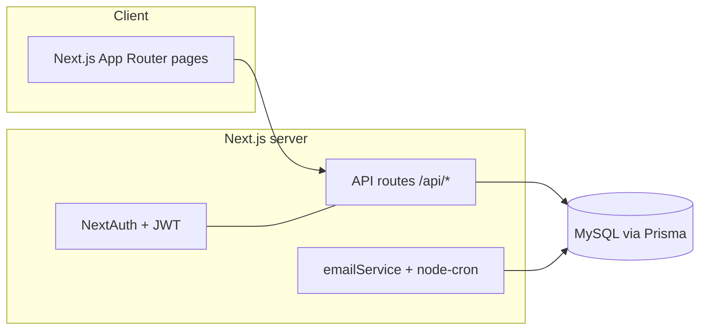

# CLAUDE.md

Guidance for AI agents (Claude Code) working in this repository. Read this first.

## What this project is

**Internship CRM** — a Next.js app for managing mentor ↔ mentee relationships through an
internship/hiring pipeline. It digitizes a workflow previously tracked in a spreadsheet:
mentors follow each mentee from first contact → internship → hired, logging interactions
along the way.

## Tech stack

- **Next.js 15** (App Router) + **React 19** + **TypeScript**
- **Prisma 5** ORM → **MySQL**
- **NextAuth 4** (Credentials provider, JWT sessions, bcrypt password hashing)
- **Tailwind CSS**, **lucide-react**, **react-hook-form**, **zod**
- **Nodemailer** (SMTP) + **node-cron** for interaction reminders
- Containerized (**Docker**); deployed to a **Plesk** server via GitHub Actions

## Commands

```bash
npm run dev          # local dev server (http://localhost:3000)
npm run build        # production build
npm run start        # serve production build
npm run lint         # next lint
npx prisma generate  # regenerate client (also runs on postinstall)
npx prisma db push   # sync schema to DB (this project uses db push, NOT migrations)
npx prisma db seed   # create first ADMIN (see seed env vars below)

npm run test:e2e         # full Playwright suite (starts the app itself)
npm run test:e2e:smoke   # critical-path subset only (tests tagged @smoke)
npm run test:e2e:headed  # full suite, with a visible browser
```

**E2E tests** (Playwright) live in `e2e/`. The PR quality gate
(`.github/workflows/e2e.yml`, isolated MySQL service) runs **only the `@smoke` subset**;
the full suite is the scheduled safety net (see below). The **smoke set** is the tests
tagged `@smoke` (`test('…', { tag: '@smoke' }, …)`) — boot, auth, landing i18n, invite,
pipeline, free-core regression. When you add a spec for a *critical* flow, tag it
`@smoke`; keep the set small (~15-20 tests) so the PR gate stays fast. Locally `test:e2e`
boots the dev server; set `BASE_URL=https://crm-preview.ersah.in` to run against a
deployed env instead.
After switching branches, run `npx prisma generate` so the client matches the schema —
a stale client causes schema-drift 500s (the smoke test will catch these).
The **full suite** also runs on a schedule, 4× a day (`.github/workflows/e2e-full.yml`,
4-way sharded); a red scheduled run emails the team (`ALERT_EMAIL_TO`, stress.yml pattern).

## Architecture



### Roles & landing pages
- `ADMIN` → `/admin` (invite users, browse candidates, assign mentorships, companies)
- `MENTOR` → `/mentor` (own mentees, interaction logs)
- `MENTEE` → `/portal` (own profile, assigned mentor/company)

### Data model (Prisma) — key models
- **User** (`role`: ADMIN | MENTOR | MENTEE) — profile fields, `skills` (JSON)
- **MentorshipRelation** (mentor ↔ mentee, optional company) — `status` (ACTIVE|COMPLETED)
  and `pipelineStatus` (granular stage, see below)
- **InteractionLog** (Meeting | Feedback | Email) per relation
- **Company** + **CompanyNeed**
- **InvitationToken** (email-based registration, 7-day expiry)

### Pipeline status (the core domain concept)
`MentorshipRelation.pipelineStatus` mirrors the original spreadsheet's status column.
Stages (enum `PipelineStatus`): `BASVURU_100` → `ONAY_220` → `GORUSME_250` →
`TANISTIRMA_270` → `STAJ_BASLAYACAK_300` → `STAJ_DEVAM_450` → `STAJ_BITTI_490` →
`IS_ARIYOR_500` → `ISE_ALINABILIR_600` → `ISE_ALINDI_660` → `IS_BULDU_700`
(plus `YARIM_BIRAKTI_460`, `BASKA_YERDE_STAJ_800`). Default `BASVURU_100`.

## Directory map

```
src/
  app/
    api/            # route handlers (auth, register, invite, mentorship, interactions, ...)
    admin/  mentor/  portal/  auth/  onboarding/   # role-scoped pages
    layout.tsx  page.tsx  icon.svg
  components/ui/    # Button, Card, Input, Select, Badge, ...
  components/forms/ # OnboardingForm, ...
  lib/              # auth.ts (NextAuth config), prisma.ts (client singleton)
  services/         # emailService.ts (SMTP + cron reminders)
prisma/
  schema.prisma     # source of truth for the DB
  seed.mjs          # first-admin seeder
.github/workflows/deploy.yml  # build → ghcr.io → SSH deploy (prod + PR previews)
```

## Environment variables

See `.env.example`. Required: `DATABASE_URL` (MySQL), `NEXTAUTH_URL`, `NEXTAUTH_SECRET`.
SMTP_* for email. Seeder: `SEED_ADMIN_EMAIL` / `SEED_ADMIN_PASSWORD` / `SEED_ADMIN_NAME`.

## Deployment

`.github/workflows/deploy.yml` runs on push to `main` (production) and on PRs (preview):
1. Build Docker image, push to `ghcr.io`.
2. SSH to the Plesk server, `docker run` the image, `prisma db push --accept-data-loss`.

| Env | Container | Port | URL |
|-----|-----------|------|-----|
| Production | `internship-crm` | 3200 | https://crm.ersah.in |
| Preview (PRs) | `internship-crm-preview` | 3201 | https://crm-preview.ersah.in |

⚠️ **All open PRs share one preview container** (tracked in issue #39).
⚠️ The preview DB is **shared** — `prisma db push` there affects everyone's preview.

## Conventions & gotchas for agents

- **Schema first**: change `prisma/schema.prisma`, run `prisma format && prisma validate &&
  prisma generate`. This project uses **`db push`**, there is **no `migrations/` folder** — do
  not author SQL migrations.
- **Do not run `db push` against the shared preview/prod DB** without explicit confirmation;
  CI handles DB sync on deploy.
- **Never commit secrets.** Real values live only in server-side env / GitHub secrets.
- **Develop on synthetic data only** ([docs/DATA_ACCESS_POLICY.md](docs/DATA_ACCESS_POLICY.md)):
  local DB + `npx prisma db seed` + `npm run seed:demo` (rich fake data set). Contributors
  never browse real/preview PII; the demo seeder refuses non-local `DATABASE_URL`s.
- **Branch + PR per change.** Branch names: `feat/<issue>-slug`, `fix/<issue>-slug`,
  `docs/...`. Reference issues with `Closes #N`. Merging to `main` deploys to production.
- **Ship it yourself (standing instruction from the maintainer, 2026-07):** for every change,
  open a PR, self-review the diff, and **merge it once CI is green** (enable auto-merge if
  your session may end before checks finish). Don't leave green PRs waiting for a human.
  Track multi-step work with a visible task list as you go.
- **End-of-session retrospective (standing instruction, 2026-07):** before wrapping up a
  session, append a short dated entry to [`docs/agent-experience.md`](docs/agent-experience.md)
  with the concrete, reusable lessons you learned (environment quirks, tooling limits, process
  gotchas). Read it at the start of a session too — it captures fast-changing tactical tips that
  complement these durable rules.
- **Landing page copy** lives in the three `landing:` blocks of `src/i18n/dictionaries.ts`
  (EN/TR/DE — key parity is enforced by `npm run check:i18n` and CI). Several e2e specs
  assert exact landing strings (e.g. "Connect Talent with", "Everything you need",
  "Pipeline tracking", TR "Fırsatla buluştur" in `e2e/landing-i18n.spec.ts`) — keep them or
  update the specs in the same PR. Keep the marketing claims in sync with shipped features
  (check `CHANGELOG.md` / `src/lib/releaseNotes.ts` when features land).
- **Dark mode** is class-based (`html.dark`) with flat utility overrides in
  `src/app/globals.css`: `bg-*-50` boxes are retinted dark while `bg-*-100` chips stay
  light. Mid-tone text (`text-*-600/700`) sitting on a tinted `*-50` box goes dark-on-dark —
  add a compound override like the existing blue rules (`html.dark .bg-blue-50.text-blue-700
  { … }`); elements that must stay light in dark mode pin colors with `dark:!` utilities.
  Verify with the `dark-mode`/`landing-cta-dark` e2e specs or a computed-style check.
- **Claude Code web containers:** run `npm install` first (deps aren't preinstalled). If
  Playwright's pinned browser build is missing under `/opt/pw-browsers`, symlink the
  installed build into the expected version directory instead of `playwright install`.
- **Work is tracked on a GitHub Project board** (Epics #5–#11, stories #12+). Move the issue
  to the matching column as you work.
- Co-author trailer on commits: `Co-Authored-By: Claude Opus 4.8 <noreply@anthropic.com>`.
- **Feature catalogue**: when a user-visible feature ships, add/update its entry in
  `src/lib/features.ts` (+ `featureCatalog` i18n block) — the landing cards and the `/features`
  page are both fed from that single source. Same discipline as CHANGELOG/releaseNotes.
- **Versioning**: on a notable batch of merged features (not every PR), bump `package.json`
  `version` (semver), add an entry to `CHANGELOG.md` (developer-facing, Keep a Changelog
  format), and add a matching entry to `src/lib/releaseNotes.ts` (user-facing, EN/TR/DE,
  rendered at `/release-notes`, linked from the sidebar version footer). The app version is
  read from `package.json` at build time (`src/lib/version.ts`); the git SHA is baked into the
  Docker image via a build arg — no other wiring is needed.
- **E2E locator pitfalls** (hit repeatedly): `AdminNav` renders its own sidebar
  `input[type="search"]` filter box present on every admin page — an unscoped
  `input[type="search"]` selector in a new test will hit that instead of a page-level search
  box; add a `data-testid` to any new search input and target that. `getByText('X')` does
  substring matching, so a seeded name like "RB Company" also matches `getByText('Company')`
  — use `{ exact: true }` or scope to a container (`page.locator('table').getByText(...)`).
- **Known pre-existing CI flakes**: `e2e/account-self-service.spec.ts:52` and
  `e2e/sign-out-all.spec.ts:24` fail intermittently in the Playwright smoke job (usually
  preceded by a `[WebServer] TypeError: Cannot read properties of null (reading 'user')`
  warning) — unrelated to most changes. `gh run rerun <run-id> --failed` and it typically
  passes; other specs have occasionally failed-then-passed-on-retry too, so one flaky run
  isn't itself a regression signal — check the actual failure log before concluding a change
  broke something.
- **zsh gotcha**: `for f in $(cmd)` does **not** split on newlines in zsh (unlike bash), so
  iterating multi-line command output silently processes it as one word. Use
  `cmd | while IFS= read -r f; do ...; done` instead.
- **`gh` CLI + GitHub API rate limits**: `gh pr merge` / `gh pr create` / `gh pr checks` all
  use the GraphQL API, which has its own (separate, sometimes-exhausted) quota from REST —
  check both with `gh api rate_limit`. If GraphQL is exhausted but REST still has headroom,
  fall back to REST directly: `gh api --method PUT repos/<owner>/<repo>/pulls/<n>/merge -f
  merge_method=squash`, `gh api --method POST repos/<owner>/<repo>/pulls -f title=... -f
  head=... -f base=... -f body=...`, and `gh api repos/<owner>/<repo>/commits/<sha>/check-runs`
  for polling CI status.
- Local `main` can end up diverged from `origin/main` (e.g. an upstream force-push/history
  rewrite, or a stray local commit) — `git pull --ff-only` failing with "Diverging branches"
  is a signal to inspect first (`git log --oneline main..origin/main` and
  `origin/main..main`), not to force through. If the actual file contents match between the
  two tips, `git reset --hard origin/main` is safe.
