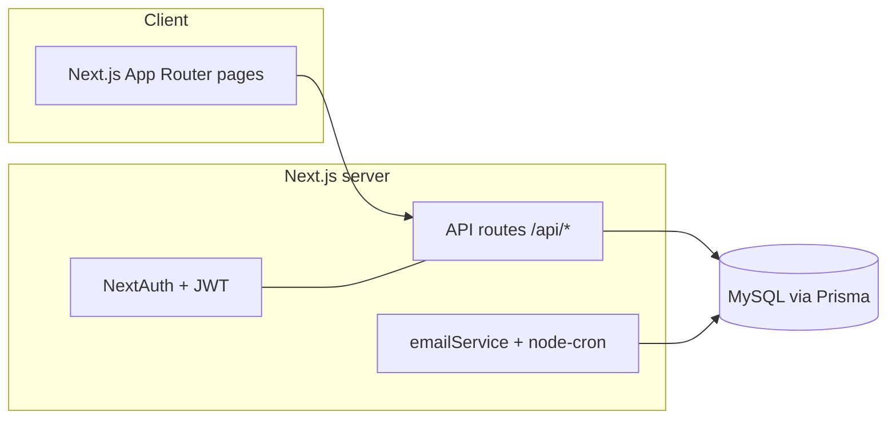

# CLAUDE.md

Guidance for AI agents (Claude Code) working in this repository. Read this first.

## What this project is

**Internship CRM** — a Next.js app for managing mentor ↔ mentee relationships through an
internship/hiring pipeline. It digitizes a workflow previously tracked in a spreadsheet:
mentors follow each mentee from first contact → internship → hired, logging interactions
along the way.

## Tech stack

- **Next.js 15** (App Router) + **React 19** + **TypeScript**
- **Prisma 5** ORM → **MySQL**
- **NextAuth 4** (Credentials provider, JWT sessions, bcrypt password hashing)
- **Tailwind CSS**, **lucide-react**, **react-hook-form**, **zod**
- **Nodemailer** (SMTP) + **node-cron** for interaction reminders
- Containerized (**Docker**); deployed to a **Plesk** server via GitHub Actions

## Commands

```bash
npm run dev          # local dev server (http://localhost:3000)
npm run build        # production build
npm run start        # serve production build
npm run lint         # next lint
npx prisma generate  # regenerate client (also runs on postinstall)
npx prisma db push   # sync schema to DB (this project uses db push, NOT migrations)
npx prisma db seed   # create first ADMIN (see seed env vars below)

npm run test:e2e         # full Playwright suite (starts the app itself)
npm run test:e2e:smoke   # critical-path subset only (tests tagged @smoke)
npm run test:e2e:headed  # full suite, with a visible browser

npm run test:stress      # weekly flat GET hammer     (BASE_URL=… ; Node, no deps)
npm run test:load        # nightly k6 ramp            (BASE_URL=… ; needs the k6 binary)
```

**E2E tests** (Playwright) live in `e2e/`. The PR quality gate
(`.github/workflows/e2e.yml`, isolated MySQL service) runs **only the `@smoke` subset**;
the full suite is the scheduled safety net (see below). The **smoke set** is the tests
tagged `@smoke` (`test('…', { tag: '@smoke' }, …)`) — boot, auth, landing i18n, invite,
pipeline, free-core regression. When you add a spec for a *critical* flow, tag it
`@smoke`; keep the set small (~15-20 tests) so the PR gate stays fast. Locally `test:e2e`
boots the dev server; set `BASE_URL=https://crm-preview.ersah.in` to run against a
deployed env instead.
After switching branches, run `npx prisma generate` so the client matches the schema —
a stale client causes schema-drift 500s (the smoke test will catch these).
The **full suite** also runs on a schedule, 4× a day at 03/09/15/21 UTC
(`.github/workflows/e2e-full.yml`, 4-way sharded, GitHub-hosted). A drift gate skips the
scheduled firing when main hasn't changed since the last completed run (re-testing the same
commit only repeats the same verdict); `workflow_dispatch` always runs. A Turkish summary
email (`scripts/e2e-report-email.mjs` → `ALERT_EMAIL_TO`) goes out **only when the run is
red** — the failing tests with error snippets. Set the repo variable
`E2E_REPORT_MODE=always` to restore the "✅ N/N test geçti" green heartbeat.

**Load tests (k6)** live in `k6/` and are the *non-functional* net: the app can be
correct and still be too slow. `k6/nightly-load.js` runs **nightly at 23:40 UTC**
(`.github/workflows/k6-load.yml`) against the deployed target (`STRESS_TARGET_URL`,
default prod) — a 6m00s VU ramp to a peak of 20, **anonymous GET only**, with
per-endpoint latency budgets declared in `options.thresholds` (each carrying its
reasoning as a comment). A Turkish breach email (`scripts/k6-report-email.mjs`) goes
out **only when a threshold fails**; green is silent. Deliberately **no drift gate** —
unlike e2e-full, a load test measures the *environment*, which degrades without any
commit changing. The older `scripts/stress-test.mjs` (weekly, flat concurrency) stays:
it is a different shape of test, not a predecessor. Full details, including **how to
add a new k6 scenario**, in [`docs/testing.md`](docs/testing.md).

## Architecture


```mermaid
flowchart LR
  subgraph Client
    UI[Next.js App Router pages]
  end
  subgraph Server[Next.js server]
    API[API routes /api/*]
    AUTH[NextAuth + JWT]
    MAIL[emailService + node-cron]
  end
  DB[(MySQL via Prisma)]
  UI --> API --> DB
  AUTH --- API
  MAIL --> DB
```

### Roles & landing pages
- `ADMIN` → `/admin` (invite users, browse candidates, assign mentorships, companies)
- `MENTOR` → `/mentor` (own mentees, interaction logs)
- `MENTEE` → `/portal` (own profile, assigned mentor/company)

### Data model (Prisma) — key models
- **User** (`role`: ADMIN | MENTOR | MENTEE) — profile fields, `skills` (JSON)
- **MentorshipRelation** (mentor ↔ mentee, optional company) — `status` (ACTIVE|COMPLETED)
  and `pipelineStatus` (granular stage, see below)
- **InteractionLog** (Meeting | Feedback | Email) per relation
- **Company** + **CompanyNeed**
- **InvitationToken** (email-based registration, 7-day expiry)

### Pipeline status (the core domain concept)
`MentorshipRelation.pipelineStatus` mirrors the original spreadsheet's status column.
Stages (enum `PipelineStatus`, `prisma/schema.prisma` is the source of truth):
`APPLICATION_100` → `APPROVAL_PENDING_220` → `INTERVIEW_PENDING_250` →
`INTRODUCTION_PENDING_270` → `INTERNSHIP_STARTING_300` → `INTERNSHIP_IN_PROGRESS_450` →
`INTERNSHIP_COMPLETED_490` → `JOB_SEEKING_500` → `HIREABLE_600` → `HIRED_660` →
`EMPLOYED_700` (plus the off-path `INTERNSHIP_DROPPED_460` and
`INTERNSHIP_FOUND_ELSEWHERE_800`). Default `APPLICATION_100`. The Turkish names are the
*labels* (`src/lib/pipeline.ts`), not the keys — this list used to give the labels as keys,
which type-checks nowhere and fails only at runtime.

## Directory map

```
src/
  app/
    api/            # route handlers (auth, register, invite, mentorship, interactions, ...)
    admin/  mentor/  portal/  auth/  onboarding/   # role-scoped pages
    layout.tsx  page.tsx  icon.svg
  components/ui/    # Button, Card, Input, Select, Badge, ...
  components/forms/ # OnboardingForm, ...
  lib/              # auth.ts (NextAuth config), prisma.ts (client singleton)
  services/         # emailService.ts (SMTP + cron reminders)
prisma/
  schema.prisma     # source of truth for the DB
  seed.mjs          # first-admin seeder
.github/workflows/deploy.yml  # build → ghcr.io → SSH deploy (prod + PR previews)
```

## Environment variables

See `.env.example`. Required: `DATABASE_URL` (MySQL), `NEXTAUTH_URL`, `NEXTAUTH_SECRET`.
SMTP_* for email. Seeder: `SEED_ADMIN_EMAIL` / `SEED_ADMIN_PASSWORD` / `SEED_ADMIN_NAME`.

## Deployment

All three environments follow the same shape: the image is **built on a GitHub-hosted
runner** (`build-image.yml`, pushed to `ghcr.io/21072026/internship`), and the Plesk
server's **self-hosted runner** only pulls it, runs `prisma db push --accept-data-loss`
+ the idempotent backfills, swaps its container and health-checks it. **Nothing
compiles on the server** — keep it that way (the repo is public, so `ubuntu-latest`
is free; between 2026-06 and 2026-07-29 the builds ran on the box as a quota
workaround, #636, and it compiled on every PR push).

| Env | Container | Port | URL | Image tag | Trigger |
|-----|-----------|------|-----|-----------|---------|
| Production | `internship-crm` | 3200 | https://crm.ersah.in | `prod-<sha>` | push to `main` (+6h drift check, manual) |
| Preview | `internship-crm-preview` | 3201 | https://crm-preview.ersah.in | `preview-<sha>` | push to `main` (+6h drift check, manual) |
| Topic (per PR) | `internship-crm-pr<N>` | 33xx | `https://crm-pr<N>.ersah.in` | `topic-pr<N>` | every push to the PR |

- `deploy-prod.yml` / `deploy-preview.yml` — **both follow `main` automatically**. Every merge
  lands on preview and prod. Three jobs: **gate** (self-hosted; resolves the target sha and
  reads the live container's `/api/health` `sha`) → **build** (`ubuntu-latest`) → **deploy**
  (self-hosted). The *drift gate* skips the build when the live sha already matches
  `origin/main`, so the 6-hourly scheduled run is a no-op unless a push was missed (the
  runner can be offline — see `runner-watchdog.yml`). A manual `workflow_dispatch` always
  deploys, and takes any branch/tag/SHA. Prod additionally runs with `FORWARD_ONLY=1` so it
  can never regress to an older commit (`FORCE=1` for a deliberate rollback).
- Everything after the gate is pinned to the **one sha the gate resolved**, so the image,
  its baked `GIT_SHA` and the deployed checkout can't disagree. Prod builds with
  `NEXT_PUBLIC_APP_ENV=production`; preview and topic envs use `preview` (green accent +
  "preview" badge, `src/lib/appEnv.ts`).
- **Planned:** prod moves to a weekly release train while preview keeps tracking `main`.
  The switch is documented in the header of `deploy-prod.yml` (drop `push:`, uncomment the
  weekly `schedule:`).
- `topic-preview.yml` — per-PR isolated environment, torn down when the PR closes (#583).
  **Fork PRs get none** (their `GITHUB_TOKEN` can't push to ghcr, and unreviewed fork code
  shouldn't run on the production host).
- `deploy.yml` is the **legacy hosted** pipeline (ghcr.io + SSH), **superseded** — don't extend it.
- `infra/autodeploy.sh` is a break-glass poller that **builds on the server** — don't put it
  on a cron (see `infra/README.md`).
- Each **topic env has its own database** (`internship_pr<N>`, #1185), created on first
  deploy, seeded with the synthetic demo set (`admin.demo@demo.example.com` / `DemoPass123!`)
  and dropped when the PR closes — so a `db push` on a PR affects nobody else, and no real
  preview data is reachable from a topic environment. The **shared preview env** at
  `crm-preview.ersah.in` still has its own single DB; `db push` there is global.

## Conventions & gotchas for agents

- **Schema first**: change `prisma/schema.prisma`, run `prisma format && prisma validate &&
  prisma generate`. This project uses **`db push`**, there is **no `migrations/` folder** — do
  not author SQL migrations.
- **Do not run `db push` against the shared preview/prod DB** without explicit confirmation;
  CI handles DB sync on deploy.
- **Never commit secrets.** Real values live only in server-side env / GitHub secrets.
- **Develop on synthetic data only** ([docs/DATA_ACCESS_POLICY.md](docs/DATA_ACCESS_POLICY.md)):
  local DB + `npx prisma db seed` + `npm run seed:demo` (rich fake data set). Contributors
  never browse real/preview PII; the demo seeder refuses non-local `DATABASE_URL`s.
- **Branch + PR per change.** Branch names: `feat/<issue>-slug`, `fix/<issue>-slug`,
  `docs/...`. Reference issues with `Closes #N`. Merging to `main` deploys to production.
- **Ship it yourself (standing instruction from the maintainer, 2026-07):** for every change,
  open a PR, self-review the diff, and **merge it once CI is green** (enable auto-merge if
  your session may end before checks finish). Don't leave green PRs waiting for a human.
  Track multi-step work with a visible task list as you go.
  **Always open the PR, without being asked** (restated 2026-08-06): the PR is how the
  maintainer *tests* the change — every PR gets its own environment at
  `https://crm-pr<N>.ersah.in` (`topic-preview.yml`). Pushing the branch alone gives them
  nothing to click. Open it as soon as the work is committed, even mid-review, and post the
  preview URL. If an issue for the work does not exist yet, file one and reference it
  (`Closes #N`) so the branch, the PR and the issue all point at each other.
- **End-of-session retrospective (standing instruction, 2026-07):** before wrapping up a
  session, append a short dated entry to [`docs/agent-experience.md`](docs/agent-experience.md)
  with the concrete, reusable lessons you learned (environment quirks, tooling limits, process
  gotchas). Read it at the start of a session too — it captures fast-changing tactical tips that
  complement these durable rules.
- **Security work** starts from [`docs/security-audit-playbook.md`](docs/security-audit-playbook.md):
  how to stand up a local DB in this container (no Docker daemon — apt MariaDB), the Playwright
  `executablePath` workaround, the role × endpoint matrix method, **which areas already tested
  clean** (don't re-litigate them; breaking one is a regression), and what was never examined.
  Root tracking issue for the 2026-07 audit: **#951**.
- **Landing page copy** lives in the three `landing:` blocks of `src/i18n/dictionaries.ts`
  (EN/TR/DE — key parity is enforced by `npm run check:i18n` and CI). Several e2e specs
  assert exact landing strings (e.g. "Connect Talent with", "Everything you need",
  "Pipeline tracking", TR "Fırsatla buluştur" in `e2e/landing-i18n.spec.ts`) — keep them or
  update the specs in the same PR. Keep the marketing claims in sync with shipped features
  (check `CHANGELOG.md` / `src/lib/releaseNotes.ts` when features land).
- **Dark mode** is class-based (`html.dark`) with flat utility overrides in
  `src/app/globals.css`: `bg-*-50` boxes are retinted dark while `bg-*-100` chips stay
  light. Mid-tone text (`text-*-600/700`) sitting on a tinted `*-50` box goes dark-on-dark —
  add a compound override like the existing blue rules (`html.dark .bg-blue-50.text-blue-700
  { … }`); elements that must stay light in dark mode pin colors with `dark:!` utilities.
  Verify with the `dark-mode`/`landing-cta-dark` e2e specs or a computed-style check.
- **Claude Code web containers:** run `npm install` first (deps aren't preinstalled). If
  Playwright's pinned browser build is missing under `/opt/pw-browsers`, symlink the
  installed build into the expected version directory instead of `playwright install`.
- **Work is tracked on a GitHub Project board** (Epics #5–#11, stories #12+). Move the issue
  to the matching column as you work.
- Co-author trailer on commits: `Co-Authored-By: Claude Opus 4.8 <noreply@anthropic.com>`.
- **Licensing & IP**: the project is `AGPL-3.0-or-later` with **dual licensing**, and the
  **sole rights holder is Mehmet Erşahin (a natural person — not bcsit GmbH)**. Don't name a
  company as the IP owner in docs or license texts; the invoicing entity is a *separate*,
  still-open question (`docs/legal/legal-tax-framework.md`). Contributor terms live in
  `CONTRIBUTING.md` (§ Contributor terms (IP)) and are confirmed via the PR template;
  rationale in [`docs/legal/licensing-strategy.md`](docs/legal/licensing-strategy.md).
- **E-mail newsletter** (`/admin/newsletters`, #1469): scheduled career content, separate
  from announcements — own audience (`MENTEE`/`MENTOR`/`BOTH`), own archive, own opt-out
  category, one `NewsletterSend` row per recipient, and a **sent issue is immutable and
  undeletable**. Curated issues live in `src/lib/newsletterContent.ts` (EN/TR/DE, house
  style documented there). Full design in [`docs/newsletter.md`](docs/newsletter.md) — read
  it before extending: `lib/newsletter.ts` is client-safe on purpose (the HMAC token and
  URL builders live in `lib/newsletterTokens.ts`), and the cron is registered from
  `/api/cron/start`, never from `initCronJobs`, to keep the import graph one-way.
- **Staying signed in** (`docs/remember-me.md`, #1495): the session JWT is 12h and stays that
  way; "keep me signed in" is a separate rotating, hashed, revocable per-device token that
  silently mints a new session. Two rules to keep in mind when touching auth: anything that
  revokes sessions (sets `sessionsValidFrom`) **must** also call `revokeAllTrustedDevices()`,
  or the browser signs itself straight back in; and any new sign-out control must go through
  `signOutEverywhere()` rather than NextAuth's `signOut()`.
- **Feature catalogue**: when a user-visible feature ships, add/update its entry in
  `src/lib/features.ts` (+ `featureCatalog` i18n block) — the landing cards and the `/features`
  page are both fed from that single source. Same discipline as CHANGELOG/releaseNotes.
- **Versioning (maintainer instruction, 2026-07-20; mechanism reworked 2026-08-23, #1275):
  every shipped change is versioned** — the maintainer tracks "what changed / what's live"
  from the version. But PRs **never edit** `package.json`'s version, `CHANGELOG.md` or
  `src/lib/releaseNotes.ts` directly anymore: those three changed on the same lines in every
  PR, so parallel PRs always conflicted and raced for the same number.
  **Versioning checklist — ONE step per shipped PR:** add a file
  `releases/unreleased/<kebab-slug>.json` with `bump` (`minor` for features, `patch` for
  fixes), `changelog` (developer-facing Keep-a-Changelog bullet, markdown) and — for
  user-visible changes — `notes` with EN/TR/DE user-facing highlight strings (all three or
  none). Full format + rationale: [releases/README.md](releases/README.md). Trivial
  non-user-facing changes (pure docs, CI config) still need no fragment.
  The displayed version is derived at build time from base+fragments (`next.config.js` →
  `src/lib/version.ts`), so it is correct immediately after every merge; a scheduled workflow
  (`release-compact.yml`) later folds fragments into the canonical files through a normal PR.
  `npm run check:release-fragments` validates fragments in CI (and prints the version each
  pending change will ship as); `npm run test:release` guards the arithmetic. A shipped change
  without a fragment is a checklist failure — reviewers will call it out.
  **One fragment = one release (#1457):** each fragment gets its own version number, dated to
  the minute (UTC) and linked to the commit that added it — in `CHANGELOG.md`, in
  `src/lib/releaseNotes.ts` and on `/release-notes`. The order is the **merge** order read
  from git, not the filename order: filename order let a `patch` fragment be swallowed by a
  later `minor`'s `patch = 0` reset (three merges in a row shipped as `0.114.0-beta`) and the
  compaction buried a whole cron window — 45 changes — under one heading. Consequences to know:
  a shallow clone cannot date a release, so anything that stamps checks out with
  `fetch-depth: 0` and compaction **fails closed**; `.git` is `.dockerignore`d, so
  `build-image.yml` resolves the stamps on the runner and passes them in as `RELEASE_STAMPS`.
- **k6 load tests** (`k6/`, added 2026-08-26): a k6 script here points at a **live shared
  environment**, so the safety rules are hard constraints, not preferences — **GET only**
  (nothing may mutate a row), **never authenticated** (bcrypt is expensive and the
  failed-login bucket would lock the runner's IP out), never an endpoint that mails, calls
  an AI provider or increments a counter, and **never a rate-limited route** (all VUs share
  the runner's single IP, so `/api/public/stats` at 60/10min and `/api/v1/*` at 120/min are
  excluded — a 429 in a report means the mix drifted, not that the app is sick). Keep the
  files **`.js`**: a `.ts` under `k6/` is pulled into `npx tsc --noEmit` and fails on the
  missing `k6/*` module types — deliberately left un-excluded in `tsconfig.json` so the rule
  enforces itself. The `.js` files themselves are linted and typechecked by **nothing**
  (`next lint` only visits `src/`, tsconfig's `include` only `*.ts|tsx`), which is why
  `npm run check:k6` (a `k6 archive` parse, wired into `ci.yml`) exists — without it a
  mistyped threshold key first surfaces at 23:40 UTC as a crash email. Tag every request `{ ep: '<name>' }` and give each tag both a
  `http_req_duration{ep:…}` budget and `http_reqs{ep:…}: ['count>0']` — a tagged sub-metric
  only reaches the JSON summary when a threshold names it, and the alert email's
  per-endpoint table is built from exactly those. Validate a change with
  `K6_SMOKE=1 K6_PEAK_VUS=3 npm run test:load` (~40s) instead of the full 6-minute ramp.
  `BASE_URL` defaults to **preview**, not prod, so a reflexive `npm run test:load` cannot
  ramp the live site. A new scenario gets **its own workflow** — `k6-load.yml` hardcodes one
  summary filename, so a second `k6 run` step there would overwrite the first one's summary.
  **Writing a new k6 test is expected** when a change puts real load on a new surface —
  follow the checklist at the end of the k6 section in `docs/testing.md`.
- **E2E locator pitfalls** (hit repeatedly): `AdminNav` renders its own sidebar
  `input[type="search"]` filter box present on every admin page — an unscoped
  `input[type="search"]` selector in a new test will hit that instead of a page-level search
  box; add a `data-testid` to any new search input and target that. `getByText('X')` does
  substring matching, so a seeded name like "RB Company" also matches `getByText('Company')`
  — use `{ exact: true }` or scope to a container (`page.locator('table').getByText(...)`).
  **Responsive dual lists**: `/admin/candidates` renders every candidate *twice* — once in the
  `md:hidden` mobile list (`candidates-mobile-list`, cards `candidate-mobile-card-<id>`) and
  once in the desktop grid (`candidates-desktop-list`, cards `candidate-card-<id>`). Strict mode
  counts matched elements regardless of CSS visibility, so any unscoped name locator there
  resolves to 2 and throws; scope to `getByTestId('candidates-desktop-list')` (what the Desktop
  Chrome viewport shows) or to a specific card testid. Assume the same for any future
  mobile/desktop split.
- **Known pre-existing CI flakes**: `e2e/account-self-service.spec.ts:52` and
  `e2e/sign-out-all.spec.ts:24` fail intermittently in the Playwright smoke job (usually
  preceded by a `[WebServer] TypeError: Cannot read properties of null (reading 'user')`
  warning) — unrelated to most changes. `gh run rerun <run-id> --failed` and it typically
  passes; other specs have occasionally failed-then-passed-on-retry too, so one flaky run
  isn't itself a regression signal — check the actual failure log before concluding a change
  broke something.
- **zsh gotcha**: `for f in $(cmd)` does **not** split on newlines in zsh (unlike bash), so
  iterating multi-line command output silently processes it as one word. Use
  `cmd | while IFS= read -r f; do ...; done` instead.
- **`gh` CLI + GitHub API rate limits**: `gh pr merge` / `gh pr create` / `gh pr checks` all
  use the GraphQL API, which has its own (separate, sometimes-exhausted) quota from REST —
  check both with `gh api rate_limit`. If GraphQL is exhausted but REST still has headroom,
  fall back to REST directly: `gh api --method PUT repos/<owner>/<repo>/pulls/<n>/merge -f
  merge_method=squash`, `gh api --method POST repos/<owner>/<repo>/pulls -f title=... -f
  head=... -f base=... -f body=...`, and `gh api repos/<owner>/<repo>/commits/<sha>/check-runs`
  for polling CI status.
- Local `main` can end up diverged from `origin/main` (e.g. an upstream force-push/history
  rewrite, or a stray local commit) — `git pull --ff-only` failing with "Diverging branches"
  is a signal to inspect first (`git log --oneline main..origin/main` and
  `origin/main..main`), not to force through. If the actual file contents match between the
  two tips, `git reset --hard origin/main` is safe.
