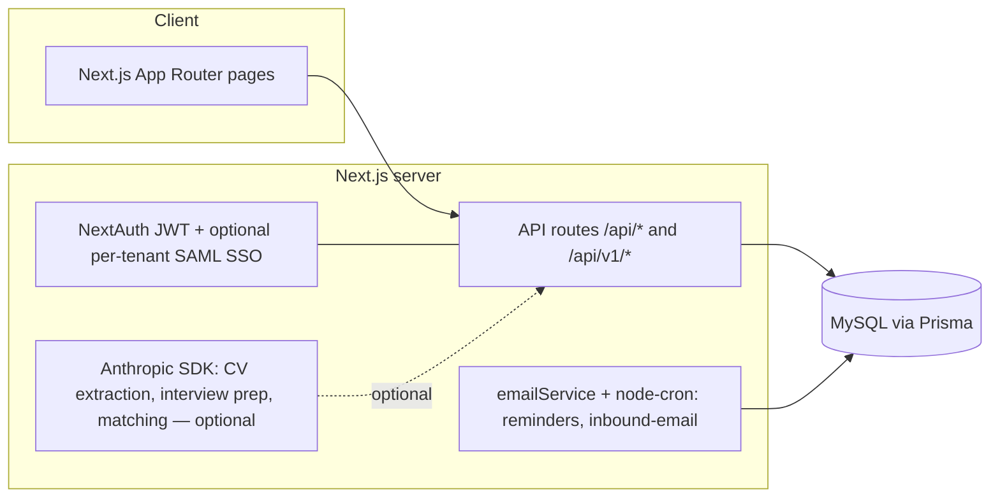

# CLAUDE.md

Guidance for AI agents (Claude Code) working in this repository. Read this first.

## What this project is

**Internship CRM** — a Next.js app for managing mentor ↔ mentee relationships through an
internship/hiring pipeline. It digitizes a workflow previously tracked in a spreadsheet:
mentors follow each mentee from first contact → internship → hired, logging interactions
along the way. It has grown into a small multi-role platform: besides mentors and mentees
it now serves **companies** (hiring, talent-pool browsing, premium analytics) and **sources**
(referral partners), plus admin-side multi-tenancy, white-label branding, SSO, and optional
AI assistance — most of these are additive and gated so the single-tenant free core keeps
working unchanged (see "Multi-tenancy, plans & premium features" below).

## Tech stack

- **Next.js 15** (App Router) + **React 19** + **TypeScript**
- **Prisma 5** ORM → **MySQL**
- **NextAuth 4** (Credentials provider, JWT sessions, bcrypt password hashing) + optional
  **SAML SSO** (`@node-saml/node-saml`) per tenant
- **Tailwind CSS**, **lucide-react**, **react-hook-form**, **zod**
- **Nodemailer** (SMTP) + **node-cron** for interaction reminders and inbound-email
- **Anthropic SDK** (`@anthropic-ai/sdk`) — optional AI features (CV extraction/feedback,
  interview prep, mentor matching, summaries), all dormant unless `ANTHROPIC_API_KEY` is set
- `mammoth` / `pdf-parse` (CV parsing), `xlsx` / `csv-parse` (import/export)
- Containerized (**Docker**); deployed to a **Plesk** server via GitHub Actions
  (self-hosted runner — see Deployment)

## Commands

```bash
npm run dev          # local dev server (http://localhost:3000)
npm run build        # production build
npm run start        # serve production build
npm run lint          # next lint
npx tsc --noEmit      # type check (CI gate; not a package.json script)
npx prisma validate   # schema check
npx prisma generate  # regenerate client (also runs on postinstall)
npx prisma db push   # sync schema to DB (this project uses db push, NOT migrations)
npx prisma db seed   # create first ADMIN (see seed env vars below)
npm run seed:demo    # rich synthetic data set for local dev (refuses non-local DATABASE_URL)
npm run check:i18n   # verify EN/TR/DE dictionary key parity; CI gate

npm run test:e2e         # full Playwright suite (starts the app itself)
npm run test:e2e:smoke   # critical-path subset only (tests tagged @smoke)
npm run test:e2e:headed  # full suite, with a visible browser
npm run test:stress      # load/stress test against a running app (docs/testing.md)
npm run import:csv       # bulk-import legacy candidate CSV (dry-run by default; --apply to write)

npm run db:dev:up    # start a local throwaway MySQL via docker-compose.dev.yml
npm run db:dev:down  # stop it
```

**E2E tests** (Playwright) live in `e2e/` (200+ spec files covering functional, a11y,
security/IDOR, XSS, responsive, PWA, and health-probe cases — see `docs/testing.md` for the
full breakdown by category). The PR quality gate (`.github/workflows/e2e.yml`, isolated MySQL
service) runs **only the `@smoke` subset**; the full suite is the scheduled safety net (see
below). The **smoke set** is the tests tagged `@smoke` (`test('…', { tag: '@smoke' }, …)`) —
boot, auth, landing i18n, invite, pipeline, free-core regression. When you add a spec for a
*critical* flow, tag it `@smoke`; keep the set small (~15-20 tests) so the PR gate stays fast.
Locally `test:e2e` boots the dev server; set `BASE_URL=https://crm-preview.ersah.in` to run
against a deployed env instead.
After switching branches, run `npx prisma generate` so the client matches the schema —
a stale client causes schema-drift 500s (the smoke test will catch these).
The **full suite** also runs on a schedule (`.github/workflows/e2e-full.yml`, 4-way sharded,
`workflow_dispatch` while GitHub-hosted quota is conserved — see Deployment); a red run
emails the team (`ALERT_EMAIL_TO`, same pattern as `stress.yml`).

## Architecture


```mermaid
flowchart LR
  subgraph Client
    UI[Next.js App Router pages]
  end
  subgraph Server[Next.js server]
    API[API routes /api/* and /api/v1/*]
    AUTH[NextAuth JWT + optional per-tenant SAML SSO]
    MAIL[emailService + node-cron: reminders, inbound-email]
    AI[Anthropic SDK: CV extraction, interview prep, matching — optional]
  end
  DB[(MySQL via Prisma)]
  UI --> API --> DB
  AUTH --- API
  MAIL --> DB
  AI -.optional.-> API
```

### Roles & landing pages
- `ADMIN` → `/admin` (invite users, browse candidates, assign mentorships, companies,
  organizations, support tickets, analytics, settings)
- `MENTOR` → `/mentor` (own mentees, interaction logs, board, calendar, analytics)
- `MENTEE` → `/portal` (own profile, assigned mentor/company, messages, notes)
- `COMPANY` → `/company` (talent-pool browsing, candidates, analytics — premium features
  gated per-company via `CompanyEntitlement`)
- `SOURCE` → `/source` (referral-source partner view)

`src/lib/roleHome.ts` is the single source of truth for role → landing route.

### Multi-tenancy, plans & premium features
The `Organization` model underpins tenant-scoped features shipped in additive, gated
phases (`docs/tenant-isolation.md`, `docs/white-label.md`, `docs/pipeline-stages.md`):
- **Isolation**: every tenant-scoped row carries a nullable `orgId`, backfilled to one
  `default` org. Enforcement (`src/lib/orgContext.ts` / `orgScope.ts`) is a Prisma
  middleware gated behind `MT_ENFORCE_ISOLATION` (default **off** — do not enable in
  production without following the rollout checklist in `docs/tenant-isolation.md`).
  While off, the app behaves as single-tenant.
- **Plans**: `Organization.plan` (`OrgPlan`: FREE/PRO/ENTERPRISE) + `planGate.ts` gate
  advisory limits.
- **White-label branding** (`src/lib/branding.ts`): per-org name/logo/color/support email,
  resolvable today but not yet applied to live chrome (needs request→org resolution first).
- **Per-tenant pipeline stages** (`PipelineStage` model, `src/lib/pipelineStages.ts`):
  orgs can relabel/reorder/recolor stages, or (post-Slice C) define wholly custom stage
  keys, resolved via `resolvePipelineStages()` / `useResolvedStages()`.
- **Company premium features** are separate from org plans: mentor/mentee experience is
  **always free**; a `CompanyEntitlement` row turns on one premium feature for one company
  (`src/lib/entitlements.ts`, catalogue in `entitlementsCatalog.ts`). Never gate mentor/mentee
  flows on entitlements.
- **SSO**: per-tenant SAML config (`src/lib/sso.ts`, `ssoSaml.ts`, `ssoProvisioning.ts`),
  see `docs/sso-saml.md`.

### Data model (Prisma) — key models
`prisma/schema.prisma` has 50+ models; the ones worth knowing up front:
- **User** (`role`: ADMIN | MENTOR | MENTEE | COMPANY | SOURCE), `orgId`, skills (JSON),
  2FA (TOTP) fields, email verification
- **Organization** — tenant root (plan, branding, SSO config)
- **MentorshipRelation** (mentor ↔ mentee, optional company) — `status`
  (ACTIVE|COMPLETED) and `pipelineStatus` (granular stage, see below)
- **InteractionLog** (Meeting | Feedback | Email) per relation; **StatusChange** for
  pipeline-stage audit history
- **Company**, **CompanyNeed**, **CompanyEntitlement**, **CompanyInterest**
- **InvitationToken** (email-based registration, 7-day expiry)
- **Meeting** / **MeetingSeries** / **MeetingRequest** (RSVP, recurring generation,
  Google Calendar sync) + **AvailabilitySlot**
- **Message** / **MessageAttachment** / **MessageReaction** / **Notification** /
  **Announcement** — in-app messaging + inbound-email bridge
- **SupportTicket** / **SupportMessage** / **SupportAttachment** — the in-app support
  desk (attachments on both mentee and admin replies)
- **Project** / **ProjectMember** / **ProjectTask** / **Cohort** — grouping beyond 1:1
  mentorship
- **Evaluation** / **Goal** / **MentorQuestion** — mentee progress tracking
- **Webhook** / **ApiKey** — outbound integrations and the public `/api/v1` surface
- **ImpersonationGrant**, **SsoLoginGrant**, **AuditLog**, **ActivityLog** — admin/security
- **UserConsent**, **PasswordResetToken**, **EmailVerificationToken** — account/GDPR flows

### Pipeline status (the core domain concept)
`MentorshipRelation.pipelineStatus` mirrors the original spreadsheet's status column.
Stages (enum `PipelineStatus`, `src/lib/pipeline.ts` is the canonical single source of
truth): `APPLICATION_100` → `APPROVAL_PENDING_220` → `INTERVIEW_PENDING_250` →
`INTRODUCTION_PENDING_270` → `INTERNSHIP_STARTING_300` → `INTERNSHIP_IN_PROGRESS_450` →
`INTERNSHIP_COMPLETED_490` → `JOB_SEEKING_500` → `HIREABLE_600` → `HIRED_660` →
`EMPLOYED_700` (plus off-path `INTERNSHIP_DROPPED_460`, `INTERNSHIP_FOUND_ELSEWHERE_800`).
Default `APPLICATION_100`. Numeric suffixes are the legacy spreadsheet status codes; comments
in the schema carry the original Turkish labels. Orgs can override labels/order/color (and,
per `docs/pipeline-stages.md` Slice C, add entirely custom stage keys) via `PipelineStage` —
always resolve through `resolvePipelineStages()`/`useResolvedStages()` rather than assuming
the canonical 13, since stage-rendering surfaces (journey, boards, filters, analytics) must
reflect the viewer's tenant.

## Directory map

```
src/
  app/
    api/            # route handlers: auth, register, invite, mentorship, interactions,
                     # messages, meetings, support, webhooks, v1/ (public API + OpenAPI), ...
    admin/  mentor/  portal/  company/  source/  auth/  onboarding/   # role-scoped pages
    layout.tsx  page.tsx  icon.svg
  components/ui/    # Button, Card, Input, Select, Badge, ...
  components/forms/ # OnboardingForm, ...
  middleware.ts     # blocks WRITE methods from unverified-email sessions (allowlist for
                     # auth/register/rsvp/apply/impersonate-stop/inbound-email)
  lib/              # auth.ts (NextAuth config), prisma.ts (client singleton), pipeline.ts,
                     # orgScope.ts/orgContext.ts (tenant isolation), entitlements.ts,
                     # branding.ts, sso*.ts, ai*.ts (CV/interview-prep/matching), ...
  services/         # emailService.ts (SMTP + cron reminders)
  i18n/             # dictionaries.ts (EN/TR/DE; key parity enforced by check:i18n)
prisma/
  schema.prisma     # source of truth for the DB
  seed.mjs          # first-admin seeder
  seed-demo.mjs      # synthetic demo data set (local-only)
  seed-templates.mjs
e2e/                # Playwright specs (200+); helpers/db.ts seeds/cleans up own data
docs/               # tenant-isolation, white-label, pipeline-stages, sso-saml,
                     # DATA_ACCESS_POLICY, testing, google-calendar, agent-experience, ...
infra/              # deploy scripts used by the self-hosted-runner workflows
.github/workflows/  # ci.yml, e2e.yml, e2e-full.yml, stress.yml, deploy-prod.yml,
                     # deploy-preview.yml, topic-preview.yml, deploy.yml (paused), infra-setup.yml
```

## Environment variables

See `.env.example` for the full, commented list. Required: `DATABASE_URL` (MySQL),
`NEXTAUTH_URL`, `NEXTAUTH_SECRET`. `SMTP_*` for email. Seeder: `SEED_ADMIN_EMAIL` /
`SEED_ADMIN_PASSWORD` / `SEED_ADMIN_NAME`. Optional feature flags, all dormant unless set:
`ANTHROPIC_API_KEY` (+`ANTHROPIC_CV_MODEL`) for AI CV extraction; `GOOGLE_CLIENT_ID`/
`GOOGLE_CLIENT_SECRET` for Calendar sync; `MT_ENFORCE_ISOLATION` for tenant-isolation
enforcement (leave `false`); `INBOUND_EMAIL_DOMAIN`/`INBOUND_SECRET` for the inbound-email
bridge.

## Deployment

CI/CD is split between GitHub-hosted runners (cheap static checks) and a **self-hosted
runner on the Plesk server itself** (everything that needs Docker/nginx, so it costs no
GitHub-hosted Actions minutes — see `infra/README.md`):

| Workflow | Runner | Trigger | What |
|----------|--------|---------|------|
| `ci.yml` | hosted | push to `main`, every PR | lint, `tsc --noEmit`, `prisma validate`, i18n parity, build |
| `e2e.yml` | hosted | push to `main`, every PR | Playwright `@smoke` subset against an isolated MySQL service |
| `e2e-full.yml` | hosted | schedule (4×/day) + manual | full Playwright suite, 4-way sharded |
| `stress.yml` | hosted | nightly 02:30 UTC + manual | load test against prod/preview; emails on threshold breach |
| `topic-preview.yml` | **self-hosted** | every PR (open/sync/reopen/close), automatic | per-PR ephemeral env: container `internship-crm-pr<N>` on its own port → `https://crm-pr<N>.ersah.in`; torn down on close |
| `deploy-preview.yml` | **self-hosted** | manual dispatch | deploys a ref to the long-lived preview (`internship-crm-preview`, :3201, `crm-preview.ersah.in`) |
| `deploy-prod.yml` | **self-hosted** | manual dispatch | deploys a ref to production (`internship-crm`, :3200, `crm.ersah.in`) |
| `deploy.yml` | hosted | **paused** (`workflow_dispatch` only) | legacy GHCR-based preview/prod deploy; superseded by the two above while hosted quota is conserved |

| Env | Container | Port | URL |
|-----|-----------|------|-----|
| Production | `internship-crm` | 3200 | https://crm.ersah.in |
| Long-lived preview | `internship-crm-preview` | 3201 | https://crm-preview.ersah.in |
| Per-PR topic preview | `internship-crm-pr<N>` | dynamic | https://crm-pr\<N\>.ersah.in |

⚠️ **The preview DB is shared** across the long-lived preview *and* every per-PR topic
preview (each PR gets its own container, but they all point at one MySQL database) —
`prisma db push` against it affects everyone's preview. Coordinate concurrent schema
changes; see `infra/README.md` and issue #39.

## Conventions & gotchas for agents

- **Schema first**: change `prisma/schema.prisma`, run `prisma format && prisma validate &&
  prisma generate`. This project uses **`db push`**, there is **no `migrations/` folder** — do
  not author SQL migrations.
- **Do not run `db push` against the shared preview/prod DB** without explicit confirmation;
  the self-hosted deploy workflows handle DB sync on deploy.
- **Never commit secrets.** Real values live only in server-side env (`/etc/internship-crm/*.env`
  on the server) / GitHub secrets.
- **Develop on synthetic data only** ([docs/DATA_ACCESS_POLICY.md](docs/DATA_ACCESS_POLICY.md)):
  local DB + `npx prisma db seed` + `npm run seed:demo` (rich fake data set, refuses non-local
  `DATABASE_URL`). Contributors never browse real/preview PII.
- **Branch + PR per change.** Branch names: `feat/<issue>-slug`, `fix/<issue>-slug`,
  `docs/...`. Reference issues with `Closes #N`. Merging to `main` deploys to production
  (via the manual `deploy-prod.yml` dispatch, or the legacy path if re-enabled).
- **Ship it yourself (standing instruction from the maintainer, 2026-07):** for every change,
  open a PR, self-review the diff, and **merge it once CI is green** (enable auto-merge if
  your session may end before checks finish — note: auto-merge has been observed disabled on
  this repo, in which case gate locally with `npm run build`/`check:i18n` and merge manually,
  `gh pr merge <n> --squash --delete-branch`). Don't leave green PRs waiting for a human.
  Track multi-step work with a visible task list as you go.
- **End-of-session retrospective (standing instruction, 2026-07):** before wrapping up a
  session, append a short dated entry to [`docs/agent-experience.md`](docs/agent-experience.md)
  with the concrete, reusable lessons you learned (environment quirks, tooling limits, process
  gotchas). Read it at the start of a session too — it captures fast-changing tactical tips that
  complement these durable rules.
- **Landing page copy** lives in the three `landing:` blocks of `src/i18n/dictionaries.ts`
  (EN/TR/DE — key parity is enforced by `npm run check:i18n` and CI). Several e2e specs
  assert exact landing strings (e.g. "Connect Talent with", "Everything you need",
  "Pipeline tracking", TR "Fırsatla buluştur" in `e2e/landing-i18n.spec.ts`) — keep them or
  update the specs in the same PR. Keep the marketing claims in sync with shipped features
  (check `CHANGELOG.md` / `src/lib/releaseNotes.ts` when features land).
- **Dark mode** is class-based (`html.dark`) with flat utility overrides in
  `src/app/globals.css`: `bg-*-50` boxes are retinted dark while `bg-*-100` chips stay
  light. Mid-tone text (`text-*-600/700`) sitting on a tinted `*-50` box goes dark-on-dark —
  add a compound override like the existing blue rules (`html.dark .bg-blue-50.text-blue-700
  { … }`); elements that must stay light in dark mode pin colors with `dark:!` utilities.
  Verify with the `dark-mode`/`landing-cta-dark` e2e specs or a computed-style check.
- **Claude Code web containers:** run `npm install` first (deps aren't preinstalled). If
  Playwright's pinned browser build is missing under `/opt/pw-browsers`, symlink the
  installed build into the expected version directory instead of `playwright install`.
- **Work is tracked on a GitHub Project board** (Epics #5–#11, stories #12+; hierarchy uses
  native sub-issues, board grouped by parent issue; priority is the P0–P3 label). Move the
  issue to the matching column as you work.
- Co-author trailer on commits: `Co-Authored-By: Claude Opus 4.8 <noreply@anthropic.com>`.
- **Feature catalogue**: when a user-visible feature ships, add/update its entry in
  `src/lib/features.ts` (+ `featureCatalog` i18n block) — the landing cards and the `/features`
  page are both fed from that single source. Same discipline as CHANGELOG/releaseNotes.
- **Versioning (maintainer instruction, 2026-07-20): bump the version + changelog on EVERY
  shipped change**, not just notable batches — the maintainer tracks "what changed / what's
  live" from the version. For each user-visible PR: bump `package.json` `version` (semver —
  patch for fixes/small tweaks, minor for features), add a `CHANGELOG.md` entry (developer-
  facing, Keep a Changelog format), and add a matching `src/lib/releaseNotes.ts` entry (user-
  facing, EN/TR/DE, rendered at `/release-notes`, linked from the sidebar version footer). The
  app version is read from `package.json` at build time (`src/lib/version.ts`); the git SHA is
  baked into the Docker image via a build arg — no other wiring is needed. (Trivial non-user-
  facing changes — pure docs, CI config — don't need a bump.) Run `npm install` after bumping
  so `package-lock.json`'s top-level `version` field stays in sync (flagged by review otherwise).
- **Multi-tenancy is real but gated off** (`MT_ENFORCE_ISOLATION=false` by default) — see
  `docs/tenant-isolation.md`. New API routes that query a tenant-anchored model (`User`,
  `Source`, `Company`, `Project`, `Cohort`, `MentorshipRelation`) should still be wrapped in
  `withTenantScope(session, …)` for uniformity, even though it's a no-op while the flag is off.
  Never flip the flag in production without following the guarded rollout checklist.
- **E2E locator pitfalls** (hit repeatedly): `AdminNav` renders its own sidebar
  `input[type="search"]` filter box present on every admin page — an unscoped
  `input[type="search"]` selector in a new test will hit that instead of a page-level search
  box; add a `data-testid` to any new search input and target that. `getByText('X')` does
  substring matching, so a seeded name like "RB Company" also matches `getByText('Company')`
  — use `{ exact: true }` or scope to a container (`page.locator('table').getByText(...)`).
- **Playwright needs env prerequisites before tests even boot**: `NEXTAUTH_SECRET` (otherwise
  NextAuth throws `NO_SECRET` and the webServer times out) and `DATABASE_URL` (otherwise
  Prisma seeding in e2e helpers fails with `Environment variable not found`). If a new e2e
  spec looks "broken" at startup, check env before debugging test logic.
- **Known pre-existing CI flakes**: `e2e/account-self-service.spec.ts:52` and
  `e2e/sign-out-all.spec.ts:24` fail intermittently in the Playwright smoke job (usually
  preceded by a `[WebServer] TypeError: Cannot read properties of null (reading 'user')`
  warning) — unrelated to most changes. `gh run rerun <run-id> --failed` and it typically
  passes; other specs have occasionally failed-then-passed-on-retry too, so one flaky run
  isn't itself a regression signal — check the actual failure log before concluding a change
  broke something.
- **zsh gotcha**: `for f in $(cmd)` does **not** split on newlines in zsh (unlike bash), so
  iterating multi-line command output silently processes it as one word. Use
  `cmd | while IFS= read -r f; do ...; done` instead.
- **`gh` CLI + GitHub API rate limits**: `gh pr merge` / `gh pr create` / `gh pr checks` all
  use the GraphQL API, which has its own (separate, sometimes-exhausted) quota from REST —
  check both with `gh api rate_limit`. If GraphQL is exhausted but REST still has headroom,
  fall back to REST directly: `gh api --method PUT repos/<owner>/<repo>/pulls/<n>/merge -f
  merge_method=squash`, `gh api --method POST repos/<owner>/<repo>/pulls -f title=... -f
  head=... -f base=... -f body=...`, and `gh api repos/<owner>/<repo>/commits/<sha>/check-runs`
  for polling CI status. `gh` calls against workflows on the **self-hosted** runner (deploys,
  topic previews) don't have SSH available in the sandbox — diagnose/fix by putting commands
  into the workflow step itself and reading logs via the GitHub API, not by SSHing in.
- Local `main` can end up diverged from `origin/main` (e.g. an upstream force-push/history
  rewrite, or a stray local commit) — `git pull --ff-only` failing with "Diverging branches"
  is a signal to inspect first (`git log --oneline main..origin/main` and
  `origin/main..main`), not to force through. If the actual file contents match between the
  two tips, `git reset --hard origin/main` is safe.
- The repo lives at `21072026/Internship` on GitHub (moved from an earlier `mersahin/Internship`
  location, which still redirects) — use the `21072026/Internship` slug for `gh --repo`.
