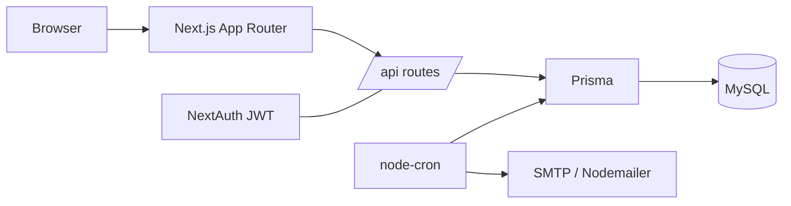
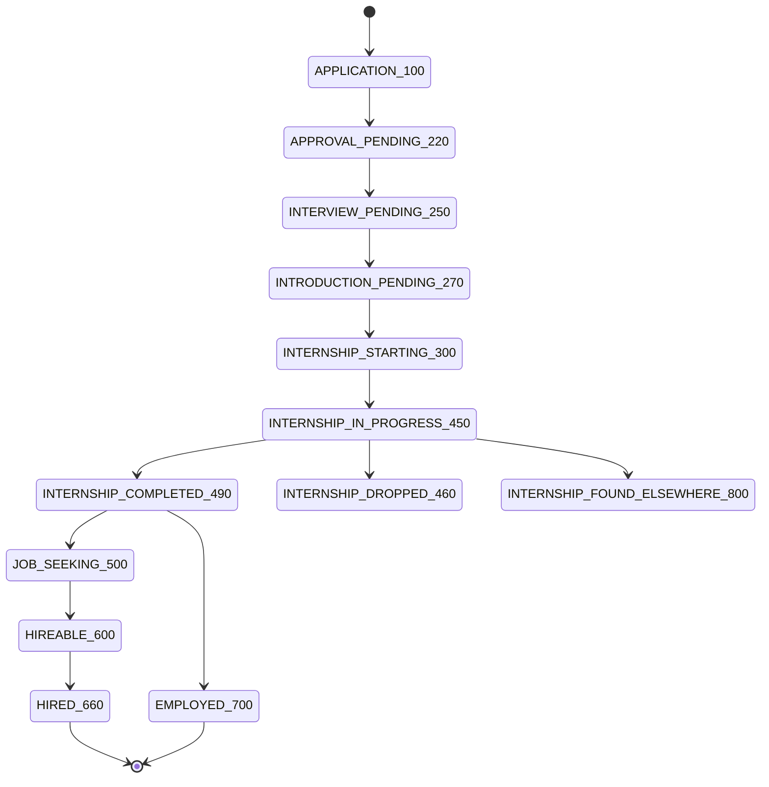

# Internship CRM

Mentor ↔ Mentee CRM & internship management system. Tracks each mentee through a hiring
pipeline (first contact → internship → hired), with interaction logging, role-based
dashboards, and email reminders. Built to replace a spreadsheet-based mentoring workflow.

## Features

- **Role-based access** — Admin, Mentor, Mentee, each with its own dashboard.
- **Mentorship pipeline** — granular status per mentee (`APPLICATION_100` … `EMPLOYED_700`).
- **Interaction logs** — meetings / feedback / emails per mentorship.
- **Candidate browsing & matching** — search/filter mentees, assign mentors & companies.
- **Invitation-based registration** — email tokens with role assignment.
- **Email reminders** — cron nudges mentors with stale (14-day) mentees.

## Tech stack

Next.js 15 (App Router) · React 19 · TypeScript · Prisma 5 · MySQL · NextAuth 4 ·
Tailwind CSS · Nodemailer · Docker.

## Architecture



## Pipeline stages



## Local setup

```bash
# 1. Install
npm install

# 2. Configure env
cp .env.example .env        # then fill DATABASE_URL, NEXTAUTH_SECRET, etc.

# 3. Sync DB schema (this project uses db push, not migrations)
npx prisma db push

# 4. Create the first admin
npx prisma db seed          # uses SEED_ADMIN_* env (default admin@example.com / ChangeMe123!)

# 5. Run
npm run dev                 # http://localhost:3000
```

### Required environment variables

| Variable | Purpose |
|----------|---------|
| `DATABASE_URL` | MySQL connection string |
| `NEXTAUTH_URL` | App base URL |
| `NEXTAUTH_SECRET` | NextAuth signing secret |
| `SMTP_HOST` / `SMTP_PORT` / `SMTP_USER` / `SMTP_PASS` / `SMTP_FROM` | Email (invites, reminders) |
| `SEED_ADMIN_EMAIL` / `SEED_ADMIN_PASSWORD` / `SEED_ADMIN_NAME` | First admin (seed, optional) |

See [`.env.example`](.env.example) for the full list.

## Scripts

| Command | Description |
|---------|-------------|
| `npm run dev` | Dev server (http://localhost:3000) |
| `npm run build` | Production build |
| `npm run start` | Serve production build |
| `npm run lint` | Lint (`next lint`) |

| `npm run check:i18n` | Verify EN/TR/DE dictionary key parity (`scripts/check-i18n.ts`); CI gate |
| `npm run test:e2e` | Playwright smoke tests |
| `npm run test:e2e:headed` | Run the Playwright smoke tests with a visible browser |
| `npm run test:stress` | Load/stress test against the app (`scripts/stress-test.mjs`; see `docs/testing.md`) |
| `npm run import:csv` | Bulk-import candidates from a CSV file (`scripts/import-csv.mjs`; dry-run by default, `--apply` to write) |
| `npm run seed:templates` | Seed the built-in document templates (`prisma/seed-templates.mjs`) |
| `npm run db:dev:up` | Start the local dev MySQL via Docker Compose (`docker-compose.dev.yml`) |
| `npm run db:dev:down` | Stop and remove the local dev MySQL container |
| `npm run postinstall` | Regenerate the Prisma client (runs automatically after `npm install`) |

| `npx prisma db push` | Sync schema to DB |
| `npx prisma db seed` | Seed first admin |

## Testing

Several kinds of test guard the app — functional E2E, accessibility, security,
XSS/injection, and a nightly **stress/load** test. See [`docs/testing.md`](docs/testing.md)
for the full map and configuration.

End-to-end tests live in [`e2e/`](e2e/) (Playwright). They cover the home page,
sign-in, admin login, and that the admin pages render without server errors.

```bash
npm run test:e2e            # starts the app and runs headless
npm run test:e2e:headed     # visible browser
BASE_URL=https://crm-preview.ersah.in npm run test:e2e   # against a deployed env

npm run test:stress         # load test (see docs/testing.md for thresholds/env)
```

CI runs the E2E suite on every PR ([`.github/workflows/e2e.yml`](.github/workflows/e2e.yml))
against an isolated MySQL service, so a regression fails the check before merge. A
scheduled workflow ([`.github/workflows/stress.yml`](.github/workflows/stress.yml)) runs
the stress test nightly and **emails the team on failure**.

## Deployment

CI/CD via GitHub Actions ([`.github/workflows/deploy.yml`](.github/workflows/deploy.yml)):
push to `main` deploys **production**; every PR deploys a **preview**.

| Environment | URL | Trigger |
|-------------|-----|---------|
| Production | https://crm.ersah.in | push to `main` |
| Preview | https://crm-preview.ersah.in | pull requests |

The pipeline builds a Docker image, pushes it to GitHub Container Registry, then SSHes to the
Plesk host to run the container and apply the schema with `prisma db push`.

## Project structure

```
src/app/        # App Router pages + /api routes (admin, mentor, portal, auth, onboarding)
src/components/ # UI primitives + forms
src/lib/        # auth + prisma client
src/services/   # email + cron
prisma/         # schema.prisma + seed
```

## License

Licensed under the **GNU Affero General Public License v3.0 or later** (AGPL-3.0-or-later) —
see [LICENSE](LICENSE). You are free to use, study, modify, and self-host this software. If
you run a modified version as a network service, the AGPL requires you to make your modified
source available to its users.

## Commercial licensing & hosting

The AGPL keeps the project open while ensuring improvements flow back to the community. Two
paths exist for organizations:

- **Hosted service** — use the maintained deployment at https://crm.ersah.in (support,
  updates, backups included) instead of running it yourself.
- **Commercial license** — if AGPL's source-sharing obligations don't fit your product (e.g.
  embedding in a closed-source offering), a separate commercial license is available.

For hosting, a commercial license, custom deployment, or support, contact
**ersahin@bcsit-gmbh.de**.

## Contributing

Work is planned on a GitHub Project board as Epics (#5–#11) and Stories (#12+). Branch per
issue (`feat/<issue>-slug`), open a PR, reference `Closes #N`. For AI-agent guidance see
[CLAUDE.md](CLAUDE.md).

By contributing you agree that your contributions are licensed under AGPL-3.0-or-later, and
that the maintainer may also offer them under a commercial license (dual licensing).
