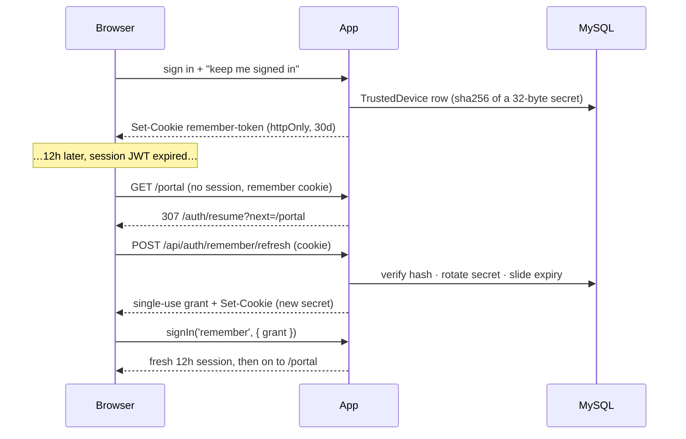

# "Keep me signed in" — trusted devices (#1495)

The session cookie is a **12-hour JWT** (`authOptions.session.maxAge`), silently
renewed at most hourly while the app is in use. That is deliberate and stays:
a JWT is not stored anywhere, so it cannot be revoked, and stretching it to
weeks would mean a stolen cookie is valid for weeks.

So staying signed in is a **second, server-side credential** — one row per
device the user chose to trust — whose only power is to mint a new short
session:

## The rules it follows

| Property | How |
|---|---|
| Not readable from a DB dump | only `sha256(secret)` is stored |
| Not replayable | the secret **rotates on every use**; the old hash stays valid 30s (racing tabs) |
| Theft is noticed | a superseded hash presented after that window revokes the device and logs `auth.device_token_reuse` (warning) |
| Not eternal | `expiresAt` slides 30 days on use, `absoluteExpiresAt` caps it at 90 and never moves |
| Revocable | sign-out, password change, password reset, "sign out of all devices", per-device "Forget", account deactivation |
| Bounded | 10 devices per account; enrolling the 11th drops the least recently used |
| Not for admins wearing someone else's face | enrolment is refused while impersonating |

## Where the code is

| File | Role |
|---|---|
| `prisma/schema.prisma` | `TrustedDevice`, `SessionRefreshGrant` |
| `src/lib/trustedDevice.ts` | enrol / rotate / revoke / list — all the DB work |
| `src/lib/rememberCookie.ts` | cookie names + writers, **edge-safe** (middleware imports it) |
| `src/lib/rememberHint.ts` | the one constant the browser bundle needs |
| `src/app/api/auth/remember/route.ts` | `POST` enrol · `DELETE` forget this device |
| `src/app/api/auth/remember/refresh/route.ts` | verify + rotate + mint grant |
| `src/middleware.ts` | routes a remembered-but-sessionless page request to /auth/resume |
| `src/app/auth/resume/*` | the one page that performs the silent sign-in |
| `src/lib/auth.ts` | the `remember` provider that consumes the grant |
| `src/app/api/account/devices/**` | the account page's list + per-device revoke |
| `src/lib/signOutClient.ts` | every sign-out control goes through here |
| `src/services/emailService.ts` | nightly purge of expired devices + spent grants (03:40) |
| `scripts/sanitize-db.mjs` | drops both tables when making a synthetic copy |

## Things that will bite a change here

- **A provider cannot set a cookie.** `authorize()` returns a user, not a
  response, which is why enrolment and refresh are separate route handlers and
  the session is reached through a single-use grant. Do not "simplify" this by
  hand-encoding a JWT: the `jwt` callback in `lib/auth.ts` is the one place that
  decides a token's role, tenant, verification flag and `authTime`.
- **Every new "revoke the sessions" path must revoke devices too.** Anything
  that sets `sessionsValidFrom` and leaves `TrustedDevice` rows alive has, in
  effect, revoked nothing: the browser mints a new session on its next visit.
- **Sign-out must revoke the device.** A plain `signOut()` leaves the remember
  cookie in place and the user cannot log out. `signOutEverywhere()` exists for
  that; `middleware.ts` clears the cookies for anyone POSTing NextAuth's own
  `/api/auth/signout` directly.
- **Only one refresh may rotate.** Two tabs waking together present the same
  secret; the rotation is a conditional write and the loser returns
  `token: null` ("keep the cookie the winner set"). Rotating twice would leave
  the browser holding a secret the database has already retired — and days
  later that innocent cookie would trip the theft check.
- **The sign-in page never auto-signs anyone in.** The resume lives on its own
  route, reached from middleware. Putting it on `/auth/signin` breaks signing in
  as a *different* person (and several e2e helpers, which switch accounts by
  dropping just the session cookie): the form would disappear under a silent
  login as the previous user.
- **The hint cookie is not a credential.** `internship.remember` is a readable
  flag saying "trying a silent refresh is worth a round trip". The server never
  reads it.
- **2FA is not re-prompted** on a silent refresh, by design: the device
  credential was issued to a browser that had already passed the password and
  the TOTP code, and unlike a long-lived JWT it can be taken away again.

Tests: `e2e/remember-me.spec.ts` (refresh + rotation + replay detection,
sign-out, sign-out-all, and the unticked-box case).
