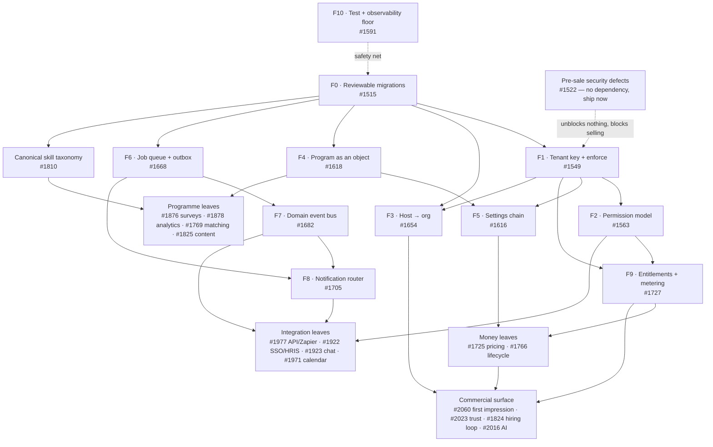

# Execution roadmap — competitive-gap programme

**Date:** 2026-08-30 · **Executes:** [`docs/research/competitive-analysis-2026-08.md`](competitive-analysis-2026-08.md)
· **Tracking initiative:** [#1514](https://github.com/21072026/Internship/issues/1514)
· **Backlog:** 27 epics → 134 stories → 408 tasks = **569 issues**, ≈**1 659 story points**

---

## 🇹🇷 Özet

348 boşluk, 27 epic ve 569 issue'luk yığın **altı dalgaya** bölündü. Dalgalar bir tercih listesi değil,
bir bağımlılık zinciri: her dalganın sonunda geçilmesi gereken bir kapı var ve kapı geçilmeden sonraki
dalga başlamıyor.

**Dalga 0 — Satma ruhsatı.** İncelenebilir şema migrasyonları (#1515), satış öncesi güvenlik defoları
(#1522), kiracı anahtarının tamamlanması ve izolasyonun açılması (#1549), yetki modeli (#1563), test ve
gözlemlenebilirlik tabanı (#1591). **İkinci müşteriye fatura kesilemez** — teknik olarak değil, dürüstçe
değil — şu beşi bitmeden: `MT_ENFORCE_ISOLATION` üretimde açık, süper-admin ile kiracı admini ayrılmış,
`Setting` bir `orgId` almış, `ApiKey`/`Webhook`/`AiUsage` kiracıya bağlanmış ve hesap kapatma gerçekten
oturumu sonlandırıyor. Bu liste ~25 story puanı ve **fiyat sayfası yayına girmeden önce** kapanmalı,
çünkü fiyat sayfası 2. kiracıyı yaratan şeydir.

**Dalga 1 — Omurga.** Dayanıklı iş kuyruğu + transactional outbox (#1668), domain olay veri yolu (#1682),
Program'ın birinci sınıf nesne olması (#1618), ayar çözümleme zinciri (#1616), host→organizasyon
çözümlemesi (#1654). **Dalga 2 — İlk euro.** Ticari omurga ve Stripe (#1727), yayımlanmış fiyat ve
self-servis dönüşüm (#1725), ilişki yaşam döngüsü (#1766), bildirim yönlendiricisi (#1705), demo/ilk
izlenim (#2060), toplantı erteleme/iptal (#1971'in ilk dilimi). **Dalga 3 — Demoyu kazanan ekranlar.**
Analitik ve ROI (#1878), anket + sağlık skoru (#1876), eşleştirme motoru (#1769), yetenek taksonomisi
(#1810), güven yüzeyi (#2023). **Dalga 4 — İkinci cüzdan.** İşe alım döngüsünün kapanması (#1824),
program içeriği (#1825), açık API + Zapier (#1977), SSO/OIDC ve SFTP roster (#1922).
**Dalga 5 — Sözleşme gelirse.** AI (#2016), Slack/Teams (#1923), SCIM/HRIS. Adı geçen, ödeyen bir
müşteri **yazılı olarak** istemeden hiçbiri başlamaz.

**Yarın sabah nereden başlıyorsun:** `prisma migrate` deploy yoluna girsin diye #1519 → #1520'yi aç,
ve aynı gün paralel olarak saatler süren üç güvenlik defosunu kapat — #1535, #1546, #1539 (artı tek
dosyalık #1537). Bu dördü hem tek başına sevk edilebilir hem de geri kalan her şeyin önkoşulu.

Bir uyarı: 1 659 story puanı küçük bir ekip için **çok çeyreklik** bir programdır. Taahhüt birimi issue
değil, **dalga**. Yığın sıralı bir menü; teslim sözü değil.

---

## The dependency spine

The CTO review reduced 348 gaps to eleven foundational items. Everything else in the backlog is a leaf
that hangs off one of them. Ten of the eleven now have an epic; F10 is the safety net under all of them.

Two edges are worth stating in words, because they are the ones people get wrong:

- **F0 is not optional and not later.** Adding `orgId` to `Setting` (a bare `key String @id` table),
  re-keying `PipelineStage`/`StageSla` to `programId`, retiring `CompanyNeed`, merging `Goal` and
  `ProjectTask`, splitting `Role` into a permission model and moving skills from free text to a
  taxonomy all resolve as **drop-and-recreate** under `db push --accept-data-loss`. Each per-PR topic
  environment pushes against its own fresh database, so a destructive diff looks perfectly green on the
  PR and only bites production.
- **F6 and F7 are one project.** The transactional outbox *is* the event bus. Filed as two epics
  (#1668, #1682) only because 20 issues in one tree is unreadable; scheduled and staffed as one.

---

## Waves

### Wave 0 · Licence to sell

The five items the GTM review calls the *uncomfortable precondition*, plus the two epics that make the
rest of the programme survivable.

| Epic | Title |
|---|---|
| [#1515](https://github.com/21072026/Internship/issues/1515) | 🧱 Reviewable schema migrations — retire `db push --accept-data-loss` from the deploy path |
| [#1522](https://github.com/21072026/Internship/issues/1522) | 🚨 Pre-sale security defects — the disqualifying findings, each hours not sprints |
| [#1549](https://github.com/21072026/Internship/issues/1549) | 🔐 Finish the tenant key and turn isolation on — `MT_ENFORCE_ISOLATION` to production |
| [#1563](https://github.com/21072026/Internship/issues/1563) | 👮 A permission model, not a role enum — `can(actor, action, subject)` |
| [#1591](https://github.com/21072026/Internship/issues/1591) | 🧪 Test and observability floor — unit runner, error tracking, uptime monitoring |

**Done means:** `prisma migrate deploy` runs the schema on every environment and a destructive statement
is visible in the PR diff; no admin can touch another tenant's config; the isolation flag is on in
production behind a two-tenant CI leak gate; a `can()` call sits in front of every privileged route;
`npm test` runs unit tests and an error tracker and an external uptime monitor are live.

**Gate — the licence-to-sell list.** All five must be green before the pricing page goes live:

| # | Precondition | Issues |
|---|---|---|
| G0.1 | `MT_ENFORCE_ISOLATION` on in production, with the 8 un-registered `orgId` models in `TENANT_MODELS` | [#1559](https://github.com/21072026/Internship/issues/1559) · [#1560](https://github.com/21072026/Internship/issues/1560) · [#1566](https://github.com/21072026/Internship/issues/1566) · [#1568](https://github.com/21072026/Internship/issues/1568) · [#1570](https://github.com/21072026/Internship/issues/1570) · [#1572](https://github.com/21072026/Internship/issues/1572) |
| G0.2 | Super-admin vs tenant-admin separation (today any tenant admin can rewrite another tenant's SAML cert) | [#1535](https://github.com/21072026/Internship/issues/1535) · [#1537](https://github.com/21072026/Internship/issues/1537) |
| G0.3 | `Setting` gets an `orgId` (2FA policy, retention and AI quota are one global row each today) | [#1553](https://github.com/21072026/Internship/issues/1553) |
| G0.4 | `ApiKey`/`Webhook`/`AiUsage` bound to an org + `/api/v1/candidates` tenant filter (live cross-tenant read) | [#1545](https://github.com/21072026/Internship/issues/1545) · [#1546](https://github.com/21072026/Internship/issues/1546) · [#1555](https://github.com/21072026/Internship/issues/1555) · [#1556](https://github.com/21072026/Internship/issues/1556) · [#1557](https://github.com/21072026/Internship/issues/1557) |
| G0.5 | Deactivation stamps `sessionsValidFrom` + admin force sign-out | [#1539](https://github.com/21072026/Internship/issues/1539) · [#1541](https://github.com/21072026/Internship/issues/1541) |

Budget ≈25 story points. Do not flip the isolation flag before G0.1's model list is complete — a
partially true isolation guarantee is worse than an honest "single-tenant today".

---

### Wave 1 · The spine

Nothing here is demoable. Everything after it is impossible without it.

| Epic | Title |
|---|---|
| [#1668](https://github.com/21072026/Internship/issues/1668) | 🔁 Durable job queue + transactional outbox — retire in-process node-cron |
| [#1682](https://github.com/21072026/Internship/issues/1682) | 📡 Domain event bus — generalize `emitStageChange` into one event stream |
| [#1618](https://github.com/21072026/Internship/issues/1618) | 🏛️ Program as a first-class object — promote `Cohort` into the container everything hangs from |
| [#1616](https://github.com/21072026/Internship/issues/1616) | ⚙️ Settings resolution chain — global → org → program behind one accessor |
| [#1654](https://github.com/21072026/Internship/issues/1654) | 🌐 Host → organization resolution and custom domains |

**Done means:** no scheduled work runs in the web process; every side effect subscribes to one `emit()`
instead of being hand-wired across 215 route files; stages, SLAs, cadence and matching config hang off a
`Program` with the org row as the default; one typed accessor answers every settings read at three
scopes; a request's `Host` header resolves to an organization before login.

**Gate:** a second container can be started without duplicating a cron sweep, `grep -rn "node-cron" src/`
returns nothing outside the queue, and a settings value set on a program overrides the org value which
overrides the global default — proven by a test, not by inspection.

---

### Wave 2 · The first euro

The wave that turns a code base into a business. Ordered so enforcement lands *before* checkout —
taking a card before the quotas bind would just move the fiction behind a payment.

| Epic | Title |
|---|---|
| [#1727](https://github.com/21072026/Internship/issues/1727) | 💳 Commercial spine — one billing subject, entitlements, metering, Stripe |
| [#1725](https://github.com/21072026/Internship/issues/1725) | 🏷️ Published pricing and self-serve conversion — the wedge against 13 quote-only vendors |
| [#1766](https://github.com/21072026/Internship/issues/1766) | 🎯 Relationship lifecycle states — pause, re-match, extend, cancel, bench |
| [#1705](https://github.com/21072026/Internship/issues/1705) | 🔔 Notification router — `notify(user, event, payload)` with channel routing and preferences |
| [#2060](https://github.com/21072026/Internship/issues/2060) | 🌱 First impression — demo data, time-to-launch, onboarding and the empty-screen problem |
| [#1971](https://github.com/21072026/Internship/issues/1971) *(story [#1972](https://github.com/21072026/Internship/issues/1972) only)* | 🔁 Meetings you can change — reschedule, cancel, delete, and a real duration |

**Done means:** `Organization` is the single billing subject and `Company` is a role inside it; the five
decorative feature keys enforce something; the active matched pair is metered and a quota blocks; Stripe
checkout, invoices, proration and dunning work; `/pricing` carries real numbers and every 403 has an
upgrade door; a relation can be paused, re-matched or closed with a reason that is not a lie; a demo
tenant shows the hiring chain instead of five empty tables.

**Gate:** a stranger reaches `/pricing`, signs up, pays with a card, exceeds a limit and is blocked —
with no human in the loop at any step. And `isBillable()` is defined exactly once
([#1768](https://github.com/21072026/Internship/issues/1768)) and imported by the meter
([#1750](https://github.com/21072026/Internship/issues/1750),
[#1737](https://github.com/21072026/Internship/issues/1737)), not re-derived.

---

### Wave 3 · The demo that wins

Persona A ("which of my 80 pairs is dying?") and Persona B (Berichtsheft oversight, placement outcomes).

| Epic | Title |
|---|---|
| [#1878](https://github.com/21072026/Internship/issues/1878) | 📈 Analytics and ROI reporting — the numbers a buyer renews on |
| [#1876](https://github.com/21072026/Internship/issues/1876) | 📊 Survey engine, NPS and a deterministic relationship health score |
| [#1769](https://github.com/21072026/Internship/issues/1769) | 🤝 Matching engine — weighted criteria, hard rules, bulk cohort matching, explainable scores |
| [#1810](https://github.com/21072026/Internship/issues/1810) | 🧬 Canonical skill taxonomy — one data model under matching, search, alerts and reporting |
| [#2023](https://github.com/21072026/Internship/issues/2023) | ✅ Trust surface — accessibility statement/VPAT, DPA, subprocessors, status page, security page |
| [#1971](https://github.com/21072026/Internship/issues/1971) *(remainder)* | 📅 Calendar and meeting integrity — Outlook/M365, free/busy, availability depth |

**Done means:** a customised pipeline reports real numbers instead of zero
([#1882](https://github.com/21072026/Internship/issues/1882)); the Berichtsheft compliance screen exists
([#1916](https://github.com/21072026/Internship/issues/1916)); a whole intake can be matched as
reviewable drafts with a visible per-rule score; skills are one vocabulary, not free text split on
commas in four places; the trust page, DPA, subprocessor register and VPAT are published.

**Gate:** the Persona A and Persona B demos run end to end without a single apology, and the ROI report
and the weekly-report oversight screen both export. No auto-assign button anywhere — bulk rounds produce
proposals only (EU AI Act / NYC LL144).

---

### Wave 4 · The second wallet

Persona C. This is the differentiator no mentoring vendor models — and the half of the product that
currently dead-ends into email.

| Epic | Title |
|---|---|
| [#1824](https://github.com/21072026/Internship/issues/1824) | 🏢 Close the hiring loop — job board, per-requisition applicant pipeline, interview, offer |
| [#1825](https://github.com/21072026/Internship/issues/1825) | 📚 Program structure and content — session agendas, milestones, drip content, training |
| [#1977](https://github.com/21072026/Internship/issues/1977) | 🔗 Public API, webhooks and the automation ecosystem |
| [#1922](https://github.com/21072026/Internship/issues/1922) | 🔌 Identity and HR system integrations — OIDC, self-serve SSO, SFTP roster |

**Done means:** a company signs itself up, verifies, posts a requisition and runs a funnel inside it; an
approved interview request becomes a scheduled slot and an outcome; an accepted offer fills the
requisition and advances the pipeline; the customer configures their own SSO without us; a scheduled
SFTP/CSV roster feed handles onboarding and deprovisioning; the Zapier app is published.

**Gate:** an employer completes sign-up → requisition → applicant → interview → offer → placement with
no admin intervention, and an external system can both read and write through `/api/v1` with webhooks
that retry.

---

### Wave 5 · Contract-driven only

Nothing in this wave starts on our own initiative.

| Epic | Title | Unlock condition |
|---|---|---|
| [#2016](https://github.com/21072026/Internship/issues/2016) | 🤖 AI — matching intelligence, summarisation, recommendations and governance | The governance half ([#2017](https://github.com/21072026/Internship/issues/2017), [#2018](https://github.com/21072026/Internship/issues/2018)) is P0 and pulls forward the moment the LLM ranking ships to a second tenant; the assistants ([#2021](https://github.com/21072026/Internship/issues/2021)) wait |
| [#1923](https://github.com/21072026/Internship/issues/1923) | 💬 Slack and Microsoft Teams apps — as adapters on the notification router | Three paying customers asking in writing |
| [#1968](https://github.com/21072026/Internship/issues/1968) *(story in #1922)* | 🏢 HRIS connectors — Personio and BambooHR, SCIM behind a contract | A signed contract naming SCIM or the connector |

**Gate:** none. This wave has no schedule by design — it is the parking lot for the enterprise checklist
we are deliberately not bidding on.

---

## Start here — the first ten items

The CTO review's ranked leverage list, mapped onto real issues. Sizes are rough calendar estimates for
one person, not story points.

| # | Issues | What it is | Why it is here | Size |
|---|---|---|---|---|
| 1 | [#1519](https://github.com/21072026/Internship/issues/1519) → [#1520](https://github.com/21072026/Internship/issues/1520) → [#1521](https://github.com/21072026/Internship/issues/1521), [#1525](https://github.com/21072026/Internship/issues/1525) · [#1527](https://github.com/21072026/Internship/issues/1527) · [#1529](https://github.com/21072026/Internship/issues/1529) | Baseline the schema, swap the deploy path to `prisma migrate deploy`, then put the SQL in the PR with a `migration:dangerous` label | Gates every re-key in F1–F5 and the taxonomy. It is also the change-management artefact enterprise questionnaires open with. **#1520 is the gate — no other epic starts schema surgery before it merges.** | 1–2 weeks (#1519 may uncover real drift) |
| 2 | [#1535](https://github.com/21072026/Internship/issues/1535) · [#1546](https://github.com/21072026/Internship/issues/1546) · [#1539](https://github.com/21072026/Internship/issues/1539) · [#1537](https://github.com/21072026/Internship/issues/1537) | The three live defects: any ADMIN can overwrite another org's SAML config; `/api/v1/candidates` reads every MENTEE with no tenant filter on an unscoped permanent key; deactivation never stamps `sessionsValidFrom`. Plus rejecting `'oidc'` at the SSO write boundary | Disqualifying in any security review, and **none of them waits for the foundational work**. Run these in parallel with item 1 on day one. #1537 is a one-file junior task | Hours each; a day for all four |
| 3 | [#1553](https://github.com/21072026/Internship/issues/1553) · [#1555](https://github.com/21072026/Internship/issues/1555) · [#1556](https://github.com/21072026/Internship/issues/1556) · [#1557](https://github.com/21072026/Internship/issues/1557) · [#1559](https://github.com/21072026/Internship/issues/1559) · [#1560](https://github.com/21072026/Internship/issues/1560) · [#1561](https://github.com/21072026/Internship/issues/1561) · [#1566](https://github.com/21072026/Internship/issues/1566) → [#1572](https://github.com/21072026/Internship/issues/1572) | Complete the tenant key, register the missing models, prove no leak with a two-tenant CI gate, then flip `MT_ENFORCE_ISOLATION` | Turns "we built an isolation engine" into a sellable claim. Roughly a third of the P0/P1 backlog is downstream of it. Note #1561: `runWithOrg` has **no call sites outside `orgContext.ts`**, so every cron sweep runs with no tenant context — flipping the flag changes nothing for mail unless that is fixed | 3–4 weeks; #1553 blocked on #1520 |
| 4 | [#1731](https://github.com/21072026/Internship/issues/1731) · [#1733](https://github.com/21072026/Internship/issues/1733) · [#1738](https://github.com/21072026/Internship/issues/1738) → [#1744](https://github.com/21072026/Internship/issues/1744) · [#1748](https://github.com/21072026/Internship/issues/1748) → [#1754](https://github.com/21072026/Internship/issues/1754) · then [#1758](https://github.com/21072026/Internship/issues/1758) → [#1761](https://github.com/21072026/Internship/issues/1761) | One billing subject (Organization), collapse `entitlements.ts`(companyId) and `planGate.ts`(orgId) into it, make the five decorative feature keys enforce, meter the active matched pair, then Stripe | The only path from a lead to revenue that does not require a human. Self-serve pricing against 13 vendors who publish none is a positioning weapon, not plumbing. **Stripe lands last in the epic on purpose** | 4–6 weeks |
| 5 | [#1622](https://github.com/21072026/Internship/issues/1622) · [#1624](https://github.com/21072026/Internship/issues/1624) · [#1626](https://github.com/21072026/Internship/issues/1626) · [#1628](https://github.com/21072026/Internship/issues/1628) | Promote `Cohort` to `Program`; re-key `PipelineStage`, `StageSla`, matching config and enrolment rules from `orgId` → `programId` with the org row as the default | The container every per-program gap hangs from. `Cohort` already carries the `orgId` FK, so this is a promotion, not a new tree. Blocked on #1520 (re-key = drop-and-recreate) | 2–3 weeks |
| 6 | [#1671](https://github.com/21072026/Internship/issues/1671) · [#1673](https://github.com/21072026/Internship/issues/1673) · [#1674](https://github.com/21072026/Internship/issues/1674) · [#1676](https://github.com/21072026/Internship/issues/1676) → [#1678](https://github.com/21072026/Internship/issues/1678) · [#1680](https://github.com/21072026/Internship/issues/1680) · [#1681](https://github.com/21072026/Internship/issues/1681) | MySQL-backed job queue with at-least-once claim, backoff and a dead-letter; leader-elected scheduler; the 12 jobs out of the 3 208-line `emailService.ts`; the outbox as the event bus | Unblocks multi-replica, webhook reliability, email retry, scheduled reports, automation rules and Zapier simultaneously. Kafka/Temporal are explicitly ruled out — the AGPL single-container self-host has to keep working | 4–5 weeks |
| 7 | [#1619](https://github.com/21072026/Internship/issues/1619) · [#1621](https://github.com/21072026/Internship/issues/1621) · [#1623](https://github.com/21072026/Internship/issues/1623) · [#1625](https://github.com/21072026/Internship/issues/1625) | One typed, cached accessor resolving global → org → program, one audited writer, a CI guard against direct `Setting` reads | Turns a dozen global toggles into real multi-tenancy. Watch the cron trap called out in #1621: a global read at the top of a tenant-crossing sweep hands every tenant the first tenant's value | 1–2 weeks after #1553 and #1624 |
| 8 | [#1768](https://github.com/21072026/Internship/issues/1768) · [#1770](https://github.com/21072026/Internship/issues/1770) · [#1772](https://github.com/21072026/Internship/issues/1772) · [#1774](https://github.com/21072026/Internship/issues/1774) | Real lifecycle states — pause, resume, end with a reason — as a **separate state field**, not a widened `MentorshipStatus` enum | Cheapest possible fix to the credibility of every conversion and time-to-hire number we sell: today a bad match can only be recorded as `COMPLETED`. `grep -rn "status: 'ACTIVE'" src/` returns 52 hits — widening the enum would silently drop paused pairs out of the portal, messaging, meetings and documents at once | 1–2 weeks |
| 9 | [#1710](https://github.com/21072026/Internship/issues/1710) · [#1711](https://github.com/21072026/Internship/issues/1711) · [#1712](https://github.com/21072026/Internship/issues/1712) · [#1713](https://github.com/21072026/Internship/issues/1713) · [#1714](https://github.com/21072026/Internship/issues/1714) | `notify()` core, channel adapters, a delivery ledger, per-category channel preference and quiet hours | Do not let Slack/Teams be built without it — without the router that is the same fan-out logic written three times into a file that is already 3 208 lines. #1712 builds the adapter **port** plus a chat-over-webhook adapter and forbids adding any SMS provider client | 2–3 weeks after #1668/#1682 |
| 10 | [#1815](https://github.com/21072026/Internship/issues/1815) · [#1816](https://github.com/21072026/Internship/issues/1816) · [#1818](https://github.com/21072026/Internship/issues/1818) · [#1819](https://github.com/21072026/Internship/issues/1819) | Canonical skills, synonyms, adjacency; one write path with autocomplete; a backfill that loses nothing | One data-model change under matching, talent-pool search, requisition alerts, skills-gap reporting and semantic AI — ~8 gap entries across 4 domains. #1816 is a junior task with no schema change. Blocked on #1520 | 2–3 weeks |

**Sequencing note for items 1 and 2:** they are independent of each other and of everything else. Two
people can start on the same morning. Everything from item 3 down waits on #1520 merging.

---

## The near-free ride-alongs

High ROI, small, and each currently makes a shipped feature read as broken. None of these should queue
behind the ten above — hand them to whoever has an afternoon.

| Issues | What | Why it should not wait |
|---|---|---|
| [#2035](https://github.com/21072026/Internship/issues/2035) · [#2037](https://github.com/21072026/Internship/issues/2037) | Accessibility conformance statement + VPAT 2.5 generated from `e2e/a11y-baseline.json` | Our axe baseline is already zero violations — we have **better evidence than the competitors making the claim**, and public-sector procurement (Persona B) asks before the demo. Mostly writing |
| [#1773](https://github.com/21072026/Internship/issues/1773) | "Request this mentor" CTA on the mentor discovery screen | 2 points. Its absence makes an already-shipped feature read as broken. Junior task |
| [#1980](https://github.com/21072026/Internship/issues/1980) · [#1982](https://github.com/21072026/Internship/issues/1982) · [#1984](https://github.com/21072026/Internship/issues/1984) · [#1986](https://github.com/21072026/Internship/issues/1986) | Meeting reschedule/cancel/delete + propose-another-time; the missing `removeMeeting()` call sites and every Google write path; the real duration bug (banner and Google assume 60, `ics.ts:19` defaults to 30) | "Trouble changing a meeting time" is literally the top recurring complaint against Together. A ghost meeting left on a real calendar destroys trust in the whole integration. Being visibly better on the thing everyone complains about is the cheapest credibility available |
| [#2062](https://github.com/21072026/Internship/issues/2062) · [#2063](https://github.com/21072026/Internship/issues/2063) *(on top of existing [#1419](https://github.com/21072026/Internship/issues/1419))* | Demo/seed rows for `Requisition`, `Offer`, `InterviewRequest`, `InterviewPanel`, `WeeklyReport`, `DocumentRequirement` + a CI fidelity gate that keeps them | Our differentiating pipeline currently renders as **empty screens on every demo and every PR environment**. Our own agents have mistaken empty tables for broken features; a buyer will too. #2062 is a junior task |
| [#1598](https://github.com/21072026/Internship/issues/1598) · [#1599](https://github.com/21072026/Internship/issues/1599) · [#1600](https://github.com/21072026/Internship/issues/1600) · [#1601](https://github.com/21072026/Internship/issues/1601) · [#1603](https://github.com/21072026/Internship/issues/1603) · [#1604](https://github.com/21072026/Internship/issues/1604) | Unit test runner for `src/` with coverage on the wave-0/1 blast radius; error tracking + request-scoped structured logs; external uptime monitor + public status page | Every item F0–F9 is a large refactor and today the only way to test pure logic is to boot a browser through Playwright. This is the thing that decides whether the foundational work is survivable. #1600 deliberately leaves the product choice (self-hosted vs hosted free tier) to the maintainer |

Three real defects found while filing, each shippable today with no dependency:

- [#1806](https://github.com/21072026/Internship/issues/1806) — saving an admin note on a mentor
  application **overwrites the recorded rejection reason**
  (`src/app/api/mentor-applications/[id]/route.ts:78` vs `:121`). Live data loss, half a day.
- [#1780](https://github.com/21072026/Internship/issues/1780) — `NO_LOGIN_PASSWORDS`
  (`src/lib/menteeAccount.ts:24`) is missing `'!apply-no-login'`, so `isPendingActivation()` does not
  recognise the largest source of never-had-a-password accounts and an apply-link mentee is never
  offered an activation link.
- [#1634](https://github.com/21072026/Internship/issues/1634) — new relations do not start on the
  tenant's configured first stage.

---

## Explicit non-goals

Each of these is a real gap. Each is a deliberate loss, because chasing it costs more than the segment
it wins. The third column is what we say out loud — silence is what stalls a deal, not a "no".

| We do not build | Reason | What we say |
|---|---|---|
| SOC 2 Type II audit in year 1 | €40–80k and 12 months of evidence collection. And we cannot honestly pass it while prod, preview, demo, every PR environment and MySQL share one Plesk box | "Trust Center, subprocessor register, DPA, annual pen test, and AGPL source you can audit yourself. SOC 2 when a signed contract pays for it." |
| SCIM 2.0, sub-organisations, multi-region residency, HRIS connectors | A full protocol server with Okta and Entra certification that presupposes F1, F2 and F4 and returns literally zero before a second real tenant exists. These win the 5 000-employee L&D deal we are not bidding on | "Scheduled SFTP/CSV roster sync with delta and automatic deprovisioning ([#1963](https://github.com/21072026/Internship/issues/1963)) — a fifth of the cost, same outcome. SCIM when it is in a contract." |
| Microsoft Teams app and Slack app | ~15 story points each for a segment we are not selling to; our buyer's programme runs on email and a browser | "Zapier and webhooks reach both. Revisit when three paying customers ask in writing." |
| Group / circle / peer / reverse / flash mentoring | The price of not chasing the L&D buyer. `MentorshipRelation` stays 1:1 | "We are a 1:1 internship-to-hire product, on purpose. If you need cohort circles, we are the wrong tool." |
| ATS integrations via Merge (Greenhouse/Lever/Workday Recruiting) | A whole product's roadmap, not a line item | "Public write API, webhooks and a Zapier app — wire it to your ATS or let a partner do it." |
| Learning content: handbooks, mini-courses, quizzes, LMS/LTI | We are a pipeline product, not a courseware vendor | "We link out to your LMS. We track that the mentee did it; we do not host it." |
| Career fairs, OCI, booth and bidding engines | Symplicity's moat, six figures of engineering, wrong buyer | "We do not do campus recruiting events." |
| Custom report builder | Reviewers complain that every competitor's builder is inflexible anyway | "Six fixed, board-shaped reports plus scheduled email plus CSV/XLSX and a warehouse extract. Fixed and correct beats configurable and wrong." |
| 360 multi-rater, NPS-heavy suites, DEI analytics, predictive risk scoring, cross-installation benchmarking | Downstream of an HRIS join we are not building, and we do not have the volume for a model to beat a rules table | "A deterministic health score, and we tell you exactly how it is computed. No black box." |
| SMS/WhatsApp, native iOS/Android apps, RTL/Arabic, command palette, real offline mode, gamification | Cost per segment won | "PWA on every phone, EN/TR/DE free at every tier." |
| A services and CSM business; implementation fees beyond the €890 migration SKU | Our price only works because there is no sales call and no onboarding consultant. The moment we sell services we become the thing we are undercutting | "One €890 migration SKU. Everything else is self-serve, and that is why the price is what it is." |
| **Any paid tier for individual mentors or mentees. Ever.** Not a limit, not a "pro" tier, not an AI credit pack | The free core is the marketing | "Free forever for every mentor and every mentee. No cap, no expiry, no seat count." |
| Per-program pricing | Chronus's paywall lever; ours is the active matched pair | "Unlimited programmes and cohorts on every paid tier. We meter active matched pairs, never seats and never programmes." |

---

## Sizing reality check

**569 issues. ≈1 659 story points. A small team.**

Said plainly:

1. **This is a multi-quarter programme, not a quarter.** At any realistic velocity for this team, the
   full backlog is years of work. Nobody should read the epic count as a delivery plan.
2. **The unit of commitment is the wave, not the issue.** A wave has a gate you can state in one
   sentence and check. Committing to "Wave 0 by date X" is meaningful; committing to 569 issues is not.
   When something has to give, cut scope *inside* a wave — never start the next one early.
3. **The backlog is a menu with an order, not a promise.** Waves 3–5 in particular are options: several
   epics there exist so that when a named customer asks, we already know what the answer costs. Wave 5
   is explicitly parked.
4. **The ten leverage items are ~40% of the value for ~15% of the points.** If only one thing gets done
   this quarter, make it Wave 0 plus items 1–4 of the start-here list. That is the difference between a
   product we cannot sell and a product with a second paying customer.
5. **The ride-alongs are the pressure valve.** They are the work that keeps shipping visible while the
   foundational refactors are in flight, and roughly one in five tasks across the tree is tagged
   `good first issue` + `stajyer` deliberately, so an intern always has somewhere to start.

---

## Working conventions

**Picking up an item.** Every issue in this tree carries a ready-to-paste **🤖 Agent prompt** section
with the file:line evidence already gathered — open the issue, copy that block into a fresh Claude Code
session, and the grounding work is done. Task issues are scoped to half a day to two days for one
person. Do not start a story; start one of its tasks.

**Branch, PR, merge.** Per [`CLAUDE.md`](../../CLAUDE.md): branch `feat/<issue>-slug` or
`fix/<issue>-slug`, reference the issue with `Closes #N`, open the PR **immediately** — the PR is how
the maintainer tests the change, because every PR gets its own environment at `https://crm-pr<N>.ersah.in`
with its own database and demo seed. Self-review the diff, enable auto-merge, and do not leave a green
PR waiting for a human. Move the issue to the matching column on the project board as you go.

**Release fragment.** Every shipped change adds `releases/unreleased/<kebab-slug>.json` with `bump`
(`minor` for features, `patch` for fixes), a `changelog` bullet, and — for anything user-visible —
`notes` in EN/TR/DE. Never edit `package.json`'s version, `CHANGELOG.md` or `src/lib/releaseNotes.ts`
directly. Pure-docs and CI-only tasks need no fragment; the issue bodies say which ones those are.

**Schema-changing work waits for [#1515](https://github.com/21072026/Internship/issues/1515).** This is
the one hard rule in the whole roadmap. Specifically, until
[#1520](https://github.com/21072026/Internship/issues/1520) has merged and the deploy path runs
`prisma migrate deploy`:

- **Additive only.** New tables and new nullable columns are fine. A primary-key change, a model merge,
  a rename or a re-key is not.
- The named drop-and-recreate cases are: `orgId` on `Setting` (`key String @id`), retiring
  `CompanyNeed`, merging `Goal` and `ProjectTask`, re-keying `PipelineStage`/`StageSla` to `programId`,
  splitting `Role` into a permission model, renaming `GoogleCalendarConnection`, and skills free-text →
  taxonomy. Each of those tasks carries a bold **DANGEROUS** section — read it before merging.
- **A green PR proves nothing here.** Each topic environment pushes against its own fresh database, so a
  destructive diff looks perfectly healthy on the PR and only bites production. That is exactly the trap
  [#1530](https://github.com/21072026/Internship/issues/1530) (dry-run against a production-shaped
  snapshot) exists to close.
- Any new tenant-data model gets an `orgId` **and** a `TENANT_MODELS` entry in `src/lib/orgContext.ts` —
  wrapping a route in `withTenantScope` without registering the model is cosmetic
  ([#1556](https://github.com/21072026/Internship/issues/1556) is the worked example).

**One more standing rule from the reviews, worth repeating here:** no auto-assign button, anywhere.
Matching produces proposals with a visible per-rule breakdown and a logged rule-set version — the AI Act
and NYC LL144 make automated employment decisions a category we do not want to be in by accident.
