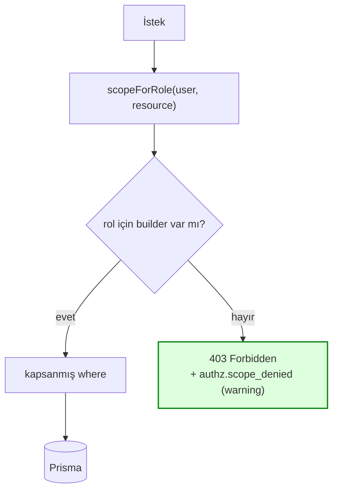

# Rol-erişim matrisi / Role access matrix

Bu doküman, her rolün hangi veriyi görebildiğini tek yerde tanımlar. Kaynak kod
karşılığı: [`src/lib/authzScope.ts`](../src/lib/authzScope.ts). Kod ile bu tablo
ayrışırsa **kod doğrudur** — tabloyu güncelleyin.

İlgili: epic [#814](https://github.com/21072026/Internship/issues/814), story
[#831](https://github.com/21072026/Internship/issues/831), denetim playbook'u
[`security-audit-playbook.md`](security-audit-playbook.md). MARKETING dikeyinin
firma kaynağı: story [#2396](https://github.com/21072026/Internship/issues/2396)
(aşağıda kendi bölümü var).

## Neden fail-closed / Why fail-closed

Route'lar kapsamı "tanıdığım rolü filtrele" mantığıyla kuruyordu:

```ts
if (role === 'MENTOR')      where.relation = { mentorId: self };
else if (role === 'MENTEE') where.relation = { menteeId: self };
// else YOK → COMPANY, SOURCE ve sonradan eklenen her rol filtresiz sorgu çalıştırır
```

`else` dalı olmadığı için, zincirin adını anmadığı rol boş bir `where` ile
devam ediyor ve **ADMIN görünürlüğü** alıyordu. Bu "allowlist-by-omission"
deseni, `COMPANY` ve `SOURCE` rolleri eklendiğinde sessizce yetki yükseltmesine
dönüştü ([#847](https://github.com/21072026/Internship/issues/847),
[#848](https://github.com/21072026/Internship/issues/848)).

Bugünkü kural: **kapsamı tanımlı olmayan rol reddedilir.**



`schema.prisma`'daki `Role` enum'una yeni bir rol eklemek, `authzScope.ts`'e
builder eklenmediği sürece o role **erişim vermez** — sessizce genişletmek
artık mümkün değil.

## Kapsanan kaynaklar / Scoped resources

`scopeForRole(user, resource)` üç kaynak tanıyor: `relation`, `project` ve
`company`. `{}` = kasıtlı olarak kapsamsız; `—` = builder yok, yani **403**.

### `relation` — `MentorshipRelation` ve üzerinden erişilen her şey

`GET /api/mentorship`, `GET /api/interactions`

| Rol | Kapsam | Gerekçe |
|---|---|---|
| `ADMIN` | `{}` (tümü) | Tenant'ın tamamı tasarım gereği |
| `MENTOR` | `mentorId = self` **veya** `menteeId = self` | Kendi mentilerini takip eder; aynı kişi başka bir ilişkide menti olabilir ([#1141](https://github.com/21072026/Internship/issues/1141)) |
| `MENTEE` | `menteeId = self` **veya** `mentorId = self` | Kendi ilişkisi (iki yön, aynı gerekçe) |
| `COMPANY` | `companyId = self.companyId ?? '__none__'` | Salt-okunur; yalnız kendi şirketine atanmış ilişkiler |
| `SOURCE` | `mentee.sourceId = <kendi sourceId'si> ?? '__none__'` | Yalnız kendi yönlendirdiği adaylar |
| diğer | — | 403 |

`companyId`/`sourceId` boşsa `'__none__'` sentinel'i devreye girer: hiçbir cuid
ile eşleşmediği için sonuç kümesi **boş** olur. Bu önemli — şirketi atanmamış
bir `COMPANY` hesabı "filtre yok" değil "hiçbir şey" görmeli.

### `project` — `Project`

`GET /api/projects`

| Rol | Kapsam | Gerekçe |
|---|---|---|
| `ADMIN` | `{}` (tümü) | |
| `MENTOR` | sahibi **veya** üyesi olduğu projeler | [#617](https://github.com/21072026/Internship/issues/617) / [#619](https://github.com/21072026/Internship/issues/619) |
| `MENTEE` | `isPublic = true` | Yalnız açık vitrin |
| `COMPANY` | `ownerCompanyId = self.companyId ?? '__none__'` | Kendi şirketinin projeleri |
| `SOURCE` | `isPublic = true` | Kendine ait proje akışı yok; menti ile aynı vitrin |
| diğer | — | 403 |

Vitrin rolleri (`MENTEE`, `SOURCE`) için yanıt ayrıca **PII'dan arındırılıyor**:
üye ve ilişki isimleri çıkarılıp yalnız sayı bırakılıyor.

## MARKETING dikeyi / `company` kaynağı — `Company`

Story [#2396](https://github.com/21072026/Internship/issues/2396); karar
[#2429](https://github.com/21072026/Internship/issues/2429), builder
[#2430](https://github.com/21072026/Internship/issues/2430), uygulama
[#2431](https://github.com/21072026/Internship/issues/2431), fixture
[#2432](https://github.com/21072026/Internship/issues/2432). Kürasyon gerekçesi:
[`marketing-vertical/CURATION.md`](marketing-vertical/CURATION.md) → epic-06.

`Company`, INTERNSHIP'te partner firma kaydı, MARKETING'de ise **müşteri
defterinin kendisi** (account master; funnel kaydı `MentorshipRelation`'ın
`companyId`'si). `#2431` öncesinde `GET /api/companies` ve
`GET /api/companies/[id]` yalnızca `if (!session)` kontrol ediyordu — yani
**oturum açmış her rol** tenant'taki bütün firmaları `contactEmail` ve adresle
birlikte okuyordu. Fail-closed gerekçesi yukarıdaki bölümdedir; burada yalnızca
kararlar var.

### İki ayrı katman — karıştırmayın

| Katman | Sorusu | Kaynak | Kimin üzerinden karar verir |
|---|---|---|---|
| **Yetenek (capability)** | *Bu tenant'ın ürününde bu modül var mı?* | [`verticals.ts`](../src/lib/verticals.ts) + [`capabilityGate.ts`](../src/lib/capabilityGate.ts) (`requireCapability`) | Aktörün **org'unun dikeyi** (INTERNSHIP = hepsi; MARKETING = `companies`, `pipeline`, `messaging`, `documents`) |
| **Rol kapsamı (bu matris)** | *Modül varsa, bu kullanıcı hangi satırları görür?* | [`authzScope.ts`](../src/lib/authzScope.ts) `scopeForRole(user, 'company')` | Aktörün **rolü** ve kimliği |

Yetenek katmanı modülü **tenant** için açar ya da kapatır; kapsam katmanı açık
modülün içinde **satırları** süzer. MARKETING'de `companies` yeteneği açık
olduğu için firma okuma yolu vardır — kimin *hangi* firmaları okuyacağını
yalnızca aşağıdaki tablo söyler. Birinin kararı diğerini asla ima etmez.

### Rol enum'u donuktur

`Role` = `ADMIN | MENTOR | MENTEE | COMPANY | SOURCE`
(`prisma/schema.prisma`). MARKETING için `MARKETER`/`MANAGER` gibi **yeni rol
eklenmez**; devralınan backlog'un "bir marketer yalnız kendi müşterilerini mi
görür?" sorusu bu repoda **"MENTOR yalnız ilişkili firmalarını mı görür?"**
olarak yeniden yazılır. Beş rolün tamamı için karar aşağıdadır — tanımsız hücre
yoktur.

### `company` — `Company`

`GET /api/companies`, `GET /api/companies/[id]` ve firmayı dolaylı okuyan uçlar
(bkz. sonraki tablo).

| Rol | Kapsam | Gerekçe |
|---|---|---|
| `ADMIN` | `{}` (tümü) | Tenant'ın tamamı tasarım gereği; admin ekranları bayt-bayt aynı kalır |
| `MENTOR` | `mentorships.some(mentorId = self ∨ menteeId = self)` | Yalnız **kendi adının geçtiği** bir ilişki üzerinden ulaştığı firmalar — `relation` kapsamının aynası ([#1141](https://github.com/21072026/Internship/issues/1141)). "Aday yerleştirebileceğim firmalar" değil. Bugün mentor ekranlarında çağıran yok; karar ileride bir ekran açıldığında geçerli olacak sınırdır |
| `MENTEE` | — (**403**) | INTERNSHIP'te menti "kendi" firmasına `/api/mentorship` üzerinden zaten ulaşır (ilişki yükü firmayı taşır); MARKETING'de MENTEE satırı lead'in **muhatabıdır**, operatör değil. Hiçbir sevk edilmiş ekran menti olarak `/api/companies` çağırmıyor (tek admin-dışı çağıran `ProjectForm`, `showOwnerPicker={isAdmin}` arkasında). Tüketicisi olmayan bir kapsam tanımlanmaz |
| `COMPANY` | `id = self.companyId ?? '__none__'` | Yalnız kendi hesabı; atanmamış hesap **hiçbir şey** görür |
| `SOURCE` | — (**403**) | Aday yönlendirir; müşteri defteriyle işi yok, ekranı yok |
| diğer | — | 403 |

**`'__none__'` yerine 403 neden?** `{ id: '__none__' }` da (200 + boş liste)
mümkündü. Boş liste "firma yok" diye okunur, 403 "sana göre değil" diye; ve
`logScopeDenial()` sayesinde bir istemci günün birinde sormaya başlarsa
`ActivityLog`'da `authz.scope_denied` satırı olarak **görünür** olur — sessizce
`[]` almaz.

**403 ile 404 ayrımı** (devralınan "her zaman 404" kuralı *taşınmadı*):

- kapsamı **tanımsız** rol → `logScopeDenial()` + **403** — mevcut konvansiyon
  (`authzScope.ts` başlığı, `e2e/authz-idor.spec.ts`);
- tanımlı kapsamın **dışında** kalan id → **404**, var olmayan id ile aynı yanıt;
  detay ucu yabancı satır hakkında hiçbir şey doğrulamaz. Liste ucunda aynı satır
  yalnızca **yoktur**.

Detay ucundaki iç içe `mentorships` (menti ad + e-posta) firmayla birlikte
**gelmez**; `relation` kapsamına tabidir. Bir firmaya tek ilişki üzerinden
ulaşan mentor o firmadaki *diğer* mentorların mentilerini okuyamaz. `ADMIN`'in
`{}`'i ve `COMPANY`'nin `companyId = own` kapsamı yükü olduğu gibi bırakır.

### Firmayı dolaylı okuyan uçlar

`grep prisma.company.find src/` (2026-09-22) — tamamı ya bu kapsamı kullanır ya
da zaten fail-closed bir desenle yazılmıştır:

| Uç / modül | Desen | Not |
|---|---|---|
| `GET /api/companies`, `GET /api/companies/[id]` | `scopeForRole(user, 'company')` | Bu matris |
| `GET /api/requisitions` (yükteki firma seçici) | `scopeForRole(user, 'company')` | Route girişte `ADMIN`/`COMPANY` dışını 403'lüyor; elle yazılmış `role === 'COMPANY'` filtresi kapsam builder'ıyla değiştirildi |
| `POST /api/requisitions`, `/api/company/interests`, `/api/company/*` | girişte rol allowlist'i + `companyId = session.user.companyId` | Firma id'si oturumdan gelir, gövdeden değil |
| `/api/search` firma dalı | `role === 'ADMIN'` ternary'si | Diğer roller `[]` |
| `/api/mentorship*`, `/api/offers*`, `/api/interview-requests`, `/api/requisitions/[id]`, `/api/candidates`, `/api/users/[id]`, `/api/account/export` | satırın kendi kapsamı + `include: { company: { select: { id, name } } }` | Firma **id ile aranmıyor**; zaten çağırana ait bir satırdan (ilişki, teklif, talep) geçilerek okunuyor ve yalnızca `id`+`name` dönüyor — `contactEmail`/`address` bu yollardan hiç çıkmıyor. Bu yüzden `company` kapsamı değil, satırın kendi kapsamı doğru katmandır |
| `/api/admin/*` | `ADMIN` allowlist'i | |
| `resolveOwner()` ([`projectAccess.ts`](../src/lib/projectAccess.ts)) | yalnız admin'in sahip seçicisinden çağrılır; varlık kontrolü, veri döndürmez | |
| `/api/register`, `companyProvisioning.ts`, `emailService.ts` cron'u | oturumsuz | Kapsam katmanının konusu değil; tenant bağlamını kendileri geçer |

Yeni bir firma okuma yolu açan, bu tabloya satır ekler **ve** kapsamı
`scopeForRole(user, 'company')`'den alır — ikinci bir `if (role === …)` zinciri
yazmaz.

## Bu matrisin dışında kalanlar / Out of scope for this matrix

Aşağıdaki alanlar `scopeForRole` kullanmıyor çünkü zaten fail-closed bir desenle
yazılmışlar; denetimde temiz çıktılar ve **bozulmamalı**:

| Alan | Desen | Dosya |
|---|---|---|
| CV erişimi | `canAccessCv()` — sonda açık `return false` | [`src/lib/cvAccess.ts`](../src/lib/cvAccess.ts) |
| Belge erişimi | aynı desen | [`src/lib/documentAccess.ts`](../src/lib/documentAccess.ts) |
| Mesajlaşma | `getThreadIfAllowed()` | [`src/lib/messaging.ts`](../src/lib/messaging.ts) |
| Proje detayı/üyeleri | `isProjectMember()` + sahiplik | [`src/lib/projectAccess.ts`](../src/lib/projectAccess.ts) |
| Rol-kapılı route'lar | Girişte rol allowlist'i → 401 (`/api/users`, `/api/search`, `/api/meetings`, `/api/availability`, `/api/company/*`, `/api/mentor/*`, `/api/admin/*`) | ilgili `route.ts` |
| Kayıt bazlı yetki | `allowed = ADMIN \|\| katılımcı` (varsayılan `false`) | `/api/evaluations`, `/api/questions/[id]`, `/api/mentorship/[id]`, `/api/users/[id]/activity` |

Erişimin *süresi* ve *kapsamı* (mentorluk sonrası pencere, alan minimizasyonu)
da ayrı bir katman: [`pii-access-lifecycle.md`](pii-access-lifecycle.md).

Tenant (organizasyon) izolasyonu **ayrı bir katman**: `withTenantScope()` /
`MT_ENFORCE_ISOLATION` — bkz. [`tenant-isolation.md`](tenant-isolation.md). Bu
matris tenant *içi* rol kapsamlamasını tanımlar.

## Yazma işlemleri / Write access

Bu matris **okuma** kapsamıdır. Yazma yolları ayrı korunuyor ve bu değişiklikle
ellenmedi; en kritikleri:

| İşlem | Kural |
|---|---|
| `POST /api/interactions` | `ADMIN` veya ilişkinin mentoru |
| `POST /api/mentorship` | yalnız `ADMIN` |
| `POST /api/projects` | `ADMIN` veya `MENTOR` (mentor daima sahip olur) |
| `POST /api/source/mentees` | yalnız `SOURCE`, kendi `sourceId`'si ile |
| `GET/POST /api/sources` | `ADMIN` veya `MENTOR` — birleşik "getiren kişi / kaynak" seçiminin listesi ve yerinde kaynak yaratma (#1296). Yönetim uçları (istatistik, silme) `ADMIN`-only `/api/admin/sources` altında kalıyor. |

## Yapay zekâ uçları / AI endpoints

Beş uç bir dil modeline metin gönderir. Hepsi rol kapılı **ve** ayrıca
[`runAiGated`](../src/lib/aiGate.ts) üzerinden geçer: rıza → aylık kota →
sağlayıcı. Rol kontrolünü geçmek tek başına yetmez.

| Uç | Rol | Ek kapı |
|---|---|---|
| `POST /api/cv/[userId]/extract-ai` | `canAccessCv()` kime izin veriyorsa | CV sahibinin `AI_CV_PARSING` rızası |
| `POST /api/cv/feedback` | oturum açmış herkes — **yalnızca kendi CV'si** (uç, gövdedeki id'yi değil oturumu okur) | çağıranın `AI_CV_PARSING` rızası |
| `POST /api/interactions/summary` | `MENTOR` veya `ADMIN`, `getThreadIfAllowed()` ile kendi ilişkisinde | **mentee'nin** `AI_INTERACTION_SUMMARY` rızası |
| `POST /api/interview-prep` | yalnız `MENTEE`, kendisi için | rıza yok — kimlik taşıyan hiçbir alan gönderilmez |
| `POST /api/admin/mentor-suggest` | yalnız `ADMIN` | rıza yok — mentorlar A–E harfleriyle anonim gider |

`GET /api/cv/feedback` ve `GET /api/interview-prep` yalnızca "bu özellik açık
mı" bilgisini döndürür; kişisel veri taşımaz.

Her ucun ne gönderip neyi bilerek göndermediği, saklama ve bozulma davranışı:
[`ai.md`](ai.md).

## Regresyon testi / Regression test

İki spec bu matrisi kilitliyor:

- [`e2e/authz-matrix.spec.ts`](../e2e/authz-matrix.spec.ts) (`@smoke`) — matrisin
  **çalıştırılabilir** hâli. Tablo [`e2e/fixtures/authz-matrix.ts`](../e2e/fixtures/authz-matrix.ts)
  içinde; her rol × uç hücresi `all` / `own` / `deny`. Yeni bir kaynak veya rol
  eklerken **önce oraya satır ekleyin**.
- [`e2e/role-scoping.spec.ts`](../e2e/role-scoping.spec.ts) (`@smoke`) — özgün
  sızıntının somut senaryosu.

Her ikisi de Test **satır sahipliğini** doğruluyor,
HTTP status'unu değil — sızıntı boyunca her istek `200` dönüyordu, dolayısıyla
yalnız status kontrol eden bir test bunu yakalayamazdı.

Yeni bir rol veya yeni bir kapsanan kaynak eklerken:

1. `authzScope.ts` içindeki `BUILDERS`'a rolü ekleyin (eklemezseniz rol 403 alır — güvenli varsayılan).
2. Bu dokümandaki tabloyu güncelleyin.
3. [`e2e/fixtures/authz-matrix.ts`](../e2e/fixtures/authz-matrix.ts) tablosuna rolü/ucu ekleyin — `own` hücresi
   için `ownership` yüklemini de yazın.
