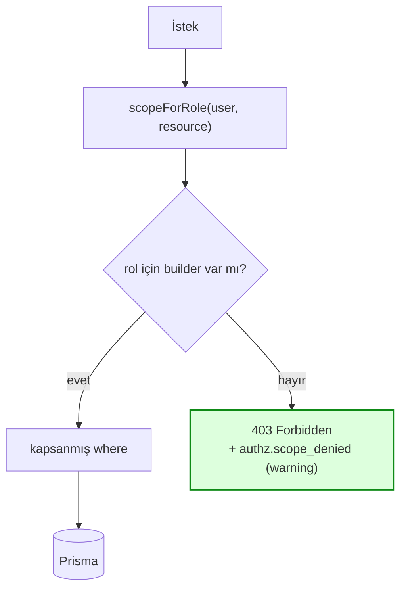

# Rol-erişim matrisi / Role access matrix

Bu doküman, her rolün hangi veriyi görebildiğini tek yerde tanımlar. Kaynak kod
karşılığı: [`src/lib/authzScope.ts`](../src/lib/authzScope.ts). Kod ile bu tablo
ayrışırsa **kod doğrudur** — tabloyu güncelleyin.

İlgili: epic [#814](https://github.com/21072026/Internship/issues/814), story
[#831](https://github.com/21072026/Internship/issues/831), denetim playbook'u
[`security-audit-playbook.md`](security-audit-playbook.md). MARKETING dikeyinin
firma kaynağı: story [#2396](https://github.com/21072026/Internship/issues/2396)
(aşağıda kendi bölümü var).

## Neden fail-closed / Why fail-closed

Route'lar kapsamı "tanıdığım rolü filtrele" mantığıyla kuruyordu:

```ts
if (role === 'MENTOR')      where.relation = { mentorId: self };
else if (role === 'MENTEE') where.relation = { menteeId: self };
// else YOK → COMPANY, SOURCE ve sonradan eklenen her rol filtresiz sorgu çalıştırır
```

`else` dalı olmadığı için, zincirin adını anmadığı rol boş bir `where` ile
devam ediyor ve **ADMIN görünürlüğü** alıyordu. Bu "allowlist-by-omission"
deseni, `COMPANY` ve `SOURCE` rolleri eklendiğinde sessizce yetki yükseltmesine
dönüştü ([#847](https://github.com/21072026/Internship/issues/847),
[#848](https://github.com/21072026/Internship/issues/848)).

Bugünkü kural: **kapsamı tanımlı olmayan rol reddedilir.**


```mermaid
flowchart TD
  R[İstek] --> SW["scopeForRole(user, resource)"]
  SW --> K{rol için builder var mı?}
  K -- evet --> F[kapsanmış where] --> Q[(Prisma)]
  K -- hayır --> D403["403 Forbidden<br/>+ authz.scope_denied (warning)"]
  style D403 fill:#ddffdd,stroke:#0e8a16,stroke-width:2px
```

`schema.prisma`'daki `Role` enum'una yeni bir rol eklemek, `authzScope.ts`'e
builder eklenmediği sürece o role **erişim vermez** — sessizce genişletmek
artık mümkün değil.

## Kapsanan kaynaklar / Scoped resources

`scopeForRole(user, resource)` üç kaynak tanıyor: `relation`, `project` ve
`company`. `{}` = kasıtlı olarak kapsamsız; `—` = builder yok, yani **403**.

### `relation` — `MentorshipRelation` ve üzerinden erişilen her şey

`GET /api/mentorship`, `GET /api/interactions`

| Rol | Kapsam | Gerekçe |
|---|---|---|
| `ADMIN` | `{}` (tümü) | Tenant'ın tamamı tasarım gereği |
| `MENTOR` | `mentorId = self` **veya** `menteeId = self` | Kendi mentilerini takip eder; aynı kişi başka bir ilişkide menti olabilir ([#1141](https://github.com/21072026/Internship/issues/1141)) |
| `MENTEE` | `menteeId = self` **veya** `mentorId = self` | Kendi ilişkisi (iki yön, aynı gerekçe) |
| `COMPANY` | `companyId = self.companyId ?? '__none__'` | Salt-okunur; yalnız kendi şirketine atanmış ilişkiler |
| `SOURCE` | `mentee.sourceId = <kendi sourceId'si> ?? '__none__'` | Yalnız kendi yönlendirdiği adaylar |
| diğer | — | 403 |

`companyId`/`sourceId` boşsa `'__none__'` sentinel'i devreye girer: hiçbir cuid
ile eşleşmediği için sonuç kümesi **boş** olur. Bu önemli — şirketi atanmamış
bir `COMPANY` hesabı "filtre yok" değil "hiçbir şey" görmeli.

### `project` — `Project`

`GET /api/projects`

| Rol | Kapsam | Gerekçe |
|---|---|---|
| `ADMIN` | `{}` (tümü) | |
| `MENTOR` | sahibi **veya** üyesi olduğu projeler | [#617](https://github.com/21072026/Internship/issues/617) / [#619](https://github.com/21072026/Internship/issues/619) |
| `MENTEE` | `isPublic = true` | Yalnız açık vitrin |
| `COMPANY` | `ownerCompanyId = self.companyId ?? '__none__'` | Kendi şirketinin projeleri |
| `SOURCE` | `isPublic = true` | Kendine ait proje akışı yok; menti ile aynı vitrin |
| diğer | — | 403 |

Vitrin rolleri (`MENTEE`, `SOURCE`) için yanıt ayrıca **PII'dan arındırılıyor**:
üye ve ilişki isimleri çıkarılıp yalnız sayı bırakılıyor.

**Her rol için kapsam ayrıca çağıranın kiracısıyla `AND`'lenir** (#2622,
`tenantWhere(session)`): `MT_ENFORCE_ISOLATION` kapalıyken ADMIN'in `{}`'i
**bütün kiracıların** projelerini, menti/kaynağın `isPublic`'i bütün kiracıların
açık projelerini listeliyordu. Kiracılar arası açık vitrin `/projects`'tir (anonim,
dikey başına), bu liste değil.

`/api/projects/[id]` ve altındaki `members`, `join-requests`, `task-templates`,
`tasks` uçlarının **hepsi** önce `projectInCallerTenant()`'e sorar
(`src/lib/projectAccess.ts`): başka kiracının projesi **yok bir proje ile aynı
404**'ü alır — `canViewProject`/`isProjectOwner`/`canManageProject` her ADMIN'e
`true` dediği için bu kontrol olmadan başka kiracının admini projeyi okuyor,
düzenliyor, siliyor, ekibini/katılma isteklerini/hedeflerini yönetiyordu.
Ayrıca: `members` POST eklenecek kullanıcıyı, `resolveOwner()` sahip
kullanıcıyı/firmayı çağıranın kiracısında çözer (yoksa 400); `POST /api/projects`
`orgId`'yi elle damgalar (bayrak kapalıyken middleware damgalamaz, NULL-org proje
varsayılan org'undur). `/projects/[id]` sayfası başka kiracıdan oturum açmış
ziyaretçiyi **anonim** gibi okur: açık projede vitrin kartı, gerisinde 404.
`/api/project-tasks/[taskId]` zaten `inCallerTenant` ile korunuyordu.

## MARKETING dikeyi / `company` kaynağı — `Company`

Story [#2396](https://github.com/21072026/Internship/issues/2396); karar
[#2429](https://github.com/21072026/Internship/issues/2429), builder
[#2430](https://github.com/21072026/Internship/issues/2430), uygulama
[#2431](https://github.com/21072026/Internship/issues/2431), fixture
[#2432](https://github.com/21072026/Internship/issues/2432). Kürasyon gerekçesi:
[`marketing-vertical/CURATION.md`](marketing-vertical/CURATION.md) → epic-06.

`Company`, INTERNSHIP'te partner firma kaydı, MARKETING'de ise **müşteri
defterinin kendisi** (account master; funnel kaydı `MentorshipRelation`'ın
`companyId`'si). `#2431` öncesinde `GET /api/companies` ve
`GET /api/companies/[id]` yalnızca `if (!session)` kontrol ediyordu — yani
**oturum açmış her rol** tenant'taki bütün firmaları `contactEmail` ve adresle
birlikte okuyordu. Fail-closed gerekçesi yukarıdaki bölümdedir; burada yalnızca
kararlar var.

### İki ayrı katman — karıştırmayın

| Katman | Sorusu | Kaynak | Kimin üzerinden karar verir |
|---|---|---|---|
| **Yetenek (capability)** | *Bu tenant'ın ürününde bu modül var mı?* | [`verticals.ts`](../src/lib/verticals.ts) + [`capabilityGate.ts`](../src/lib/capabilityGate.ts) (`requireCapability`) | Aktörün **org'unun dikeyi** (INTERNSHIP = hepsi; MARKETING = `companies`, `pipeline`, `messaging`, `documents`) |
| **Rol kapsamı (bu matris)** | *Modül varsa, bu kullanıcı hangi satırları görür?* | [`authzScope.ts`](../src/lib/authzScope.ts) `scopeForRole(user, 'company')` | Aktörün **rolü** ve kimliği |

Yetenek katmanı modülü **tenant** için açar ya da kapatır; kapsam katmanı açık
modülün içinde **satırları** süzer. MARKETING'de `companies` yeteneği açık
olduğu için firma okuma yolu vardır — kimin *hangi* firmaları okuyacağını
yalnızca aşağıdaki tablo söyler. Birinin kararı diğerini asla ima etmez.

### Rol enum'u donuktur

`Role` = `ADMIN | MENTOR | MENTEE | COMPANY | SOURCE`
(`prisma/schema.prisma`). MARKETING için `MARKETER`/`MANAGER` gibi **yeni rol
eklenmez**; devralınan backlog'un "bir marketer yalnız kendi müşterilerini mi
görür?" sorusu bu repoda **"MENTOR yalnız ilişkili firmalarını mı görür?"**
olarak yeniden yazılır. Beş rolün tamamı için karar aşağıdadır — tanımsız hücre
yoktur.

### `company` — `Company`

`GET /api/companies`, `GET /api/companies/[id]` ve firmayı dolaylı okuyan uçlar
(bkz. sonraki tablo).

| Rol | Kapsam | Gerekçe |
|---|---|---|
| `ADMIN` | `{}` (tümü) | Tenant'ın tamamı tasarım gereği; admin ekranları bayt-bayt aynı kalır |
| `MENTOR` | `mentorships.some(mentorId = self ∨ menteeId = self)` | Yalnız **kendi adının geçtiği** bir ilişki üzerinden ulaştığı firmalar — `relation` kapsamının aynası ([#1141](https://github.com/21072026/Internship/issues/1141)). "Aday yerleştirebileceğim firmalar" değil. Bugün mentor ekranlarında çağıran yok; karar ileride bir ekran açıldığında geçerli olacak sınırdır |
| `MENTEE` | — (**403**) | INTERNSHIP'te menti "kendi" firmasına `/api/mentorship` üzerinden zaten ulaşır (ilişki yükü firmayı taşır); MARKETING'de MENTEE satırı lead'in **muhatabıdır**, operatör değil. Hiçbir sevk edilmiş ekran menti olarak `/api/companies` çağırmıyor (tek admin-dışı çağıran `ProjectForm`, `showOwnerPicker={isAdmin}` arkasında). Tüketicisi olmayan bir kapsam tanımlanmaz |
| `COMPANY` | `id = self.companyId ?? '__none__'` | Yalnız kendi hesabı; atanmamış hesap **hiçbir şey görmez**, her şeyi değil |
| `SOURCE` | — (**403**) | Aday yönlendirir; müşteri defteriyle işi yok, ekranı yok |
| diğer | — | 403 |

**`'__none__'` yerine 403 neden?** `{ id: '__none__' }` da (200 + boş liste)
mümkündü. Boş liste "firma yok" diye okunur, 403 "sana göre değil" diye; ve
`logScopeDenial()` sayesinde bir istemci günün birinde sormaya başlarsa
`ActivityLog`'da `authz.scope_denied` satırı olarak **görünür** olur — sessizce
`[]` almaz.

**403 ile 404 ayrımı** (devralınan "her zaman 404" kuralı *taşınmadı*):

- kapsamı **tanımsız** rol → `logScopeDenial()` + **403** — mevcut konvansiyon
  (`authzScope.ts` başlığı, `e2e/authz-idor.spec.ts`);
- tanımlı kapsamın **dışında** kalan id → **404**, var olmayan id ile aynı yanıt;
  detay ucu yabancı satır hakkında hiçbir şey doğrulamaz. Liste ucunda aynı satır
  yalnızca **yoktur**.

Detay ucundaki iç içe `mentorships` (menti ad + e-posta) firmayla birlikte
**gelmez**; `relation` kapsamına tabidir. Bir firmaya tek ilişki üzerinden
ulaşan mentor o firmadaki *diğer* mentorların mentilerini okuyamaz. `ADMIN`'in
`{}`'i ve `COMPANY`'nin `companyId = own` kapsamı yükü olduğu gibi bırakır.

Aynı kural **liste** ucundaki `_count.mentorships` için de geçerlidir: satırları
kapsamlayıp toplamı kapsamlamamak, mentora o firmadaki *bütün* ilişkilerin
adedini söylerdi. Sayaç da `relation` kapsamından geçer; `ADMIN`'in boş kapsamı
sayacı filtresiz bırakır, yani admin sorgusu bayt-bayt aynı kalır.

### Firmayı dolaylı okuyan uçlar

İki grep birlikte (2026-09-22) — **ikisi de gerekli**: `grep prisma.company.find
src/` firmayı id ile arayan yolları bulur, ama bir ilişkiye/teklife takılı
`include` ile okunan firmayı **bulmaz**; onun için
`grep -rE "company: (true|\{)" src/` gerekir. İlk denemede yalnızca birincisi
çalıştırıldı ve `/api/mentorship/[id]`'nin `company: true`'su gözden kaçtı.
Aşağıdakilerin tamamı ya bu kapsamı kullanır ya da zaten fail-closed bir
desenle yazılmıştır:

| Uç / modül | Desen | Not |
|---|---|---|
| `GET /api/companies`, `GET /api/companies/[id]` | `scopeForRole(user, 'company')` | Bu matris |
| `GET /api/companies/[id]/export` | yalnız `ADMIN` (taklit edilmemiş) + `scopeForRole(user, 'company')` + elle `withinTenant(…, tenantWhere(session))` | Firmanın tüm kaydı tek JSON dosyası ([#2435](https://github.com/21072026/Internship/issues/2435)); aşağıda § Tek dosya |
| `GET /api/requisitions` (yükteki firma seçici) | `scopeForRole(user, 'company')` | Route girişte `ADMIN`/`COMPANY` dışını 403'lüyor; elle yazılmış `role === 'COMPANY'` filtresi kapsam builder'ıyla değiştirildi |
| `POST /api/requisitions`, `/api/company/interests`, `/api/company/*` | girişte rol allowlist'i + `companyId = session.user.companyId` | Firma id'si oturumdan gelir, gövdeden değil |
| `/api/search` firma dalı | `role === 'ADMIN'` ternary'si | Diğer roller `[]` |
| `/api/mentorship` (liste), `/api/mentorship/[id]`, `/api/offers*`, `/api/interview-requests`, `/api/requisitions/[id]`, `/api/candidates`, `/api/users/[id]`, `/api/account/export` | satırın kendi kapsamı + `include: { company: { select: … } }` | Firma **id ile aranmıyor**; zaten çağırana ait bir satırdan (ilişki, teklif, talep) geçilerek okunuyor. Seçilen kolonlar dar: `{ id, name }` (offers, interview-requests, requisitions/[id], candidates), `{ name }` (account/export), `{ id, name, industry }` (mentorship listesi, mentorship/[id], users/[id]). **`contactEmail`/`address`/`description`/`quota` bu uçlardan çıkmaz.** Bu yüzden `company` kapsamı değil, satırın kendi kapsamı doğru katmandır |
| `/api/mentorship/[id]` — **düzeltilmiş geçmiş** | — | Bu uç #2431'e kadar `company: true` idi: ilişkinin MENTOR'u ve MENTEE'si **bütün** Company skalerlerini (`contactEmail`, `address`, `description`, `quota`) okuyordu. Bu PR'ın ilk hâli tabloyu yanlış yazıp uca "yalnızca `id`+`name`" demişti; inceleme yakaladı. Uç artık `{ id, name, industry }` seçiyor — payload'ın üç tüketicisi (`admin/candidates/[id]`, `mentor/mentees/[id]`, iki pano) zaten yalnızca bu üçünü okuyordu |
| `/portal/journey` (sunucu bileşeni, uç değil) | `menteeRelationWhere(menteeId)` — menti **kendi** ilişkisi | Tek kalan `company: true`. Menti kendi yerleştiği firmanın `name`/`industry`/`contactEmail`/`description` alanlarını ekranda görür; bu **bilinçli bir ürün kararıdır** (staj yerinin muhatabı), API üzerinden ham satır dönüşü değil. Kapsam katmanı burada ilişkinin kendisidir: menti başka hiçbir firmaya ulaşamaz |
| `/api/admin/*` | `ADMIN` allowlist'i | |
| `resolveOwner()` ([`projectAccess.ts`](../src/lib/projectAccess.ts)) | yalnız admin'in sahip seçicisinden çağrılır; varlık kontrolü, veri döndürmez | |
| `/api/register`, `companyProvisioning.ts`, `emailService.ts` cron'u | oturumsuz | Kapsam katmanının konusu değil; tenant bağlamını kendileri geçer |

Yeni bir firma okuma yolu açan, bu tabloya satır ekler **ve** kapsamı
`scopeForRole(user, 'company')`'den alır — ikinci bir `if (role === …)` zinciri
yazmaz.

### Kim okudu? — `company.view` erişim kaydı

[#2433](https://github.com/21072026/Internship/issues/2433). `GET
/api/companies/[id]` başarılı bir okumada `ActivityLog`'a bir `company.view`
satırı yazar (`actorId`, `actorEmail`, `targetType: 'company'`, `targetId`,
`ip`, `userAgent`). Ayrı bir `AccessLog` tablosu **yok**: yazma yolu
`logActivity()`, saklama `activityLogRetentionDays` (365 gün,
[`pii-access-lifecycle.md`](pii-access-lifecycle.md)), görüntüleme
`/admin/activity` (eylem filtresi `company.view`; firma `targetId` ile bulunur).

**Neyin kaydı tutulur, neyin tutulmaz — tam olarak:**

- **Kaydedilir:** bir firmayı *açmak*. Üründe bunun tek yolu `/admin/companies`
  üzerindeki düzenleme penceresidir ve pencere formunu tıklandığı sayfalı liste
  satırından değil, `GET /api/companies/[id]`'den doldurur — okuma kaydın
  yazıldığı yerden geçer. Okuma başarısız olursa form açılmaz (liste satırına
  sessizce düşmek, kaydı olmayan bir açılış olurdu). Aynı rotayı doğrudan
  çağıran her istemci (API, betik) de aynı satırı yazar.
- **Kaydedilmez:** listeye göz atmak. `GET /api/companies` (sayfalı ızgara,
  `all=1` seçiciler) aynı kolonları döndürür ama satır yazmaz — 24 kartlık bir
  sayfa bir "açılış" değil, ve her sayfa görüntülemesi için 24 satır, aradığınız
  okumayı gömerdi. "Kim hangi firmayı açtı?" yanıtlanır; "kimin ekranında hangi
  firma listelendi?" yanıtlanmaz.

- **404 yazmaz** (okunan bir şey yok); **403** zaten `authz.scope_denied`
  satırını yazmıştır.
- **Gerçek okuyucu yazılır.** Taklit (impersonation) sırasında oturum
  kullanıcınındır ama okuyan admindir: satır `actorId`/`actorEmail` olarak
  **admini** taşır (`impersonate.stop` ile aynı düzen), `detail` = `as
  <userId>`. Kullanıcıya yazılsaydı son etkinlik tarihini ilerletir, kendi
  akışında yapmadığı bir okuma gösterir ve adminin e-postasıyla yapılan bir
  aramada görünmezdi (pageview takibi de bu yüzden taklitte yazmaz).
- **`detail`'de firma adı yok.** `ActivityLog`'un `orgId`'si yok ve
  `/admin/activity` kiracıya göre süzülmüyor ([#543](https://github.com/21072026/Internship/issues/543));
  firma adı orada, bir kiracının müşteri listesini diğer kiracıların
  adminlerine gösterirdi. `targetId` kaydı zaten tanımlar.
- **Kısa pencerede tekrar = tek satır.** Aynı eylem, aynı okuyucu, aynı firma,
  aynı `detail` ve aynı **IP** için `viewLogWindowMinutes` (varsayılan 15 dk)
  içinde ikinci satır yazılmaz. Farklı bir IP'den okuma yeni bir olgudur ve
  ayrı satırdır; adminin kendi okuması ile taklit ettiği hesap üzerinden
  yaptığı okuma `detail` sayesinde birleşmez.
- **Kayıt asla kapatılamaz:** `0` = her okuma satır; bir günü aşan değer bir
  güne kırpılır; boş/bozuk değer 15'e düşer, "hiç yazma"ya değil. Ayar, saklama
  pencereleri gibi `PUT /api/admin/settings` ile yazılır, formda yoktur.
- **Hata sayfayı kırmaz:** ayar okunamazsa varsayılan, tekrar kontrolü
  başarısız olursa satır **yazılır** (bir kopya, iz bırakmayan bir okumadan
  ucuzdur), yazma hatası `logActivity()` içinde yutulur. Bastırma en iyi
  çabadır: eşzamanlı iki istek ikisi de yazabilir — tam garanti bir şema
  değişikliği (unique kısıt) gerektirirdi.

Kural bağımlılıksız [`src/lib/viewLogRule.ts`](../src/lib/viewLogRule.ts)'te
(birim testi `scripts/test/view-log-rule.test.mjs`); Prisma'ya değen yarısı
`logViewActivity()` ([`src/lib/activity.ts`](../src/lib/activity.ts)). Başka bir
kaydın okunmasını loglamak isteyen aynı fonksiyonu çağırır — ikinci bir log
yolu açmaz.

### Tek dosya — firma dışa aktarımı (`company.export`)

[#2435](https://github.com/21072026/Internship/issues/2435). "Bende ne var?"
diye soran bir müşteriye ya da devredilen bir hesaba, o firmaya ait her şey
tek JSON dosyasında verilir: `GET /api/companies/[id]/export`, `/admin/companies`
kartındaki indirme düğmesi. Şekli `/api/account/export` (GDPR öz-hizmet)
örnek alır: tek GET, `Content-Disposition: attachment`, `Cache-Control:
no-store`, tek denetim satırı. **Yeni tablo yok.**

- **Kim:** yalnız `ADMIN`, taklit edilmemiş oturumla. Firmayı *okuyabilen*
  MENTOR ve COMPANY bile **403** + `authz.scope_denied` alır (hedef = route
  deseni, id değil). Neden rol başına daraltılmış bir dosya değil: her bölümün
  her kolonunu her okuma ucuna karşı yeniden kanıtlamak gerekirdi — ilk taslak
  COMPANY okuyucusuna, `GET /api/offers`'ın ona göstermediği DRAFT teklifleri
  ve `compensationNote`'u veriyordu.
- **Hangi firma:** detay okumasıyla aynı sınır, dosya okumadan geniş olamaz —
  `scopeForRole(user, 'company')` **ve** bayraktan bağımsız
  `withinTenant(…, tenantWhere(session))` (#2542, `src/lib/tenantFilter.ts` —
  detay okumasının çağırdığı aynı kural; `assertSameOrg` `MT_ENFORCE_ISOLATION`
  kapalıyken no-op olduğu için bugün tek başına koruma sağlamaz). Başka org'un firması, olmayan bir id ile aynı **404**'ü alır.
- **İçerik:** `company`, `needs`, `requisitions`, `offers` (bu firmayı adlandıran
  ya da firmasız olup bu firmanın bir ilişkisinde duran; **başka** firmayı
  adlandıran teklif o firmanındır), `interests`, `inquiries` (bu firmaya
  dönüştürülen `CompanyInquiry`), `relations` (`relation` kapsamından; kişiler
  yalnız `id`/`fullName`/`email`), `interactions` (`InteractionLog`),
  `statusChanges`. Bilinçli olarak dışarıda: `placements`, `usage`, firma
  kullanıcı hesapları (her birinin kendi `/api/account/export`'u var) ve
  diğer ilişkiler — eklemek bu listenin kararıdır, bir `include`'un yan etkisi
  değil.
- **Denetim:** sunulan her dosya `logActivity()` ile bir `company.export`
  satırı yazar; tekrar bastırması **yok** (ikinci indirme ikinci kopyadır).
  `detail`'de firma adı yok (`company.view` ile aynı gerekçe). 404 yazmaz.

Sabitleyen: `e2e/company-export.spec.ts` ve `e2e/fixtures/authz-matrix.ts`.

## Süper-admin yalnız uçlar / Super-admin-only endpoints

`role === 'ADMIN'` bir **tenant** admin'idir; kiracıların kendisini yönetmek
ayrı bir yetkidir (`User.isSuperAdmin`, her istekte veritabanından okunur —
[`superAdmin.ts`](../src/lib/superAdmin.ts), #1535). Aşağıdaki uçlarda düz bir
tenant ADMIN'i — hedef org'un **kendi** admin'i dahil — reddedilir ve ret
`authz.scope_denied` satırı yazar (`logCrossTenantDenial`).

| Uç | Süper-admin | Tenant ADMIN | MENTOR / MENTEE / COMPANY / SOURCE | Oturumsuz | Not |
|---|---|---|---|---|---|
| `POST /api/admin/organizations/[id]/invite-admin` | ✅ 201 — yalnızca **kendi dünyasının** org'u; öbür dünyanın org'u ve olmayan id **404** | **403** | **403** | 401 | Kendi dünyasındaki herhangi bir org'a `ADMIN` daveti — yeni bir MARKETING org'unun ilk admin'i ([`docs/worlds.md`](worlds.md) § İkinci dünyaya davet). Ret, org aranmadan önce gelir; yabancı bir org id'sinin varlığını doğrulamaz. Adres hedef org'un dünyasında kayıtlıysa `409 email_taken_in_world`, o org'da açık davet varsa `409 invitation_pending` |

| `GET /api/admin/organizations` | ✅ yalnızca kendi dünyasının org'ları (`world`, `verticals` = oluşturulabilir) | yalnızca kendi org'u | 401 | 401 | Süper-admin dünya başınadır ([`docs/worlds.md`](worlds.md) § Süper-admin dünya başınadır) |
| `POST /api/admin/organizations` | ✅ 201 — `vertical` zorunlu (`400 vertical_required`), öbür dünya `403 vertical_other_world` | **403** | 401 | 401 | Yeni müşteri org'u doğuşta dikeyiyle tiplenir |
| `PATCH /api/admin/organizations` | ✅ kendi dünyasının org'u; öbür dünyanın org'u **403**; dikey taşıma **403 `vertical_other_world`** | yalnızca kendi org'u (plan/dikey hariç) | 401 | 401 | |
| `GET /api/admin/email-log` | ✅ yalnızca kendi dünyasında hesabı olan adreslere giden posta (24s kota kurulum geneli) | **403 `super_admin_only`** | 401 | 401 | |

Her süper-admin kontrolü isteğin host'unun dünyasını da ister: öbür dünyanın host'unda
süper-admin oturumu etkisizdir (zaten `null` olan oturumun yanında ikinci kilit).

Çalıştırılabilir hali: `e2e/fixtures/authz-matrix.ts` → `SUPER_ADMIN_ONLY`
(koşan spec `e2e/authz-matrix.spec.ts`, her rol için) ve
`e2e/super-admin-invite-org-admin.spec.ts`, `e2e/tenant-isolation-worlds.spec.ts`. Bir satır eklerken ikisini birlikte
güncelleyin.

## Dikey yeteneği kapıları / Vertical capability gates

`src/lib/navLinks.ts`'te `capability` etiketli bir hedef, o yeteneği olmayan bir
dikeyde (bugün MARKETING) menüde yoktur, URL'si **404** (`gatePage`), API'si
**`403 capability_unavailable`** verir — rolden bağımsız, okumalar dahil.
Ayrıntı: [`docs/worlds.md`](worlds.md) § Yalnız-internship yüzeyleri.

| Yüzey | Yetenek | MARKETING ADMIN |
|---|---|---|
| `/admin/newsletters`, `/newsletters`, `api/admin/newsletters/**`, `api/newsletters` | `mentorship` | 404 / 403 |
| `/admin/email` | `mentorship` | 404 |
| `/admin/re-engagement` | `mentorship` | 404 |
| `/admin/testimonials`, `api/admin/testimonials` | `mentorship` | 404 / 403 |
| `api/admin/mentorship-requests` | `mentorship` | 403 |

## MARKETING satış temsilcisi / The MARKETING sales rep (`/sales`)

Karar: [#2580](https://github.com/21072026/Internship/issues/2580), seçenek (b),
maintainer onayı 2026-09-29. Satış temsilcisi **`MENTOR`** olarak davet edilir;
`Role` enum'u değişmez. `mentorship` yeteneği olmayan bir dikeyde (MARKETING) bir
MENTOR artık `/account`'a değil, **`/sales`** satış yüzeyine düşer. Kural tek
yerde: [`src/lib/salesSurface.ts`](../src/lib/salesSurface.ts)
(`hasSalesSurface(role, capabilities)` = `MENTOR` ∧ `pipeline` ∧ ¬`mentorship`).

- **Yetenek**: yüzeyi `pipeline` açar (her dikeyde var), `mentorship` değil —
  MARKETING'e `mentorship` verilmez; o, mentor kabuğunu, menti portalını ve #2352
  kapılı her yazmayı açardı. Yüzey yalnızca mentor kabuğunun **olmadığı** yerde
  vardır: INTERNSHIP'teki bir mentor `/sales`'e gelirse `/mentor`'a döner, mentor
  kabuğunun `/sales` yönlendirmesi INTERNSHIP'te hiç çalışmaz.
- **Kim değil**: MARKETING'de `MENTEE` lead'in muhatabıdır (kayıt, operatör
  değil) ve `COMPANY` müşteridir — ikisi de `/account`'ta kalır. `ADMIN` kendi
  admin kabuğunu kullanır.
- **Satırlar**: her okuma `mentorId = self` **ve** temsilcinin tenant'ı
  (`tenantWhere`/`withinTenant`, #2542). Server component'ler API filtresinden
  geçmediği için ikisi de sayfada elle yazılı. Başka bir temsilcinin ya da başka
  bir org'un kaydı/hesabı **gerçek HTTP 404** (`/sales` altında `loading.tsx`
  yok). Hesap sayfası #2560'ın okuyucusunu (`src/lib/companyDetail.ts`)
  `ownerId` ile çağırır: hesap yalnızca temsilcinin bir ilişkisi ona bağlıysa
  bulunur; huni ve etkileşim listesi yalnızca kendi kayıtlarıdır. ADMIN-only
  kolonlar (`vatId`, `contactName`, `contactPhone`) `companyVisibility.ts`
  tarafından yine çıkarılır.

| Yüzey / uç | MARKETING `MENTOR` | Not |
|---|---|---|
| `/sales` (pano + dikkat kuyruğu) | ✅ kendi | Kuyruk: `overdue`, `trial_expired`, `trial_no_end_date`, `next_action_due` (`SALES_ATTENTION_REASONS`); mentorluk nedenleri yok |
| `/sales/board`, `GET /api/mentorship` | ✅ kendi | `relation` kapsamı (`mentorId ∨ menteeId = self`); temsilci hiçbir kaydın menteesi değil |
| `/sales/accounts`, `/sales/accounts/[id]` | ✅ kendi / 404 | Sayaç yalnızca kendi kayıtları |
| `/sales/leads/[id]` | ✅ kendi / 404 | Takip (#2563) ve deneme bitişi (#2553) editörleri |
| `PUT /api/mentorship/[id]` (aşama, takip) | ✅ kendi / 403 | Sahip ∨ ADMIN |
| `PUT /api/mentorship/[id]` `{companyId}` | **403** `company_change_admin_only` | Kaydı başka bir hesaba bağlamak **her dikeyde** ADMIN kararı (#2613) — yoksa `/sales/accounts` o hesabı açardı. Rol kontrolü id aranmadan önce cevaplar; mevcut değeri geri göndermek no-op'tur |
| `POST /api/interactions` (kendi kaydı) | ✅ 201 | `/sales/leads/[id]` üzerinden; `mentorship` olmayan dikeyde menteeye `interaction.logged` bildirimi gitmez |
| `PATCH /api/mentorship/[id]/trial` | ✅ kendi / 403 | Sahip ∨ ADMIN, `pipeline` yeteneği |
| `GET/PUT /api/mentorship/[id]` başka temsilcinin | 403 | Aynı kiracı, sahip değil |
| `GET/PUT /api/mentorship/[id]` başka org'un | 404 | İlişki çağıranın kiracısı içinde aranır (#2613); ADMIN dahil |
| `GET /api/companies/[id]` başkasının | 404 | `company` kapsamı |
| `POST /api/invite` | **403** `capability_unavailable` | ADMIN dışı davet artık `mentorship` yeteneği ister (#2580) |
| `/api/admin/*` (ayarlar, org, davetler, import, analitik, aktivite, kullanıcı işlemleri) | 401/403 | ADMIN-only kalır |
| `GET/PATCH /api/users/[id]` | 401 | ADMIN-only |
| `POST/PUT/DELETE /api/companies…` | 401 | ADMIN-only |
| `POST /api/mentorship`, `…/transfer` | 401/403 | Atama ve devir ADMIN'de |

Çalıştırılabilir hali: `e2e/fixtures/authz-matrix.ts` →
`MARKETING_MENTOR_ADMIN_ONLY`, `MARKETING_MENTOR_ROWS`, `MARKETING_MENTOR_PAGES`;
koşan spec `e2e/marketing-sales-surface.spec.ts`. Bir satır eklerken ikisini
birlikte güncelleyin.

## Bu matrisin dışında kalanlar / Out of scope for this matrix

Aşağıdaki alanlar `scopeForRole` kullanmıyor çünkü zaten fail-closed bir desenle
yazılmışlar; denetimde temiz çıktılar ve **bozulmamalı**:

| Alan | Desen | Dosya |
|---|---|---|
| CV erişimi | `canAccessCv()` — sonda açık `return false` | [`src/lib/cvAccess.ts`](../src/lib/cvAccess.ts) |
| Belge erişimi | aynı desen | [`src/lib/documentAccess.ts`](../src/lib/documentAccess.ts) |
| Mesajlaşma | `getThreadIfAllowed()` | [`src/lib/messaging.ts`](../src/lib/messaging.ts) |
| Proje detayı/üyeleri | `isProjectMember()` + sahiplik | [`src/lib/projectAccess.ts`](../src/lib/projectAccess.ts) |
| Rol-kapılı route'lar | Girişte rol allowlist'i → 401 (`/api/users`, `/api/search`, `/api/meetings`, `/api/availability`, `/api/company/*`, `/api/mentor/*`, `/api/admin/*`) | ilgili `route.ts` |
| Kayıt bazlı yetki | `allowed = ADMIN \|\| katılımcı` (varsayılan `false`) | `/api/evaluations`, `/api/questions/[id]`, `/api/mentorship/[id]`, `/api/users/[id]/activity` |

Erişimin *süresi* ve *kapsamı* (mentorluk sonrası pencere, alan minimizasyonu)
da ayrı bir katman: [`pii-access-lifecycle.md`](pii-access-lifecycle.md).

Tenant (organizasyon) izolasyonu **ayrı bir katman**: `withTenantScope()` /
`MT_ENFORCE_ISOLATION` — bkz. [`tenant-isolation.md`](tenant-isolation.md). Bu
matris tenant *içi* rol kapsamlamasını tanımlar.

## Yazma işlemleri / Write access

Bu matris **okuma** kapsamıdır. Yazma yolları ayrı korunuyor ve bu değişiklikle
ellenmedi; en kritikleri:

| İşlem | Kural |
|---|---|
| `POST /api/interactions` | `ADMIN` veya ilişkinin mentoru |
| `POST /api/mentorship` | yalnız `ADMIN`; `companyId` / `projectId` çağıranın kiracısında çözülmezse **404** `company_not_found` / `project_not_found` (#2613, #2618) |
| `PUT /api/mentorship/[id]` `{companyId}` | yalnız `ADMIN`, **her dikeyde** — sahip mentor/temsilci **403** `company_change_admin_only` (hiçbir ADMIN-dışı ekran `companyId` göndermez; mevcut değeri geri göndermek no-op). Hedef çağıranın kiracısında çözülür: başka kiracının firması ile var olmayan id **aynı 404** gövdesini alır, isim dönmez, FK hatası oluşmaz (`src/lib/relationTargets.ts`, #2613) |
| `PUT /api/mentorship/[id]` `{projectId}` / `{cohortId}` | Aynı kural (#2618): yalnız `ADMIN`, sahip **403** `project_change_admin_only` / `cohort_change_admin_only`; hedef kiracı içinde çözülür, yabancı ve yok id aynı **404** `project_not_found` / `cohort_not_found`. `projectId` bir etiket değil: ACTIVE ilişkinin `projectId`'si mentor ve mentee için **proje ekibi üyeliğidir** (`isProjectMember`, `src/lib/projectTeam.ts`) — sahip değiştirebilseydi istediği özel projeye girerdi. Karışık bir istekte bir hedef reddedilirse hiçbiri yazılmaz |
| `POST /api/projects` | `ADMIN` veya `MENTOR` (mentor daima sahip olur) |
| `POST /api/source/mentees` | yalnız `SOURCE`, kendi `sourceId`'si ile |
| `GET/POST /api/sources` | `ADMIN` veya `MENTOR` — birleşik "getiren kişi / kaynak" seçiminin listesi ve yerinde kaynak yaratma (#1296). Yönetim uçları (istatistik, silme) `ADMIN`-only `/api/admin/sources` altında kalıyor. |

## Yapay zekâ uçları / AI endpoints

Beş uç bir dil modeline metin gönderir. Hepsi rol kapılı **ve** ayrıca
[`runAiGated`](../src/lib/aiGate.ts) üzerinden geçer: rıza → aylık kota →
sağlayıcı. Rol kontrolünü geçmek tek başına yetmez.

| Uç | Rol | Ek kapı |
|---|---|---|
| `POST /api/cv/[userId]/extract-ai` | `canAccessCv()` kime izin veriyorsa | CV sahibinin `AI_CV_PARSING` rızası |
| `POST /api/cv/feedback` | oturum açmış herkes — **yalnızca kendi CV'si** (uç, gövdedeki id'yi değil oturumu okur) | çağıranın `AI_CV_PARSING` rızası |
| `POST /api/interactions/summary` | `MENTOR` veya `ADMIN`, `getThreadIfAllowed()` ile kendi ilişkisinde | **mentee'nin** `AI_INTERACTION_SUMMARY` rızası |
| `POST /api/interview-prep` | yalnız `MENTEE`, kendisi için | rıza yok — kimlik taşıyan hiçbir alan gönderilmez |
| `POST /api/admin/mentor-suggest` | yalnız `ADMIN` | rıza yok — mentorlar A–E harfleriyle anonim gider |

`GET /api/cv/feedback` ve `GET /api/interview-prep` yalnızca "bu özellik açık
mı" bilgisini döndürür; kişisel veri taşımaz.

Her ucun ne gönderip neyi bilerek göndermediği, saklama ve bozulma davranışı:
[`ai.md`](ai.md).

## Regresyon testi / Regression test

İki spec bu matrisi kilitliyor:

- [`e2e/authz-matrix.spec.ts`](../e2e/authz-matrix.spec.ts) (`@smoke`) — matrisin
  **çalıştırılabilir** hâli. Tablo [`e2e/fixtures/authz-matrix.ts`](../e2e/fixtures/authz-matrix.ts)
  içinde; her rol × uç hücresi `all` / `own` / `deny`. Yeni bir kaynak veya rol
  eklerken **önce oraya satır ekleyin**.
- [`e2e/role-scoping.spec.ts`](../e2e/role-scoping.spec.ts) (`@smoke`) — özgün
  sızıntının somut senaryosu.

Her ikisi de Test **satır sahipliğini** doğruluyor,
HTTP status'unu değil — sızıntı boyunca her istek `200` dönüyordu, dolayısıyla
yalnız status kontrol eden bir test bunu yakalayamazdı.

Yeni bir rol veya yeni bir kapsanan kaynak eklerken:

1. `authzScope.ts` içindeki `BUILDERS`'a rolü ekleyin (eklemezseniz rol 403 alır — güvenli varsayılan).
2. Bu dokümandaki tabloyu güncelleyin.
3. [`e2e/fixtures/authz-matrix.ts`](../e2e/fixtures/authz-matrix.ts) tablosuna rolü/ucu ekleyin — `own` hücresi
   için `ownership` yüklemini de yazın.
